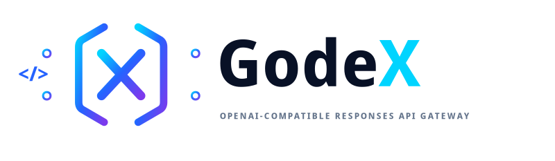

<div align="center">



**Convierte cada modelo en un motor Codex.**

Puerta de enlace (gateway) de la API Responses compatible con OpenAI para Codex, herramientas CLI y agentes de desarrollo.

[](https://www.npmjs.com/package/@ahoo-wang/godex)
[](https://codecov.io/gh/Ahoo-Wang/GodeX)
[](https://bun.sh)
[](https://www.typescriptlang.org/)

[**Documentación en inglés**](https://godex.ahoo.me/) · [**Documentación en chino**](https://godex.ahoo.me/zh/)
</div>

GodeX permite a los clientes que utilizan la API Responses de OpenAI acceder a proveedores como DeepSeek, Xiaomi, MiniMax y Zhipu a través de un único servidor local.


## Puntos destacados

- Endpoint `POST /v1/responses` compatible con OpenAI con respuestas síncronas y en streaming.
- Alias de `GET /v1/models` para que los clientes puedan usar nombres de modelos estables mientras GodeX enruta a los objetivos de proveedor/modelo.
- Proveedores puente integrados para DeepSeek, Xiaomi, MiniMax y Zhipu.
- Planificación de capacidades del proveedor para parámetros de solicitud, herramientas, `tool_choice`, formatos de salida estructurada, razonamiento y uso de streaming.
- Soporte híbrido para búsqueda web con declaraciones nativas del proveedor para Zhipu/Xiaomi y búsqueda alojada gestionada por GodeX a través de la API Web Search de Zhipu.
- Cadenas de sesiones `previous_response_id` de Responses respaldadas por memoria o SQLite.
- Registro de trazas para solicitudes del proveedor, respuestas del proveedor, eventos de stream, uso y errores.
- Entorno nativo Bun, fuente en TypeScript y binarios compilados por plataforma para lanzamientos.

## Proveedores integrados

| Proveedor | Razonamiento | Entrada GodeX | Selección de Herramienta | Formato de Respuesta | Tokens en Caché | Modelo Predeterminado |
|----------|-----------|-------------|-------------|-----------------|---------------|---------------|
| DeepSeek | nativo | texto | auto, none, required, function | texto, json_object | ✅ | `deepseek-v4-pro` |
| Xiaomi   | booleano | texto | auto | texto, json_object | ✅ | `mimo-v2.5-pro` |
| MiniMax  | booleano | texto, imagen, video | auto, none, required, function | texto, json_object | ✅ | `MiniMax-M3` |
| Zhipu    | booleano | texto | auto, none | texto, json_object | ✅ | `glm-5.2` |

## Arquitectura


## Interacción de componentes


## Instalación

Para desarrollo local:

```bash
git clone https://github.com/Ahoo-Wang/GodeX.git
cd GodeX
bun install
```

Para uso como paquete, instala el paquete publicado y ejecuta el binario `godex`:

```bash
npm install -g @ahoo-wang/godex
godex --help
```

### Docker

Las imágenes preconstruidas se publican en Docker Hub y GitHub Container Registry:

```bash
docker pull ahoowang/godex:latest
# or
docker pull ghcr.io/ahoo-wang/godex:latest
```

Ejecutar con un archivo de configuración:

```bash
docker run -d \
  --name godex \
  -p 5678:5678 \
  -e ZHIPU_API_KEY=your-key \
  -e DEEPSEEK_API_KEY=your-key \
  -e MINIMAX_API_KEY=your-key \
  -e MIMO_API_KEY=your-key \
  -v ./godex.yaml:/etc/godex/godex.yaml:ro \
  -v godex-data:/data \
  ahoowang/godex:latest
```

La imagen es compatible con `linux/amd64` y `linux/arm64`.

- Archivo de configuración: `/etc/godex/godex.yaml`
- Directorio de datos (sesiones, trazas): `/data`
- Puerto predeterminado: `5678`

## Inicio rápido

Crea una configuración e inicia el servidor:

```bash
godex init
godex serve --config ./godex.yaml
```

El asistente interactivo te guía para seleccionar proveedores, ingresar URLs base y claves API, y escribe el archivo de configuración automáticamente.

Alternativamente, crea `godex.yaml` manualmente:

```yaml
server:
  port: 5678
  host: 0.0.0.0

default_provider: deepseek

models:
  aliases:
    # -------------------------------------------------------------------------
    # Codex-compatible model aliases
    #
    # 这些 alias 是 GodeX routing policy，不代表与 OpenAI 原模型能力等价。
    # 依据优先级：公开 benchmark > 官方模型定位 > Provider 产品说明。
    # -------------------------------------------------------------------------

    # Codex 默认主力：复杂编码 / computer use / research workflows
    # 依据：DeepSeek V4-Pro 在 SWE / Terminal / Codeforces / GDPval-AA 上公开成绩强。
    gpt-5.5: "deepseek/deepseek-v4-pro"

    # Codex 旗舰：coding + reasoning + tool use + agentic workflows
    # 依据：DeepSeek V4-Pro 有更完整的公开 coding/agentic benchmark 覆盖。
    gpt-5.4: "deepseek/deepseek-v4-pro"

    # Codex mini：subagents
    gpt-5.4-mini: "zhipu/glm-5.1"

    # Codex 编码专用：复杂软件工程
    # 依据：DeepSeek V4-Pro 的 SWE Verified / SWE Pro / Terminal Bench 表现。
    gpt-5.3-codex: "deepseek/deepseek-v4-pro"

    # Codex spark：近实时编码迭代
    gpt-5.3-codex-spark: "zhipu/glm-5.1"

    # 上一代通用 coding / agentic fallback
    # 严谨起见仍走 DeepSeek；不强行映射到 Zhipu。
    gpt-5.2: "deepseek/deepseek-v4-pro"

    # -------------------------------------------------------------------------
    # Provider native models
    # -------------------------------------------------------------------------

    deepseek-v4-pro: "deepseek/deepseek-v4-pro"
    deepseek-v4-flash: "deepseek/deepseek-v4-flash"

    mimo-v2.5-pro: "xiaomi/mimo-v2.5-pro"
    mimo-v2.5: "xiaomi/mimo-v2.5"

    glm-5.1: "zhipu/glm-5.1"
    glm-5-turbo: "zhipu/glm-5-turbo"
    glm-4.7: "zhipu/glm-4.7"
    glm-4.5-air: "zhipu/glm-4.5-air"

    MiniMax-M3: "minimax/MiniMax-M3"

    # Fallback for unknown bare model names
    "*": "deepseek/deepseek-v4-pro"

providers:
  deepseek:
    spec: deepseek
    credentials:
      api_key: ${DEEPSEEK_API_KEY}
    endpoint:
      base_url: https://api.deepseek.com
  zhipu:
    spec: zhipu
    credentials:
      api_key: ${ZHIPU_API_KEY}
    endpoint:
      base_url: https://open.bigmodel.cn/api/coding/paas/v4
  minimax:
    spec: minimax
    credentials:
      api_key: ${MINIMAX_API_KEY}
    endpoint:
      base_url: https://api.minimaxi.com/v1
  xiaomi:
    spec: xiaomi
    credentials:
      api_key: ${MIMO_API_KEY}
    endpoint:
      base_url: https://api.xiaomimimo.com/v1

web_search:
  enabled: true
  mode: auto
  provider: zhipu
  on_unavailable: client_tool_call
  max_iterations: 2

session:
  backend: sqlite

logging:
  level: info

trace:
  enabled: true
  path: ./data/trace.db
  capture_payload: false
```

Inicia el servidor:

```bash
godex serve --config ./godex.yaml
```

El comando de desarrollo inicia GodeX en el puerto `13145`; el puerto predeterminado de configuración de ejecución es `5678`.

## API

### Estado (Health)

```bash
curl http://localhost:5678/health
```

### Modelos

```bash
curl http://localhost:5678/v1/models
```

`/v1/models` lista los alias configurados, excluyendo el alias comodín `*`.

### Respuestas

```bash
curl http://localhost:5678/v1/responses \
  -H 'content-type: application/json' \
  -d '{
    "model": "gpt-5.5",
    "input": "Write a short TypeScript function that adds two numbers."
  }'
```

El streaming utiliza nombres estándar de eventos SSE de Responses:

```bash
curl -N http://localhost:5678/v1/responses \
  -H 'content-type: application/json' \
  -d '{
    "model": "gpt-5.5",
    "stream": true,
    "input": "Explain Bun streams in two sentences."
  }'
```

## Enrutamiento de modelos

Los clientes pueden pasar cualquiera de:

- Un selector cualificado por proveedor como `deepseek/deepseek-v4-pro`
- Un alias configurado como `gpt-5.5`
- Un nombre de modelo sin prefijo, que se resuelve a través de `default_provider` cuando no hay coincidencia con un alias

Los alias deben mapearse a valores `provider/model`, y el proveedor debe existir en `providers`.


## Integración con Codex

Conecta la aplicación de escritorio Codex a GodeX agregando un proveedor personalizado en `~/.codex/config.toml`:

```toml
model = "gpt-5.5"
model_provider = "godex"

[model_providers.godex]
name = "GodeX"
base_url = "http://127.0.0.1:5678/v1"
wire_api = "responses"
requires_openai_auth = false
supports_websockets = false
```

Los alias de modelos (`gpt-5.5`, `gpt-5.4`, `gpt-5.4-mini`, etc.) son resueltos por GodeX usando el mapa `models.aliases` en `godex.yaml`; Codex solo necesita el nombre del alias.


## Comportamiento del puente de proveedores

GodeX construye una solicitud al proveedor en tres pasos:

1. Resuelve el selector de modelo del cliente a un proveedor configurado y un modelo de origen (upstream).
2. Planifica la compatibilidad desde el `ProviderSpec` del proveedor, incluyendo parámetros de solicitud, declaraciones de herramientas, `tool_choice`, formato de respuesta, razonamiento y uso de stream.
3. Convierte la entrada de Responses y el historial de sesión en mensajes de Chat Completions, llama al proveedor de origen y reconstruye un objeto Responses o un stream SSE de Responses.

Las diferencias específicas de cada proveedor pertenecen en `spec.ts`, `hooks.ts`, tipos de protocolo y cliente HTTP de cada proveedor. La política compartida de Responses-a-Chat pertenece bajo `src/bridge`.

## Salida estructurada

Cuando un proveedor soporta `json_object` pero no `json_schema` nativo, GodeX puede degradar solicitudes estrictas de `json_schema` a `json_object`.

Para esquemas degradados estrictos:

- La instrucción del esquema se agrega al preámbulo del prompt del proveedor para la solicitud actual.
- El proveedor recibe `response_format: { "type": "json_object" }`.
- GodeX valida que la salida final sea JSON válido.
- Una salida síncrona inválida falla la respuesta; una salida de stream inválida se reescribe a un evento terminal `response.failed`.

El validador verifica la sintaxis JSON, no la conformidad completa con JSON Schema.

## Sesiones

Las respuestas pueden almacenarse y reproducirse con `previous_response_id`.

- `session.backend: memory` mantiene el historial en la memoria del proceso.
- `session.backend: sqlite` persiste el historial en SQLite.
- Las solicitudes con `store: false` no se guardan.
- La cadena de sesión almacena instantáneas de solicitud y elementos de salida de respuesta, luego reconstruye un historial neutro al proveedor en la siguiente turno.

## Base de datos de trazas

La traza está habilitada por defecto y escribe filas en SQLite a `./data/trace.db` a menos que se configure lo contrario.

Los registros de traza incluyen:

- Metadatos de la solicitud del proveedor y resúmenes de la carga útil (payload) de la solicitud parcheada final
- Eventos del ciclo de vida de la solicitud del proveedor sin duplicar cuerpos completos de solicitud
- Cuerpos de respuesta síncrona del proveedor como cargas útiles resumidas
- Eventos de stream crudos y transformados
- Detalles de uso, incluidos tokens en caché cuando son proporcionados por el origen
- Errores de ruta y del proveedor

Establece `trace.capture_payload: true` para persistir el JSON de la carga útil hasta `trace.payload_max_bytes` para filas de traza que contienen cargas útiles. Mantenlo deshabilitado para entornos sensibles.

## Desarrollo

```bash
bun install                  # Install dependencies
bun run dev                  # Dev server with hot reload on port 13145
bun run start                # Start server from source
bun run build                # Build a binary for the current platform
bun run compile:all          # Cross-compile all supported platform packages
```

Controles de calidad:

```bash
bun run typecheck            # TypeScript
bun run lint                 # Biome check
bun run lint:fix             # Biome autofix
bun run format               # Biome format
bun run test                 # Unit and integration tests, excluding src/e2e
bun run test:e2e             # Mocked end-to-end tests
bun run test:zhipu           # Live Zhipu tests; requires ZHIPU_API_KEY
bun run test:deepseek        # Live DeepSeek tests; requires DEEPSEEK_API_KEY
bun run test:minimax         # Live MiniMax tests; requires MINIMAX_API_KEY
bun run test:xiaomi         # Live Xiaomi tests; requires MIMO_API_KEY
bun run check                # typecheck + lint + test
bun run ci                   # typecheck + biome ci + test + e2e
```

## Mapa de origen

```text
src/
  cli/          Commander CLI, init wizard, runtime config loading
  config/       godex.yaml schema, defaults, env interpolation
  context/      ApplicationContext and per-request ResponsesContext
  bridge/       Provider-agnostic Responses-to-Chat planning and reconstruction
  providers/    Built-in provider specs, hooks, clients, and registry
  responses/    Sync and stream request pipelines
  server/       Bun routes for /health, /v1/models, /v1/responses
  session/      Memory and SQLite response session stores
  trace/        SQLite trace recorder and usage/error/event mappers
  protocol/     OpenAI protocol type definitions
  error/        GodeXError hierarchy and domain codes
```

## Desarrollo de proveedores

Las carpetas de proveedores siguen esta estructura:

```text
src/providers/<name>/
  spec.ts       ProviderSpec declaration
  client.ts     ProviderEdge construction with ChatProviderClient
  hooks.ts      Provider-specific patching, accessors, usage, stream deltas
  protocol/     Provider DTOs when needed
  index.ts      Public exports
```

Agrega la política de compatibilidad compartida a `src/bridge`; agrega transporte compartido del proveedor o ayudantes de protocolo a `src/providers/shared`.

## Licencia

Apache-2.0. Consulta [LICENSE](./LICENSE).
