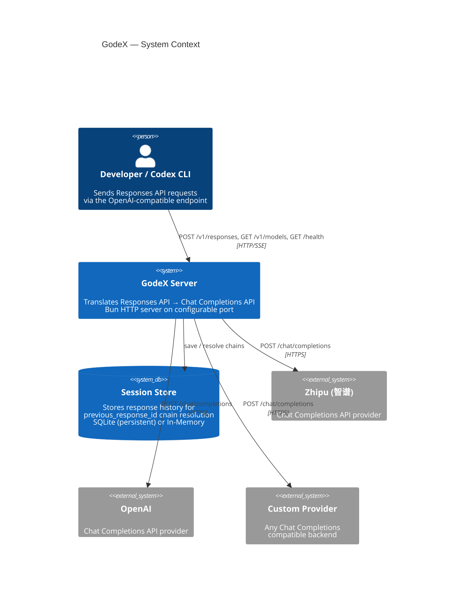

<div align="center">


**Make every model a Codex engine.**

OpenAI-compatible Responses API gateway — translates `/v1/responses` into upstream Chat Completions API calls, connecting Codex, CLI, IDE, and automation tools with any model provider.

[](https://www.npmjs.com/package/@ahoo-wang/godex)
[](https://codecov.io/gh/Ahoo-Wang/GodeX)
[](https://bun.sh)
[](https://www.typescriptlang.org/)

[Getting Started](https://godex.ahoo.me/01-getting-started/overview) · [Architecture](https://godex.ahoo.me/02-architecture/overview) · [Configuration](https://godex.ahoo.me/07-configuration/config-schema) · [Documentation](https://godex.ahoo.me)

</div>

## Quick Start

```bash
# Install — no Bun required at runtime
npm install -g @ahoo-wang/godex

# Create config interactively
godex init

# Start the gateway
godex serve
```

### Connect Codex CLI

```bash
export OPENAI_BASE_URL=http://localhost:5678/v1
export OPENAI_API_KEY=any-value          # not validated by GodeX, must be set
codex
```

### Use OpenAI SDK

```ts
import OpenAI from "openai";

const client = new OpenAI({
  baseURL: "http://localhost:5678/v1",
  apiKey: "any-value",
});

const response = await client.responses.create({
  model: "gpt-4o",          // mapped to glm-4.7 via godex.yaml
  input: "Hello!",
});
```

## How It Works

```
Codex / CLI / IDE
      │
      ▼  POST /v1/responses
┌─────────────────┐
│   GodeX Gateway │
└────────┬────────┘
         │  Provider Adapter
         ▼
┌─────────────────────────┐
│  Chat Completions API   │
│  (any compatible model) │
└─────────────────────────┘
```

GodeX accepts OpenAI Responses API requests, translates them to Chat Completions API calls via pluggable provider adapters, and streams results back — preserving the full protocol semantics that Codex expects.

## Architecture



> Full diagrams: [Request Flow](https://godex.ahoo.me/02-architecture/request-flow) · [Stream Pipeline](https://godex.ahoo.me/02-architecture/stream-pipeline) · [Component Model](https://godex.ahoo.me/02-architecture/adapter-pattern)

## Configuration

### godex.yaml

```yaml
server:
  port: 5678

default_provider: zhipu

providers:
  zhipu:
    api_key: ${ZHIPU_API_KEY}
    base_url: https://open.bigmodel.cn/api/coding/paas/v4
    models:
      "gpt-4o": glm-4.7         # model name mapping
      "*": glm-5.1              # catch-all fallback

session:
  backend: sqlite               # or "memory"
  sqlite:
    path: ./data/sessions.db

logging:
  level: info                   # trace | debug | info | warn | error
```

### Model Selection

```
model: "gpt-4o"              → resolved via default_provider model mapping
model: "zhipu/glm-4.7"       → explicit provider/model selector
model: "openai/gpt-4o"       → routes to configured openai provider
```

### Health Check

```bash
curl http://localhost:5678/health
# {"status":"ok","providers":["zhipu"],"unsupported_providers":[]}
```

### Adding a Provider

Implement three interfaces in `src/providers/<name>/`:

| Interface | Purpose |
|-----------|---------|
| `Provider` | Bundles mapper + chatClient + capabilities |
| `ProviderMapper` | request / response / stream mapping functions |
| `ChatClient` | `chat()` and `streamChat()` HTTP calls |

Register the factory in `src/providers/builtin.ts`:

```ts
registrar.registerFactory("myprovider", (config) =>
  createMyProvider(config) as Provider<unknown, unknown, unknown>
);
```

## Project Structure

```
src/
├── cli/              Commander CLI (serve, config check, init)
├── config/           godex.yaml schema, env interpolation, defaults
├── context/          ApplicationContext (DI), ResponsesContext (per-request)
├── adapter/          Adapter interface, DefaultAdapter, stream transformers
│   ├── mapper/       RequestMapper / ResponseMapper / StreamMapper contracts
│   └── transformers/ ProviderEvent → Response → SSE encode pipeline
├── providers/        Provider registry + builtin factories
│   └── zhipu/        Reference provider: mapper, chat-client, tools, messages
├── resolver/         ModelResolver (model selector → provider + model)
├── server/           Bun HTTP server, routes (/v1/responses, /health, /v1/models)
├── session/          ResponseSessionStore (Memory + SQLite), chain resolution
├── error/            GodeXError hierarchy with domain codes
├── protocol/openai/  OpenAI-compatible type definitions
├── logger/           Structured JSON logger
└── e2e/              End-to-end tests with mocked upstream
```

## Development

```bash
bun install                  # Install dependencies
bun run dev                  # Dev server with hot reload (port 13145)
bun run test                 # Unit + integration tests
bun run test:e2e             # E2E tests with mocked upstream
bun run build                # Build standalone binary for current platform
bun run check                # typecheck + lint + test
bun run ci                   # Full CI pipeline
```

## Publishing

`@ahoo-wang/godex` is a lightweight npm wrapper. Native binaries ship as platform-specific optional dependencies:

```
@ahoo-wang/godex
├── @ahoo-wang/godex-darwin-arm64     ← macOS Apple Silicon
├── @ahoo-wang/godex-darwin-x64       ← macOS Intel
├── @ahoo-wang/godex-linux-x64        ← Linux x86_64
├── @ahoo-wang/godex-linux-arm64      ← Linux ARM64
├── @ahoo-wang/godex-win32-x64        ← Windows x86_64
└── @ahoo-wang/godex-win32-arm64      ← Windows ARM64
```

## License

[Apache License 2.0](LICENSE)
