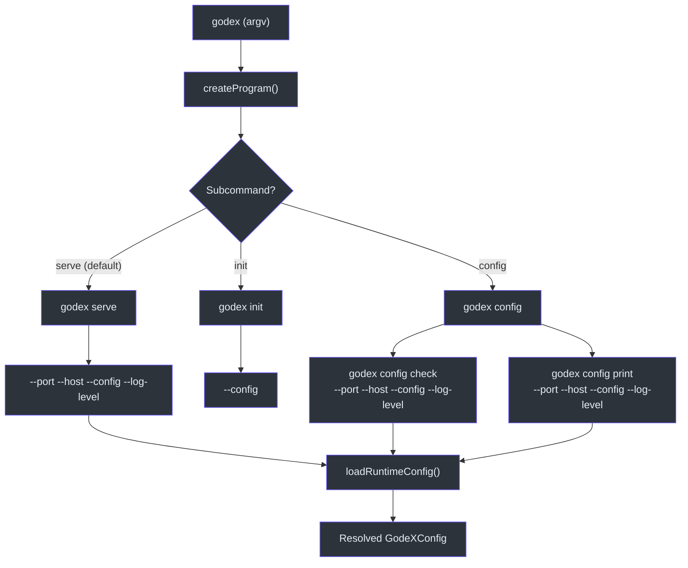
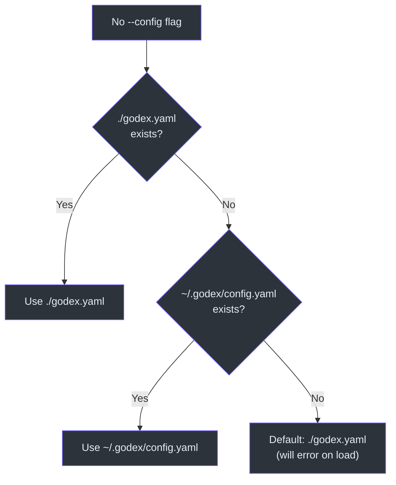
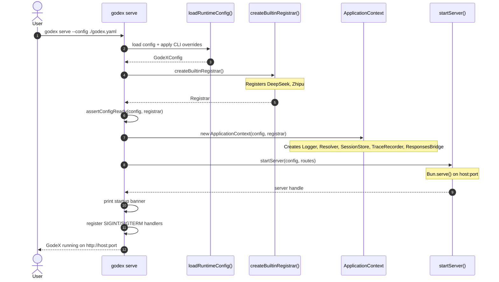
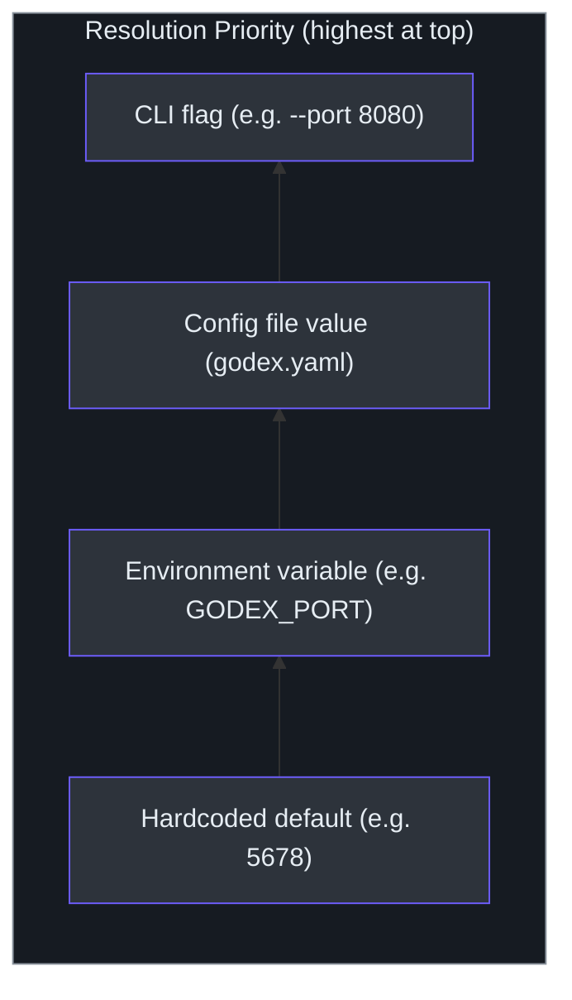

# CLI Reference

The `godex` CLI is a Commander.js program defined in [`src/cli/program.ts`](https://github.com/Ahoo-Wang/GodeX/blob/main/src/cli/program.ts). It provides three top-level surfaces: the default `serve` command for running the gateway, an `init` command for generating configuration files interactively, and a `config` command group for inspecting and validating configuration. The entry point is [`src/index.ts:5`](https://github.com/Ahoo-Wang/GodeX/blob/main/src/index.ts#L5), which calls `runCli(process.argv)` defined in [`src/cli/cli.ts`](https://github.com/Ahoo-Wang/GodeX/blob/main/src/cli/cli.ts).

## At a Glance

| Command | Description | Source |
|---|---|---|
| `godex serve` | Start the Responses API proxy (default command) | [`src/cli/commands/serve.ts`](https://github.com/Ahoo-Wang/GodeX/blob/main/src/cli/commands/serve.ts) |
| `godex init` | Interactively create a godex.yaml configuration file | [`src/cli/commands/init.ts`](https://github.com/Ahoo-Wang/GodeX/blob/main/src/cli/commands/init.ts) |
| `godex config check` | Validate the effective config without starting the server | [`src/cli/commands/config.ts`](https://github.com/Ahoo-Wang/GodeX/blob/main/src/cli/commands/config.ts) |
| `godex config print` | Print the effective config with secrets redacted | [`src/cli/commands/config.ts`](https://github.com/Ahoo-Wang/GodeX/blob/main/src/cli/commands/config.ts) |

## Command Routing



## Global Flags

All commands that load configuration support these flags:

| Flag | Type | Description |
|---|---|---|
| `--config <path>` | string | Path to the godex.yaml config file |
| `--port <number>` | number | Server port override |
| `--host <address>` | string | Server bind address override |
| `--log-level <level>` | string | Log level override (`trace`, `debug`, `info`, `warn`, `error`) |

The `--config` flag takes precedence over the automatic search order. The `--port`, `--host`, and `--log-level` flags override their corresponding values in the config file.

## Config File Resolution

When `--config` is not provided, GodeX searches for a configuration file in this order:

1. `./godex.yaml` (current working directory)
2. `~/.godex/config.yaml` (user home directory)

This search order is defined in [`src/config/paths.ts:7`](https://github.com/Ahoo-Wang/GodeX/blob/main/src/config/paths.ts#L7).



## Environment Variables

Environment variables serve two purposes: overriding config values and providing secrets to config interpolation.

### Config Overrides

| Variable | Config Equivalent | Default |
|---|---|---|
| `GODEX_PORT` | `server.port` | `5678` |
| `GODEX_HOST` | `server.host` | `0.0.0.0` |
| `GODEX_LOG_LEVEL` | `logging.level` | `info` |
| `GODEX_DEFAULT_PROVIDER` | `default_provider` | `zhipu` |

The resolution priority for each value is: CLI flag > config file value > environment variable > hardcoded default. This cascading logic is in [`src/config/sections/server.ts`](https://github.com/Ahoo-Wang/GodeX/blob/main/src/config/sections/server.ts) and [`src/config/sections/logging.ts`](https://github.com/Ahoo-Wang/GodeX/blob/main/src/config/sections/logging.ts).

### Config Interpolation

Any string value in `godex.yaml` can reference environment variables using the `${VAR}` syntax:

```yaml
providers:
  zhipu:
    credentials:
      api_key: ${ZHIPU_API_KEY}
  deepseek:
    credentials:
      api_key: ${DEEPSEEK_API_KEY}
```

The interpolation is recursive and deep, handled by [`src/config/env-interpolation.ts`](https://github.com/Ahoo-Wang/GodeX/blob/main/src/config/env-interpolation.ts). If the referenced variable is not set, the `${VAR}` placeholder is kept as-is.

## `godex serve`

Starts the Responses API proxy server. This is the default command, so running `godex` with no subcommand is equivalent to `godex serve`.

```bash
# Minimal
godex serve

# With all flags
godex serve --config ./godex.yaml --port 8080 --host 127.0.0.1 --log-level debug

# Development mode (from source, hot reload, port 13145)
bun run dev
```

The serve command is implemented in [`src/cli/serve.ts`](https://github.com/Ahoo-Wang/GodeX/blob/main/src/cli/serve.ts). It loads the config, creates the `ApplicationContext`, registers the built-in routes, and starts the Bun HTTP server. Shutdown handlers for `SIGINT` and `SIGTERM` ensure graceful resource cleanup.



## `godex init`

Launches an interactive configuration wizard that creates a `godex.yaml` file. The wizard uses `@clack/prompts` for a guided terminal UI.

```bash
# Default: creates ./godex.yaml
godex init

# Custom output path
godex init --config /path/to/config.yaml
```

The wizard prompts for:

1. **Provider selection** -- Choose which providers to configure (DeepSeek, Zhipu)
2. **API keys** -- Enter keys or `${VAR}` placeholders for each provider
3. **Base URLs** -- Select from predefined options per provider
4. **Default provider** -- Choose the fallback when requests omit a provider prefix
5. **Server port** -- Default is `5678`
6. **Session backend** -- `sqlite` or `memory`
7. **Log level** -- `debug`, `info`, or `warn`

The generated file is written with mode `0600` to protect API keys. The init flow is in [`src/cli/init/run.ts`](https://github.com/Ahoo-Wang/GodeX/blob/main/src/cli/init/run.ts), with prompts defined in [`src/cli/init/prompts.ts`](https://github.com/Ahoo-Wang/GodeX/blob/main/src/cli/init/prompts.ts) and YAML generation in [`src/cli/init/config-yaml.ts`](https://github.com/Ahoo-Wang/GodeX/blob/main/src/cli/init/config-yaml.ts).

## `godex config check`

Validates the effective configuration without starting the server. This is useful for CI pipelines and pre-deploy verification.

```bash
godex config check --config ./godex.yaml
```

The command loads the config, applies CLI overrides, and runs `assertConfigReady()` which verifies:

- The config file is valid YAML
- All declared providers have a `spec` field (legacy configs without `spec` are rejected)
- All provider specs are registered in the built-in registrar
- Required fields are present and correctly typed

On success, it prints a summary. On failure, it exits with a non-zero code and an error message.

Implemented in [`src/cli/commands/config.ts:28`](https://github.com/Ahoo-Wang/GodeX/blob/main/src/cli/commands/config.ts#L28).

## `godex config print`

Prints the fully resolved and redacted configuration as JSON. Secrets (API keys) are replaced with `***`.

```bash
godex config print --config ./godex.yaml
```

This shows the merged result of: config file values + environment variable interpolation + CLI flag overrides, with all sensitive fields redacted. Useful for debugging config resolution issues.

Implemented in [`src/cli/commands/config.ts:41`](https://github.com/Ahoo-Wang/GodeX/blob/main/src/cli/commands/config.ts#L41).

## Config Resolution Priority

For each configurable value, GodeX applies this priority order (highest wins):



This resolution is implemented in [`src/cli/runtime-config/load.ts`](https://github.com/Ahoo-Wang/GodeX/blob/main/src/cli/runtime-config/load.ts) and [`src/config/builder.ts`](https://github.com/Ahoo-Wang/GodeX/blob/main/src/config/builder.ts).

## Version and Help

```bash
godex --version        # Print GodeX version
godex --help           # Print top-level help
godex serve --help     # Print serve command help
godex config --help    # Print config subcommand help
```

The program definition at [`src/cli/program.ts:10`](https://github.com/Ahoo-Wang/GodeX/blob/main/src/cli/program.ts#L10) sets the program name to `godex`, configures `showHelpAfterError`, and uses `exitOverride()` so that errors produce non-zero exit codes instead of process termination.

## Related Pages

- [Overview](./overview.md) -- What GodeX is and its core capabilities
- [Quick Start](./quick-start.md) -- Get running in five minutes
- [Configuration](../07-configuration/configuration.md) -- Full godex.yaml schema and validation rules
- [Architecture](../02-architecture/architecture.md) -- Layered system design and data flow
