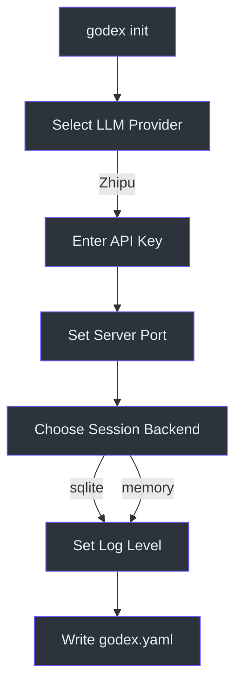
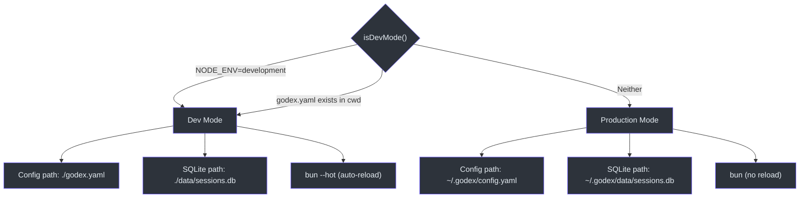

# Installation & Setup

## Installation Methods

### From npm (Global)

```bash
npm install -g @ahoo-wang/godex
godex --version
```

### From Source

```bash
git clone https://github.com/Ahoo-Wang/Godex.git
cd Godex
bun install
bun run start -- --version
```

## The Init Wizard

Run `godex init` to interactively create a `godex.yaml` configuration file. The wizard walks through five steps:



| Wizard Step | Options | Default |
|---|---|---|
| Provider | Zhipu (智谱) | — |
| API Key | Plain text or `${ENV_VAR}` | `${ZHIPU_API_KEY}` |
| Port | Any 1–65535 | `5678` |
| Session Backend | SQLite, In-memory | SQLite |
| Log Level | debug, info, warn | info |

The wizard is implemented in [src/cli/init.ts](https://github.com/Ahoo-Wang/Godex/blob/main/src/cli/init.ts) using `@clack/prompts`.

## godex.yaml Configuration

A typical `godex.yaml` generated by the init wizard:

```yaml
server:
  port: 5678

default_provider: zhipu

providers:
  zhipu:
    api_key: ${ZHIPU_API_KEY}
    base_url: https://open.bigmodel.cn/api/paas/v4
    models:
      gpt-5.5: glm-5.1
      gpt-5: glm-5.1
      gpt-5-mini: glm-5-turbo
      gpt-4o: glm-4.7
      gpt-4o-mini: glm-4.7-flash

session:
  backend: sqlite
  sqlite:
    path: ./data/sessions.db

logging:
  level: info
```

### Configuration Sections

| Section | Key Fields | Description |
|---|---|---|
| `server` | `port`, `host`, `idle_timeout` | HTTP server configuration |
| `default_provider` | string | Fallback provider when model selector omits provider prefix |
| `providers` | per-provider config | Provider name → `api_key`, `base_url`, `models` |
| `session` | `backend`, `sqlite.path` | Session persistence backend |
| `logging` | `level` | Log verbosity: trace/debug/info/warn/error |

## Environment Variable Interpolation

Godex supports `${VAR_NAME}` syntax throughout the config file. The `resolveEnvVars` function ([src/config/index.ts:11](https://github.com/Ahoo-Wang/Godex/blob/main/src/config/index.ts#L11)) replaces these placeholders with environment variable values at load time.


Key behaviors:
- `${ZHIPU_API_KEY}` is replaced by `process.env.ZHIPU_API_KEY`
- Unresolved variables remain as literal `${...}` strings
- The `collectConfigDiagnostics` function ([src/cli/config.ts:87](https://github.com/Ahoo-Wang/Godex/blob/main/src/cli/config.ts#L87)) warns about unresolved variables
- Interpolation is deep: it traverses arrays and nested objects recursively

## Model Mapping

The `models` field in each provider config maps request model names to provider-native names:

| Request Model | Maps To | Notes |
|---|---|---|
| `gpt-4o` | `glm-4.7` | Explicit alias |
| `gpt-4o-mini` | `glm-4.7-flash` | Explicit alias |
| `claude-sonnet` | `claude-sonnet` | No mapping, passed through |
| `*` | `glm-4.7-flash` | Wildcard fallback |

The wildcard `*` acts as a catch-all: any model not explicitly listed maps to the wildcard value. This is resolved in `ModelResolver.resolve()` ([src/resolver/index.ts:25](https://github.com/Ahoo-Wang/Godex/blob/main/src/resolver/index.ts#L25)):

```typescript
const mapped = models?.[modelName] ?? models?.["*"];
return { provider, model: mapped ?? modelName };
```

## Dev vs Production Mode



## References

- [src/config/schema.ts](https://github.com/Ahoo-Wang/Godex/blob/main/src/config/schema.ts) — `GodexConfig` type definitions
- [src/config/index.ts](https://github.com/Ahoo-Wang/Godex/blob/main/src/config/index.ts) — Config loading, env var interpolation, dev mode detection
- [src/cli/init.ts](https://github.com/Ahoo-Wang/Godex/blob/main/src/cli/init.ts) — Interactive init wizard
- [src/cli/config.ts](https://github.com/Ahoo-Wang/Godex/blob/main/src/cli/config.ts) — Config validation and diagnostics
- [src/resolver/index.ts](https://github.com/Ahoo-Wang/Godex/blob/main/src/resolver/index.ts) — Model resolution and mapping
