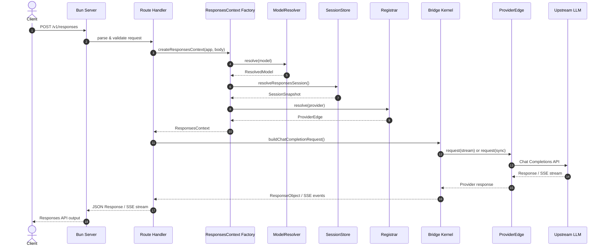
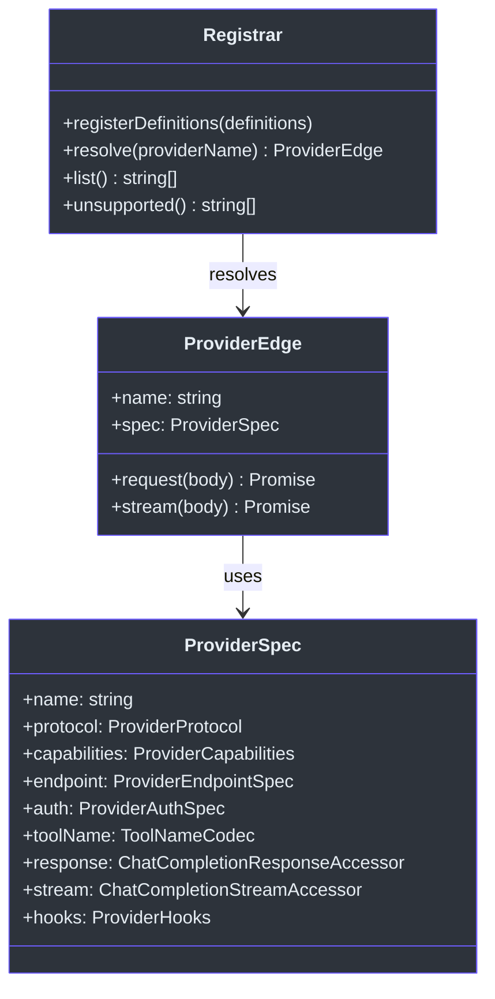
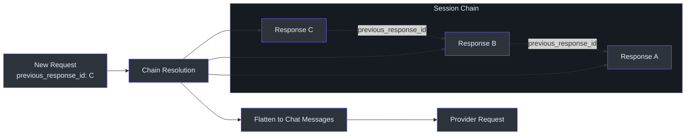
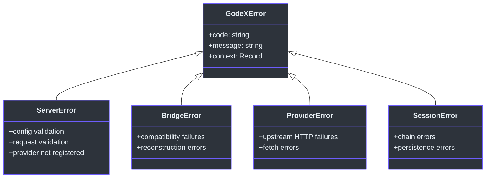

# Overview

GodeX is an OpenAI-compatible Responses API gateway that makes every LLM model a Codex engine. It sits between your OpenAI Responses API clients and any number of upstream LLM providers, translating Requests, Responses, and streaming events in real time. The core problem GodeX solves is vendor lock-in: tools and agents built against the OpenAI Responses API can work with any provider -- DeepSeek, Zhipu (智谱), or future additions -- without code changes. GodeX handles request bridging, model aliasing, session chain resolution, streaming translation, structured output contracts, and tool compatibility planning so that callers never need to know which upstream provider ultimately handles their request.

## At a Glance

| Aspect | Detail |
|---|---|
| Package | `@ahoo-wang/godex` |
| License | Apache-2.0 |
| Runtime | TypeScript on Bun (Node.js >=18 also supported) |
| Entry Point | [`src/index.ts:5`](https://github.com/Ahoo-Wang/GodeX/blob/main/src/index.ts#L5) |
| Primary Endpoint | `POST /v1/responses` (OpenAI Responses API) |
| Built-in Providers | DeepSeek, Zhipu (智谱) |
| Session Storage | In-memory or SQLite |
| Trace Storage | SQLite |
| Logging | LogTape structured logging |

## Core Capabilities

- **Request Bridging** -- Translates Responses API requests into provider-native Chat Completions format, including input normalization and session history flattening.
- **Model Aliasing** -- Maps human-friendly names (e.g., `gpt-5.5`) to real provider/model pairs (e.g., `zhipu/glm-5.1`) via [`src/resolver/model-resolver.ts`](https://github.com/Ahoo-Wang/GodeX/blob/main/src/resolver/model-resolver.ts).
- **Session Chains** -- Supports `previous_response_id` as a parent pointer, building conversation context across turns through [`src/session/`](https://github.com/Ahoo-Wang/GodeX/blob/main/src/session/).
- **Streaming Translation** -- A state machine in the bridge kernel maps provider SSE deltas into Responses API streaming events in real time.
- **Structured Output Contracts** -- Plans and validates JSON output schemas against provider capabilities via [`src/bridge/output/`](https://github.com/Ahoo-Wang/GodeX/blob/main/src/bridge/output/).
- **Tool Compatibility Planning** -- Evaluates tool declarations against each provider's capabilities, applying downgrade, rejection, or passthrough strategies.
- **Trace and Observability** -- SQLite-backed trace recording for requests, usage, events, and errors.

## Architecture Layers

The system follows a strict layered design where each layer has a single responsibility:

```mermaid
flowchart TB
    subgraph CLI["CLI Layer"]
        direction LR
        A["godex CLI<br>Commander program"]
    end

    subgraph AppCtx["Application Context"]
        direction LR
        B["ApplicationContext"]
        C["ModelResolver"]
        D["Registrar"]
        E["SessionStore"]
        F["TraceRecorder"]
    end

    subgraph Server["Bun HTTP Server"]
        direction LR
        G["POST /v1/responses"]
        H["GET /v1/models"]
        I["GET /health"]
    end

    subgraph Pipeline["Responses Pipeline"]
        direction LR
        J["SyncRequestPipeline"]
        K["StreamPipeline"]
        L["ProviderExchange"]
    end

    subgraph Bridge["Bridge Kernel"]
        direction LR
        M["Request Builder"]
        N["Compatibility Planner"]
        O["Tool Planner"]
        P["Output Contracts"]
        Q["Response Reconstructor"]
        R["Stream State Machine"]
    end

    subgraph Edge["Provider Edge"]
        direction LR
        S["DeepSeek"]
        T["Zhipu"]
    end

    CLI --> AppCtx --> Server --> Pipeline --> Bridge --> Edge

    style CLI fill:#2d333b,stroke:#6d5dfc,color:#e6edf3
    style AppCtx fill:#2d333b,stroke:#6d5dfc,color:#e6edf3
    style Server fill:#2d333b,stroke:#6d5dfc,color:#e6edf3
    style Pipeline fill:#2d333b,stroke:#6d5dfc,color:#e6edf3
    style Bridge fill:#2d333b,stroke:#6d5dfc,color:#e6edf3
    style Edge fill:#2d333b,stroke:#6d5dfc,color:#e6edf3
```



## Request Flow

Every request passes through the same pipeline: the Bun HTTP server receives the request, the `ApplicationContext` resolves the model and provider, the bridge kernel translates the request, the provider edge calls upstream, and the response is reconstructed back into the Responses API format.



## Tech Stack

The technology choices are deliberately minimal:

- **TypeScript** with strict mode, ESNext target, and ESM modules for type safety and modern runtime features.
- **Bun runtime** for fast startup and native TypeScript execution, with Node.js >=18 as a fallback.
- **SQLite** for session persistence and trace storage, requiring no external database infrastructure.
- **LogTape** for structured, leveled logging with console and file sinks.
- **Commander.js** for the CLI program with subcommands and option parsing.

## Project Structure

```text
src/
  cli/          Commander CLI, commands, init wizard, runtime config
  config/       godex.yaml parsing, defaults, validation, env interpolation
  context/      ApplicationContext and request-scoped ResponsesContext
  bridge/       Provider-agnostic Responses-to-Chat kernel
  providers/    Provider registry, specs, clients, hooks, protocol DTOs
  responses/    Sync and streaming orchestration pipelines
  server/       Bun routes: /health, /v1/models, /v1/responses
  resolver/     Model selector and alias resolution
  session/      Memory and SQLite previous_response_id stores
  trace/        SQLite trace records for requests, usage, events, errors
  logger/       LogTape-based structured logging
  error/        GodeXError hierarchy and domain codes
  protocol/     OpenAI protocol type definitions
  tools/        Codex built-in tool definitions
  testing/      Shared test provider utilities
```

## Provider Edge Pattern

Each built-in provider packages a compact `ProviderSpec` that declares capabilities, endpoint configuration, authentication, tool name codec, response accessors, and provider-specific hooks. The bridge kernel reads these specs to decide how to translate requests without duplicating provider-specific logic.



## Session Chain Model

Sessions use `previous_response_id` as an immutable parent pointer. Each turn creates a new response that references the prior one, forming a chain. The system detects missing parents, cycles, depth overflow, and incomplete responses during chain resolution.



## Error Architecture

All expected runtime failures use the `GodeXError` hierarchy defined in [`src/error/`](https://github.com/Ahoo-Wang/GodeX/blob/main/src/error/). This ensures consistent error codes and structured context across the server, bridge, provider, and session layers.



## Related Pages

- [Quick Start](./quick-start.md) -- Install, configure, and send your first request in minutes
- [CLI Reference](./cli-reference.md) -- Complete command and flag reference
- [Architecture](../02-architecture/architecture.md) -- Deep dive into the layered design
- [Bridge Kernel](../03-bridge-kernel/bridge-kernel.md) -- Responses-to-Chat translation internals
- [Provider Development](../04-provider-development/provider-development.md) -- How to add a new provider
