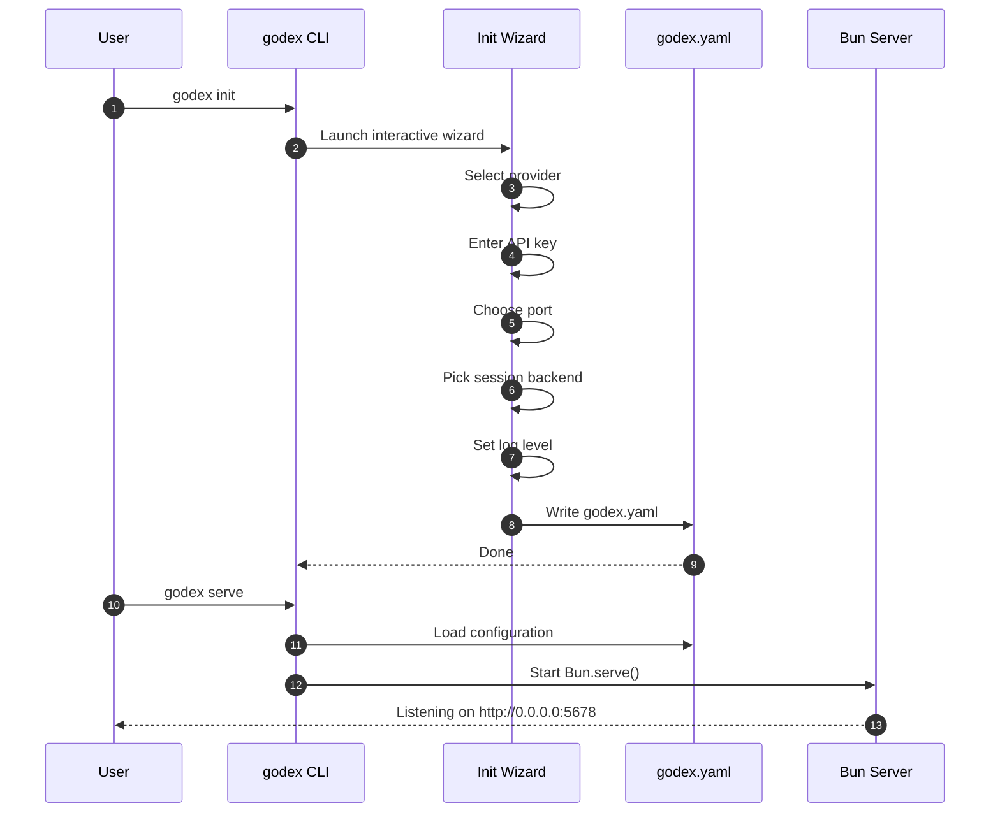
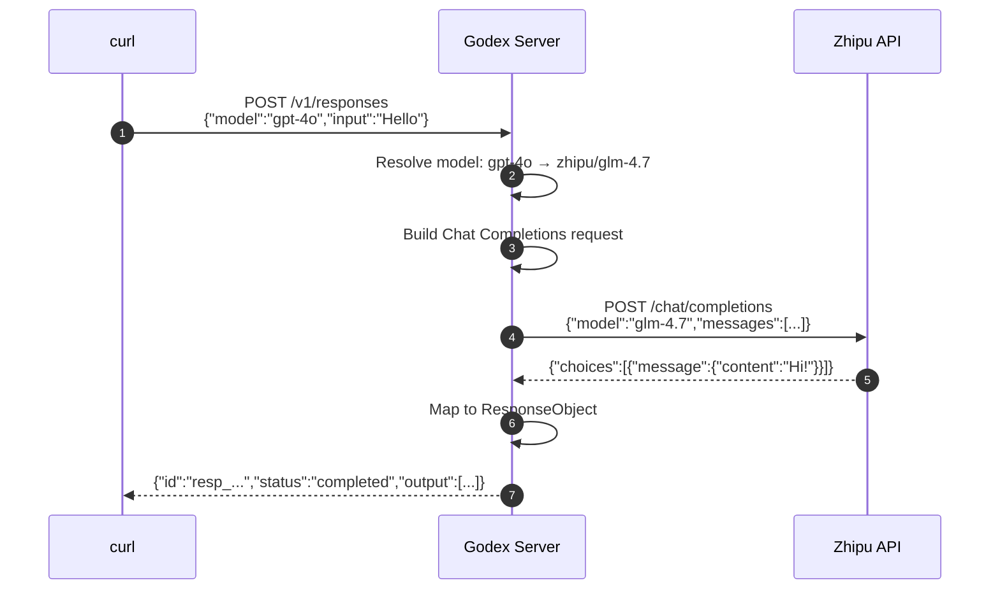

# Getting Started Overview

This guide covers the prerequisites, installation methods, and how to make your first request to Godex.

## Prerequisites

| Requirement | Minimum Version |
|---|---|
| **Bun** | >= 1.2 |
| **Node.js** | >= 18 (for npm install only) |
| **Zhipu API Key** | Required for the built-in provider |

Install Bun:

```bash
curl -fsSL https://bun.sh/install | bash
```

## Installation

### Option A: Install from npm (recommended)

```bash
npm install -g @ahoo-wang/godex
```

### Option B: Build from source

```bash
git clone https://github.com/Ahoo-Wang/Godex.git
cd Godex
bun install
```

## Configuration and Startup



After installing, create a configuration file:

```bash
godex init
```

Then start the server:

```bash
# Development with hot reload
bun run dev

# Production
godex serve
```

## First Request



Send a non-streaming request:

```bash
curl -X POST http://localhost:5678/v1/responses \
  -H "Content-Type: application/json" \
  -d '{
    "model": "gpt-4o",
    "input": "Say hello in one word."
  }'
```

Response:

```json
{
  "id": "resp_abc123",
  "object": "response",
  "created_at": 1716000000,
  "status": "completed",
  "model": "glm-4.7",
  "output": [
    {
      "id": "msg_abc123",
      "type": "message",
      "role": "assistant",
      "content": [{ "type": "output_text", "text": "Hello!" }]
    }
  ],
  "output_text": "Hello!"
}
```

## Streaming Request

```bash
curl -N -X POST http://localhost:5678/v1/responses \
  -H "Content-Type: application/json" \
  -d '{
    "model": "gpt-4o",
    "input": "Count to five",
    "stream": true
  }'
```

The response is a stream of SSE events:

```
event: response.created
data: {"type":"response.created","response":{"id":"resp_...","status":"in_progress",...}}

event: response.output_text.delta
data: {"type":"response.output_text.delta","delta":"1"}

event: response.output_text.delta
data: {"type":"response.output_text.delta","delta":"2"}

event: response.completed
data: {"type":"response.completed","response":{"status":"completed",...}}

data: [DONE]
```

## Verify It Works

```bash
# Health check
curl http://localhost:5678/health
```

Returns:

```json
{
  "status": "ok",
  "timestamp": 1716000000000,
  "providers": ["zhipu"],
  "unsupported_providers": []
}
```

## References

- [src/cli/index.ts](https://github.com/Ahoo-Wang/Godex/blob/main/src/cli/index.ts)
- [src/cli/serve.ts](https://github.com/Ahoo-Wang/Godex/blob/main/src/cli/serve.ts)
- [src/server/routes/responses/index.ts](https://github.com/Ahoo-Wang/Godex/blob/main/src/server/routes/responses/index.ts)
- [src/server/routes/health.ts](https://github.com/Ahoo-Wang/Godex/blob/main/src/server/routes/health.ts)
