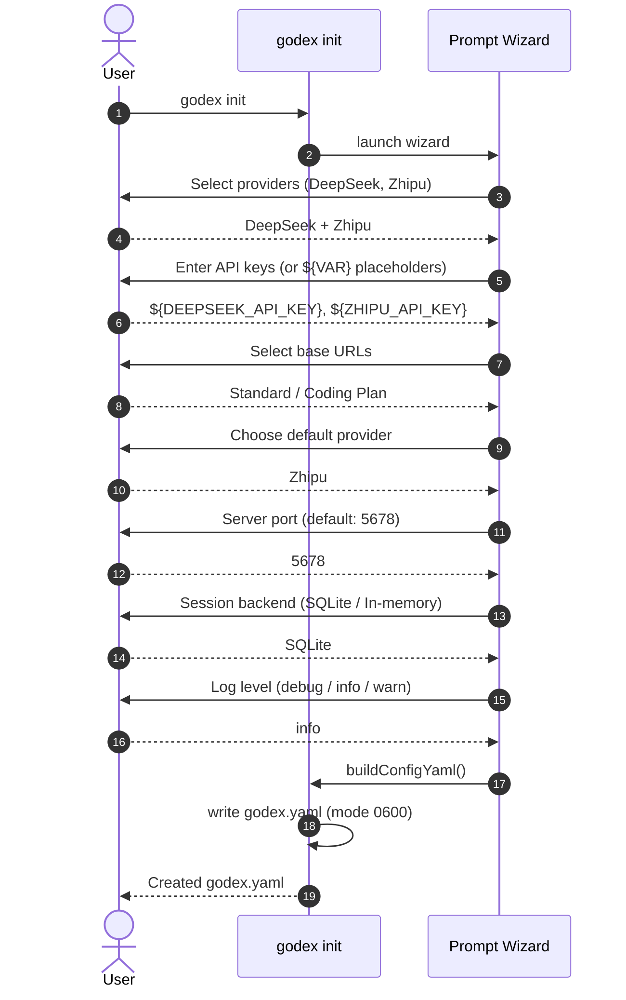
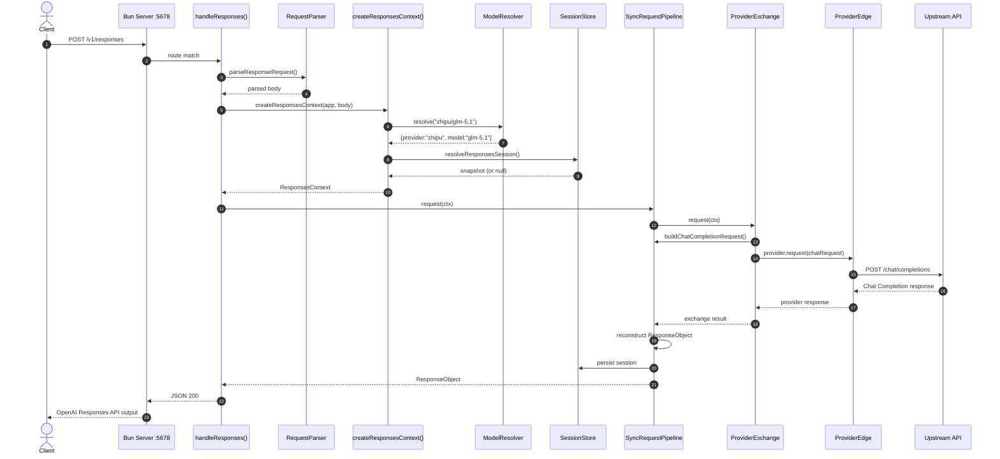
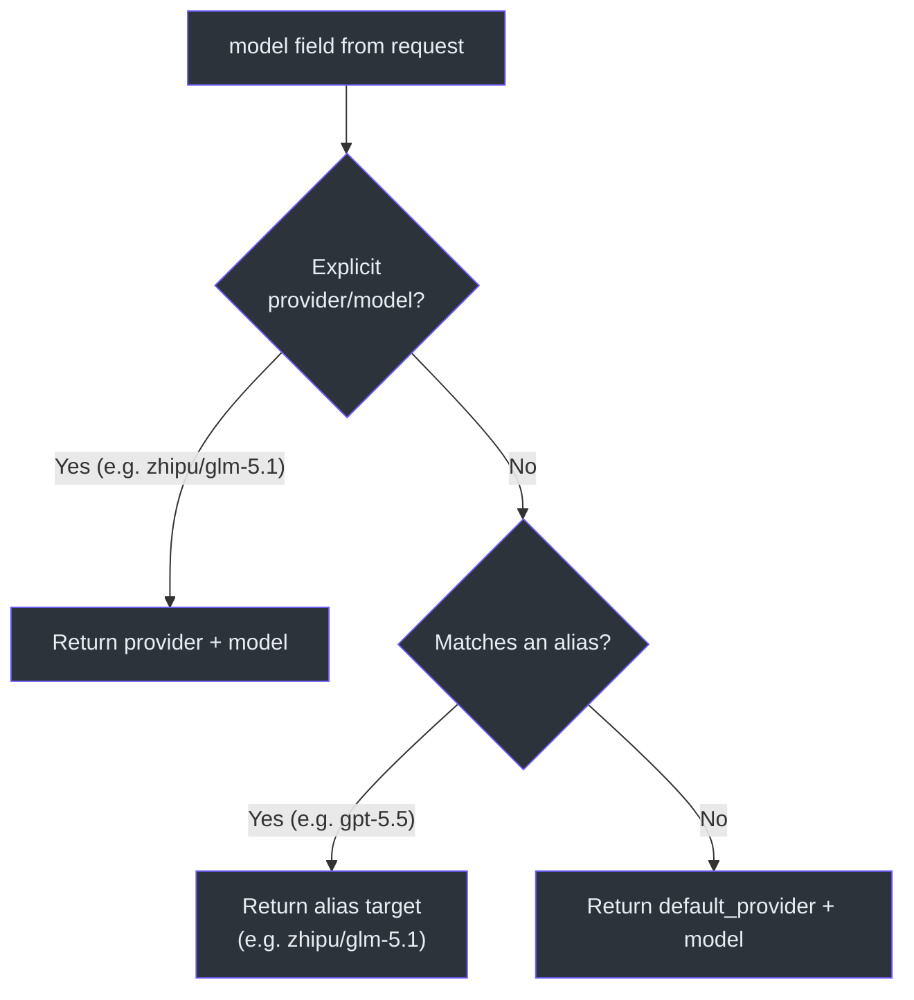
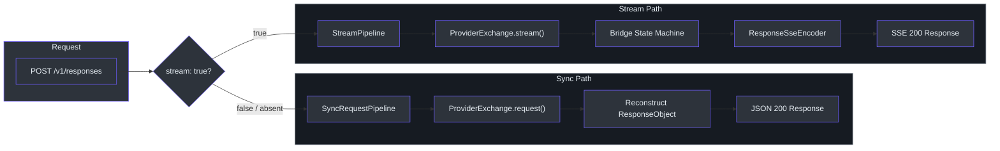

# Quick Start

This guide walks you through installing GodeX, creating a configuration file with the interactive wizard, starting the server, and sending your first request. By the end you will have a fully operational Responses API gateway that can proxy requests to DeepSeek, Zhipu (智谱), or any other configured provider.

## At a Glance

| Step | Command | What It Does |
|---|---|---|
| Install | `npm install -g @ahoo-wang/godex` | Installs the `godex` CLI globally |
| Init | `godex init` | Interactive wizard creates `godex.yaml` |
| Run | `godex serve --config ./godex.yaml` | Starts the proxy on port 5678 |
| Test | `curl http://localhost:5678/health` | Health check |
| Request | `curl -X POST ... /v1/responses` | Send a Responses API request |

## Prerequisites

| Requirement | Minimum Version |
|---|---|
| Node.js | >= 18.0.0 |
| Bun | >= 1.2.0 (optional, but recommended for development) |

GodeX runs on Node.js >= 18 or the Bun runtime. Bun is the primary development runtime and provides faster startup and native TypeScript execution.

## Installation

**Global install via npm:**

```bash
npm install -g @ahoo-wang/godex
```

**Or install via Bun:**

```bash
bun install
```

**Or run directly from source:**

```bash
git clone https://github.com/Ahoo-Wang/GodeX.git
cd GodeX
bun install
bun run dev   # Dev server with hot reload on port 13145
```

The package also ships pre-built platform binaries for macOS (arm64, x64), Linux (arm64, x64), and Windows (x64, arm64) via optional dependencies.

## Init Wizard

Run `godex init` to launch an interactive configuration wizard. The wizard is built with `@clack/prompts` and guides you through every setting.



The wizard produces a `godex.yaml` like this:

```yaml
server:
  port: 5678
default_provider: zhipu
providers:
  deepseek:
    spec: deepseek
    credentials:
      api_key: ${DEEPSEEK_API_KEY}
    endpoint:
      base_url: https://api.deepseek.com
  zhipu:
    spec: zhipu
    credentials:
      api_key: ${ZHIPU_API_KEY}
    endpoint:
      base_url: https://open.bigmodel.cn/api/paas/v4
session:
  backend: sqlite
  sqlite:
    path: ~/.godex/data/sessions.db
logging:
  level: info
```

The init wizard is implemented in [`src/cli/init/run.ts`](https://github.com/Ahoo-Wang/GodeX/blob/main/src/cli/init/run.ts) and prompts are defined in [`src/cli/init/prompts.ts`](https://github.com/Ahoo-Wang/GodeX/blob/main/src/cli/init/prompts.ts).

## Configure API Keys

GodeX supports environment variable interpolation in config values using the `${VAR}` syntax. You have two options:

**Option A: Environment variables (recommended)**

```bash
export ZHIPU_API_KEY="your-zhipu-key"
export DEEPSEEK_API_KEY="your-deepseek-key"
```

With `${ZHIPU_API_KEY}` in your `godex.yaml`, GodeX resolves the value at load time via [`src/config/env-interpolation.ts`](https://github.com/Ahoo-Wang/GodeX/blob/main/src/config/env-interpolation.ts).

**Option B: Hardcoded in config (not recommended for production)**

```yaml
providers:
  zhipu:
    credentials:
      api_key: your-actual-key-here
```

## Start the Server

```bash
# Production mode
godex serve --config ./godex.yaml

# Development mode with hot reload (port 13145)
bun run dev

# Custom port and host
godex serve --config ./godex.yaml --port 8080 --host 127.0.0.1
```

The default port is `5678` (configurable in [`src/config/sections/server.ts`](https://github.com/Ahoo-Wang/GodeX/blob/main/src/config/sections/server.ts)). The `bun run dev` command explicitly uses port `13145` with hot reload enabled.

On startup, GodeX prints a banner showing the version, environment, host, port, config path, session backend, and registered providers.

## First Request

### Sync Request

```bash
curl -X POST http://localhost:5678/v1/responses \
  -H "Content-Type: application/json" \
  -d '{
    "model": "zhipu/glm-5.1",
    "input": "Explain the concept of a gateway pattern in two sentences."
  }'
```

### Streaming Request

```bash
curl -X POST http://localhost:5678/v1/responses \
  -H "Content-Type: application/json" \
  -d '{
    "model": "zhipu/glm-5.1",
    "stream": true,
    "input": "Explain the concept of a gateway pattern in two sentences."
  }'
```

The following diagram shows the complete lifecycle of a sync request:



## Model Aliasing

GodeX can map friendly model names to real provider/model pairs. This lets clients use names like `gpt-5.5` while GodeX routes them to the correct upstream model.

Add aliases to your `godex.yaml`:

```yaml
models:
  aliases:
    gpt-5.5: zhipu/glm-5.1
    codex: deepseek/deepseek-coder
```

Now clients can use the alias:

```bash
curl -X POST http://localhost:5678/v1/responses \
  -H "Content-Type: application/json" \
  -d '{
    "model": "gpt-5.5",
    "input": "Write a hello world in Rust."
  }'
```

The `ModelResolver` at [`src/resolver/model-resolver.ts`](https://github.com/Ahoo-Wang/GodeX/blob/main/src/resolver/model-resolver.ts) checks aliases first, then falls back to `provider/model` syntax, and finally uses the default provider with the bare model name.



## Health Check

```bash
curl http://localhost:5678/health
```

Returns:

```json
{
  "status": "ok",
  "timestamp": 1748500000000,
  "providers": ["deepseek", "zhipu"],
  "unsupported_providers": []
}
```

The health endpoint is handled by [`src/server/routes/health.ts`](https://github.com/Ahoo-Wang/GodeX/blob/main/src/server/routes/health.ts).

## Models List

```bash
curl http://localhost:5678/v1/models
```

Returns all configured model aliases and registered providers:

```json
{
  "object": "list",
  "data": [
    { "id": "gpt-5.5", "object": "model", "owned_by": "zhipu" },
    { "id": "codex", "object": "model", "owned_by": "deepseek" }
  ]
}
```

The models endpoint is handled by [`src/server/routes/models.ts`](https://github.com/Ahoo-Wang/GodeX/blob/main/src/server/routes/models.ts).

## Streaming vs Sync

The `stream` field in the request body controls whether GodeX returns a complete JSON response or an SSE event stream:



The routing decision happens in [`src/server/routes/responses/response-dispatcher.ts`](https://github.com/Ahoo-Wang/GodeX/blob/main/src/server/routes/responses/response-dispatcher.ts), which checks `ctx.request.stream` and dispatches to either the sync or stream pipeline.

## Related Pages

- [Overview](./overview.md) -- What GodeX is and why it exists
- [CLI Reference](./cli-reference.md) -- All CLI commands, flags, and environment variables
- [Configuration](../07-configuration/configuration.md) -- Full godex.yaml schema and options
- [Streaming Pipeline](../05-streaming-pipeline/streaming-pipeline.md) -- Deep dive into the stream transform chain
