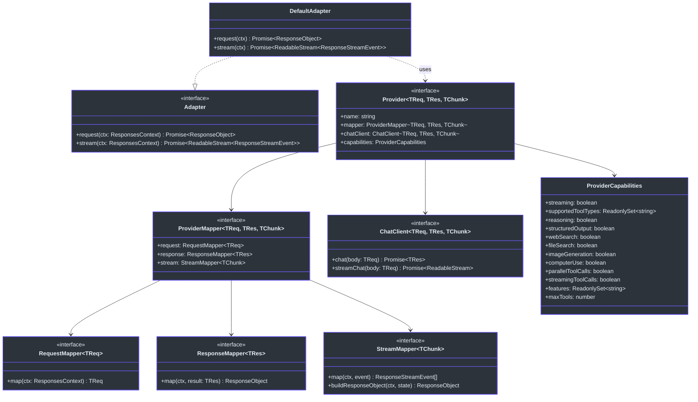
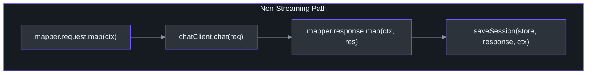
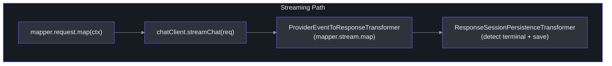

# Adapter Pattern

Godex uses the **Adapter pattern** to decouple the OpenAI Responses API protocol from provider-specific Chat Completions APIs. Each provider contributes a self-contained adapter that handles request mapping, response mapping, and stream mapping, while the core `DefaultAdapter` orchestrates the overall lifecycle.

## Why the Adapter Pattern

Without an adapter layer, every new provider would require changes to the core request handling code. The adapter pattern isolates provider-specific concerns into three mapping functions while keeping the orchestration logic provider-agnostic:

```
ResponsesContext ──► DefaultAdapter ──► Provider.mapper.request  ──► Upstream Request
                                       Provider.chatClient.chat   ──► Upstream Response
                                       Provider.mapper.response ──► ResponseObject
```

This means adding a new provider (e.g., DeepSeek) requires only:
1. Implementing `ProviderMapper` (request/response/stream mapping)
2. Implementing `ChatClient` (HTTP calls)
3. Registering a `ProviderFactory` in the `Registrar`

No changes to `DefaultAdapter`, `ResponsesContext`, or the route handler.

## Core Interfaces

| Interface | Responsibility | Key File | Source |
|-----------|---------------|----------|--------|
| `Adapter` | Orchestrate request/stream lifecycle | [`src/adapter/adapter.ts`](https://github.com/Ahoo-Wang/Godex/blob/main/src/adapter/adapter.ts) | [Lines 28-31](https://github.com/Ahoo-Wang/Godex/blob/main/src/adapter/adapter.ts#L28) |
| `Provider` | Bundle mapper + client + capabilities | [`src/adapter/provider.ts`](https://github.com/Ahoo-Wang/Godex/blob/main/src/adapter/provider.ts) | [Lines 167-172](https://github.com/Ahoo-Wang/Godex/blob/main/src/adapter/provider.ts#L167) |
| `ProviderMapper` | Three mapping functions: request, response, stream | [`src/adapter/provider.ts`](https://github.com/Ahoo-Wang/Godex/blob/main/src/adapter/provider.ts) | [Lines 8-12](https://github.com/Ahoo-Wang/Godex/blob/main/src/adapter/provider.ts#L8) |
| `RequestMapper` | ResponsesContext → upstream request | [`src/adapter/mapper/contract.ts`](https://github.com/Ahoo-Wang/Godex/blob/main/src/adapter/mapper/contract.ts) | [Lines 16-18](https://github.com/Ahoo-Wang/Godex/blob/main/src/adapter/mapper/contract.ts#L16) |
| `ResponseMapper` | Upstream response → ResponseObject | [`src/adapter/mapper/contract.ts`](https://github.com/Ahoo-Wang/Godex/blob/main/src/adapter/mapper/contract.ts) | [Lines 20-25](https://github.com/Ahoo-Wang/Godex/blob/main/src/adapter/mapper/contract.ts#L20) |
| `StreamMapper` | Upstream SSE chunks → ResponseStreamEvent[] | [`src/adapter/mapper/contract.ts`](https://github.com/Ahoo-Wang/Godex/blob/main/src/adapter/mapper/contract.ts) | [Lines 27-37](https://github.com/Ahoo-Wang/Godex/blob/main/src/adapter/mapper/contract.ts#L27) |
| `ChatClient` | HTTP boundary to upstream providers | [`src/adapter/chatClient.ts`](https://github.com/Ahoo-Wang/Godex/blob/main/src/adapter/chatClient.ts) | [Lines 3-7](https://github.com/Ahoo-Wang/Godex/blob/main/src/adapter/chatClient.ts#L3) |

## Class Diagram



## How DefaultAdapter Orchestrates

### Non-Streaming Path

[`DefaultAdapter.request()`](https://github.com/Ahoo-Wang/Godex/blob/main/src/adapter/default-adapter.ts#L14) follows a simple 4-step pipeline:



Step by step ([`src/adapter/default-adapter.ts:14-29`](https://github.com/Ahoo-Wang/Godex/blob/main/src/adapter/default-adapter.ts#L14)):

1. **Request mapping**: `mapper.request.map(ctx)` translates the ResponsesContext into a provider-specific request body (e.g., Zhipu `ChatCompletionTextRequest`)
2. **HTTP call**: `chatClient.chat(req)` sends the request to the upstream provider
3. **Response mapping**: `mapper.response.map(ctx, res)` translates the provider response back to an OpenAI `ResponseObject`
4. **Session save**: `saveSession()` persists the response for future `previous_response_id` lookups. Failures are logged but do not propagate

### Streaming Path

[`DefaultAdapter.stream()`](https://github.com/Ahoo-Wang/Godex/blob/main/src/adapter/default-adapter.ts#L31) assembles a `TransformStream` pipeline:



The key difference: instead of a single response mapping call, each upstream SSE chunk is individually translated via `mapper.stream.map()`. A `StreamState` object accumulates partial results (output text, tool calls) as chunks arrive. See [Stream Pipeline](./stream-pipeline) for the full pipeline details.

When `store === false`, the `ResponseSessionPersistenceTransformer` is omitted ([`src/adapter/default-adapter.ts:43-44`](https://github.com/Ahoo-Wang/Godex/blob/main/src/adapter/default-adapter.ts#L43)).

## Provider Registration Flow

Providers are registered at startup through the `Registrar` + `ProviderFactory` pattern:

```mermaid
sequenceDiagram
    autonumber
    participant AC as ApplicationContext
    participant Reg as Registrar
    participant Factory as ProviderFactory
    participant Provider as Provider

    AC->>Reg: createBuiltinRegistrar()
    Reg->>Reg: registerFactory("zhipu", createZhipuProvider)
    AC->>Reg: build(config.providers)
    loop For each configured provider
        AC->>Reg: factory = factories.get(name)
        Reg->>Factory: factory(config)
        Factory-->>Reg: Provider instance
        Reg->>Reg: providers.set(name, provider)
    end
    AC->>Reg: resolve("zhipu")
    Reg-->>AC: Provider instance

    style AC fill:#2d333b,stroke:#6d5dfc,color:#e6edf3
    style Reg fill:#2d333b,stroke:#6d5dfc,color:#e6edf3
    style Factory fill:#2d333b,stroke:#6d5dfc,color:#e6edf3
    style Provider fill:#2d333b,stroke:#6d5dfc,color:#e6edf3
```

The [`createBuiltinRegistrar()`](https://github.com/Ahoo-Wang/Godex/blob/main/src/providers/builtin.ts#L6) function registers all built-in provider factories. Currently only `zhipu` is registered. Adding a new provider requires:

1. Creating a provider directory under `src/providers/<name>/`
2. Implementing the mapper, chat client, and capabilities
3. Registering the factory in [`src/providers/builtin.ts`](https://github.com/Ahoo-Wang/Godex/blob/main/src/providers/builtin.ts)

During [`Registrar.build()`](https://github.com/Ahoo-Wang/Godex/blob/main/src/providers/registrar.ts#L21), providers that have no matching factory are tracked in `unsupportedProviders` rather than causing a startup failure.

## Capability Checking System

Each `Provider` declares its capabilities via an immutable [`ProviderCapabilities`](https://github.com/Ahoo-Wang/Godex/blob/main/src/adapter/provider.ts#L14) object. This serves two purposes:

1. **Runtime capability checking** -- before dispatching a request, the adapter can verify that the provider supports the requested features (e.g., structured output, specific tool types)
2. **Default capability merging** -- providers only need to specify capabilities they override; everything else comes from `DEFAULT_CAPABILITIES` ([line 74](https://github.com/Ahoo-Wang/Godex/blob/main/src/adapter/provider.ts#L74))

### Capability Table

| Capability | Default | Description |
|-----------|---------|-------------|
| `streaming` | `true` | Supports SSE streaming responses |
| `supportedToolTypes` | `{"function"}` | Which tool types are handled |
| `reasoning` | `false` | Thinking/reasoning token support |
| `structuredOutput` | `false` | `json_schema` / `json_object` output |
| `webSearch` | `false` | Native web search |
| `fileSearch` | `false` | File/knowledge retrieval |
| `imageGeneration` | `false` | Image generation |
| `computerUse` | `false` | Computer use |
| `parallelToolCalls` | `false` | Parallel tool call support |
| `streamingToolCalls` | `false` | Streaming tool call deltas |
| `features` | `{}` | Provider-specific feature names |
| `maxTools` | `-1` | Max tools per request (-1 = unlimited) |

### Merging and Immutability

[`mergeCapabilities()`](https://github.com/Ahoo-Wang/Godex/blob/main/src/adapter/provider.ts#L107) layers partial overrides on top of `DEFAULT_CAPABILITIES`. All `Set` fields are wrapped in `ImmutableReadonlySet` ([line 41](https://github.com/Ahoo-Wang/Godex/blob/main/src/adapter/provider.ts#L41)) which prevents mutation after construction. The returned object is also frozen via `Object.freeze`.

[`checkCapability()`](https://github.com/Ahoo-Wang/Godex/blob/main/src/adapter/provider.ts#L133) provides a uniform check interface that handles boolean, Set, and number capability types, returning a `{ supported, reason? }` result.

## Cross-References

- [Architecture Overview](./overview) -- high-level component relationships
- [Request Flow](./request-flow) -- how a request travels through the adapter
- [Stream Pipeline](./stream-pipeline) -- the TransformStream pipeline used in streaming mode

## References

- [`src/adapter/adapter.ts:28-31`](https://github.com/Ahoo-Wang/Godex/blob/main/src/adapter/adapter.ts#L28) -- Adapter interface
- [`src/adapter/default-adapter.ts:13-58`](https://github.com/Ahoo-Wang/Godex/blob/main/src/adapter/default-adapter.ts#L13) -- DefaultAdapter implementation
- [`src/adapter/provider.ts:8-172`](https://github.com/Ahoo-Wang/Godex/blob/main/src/adapter/provider.ts#L8) -- Provider, ProviderMapper, ProviderCapabilities
- [`src/adapter/mapper/contract.ts:16-37`](https://github.com/Ahoo-Wang/Godex/blob/main/src/adapter/mapper/contract.ts#L16) -- RequestMapper, ResponseMapper, StreamMapper
- [`src/adapter/chatClient.ts:3-7`](https://github.com/Ahoo-Wang/Godex/blob/main/src/adapter/chatClient.ts#L3) -- ChatClient interface
- [`src/providers/registrar.ts:8-54`](https://github.com/Ahoo-Wang/Godex/blob/main/src/providers/registrar.ts#L8) -- Registrar class
- [`src/providers/builtin.ts:6-16`](https://github.com/Ahoo-Wang/Godex/blob/main/src/providers/builtin.ts#L6) -- createBuiltinRegistrar
