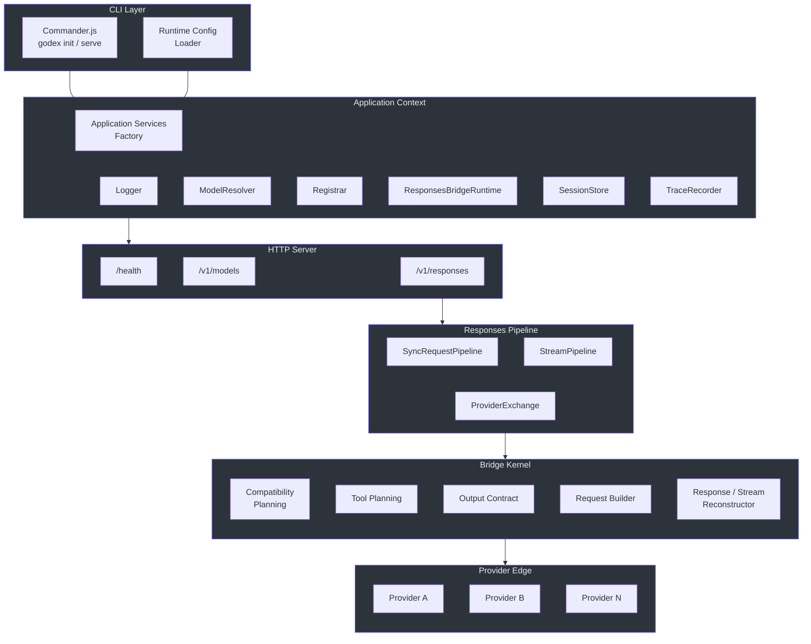
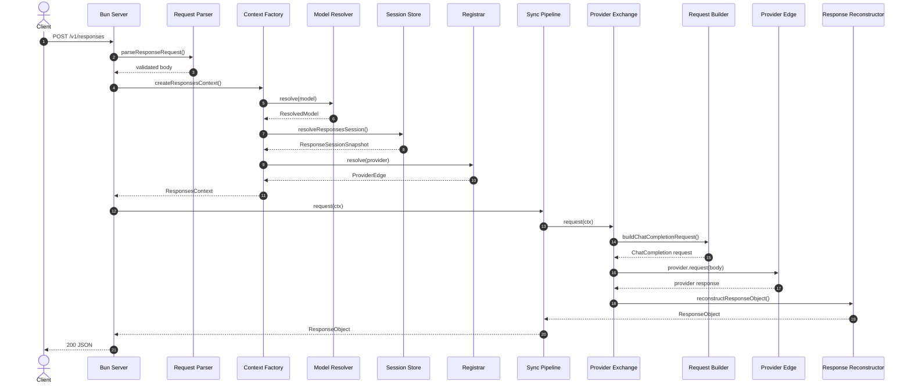
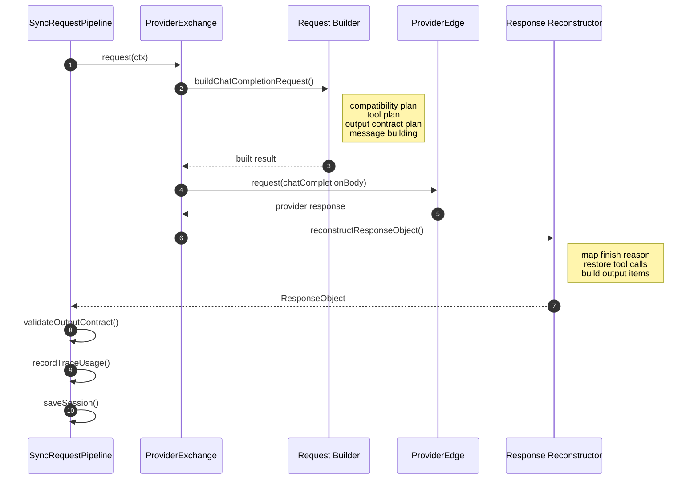
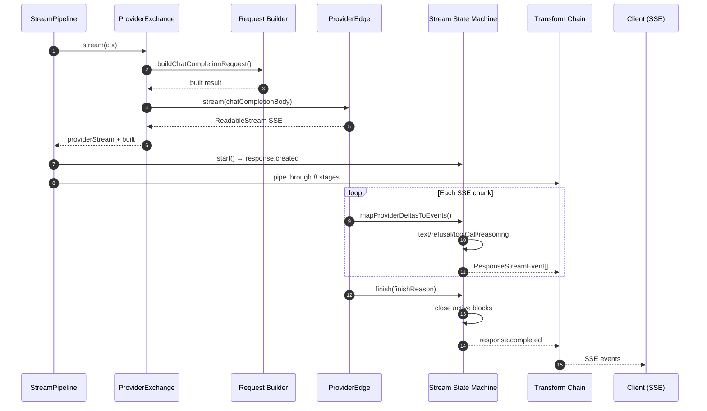
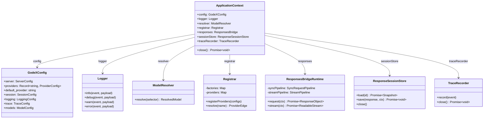

# Architecture

GodeX is built as a layered gateway that accepts OpenAI Responses API requests, translates them through a provider-agnostic bridge kernel into Chat Completions API calls, and reconstructs the responses. Understanding the architecture is essential for contributing to the codebase, adding providers, or debugging request flows. Every request touches the same vertical stack: CLI to server to bridge kernel to provider edge and back.

## At a Glance

| Component | Responsibility | Key File | Source |
|-----------|---------------|----------|--------|
| CLI Layer | Commander.js commands, init wizard, runtime config loading | `src/cli/program.ts` | [src/cli/](https://github.com/Ahoo-Wang/GodeX/blob/main/src/cli/) |
| ApplicationContext | Holds all singleton services for the lifetime of the process | `src/context/application-context.ts:10` | [application-context.ts](https://github.com/Ahoo-Wang/GodeX/blob/main/src/context/application-context.ts) |
| Application Services | Factory that wires logger, resolver, registrar, bridge, session store, trace | `src/context/application-services.ts:23` | [application-services.ts](https://github.com/Ahoo-Wang/GodeX/blob/main/src/context/application-services.ts) |
| Server | Bun.serve with route dispatch for /health, /v1/models, /v1/responses | `src/server/server.ts:29` | [server.ts](https://github.com/Ahoo-Wang/GodeX/blob/main/src/server/server.ts) |
| Responses Context | Per-request context: request, session, model, provider, diagnostics | `src/context/responses-context.ts:22` | [responses-context.ts](https://github.com/Ahoo-Wang/GodeX/blob/main/src/context/responses-context.ts) |
| Responses Pipeline | Sync and stream pipelines via ProviderExchange | `src/responses/runtime.ts:19` | [runtime.ts](https://github.com/Ahoo-Wang/GodeX/blob/main/src/responses/runtime.ts) |
| Bridge Kernel | Provider-agnostic Responses-to-Chat translation | `src/bridge/request/request-builder.ts` | [src/bridge/](https://github.com/Ahoo-Wang/GodeX/blob/main/src/bridge/) |
| Provider Edge | Provider runtime interface with request() and stream() | `src/bridge/provider-spec/contract.ts:76` | [contract.ts](https://github.com/Ahoo-Wang/GodeX/blob/main/src/bridge/provider-spec/contract.ts) |
| Registrar | Maps provider names to ProviderEdge instances | `src/providers/registrar.ts:16` | [registrar.ts](https://github.com/Ahoo-Wang/GodeX/blob/main/src/providers/registrar.ts) |

## High-Level Architecture



## System Layers

### 1. CLI Layer

The entry point for all operations. Built on Commander.js, the CLI provides three top-level commands:

- **`godex init`** — Interactive wizard that generates a `godex.yaml` configuration file ([src/cli/commands/init.ts](https://github.com/Ahoo-Wang/GodeX/blob/main/src/cli/commands/init.ts))
- **`godex serve`** — Starts the HTTP server with runtime config loading ([src/cli/commands/serve.ts](https://github.com/Ahoo-Wang/GodeX/blob/main/src/cli/commands/serve.ts))
- **`godex config`** — Validates and prints the resolved configuration

Runtime config loading ([src/cli/runtime-config/load.ts](https://github.com/Ahoo-Wang/GodeX/blob/main/src/cli/runtime-config/load.ts)) reads `godex.yaml`, applies CLI flag overrides, and produces the `GodeXConfig` object passed to `ApplicationContext`.

### 2. Application Context

[application-context.ts:10](https://github.com/Ahoo-Wang/GodeX/blob/main/src/context/application-context.ts#L10) defines the `ApplicationContext` class — the single composition root created once at startup. It holds seven singleton services:

| Field | Type | Purpose |
|-------|------|---------|
| `config` | `GodeXConfig` | Parsed configuration |
| `logger` | `Logger` | Structured logger |
| `resolver` | `ModelResolver` | Model alias and provider resolution |
| `registrar` | `Registrar` | Provider registry |
| `responses` | `ResponsesBridge` | Sync and stream pipeline orchestrator |
| `sessionStore` | `ResponseSessionStore` | Session persistence |
| `traceRecorder` | `TraceRecorder` | Async trace recording |

The constructor delegates to `createApplicationServices()` which wires everything together.

### 3. Application Services

[application-services.ts:23](https://github.com/Ahoo-Wang/GodeX/blob/main/src/context/application-services.ts#L23) implements the factory function `createApplicationServices()`. This is where the dependency graph is assembled:

1. Create a logger from the logging config
2. Create `ModelResolver` with default provider and alias mappings
3. Create `Registrar` and register all configured providers via `createConfiguredRegistrar()`
4. Create `ResponsesBridgeRuntime` (no arguments — pipelines are created internally)
5. Create `ResponseSessionStore` (memory or SQLite based on config)
6. Create trace services (async recorder or noop)

### 4. Server

[server.ts:29](https://github.com/Ahoo-Wang/GodeX/blob/main/src/server/server.ts#L29) starts `Bun.serve` with three built-in routes:

| Route | Handler | Purpose |
|-------|---------|---------|
| `/health` | `handleHealth()` | Liveness check |
| `/v1/models` | `handleModels()` | List available models |
| `/v1/responses` | `handleResponses()` | Main API endpoint |

Unknown paths return a 404 JSON error. The server reads host, port, and idle timeout from `GodeXConfig.server`.

### 5. Responses Context

[responses-context.ts:22](https://github.com/Ahoo-Wang/GodeX/blob/main/src/context/responses-context.ts#L22) defines the per-request context. Each `POST /v1/responses` call creates a fresh `ResponsesContext` that carries:

- The original `ResponseCreateRequest`
- An optional `ResponseSessionSnapshot` (from `previous_response_id` resolution)
- A `ResolvedModel` (provider + model name)
- A `ProviderEdge` instance for the resolved provider
- A `diagnostics` array for compatibility warnings
- An `outputContract` slot for structured output validation

### 6. Responses Pipeline

[runtime.ts:19](https://github.com/Ahoo-Wang/GodeX/blob/main/src/responses/runtime.ts#L19) implements `ResponsesBridgeRuntime`, which owns a `SyncRequestPipeline` and a `StreamPipeline`. Both share the same `ProviderExchange` instance:

- **Sync**: `ProviderExchange.request()` builds the ChatCompletion request, sends it to the provider, and reconstructs the `ResponseObject`
- **Stream**: `ProviderExchange.stream()` builds the request, opens an SSE stream, and pipes it through composable `TransformStream` stages

### 7. Bridge Kernel

The bridge kernel in `src/bridge/` is the translation layer between OpenAI Responses API and Chat Completions API. It is completely provider-agnostic. See [Bridge Kernel](../03-bridge-kernel/bridge-kernel.md) for the full deep dive.

### 8. Provider Edge

[contract.ts:76](https://github.com/Ahoo-Wang/GodeX/blob/main/src/bridge/provider-spec/contract.ts#L76) defines the `ProviderEdge` interface — the runtime boundary between GodeX and any upstream LLM provider:

```typescript
interface ProviderEdge<TBridgeRequest, TResponse, TChunk> {
  readonly name: string;
  readonly spec: ProviderSpec<TBridgeRequest, TResponse, TChunk>;
  request(body: TBridgeRequest): Promise<TResponse>;
  stream(body: TBridgeRequest): Promise<ReadableStream<JsonServerSentEvent<TChunk>>>;
}
```

The `createProviderEdge()` factory ([factory.ts:34](https://github.com/Ahoo-Wang/GodeX/blob/main/src/bridge/provider-spec/factory.ts#L34)) applies provider hooks (`patchRequest`, `normalizeResponse`, `normalizeChunk`) before and after each call.

### 9. Registrar

[registrar.ts:16](https://github.com/Ahoo-Wang/GodeX/blob/main/src/providers/registrar.ts#L16) maps provider names (from `godex.yaml`) to `ProviderEdge` instances. During startup, `registerProviders()` iterates the config, finds the matching factory by `spec` name, and instantiates each provider. The `resolve()` method is called per-request to look up the correct `ProviderEdge`.

## Request Flow

The full request path from HTTP to provider and back:



### Sync Request Sequence

The sync path is used when `stream` is not `true` in the request. The `SyncRequestPipeline` ([sync-request-pipeline.ts:31](https://github.com/Ahoo-Wang/GodeX/blob/main/src/responses/sync-request-pipeline.ts#L31)) executes a single exchange: build the ChatCompletion request via `ProviderExchange.request()`, then reconstruct the `ResponseObject` using the provider's response accessor. After reconstruction, the pipeline validates the output contract, records trace usage, and persists the session.



### Streaming Request Sequence

When `stream: true`, the `StreamPipeline` ([stream-pipeline.ts:37](https://github.com/Ahoo-Wang/GodeX/blob/main/src/responses/stream-pipeline.ts#L37)) opens an SSE connection to the provider and pipes the response through a chain of composable `TransformStream` stages:

1. **TraceTransformer** (raw upstream events)
2. **ProviderStreamEventBridge** (delta-to-event mapping via `ResponseStreamStateMachine`)
3. **ErrorHandler** (catches stream errors, emits failure events)
4. **OutputContractValidation** (validates JSON on stream close)
5. **TraceTransformer** (transformed events)
6. **ResponseLogTransformer** (logs completion)
7. **SessionPersistenceTransformer** (saves session on stream end)
8. **CompatibilityLogTransformer** (logs compatibility diagnostics)



## ApplicationContext Dependencies



## Component Dependency Diagram

```mermaid
graph LR
    subgraph "Per-Request"
        RC[ResponsesContext]
    end

    subgraph "Singleton Services"
        AC[ApplicationContext]
        LR[ModelResolver]
        RG[Registrar]
        RT[ResponsesBridgeRuntime]
        SS[SessionStore]
        TR[TraceRecorder]
    end

    subgraph "Bridge Kernel"
        CP[Compatibility Planner]
        TP[Tool Planner]
        OC[Output Contract]
        RB[Request Builder]
        RR[Response Reconstructor]
        SM[Stream State Machine]
    end

    subgraph "Provider Layer"
        PE[ProviderEdge]
        PS[ProviderSpec]
    end

    RC --> AC
    RC --> PE
    AC --> LR
    AC --> RG
    AC --> RT
    AC --> SS
    AC --> TR
    RT --> RB
    RB --> CP
    RB --> TP
    RB --> OC
    RT --> RR
    RT --> SM
    PE --> PS

    style "Per-Request" fill:#161b22,stroke:#6d5dfc,color:#e6edf3
    style "Singleton Services" fill:#161b22,stroke:#6d5dfc,color:#e6edf3
    style "Bridge Kernel" fill:#161b22,stroke:#6d5dfc,color:#e6edf3
    style "Provider Layer" fill:#161b22,stroke:#6d5dfc,color:#e6edf3
```

## Key Design Decisions

### Bridge Kernel is Provider-Agnostic

All provider-specific behavior lives in `ProviderSpec` hooks (`patchRequest`, `normalizeResponse`, `normalizeChunk`). The bridge kernel never imports provider code — it operates on the `ProviderSpec` interface alone. This means adding a new provider requires zero changes to the bridge.

### Compatibility Planning Before Request Building

The build phase follows a strict order: **plan compatibility → plan tools → plan output contract → build messages → validate**. If any step produces a `rejected` decision, the build throws a `BridgeError` before the request is sent upstream. This prevents silent data loss.

### Stream Pipeline Uses Composable TransformStream Stages

The streaming pipeline is a chain of `TransformStream` instances ([stream-pipeline.ts:44-84](https://github.com/Ahoo-Wang/GodeX/blob/main/src/responses/stream-pipeline.ts#L44-L84)). Each stage has a single responsibility: trace, event bridge, error handling, output validation, logging, or session persistence. New cross-cutting concerns can be added by inserting a transform stage.

### Sessions Use Parent-Pointer Chains

Sessions use `previous_response_id` to form immutable chains. Each session snapshot is loaded once and never mutated. This avoids the complexity of mutable cursors and makes session resolution a simple lookup-and-walk operation.

### Trace is Async with Bounded Queue

The `TraceRecorder` records events asynchronously using a bounded queue. If the queue is full, trace events are dropped rather than blocking the response pipeline. This ensures that trace recording never adds latency to the critical path.

## Related Pages

- [Bridge Kernel] ../03-bridge-kernel/bridge-kernel.md) — Deep dive into the translation layer
- [Streaming Pipeline](../05-streaming-pipeline/streaming-pipeline.md) — Composable transform stages
- [Session Management](../06-session-management/session-management.md) — Session chains and stores
- [Provider Development](../04-provider-development/provider-development.md) — Adding new providers
- [Configuration](../07-configuration/configuration.md) — godex.yaml schema and defaults

## References

- [application-context.ts](https://github.com/Ahoo-Wang/GodeX/blob/main/src/context/application-context.ts) — Composition root
- [application-services.ts](https://github.com/Ahoo-Wang/GodeX/blob/main/src/context/application-services.ts) — Service factory
- [server.ts](https://github.com/Ahoo-Wang/GodeX/blob/main/src/server/server.ts) — Bun.serve setup
- [responses-context.ts](https://github.com/Ahoo-Wang/GodeX/blob/main/src/context/responses-context.ts) — Per-request context
- [responses-context-factory.ts](https://github.com/Ahoo-Wang/GodeX/blob/main/src/context/responses-context-factory.ts) — Context creation
- [runtime.ts](https://github.com/Ahoo-Wang/GodeX/blob/main/src/responses/runtime.ts) — Pipeline orchestrator
- [provider-exchange.ts](https://github.com/Ahoo-Wang/GodeX/blob/main/src/responses/provider-exchange.ts) — Provider exchange
- [sync-request-pipeline.ts](https://github.com/Ahoo-Wang/GodeX/blob/main/src/responses/sync-request-pipeline.ts) — Sync path
- [stream-pipeline.ts](https://github.com/Ahoo-Wang/GodeX/blob/main/src/responses/stream-pipeline.ts) — Stream path
- [registrar.ts](https://github.com/Ahoo-Wang/GodeX/blob/main/src/providers/registrar.ts) — Provider registry
- [contract.ts](https://github.com/Ahoo-Wang/GodeX/blob/main/src/bridge/provider-spec/contract.ts) — ProviderEdge interface
- [factory.ts](https://github.com/Ahoo-Wang/GodeX/blob/main/src/bridge/provider-spec/factory.ts) — ProviderEdge factory
