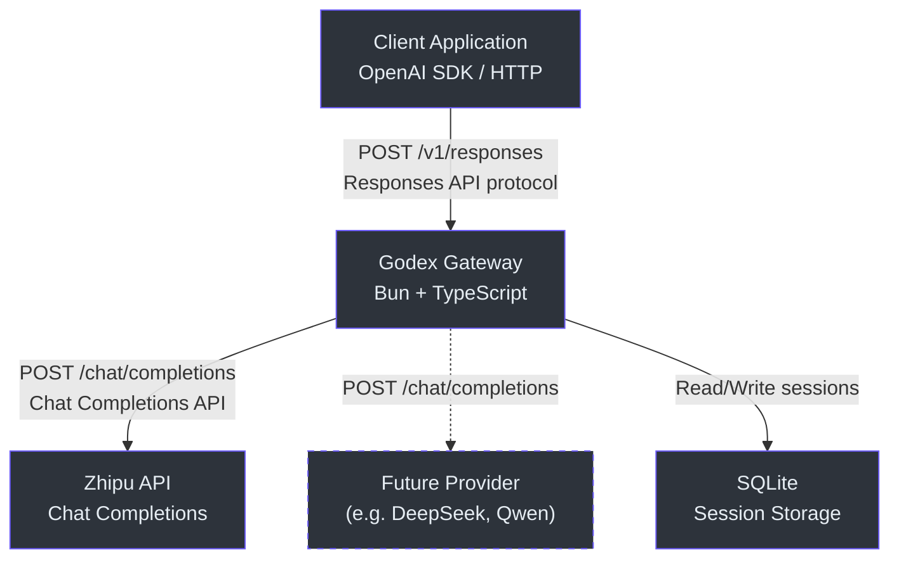
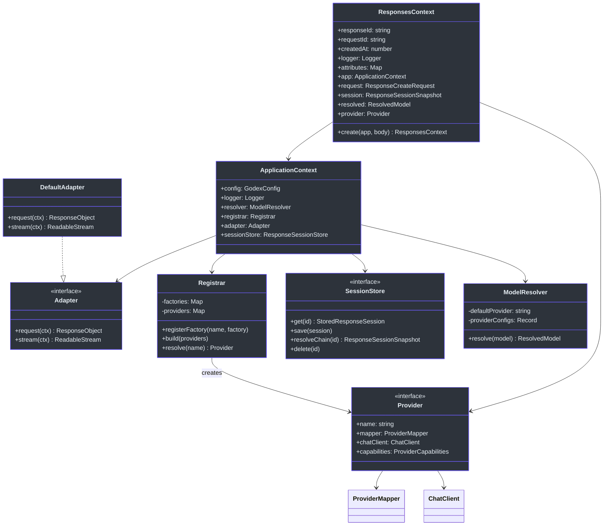
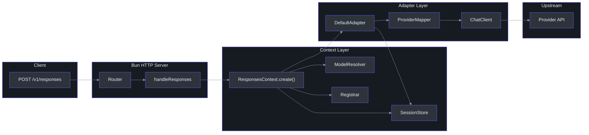

# Architecture Overview

Godex is an **OpenAI Responses API gateway** that translates `/v1/responses` requests into upstream Chat Completions API calls. It exposes an OpenAI-compatible HTTP interface while proxying to provider-specific backends, starting with [Zhipu (智谱)](https://open.bigmodel.cn/).

## Why This System Exists

The OpenAI Responses API introduces a different protocol than the classic Chat Completions API -- it uses a session-based conversation model with `previous_response_id` chaining, structured output items, and a streaming event taxonomy that differs from Chat Completions SSE chunks. Godex bridges this gap so that clients written against the Responses API can transparently reach non-OpenAI providers.

```
Client (Responses API) ──► Godex ──► Upstream Provider (Chat Completions API)
      OpenAI protocol            Protocol              Provider-specific protocol
                                 translation
```

## At a Glance

| Component | Responsibility | Key File | Source |
|-----------|---------------|----------|--------|
| **ApplicationContext** | DI container holding all shared services | [`src/context/application-context.ts`](https://github.com/Ahoo-Wang/Godex/blob/main/src/context/application-context.ts) | [Lines 23-43](https://github.com/Ahoo-Wang/Godex/blob/main/src/context/application-context.ts#L23) |
| **ResponsesContext** | Per-request context: parsed body, resolved model, session snapshot | [`src/context/responses-context.ts`](https://github.com/Ahoo-Wang/Godex/blob/main/src/context/responses-context.ts) | [Lines 15-91](https://github.com/Ahoo-Wang/Godex/blob/main/src/context/responses-context.ts#L15) |
| **Provider** | Named adapter bundling mapper + chatClient + capabilities | [`src/adapter/provider.ts`](https://github.com/Ahoo-Wang/Godex/blob/main/src/adapter/provider.ts) | [Lines 167-172](https://github.com/Ahoo-Wang/Godex/blob/main/src/adapter/provider.ts#L167) |
| **DefaultAdapter** | Orchestrates request/response lifecycle using a Provider | [`src/adapter/default-adapter.ts`](https://github.com/Ahoo-Wang/Godex/blob/main/src/adapter/default-adapter.ts) | [Lines 13-58](https://github.com/Ahoo-Wang/Godex/blob/main/src/adapter/default-adapter.ts#L13) |
| **SessionStore** | Persists response chains for multi-turn conversations | [`src/session/index.ts`](https://github.com/Ahoo-Wang/Godex/blob/main/src/session/index.ts) | [Lines 99-120](https://github.com/Ahoo-Wang/Godex/blob/main/src/session/index.ts#L99) |
| **Registrar** | Registry of provider factories; resolves provider by name | [`src/providers/registrar.ts`](https://github.com/Ahoo-Wang/Godex/blob/main/src/providers/registrar.ts) | [Lines 8-54](https://github.com/Ahoo-Wang/Godex/blob/main/src/providers/registrar.ts#L8) |
| **ModelResolver** | Parses `model` selectors and applies per-provider name mappings | [`src/resolver/index.ts`](https://github.com/Ahoo-Wang/Godex/blob/main/src/resolver/index.ts) | [Lines 13-37](https://github.com/Ahoo-Wang/Godex/blob/main/src/resolver/index.ts#L13) |
| **Router** | Bun HTTP server with route table | [`src/server/index.ts`](https://github.com/Ahoo-Wang/Godex/blob/main/src/server/index.ts) | [Lines 22-50](https://github.com/Ahoo-Wang/Godex/blob/main/src/server/index.ts#L22) |

## C4 Context Diagram



## High-Level Component Diagram



## Data Flow



## Key Architectural Decisions

| Decision | Rationale | Tradeoff |
|----------|-----------|----------|
| **Protocol translation in ProviderMapper** | Keeps Adapter logic provider-agnostic; each provider owns its mapping | Adds a layer of indirection per provider |
| **TransformStream pipeline for streaming** | Standards-based, composable, native backpressure | Slightly more abstract than callback-based approaches |
| **Session storage as a separate concern** | Decouples conversation state from request handling | Requires an extra persistence step per request |
| **Provider registration via factory pattern** | Lazy construction; only configured providers are instantiated | Factory must be called in the right order during startup |
| **Per-request ResponsesContext** | Immutable snapshot of resolution results; easy to test | Object allocation per request (negligible cost) |
| **Immutable ProviderCapabilities** | Prevents accidental mutation of capability flags | Must create new objects when overriding |
| **Bun as runtime** | Native TypeScript, built-in SQLite, fast HTTP server | Tied to Bun's API surface (not Node-compatible) |

## Cross-References

- [Request Flow](./request-flow) -- step-by-step walkthrough of a single request
- [Adapter Pattern](./adapter-pattern) -- how Provider/Mapper/ChatClient work together
- [Stream Pipeline](./stream-pipeline) -- the 3-stage TransformStream pipeline for SSE

## References

- [`src/context/application-context.ts:23-43`](https://github.com/Ahoo-Wang/Godex/blob/main/src/context/application-context.ts#L23) -- ApplicationContext DI container
- [`src/context/responses-context.ts:15-91`](https://github.com/Ahoo-Wang/Godex/blob/main/src/context/responses-context.ts#L15) -- ResponsesContext creation and per-request state
- [`src/adapter/provider.ts:167-172`](https://github.com/Ahoo-Wang/Godex/blob/main/src/adapter/provider.ts#L167) -- Provider interface
- [`src/adapter/default-adapter.ts:13-58`](https://github.com/Ahoo-Wang/Godex/blob/main/src/adapter/default-adapter.ts#L13) -- DefaultAdapter implementation
- [`src/session/index.ts:99-120`](https://github.com/Ahoo-Wang/Godex/blob/main/src/session/index.ts#L99) -- ResponseSessionStore interface
- [`src/providers/registrar.ts:8-54`](https://github.com/Ahoo-Wang/Godex/blob/main/src/providers/registrar.ts#L8) -- Registrar class
- [`src/resolver/index.ts:13-37`](https://github.com/Ahoo-Wang/Godex/blob/main/src/resolver/index.ts#L13) -- ModelResolver
- [`src/server/index.ts:22-50`](https://github.com/Ahoo-Wang/Godex/blob/main/src/server/index.ts#L22) -- Bun HTTP server setup
