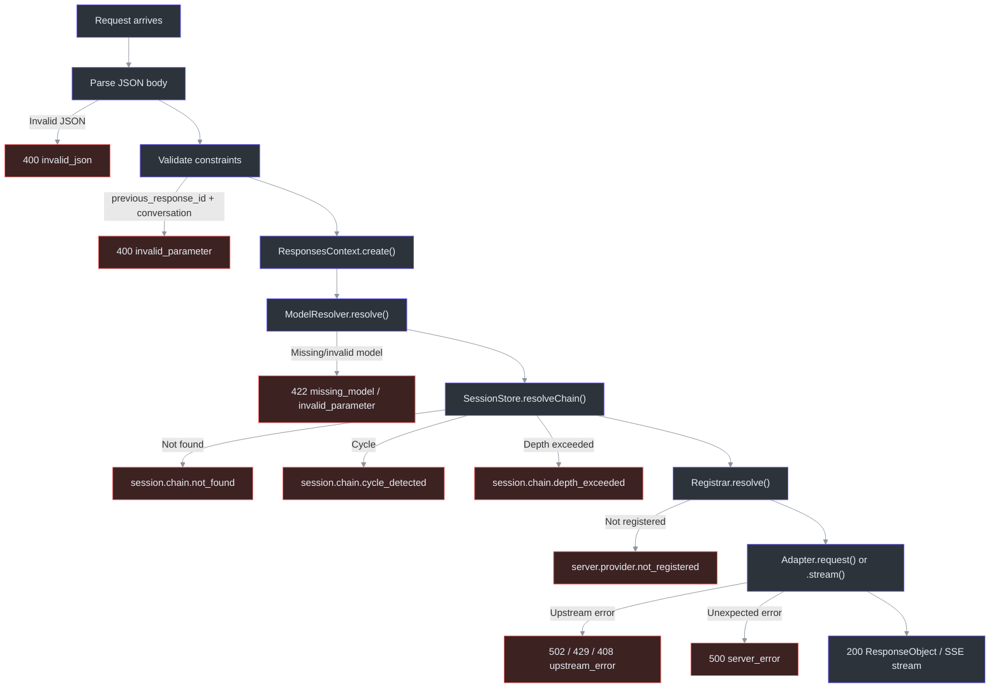

# Request Flow

This page traces the full lifecycle of a request from the moment it hits the Bun HTTP server until the response (or SSE stream) is returned to the client.

## At a Glance

| Stage | Input | Output | Key File | Source |
|-------|-------|--------|----------|--------|
| 1. HTTP parse | Raw `Request` | JSON body | [`src/server/routes/responses/index.ts`](https://github.com/Ahoo-Wang/Godex/blob/main/src/server/routes/responses/index.ts) | [Lines 17-28](https://github.com/Ahoo-Wang/Godex/blob/main/src/server/routes/responses/index.ts#L17) |
| 2. Context creation | `ResponseCreateRequest` | `ResponsesContext` | [`src/context/responses-context.ts`](https://github.com/Ahoo-Wang/Godex/blob/main/src/context/responses-context.ts) | [Lines 39-90](https://github.com/Ahoo-Wang/Godex/blob/main/src/context/responses-context.ts#L39) |
| 3. Model resolution | `body.model` string | `ResolvedModel` (provider + model) | [`src/resolver/index.ts`](https://github.com/Ahoo-Wang/Godex/blob/main/src/resolver/index.ts) | [Lines 25-37](https://github.com/Ahoo-Wang/Godex/blob/main/src/resolver/index.ts#L25) |
| 4. Session chain | `previous_response_id` | `ResponseSessionSnapshot` | [`src/session/chain.ts`](https://github.com/Ahoo-Wang/Godex/blob/main/src/session/chain.ts) | [Lines 26-98](https://github.com/Ahoo-Wang/Godex/blob/main/src/session/chain.ts#L26) |
| 5. Provider resolution | `resolved.provider` | `Provider` instance | [`src/providers/registrar.ts`](https://github.com/Ahoo-Wang/Godex/blob/main/src/providers/registrar.ts) | [Lines 34-38](https://github.com/Ahoo-Wang/Godex/blob/main/src/providers/registrar.ts#L34) |
| 6. Request mapping | `ResponsesContext` | Upstream request body | [`src/adapter/default-adapter.ts`](https://github.com/Ahoo-Wang/Godex/blob/main/src/adapter/default-adapter.ts) | [Lines 14-18](https://github.com/Ahoo-Wang/Godex/blob/main/src/adapter/default-adapter.ts#L14) |
| 7. HTTP call | Upstream request | Upstream response | [`src/adapter/chatClient.ts`](https://github.com/Ahoo-Wang/Godex/blob/main/src/adapter/chatClient.ts) | [Lines 3-7](https://github.com/Ahoo-Wang/Godex/blob/main/src/adapter/chatClient.ts#L3) |
| 8. Response mapping | Upstream response | `ResponseObject` | [`src/adapter/default-adapter.ts`](https://github.com/Ahoo-Wang/Godex/blob/main/src/adapter/default-adapter.ts) | [Lines 18-19](https://github.com/Ahoo-Wang/Godex/blob/main/src/adapter/default-adapter.ts#L18) |
| 9. Session save | `ResponseObject` | Persisted session | [`src/adapter/default-adapter.ts`](https://github.com/Ahoo-Wang/Godex/blob/main/src/adapter/default-adapter.ts) | [Lines 19-27](https://github.com/Ahoo-Wang/Godex/blob/main/src/adapter/default-adapter.ts#L19) |

## Full Request Lifecycle

```mermaid
sequenceDiagram
    autonumber
    participant Client
    participant Router as Bun Router
    participant Handler as handleResponses
    participant RC as ResponsesContext
    participant MR as ModelResolver
    participant SS as SessionStore
    participant Reg as Registrar
    participant DA as DefaultAdapter
    participant PM as ProviderMapper
    participant CC as ChatClient
    participant Upstream as Upstream Provider

    Client->>Router: POST /v1/responses
    Router->>Handler: route match
    Handler->>Handler: Parse JSON body
    Handler->>RC: ResponsesContext.create(app, body)
    RC->>MR: resolve(body.model)
    MR-->>RC: ResolvedModel {provider, model}
    RC->>SS: resolveChain(previous_response_id)
    SS-->>RC: ResponseSessionSnapshot
    RC->>Reg: resolve(provider)
    Reg-->>RC: Provider instance
    RC-->>Handler: ResponsesContext
    Handler->>DA: adapter.request(ctx)
    DA->>PM: mapper.request.map(ctx)
    PM-->>DA: upstream request body
    DA->>CC: chatClient.chat(req)
    CC->>Upstream: POST /chat/completions
    Upstream-->>CC: ChatCompletionResponse
    CC-->>DA: raw response
    DA->>PM: mapper.response.map(ctx, res)
    PM-->>DA: ResponseObject
    DA->>SS: saveSession(response)
    DA-->>Handler: ResponseObject
    Handler-->>Client: 200 JSON ResponseObject

    style Client fill:#2d333b,stroke:#6d5dfc,color:#e6edf3
    style Router fill:#2d333b,stroke:#6d5dfc,color:#e6edf3
    style Handler fill:#2d333b,stroke:#6d5dfc,color:#e6edf3
    style RC fill:#2d333b,stroke:#6d5dfc,color:#e6edf3
    style MR fill:#2d333b,stroke:#6d5dfc,color:#e6edf3
    style SS fill:#2d333b,stroke:#6d5dfc,color:#e6edf3
    style Reg fill:#2d333b,stroke:#6d5dfc,color:#e6edf3
    style DA fill:#2d333b,stroke:#6d5dfc,color:#e6edf3
    style PM fill:#2d333b,stroke:#6d5dfc,color:#e6edf3
    style CC fill:#2d333b,stroke:#6d5dfc,color:#e6edf3
    style Upstream fill:#2d333b,stroke:#6d5dfc,color:#e6edf3
```

## Stage-by-Stage Explanation

### Stage 1: HTTP Entry

The Bun HTTP server routes `POST /v1/responses` to `handleResponses` ([`src/server/routes/responses/index.ts:17-28`](https://github.com/Ahoo-Wang/Godex/blob/main/src/server/routes/responses/index.ts#L17)). The handler parses the JSON body and validates basic constraints:

```typescript
body = (await req.json()) as ResponseCreateRequest;
```

If `previous_response_id` and `conversation` are both present, the request is rejected immediately with a 400 error.

### Stage 2: Context Creation

[`ResponsesContext.create()`](https://github.com/Ahoo-Wang/Godex/blob/main/src/context/responses-context.ts#L39) is the single entry point for building a per-request context. It sequentially:

1. Calls `ModelResolver.resolve()` to parse the model selector
2. Checks that the resolved provider exists in configuration
3. Optionally resolves a session chain via `SessionStore.resolveChain()`
4. Resolves the provider instance via `Registrar.resolve()`

Each failure point throws a domain-specific error (see [Error Handling](#error-handting-flow) below).

### Stage 3: Model Resolution

[`ModelResolver.resolve()`](https://github.com/Ahoo-Wang/Godex/blob/main/src/resolver/index.ts#L25) accepts model selectors in two forms:

| Selector Form | Example | Resolved To |
|---------------|---------|-------------|
| `provider/model` | `zhipu/glm-4-flash` | provider=`zhipu`, model=`glm-4-flash` |
| bare `model` | `glm-4-flash` | provider=`default_provider`, model=`glm-4-flash` |

Per-provider `models` mappings can remap model names (e.g., `"gpt-4": "glm-4"`). A wildcard entry `"*"` acts as a catch-all.

### Stage 4: Session Chain Resolution

When `previous_response_id` is present, [`resolveResponseSessionChain()`](https://github.com/Ahoo-Wang/Godex/blob/main/src/session/chain.ts#L26) walks the parent chain backwards, performing:

- **Cycle detection** via a `visited` set ([line 49](https://github.com/Ahoo-Wang/Godex/blob/main/src/session/chain.ts#L49))
- **Depth limiting** (default 64 hops) ([line 37](https://github.com/Ahoo-Wang/Godex/blob/main/src/session/chain.ts#L37))
- **Status filtering** -- incomplete responses are rejected unless `include_incomplete` is set ([line 73](https://github.com/Ahoo-Wang/Godex/blob/main/src/session/chain.ts#L73))
- **Input item flattening** -- each turn's request input + response output is merged into `input_items` ([line 93](https://github.com/Ahoo-Wang/Godex/blob/main/src/session/chain.ts#L93))

### Stage 5: Provider Resolution

[`Registrar.resolve()`](https://github.com/Ahoo-Wang/Godex/blob/main/src/providers/registrar.ts#L34) looks up the pre-built `Provider` instance by name. If the provider was not registered during `build()`, it throws.

### Stage 6-8: Adapter Execution

[`DefaultAdapter.request()`](https://github.com/Ahoo-Wang/Godex/blob/main/src/adapter/default-adapter.ts#L14) orchestrates the three mapping steps:

1. **Request mapping** -- `mapper.request.map(ctx)` converts the Responses API request into a provider-specific format
2. **HTTP call** -- `chatClient.chat(req)` sends the request to the upstream API
3. **Response mapping** -- `mapper.response.map(ctx, res)` converts the provider response back to a `ResponseObject`

### Stage 9: Session Persistence

After successful response mapping, the session is saved via [`saveSession()`](https://github.com/Ahoo-Wang/Godex/blob/main/src/adapter/default-adapter.ts#L61). Session save failures are logged as warnings but do **not** fail the request.

## Streaming Path

When `body.stream` is `true`, the request takes a different path through the adapter:

```mermaid
sequenceDiagram
    autonumber
    participant Client
    participant Handler as handleResponses
    participant DA as DefaultAdapter
    participant CC as ChatClient
    participant Upstream as Upstream Provider
    participant PE as ProviderEventToResponse
    participant SP as SessionPersistence
    participant SSE as SseEncode

    Client->>Handler: POST /v1/responses (stream: true)
    Handler->>DA: adapter.stream(ctx)
    DA->>CC: chatClient.streamChat(req)
    CC->>Upstream: SSE connection
    loop For each upstream SSE chunk
        Upstream-->>CC: SSE chunk
        CC-->>PE: JsonServerSentEvent
        PE->>PE: mapper.stream.map(ctx, event)
        PE-->>SP: ResponseStreamEvent[]
        SP->>SP: Detect terminal event
        SP-->>SSE: ResponseStreamEvent
        SSE-->>Client: SSE event + data
    end
    SSE-->>Client: data: [DONE]

    style Client fill:#2d333b,stroke:#6d5dfc,color:#e6edf3
    style Handler fill:#2d333b,stroke:#6d5dfc,color:#e6edf3
    style DA fill:#2d333b,stroke:#6d5dfc,color:#e6edf3
    style CC fill:#2d333b,stroke:#6d5dfc,color:#e6edf3
    style Upstream fill:#2d333b,stroke:#6d5dfc,color:#e6edf3
    style PE fill:#2d333b,stroke:#6d5dfc,color:#e6edf3
    style SP fill:#2d333b,stroke:#6d5dfc,color:#e6edf3
    style SSE fill:#2d333b,stroke:#6d5dfc,color:#e6edf3
```

The streaming path differs from the non-streaming path in several key ways:

1. **No immediate response mapping** -- instead of `mapper.response.map()`, each upstream SSE chunk is individually translated via `mapper.stream.map()`
2. **TransformStream pipeline** -- three chained transformers process the stream (see [Stream Pipeline](./stream-pipeline))
3. **Deferred session save** -- the session is persisted only when a terminal event (`response.completed`, `response.incomplete`, or `response.failed`) is detected
4. **SSE wire format** -- the final transformer encodes events as `event: <type>\ndata: <json>\n\n` with a trailing `[DONE]` sentinel

When `store === false`, the `ResponseSessionPersistenceTransformer` is omitted from the pipeline entirely ([`src/adapter/default-adapter.ts:43-44`](https://github.com/Ahoo-Wang/Godex/blob/main/src/adapter/default-adapter.ts#L43)).

## Error Handling Flow



All errors are mapped to HTTP responses in [`handleResponses()`](https://github.com/Ahoo-Wang/Godex/blob/main/src/server/routes/responses/index.ts#L77):

| Error Type | HTTP Status | Handler |
|-----------|-------------|---------|
| `ProviderError` | 429 / 408 / 502 / 422 | [`providerErrorToHttp()`](https://github.com/Ahoo-Wang/Godex/blob/main/src/server/errors.ts#L20) |
| `GodexError` (base) | `err.status` | [`godexErrorToHttp()`](https://github.com/Ahoo-Wang/Godex/blob/main/src/server/errors.ts#L13) |
| Unexpected | 500 | logged + generic message |

Provider errors are specially mapped: upstream 429 becomes local 429, upstream 408 becomes local 408, and upstream 5xx becomes 502 to hide internal details from the client ([`src/server/errors.ts:20-44`](https://github.com/Ahoo-Wang/Godex/blob/main/src/server/errors.ts#L20)).

## Cross-References

- [Architecture Overview](./overview) -- high-level component diagram and design decisions
- [Adapter Pattern](./adapter-pattern) -- how Provider, ProviderMapper, and ChatClient are structured
- [Stream Pipeline](./stream-pipeline) -- the 3-stage TransformStream pipeline for SSE streaming

## References

- [`src/server/routes/responses/index.ts:17-99`](https://github.com/Ahoo-Wang/Godex/blob/main/src/server/routes/responses/index.ts#L17) -- handleResponses entry point
- [`src/context/responses-context.ts:39-90`](https://github.com/Ahoo-Wang/Godex/blob/main/src/context/responses-context.ts#L39) -- ResponsesContext.create()
- [`src/resolver/index.ts:25-37`](https://github.com/Ahoo-Wang/Godex/blob/main/src/resolver/index.ts#L25) -- ModelResolver.resolve()
- [`src/session/chain.ts:26-98`](https://github.com/Ahoo-Wang/Godex/blob/main/src/session/chain.ts#L26) -- resolveResponseSessionChain()
- [`src/providers/registrar.ts:34-38`](https://github.com/Ahoo-Wang/Godex/blob/main/src/providers/registrar.ts#L34) -- Registrar.resolve()
- [`src/adapter/default-adapter.ts:14-58`](https://github.com/Ahoo-Wang/Godex/blob/main/src/adapter/default-adapter.ts#L14) -- DefaultAdapter.request() / stream()
- [`src/server/errors.ts:13-44`](https://github.com/Ahoo-Wang/Godex/blob/main/src/server/errors.ts#L13) -- Error-to-HTTP mapping
