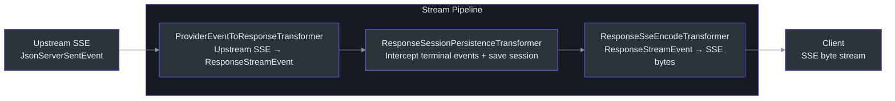
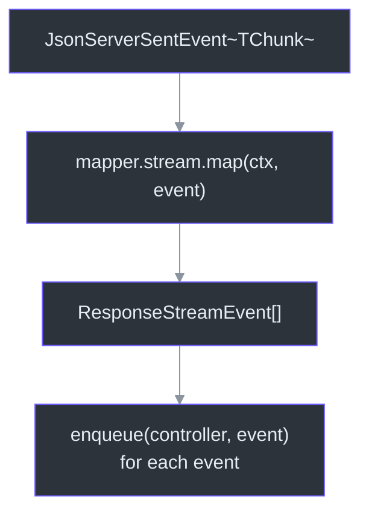
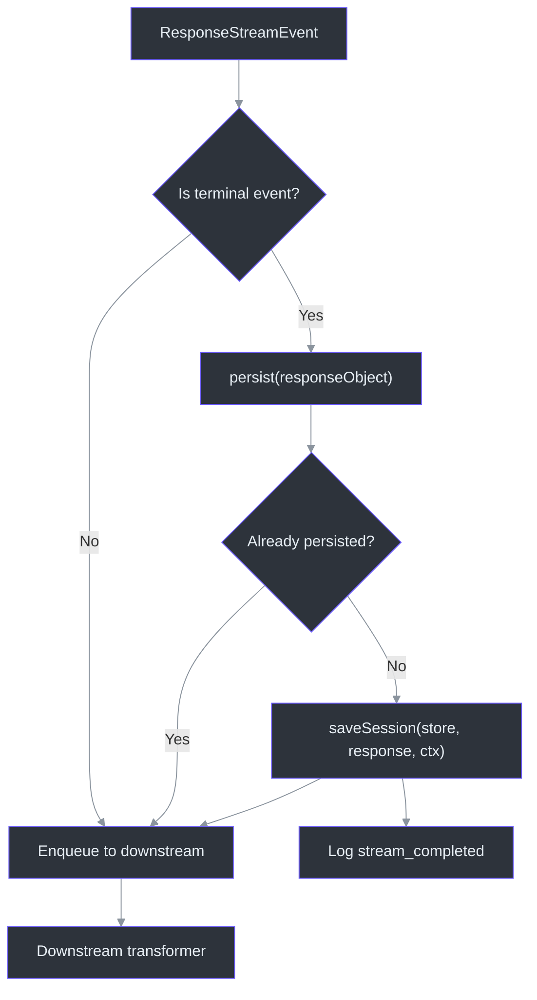
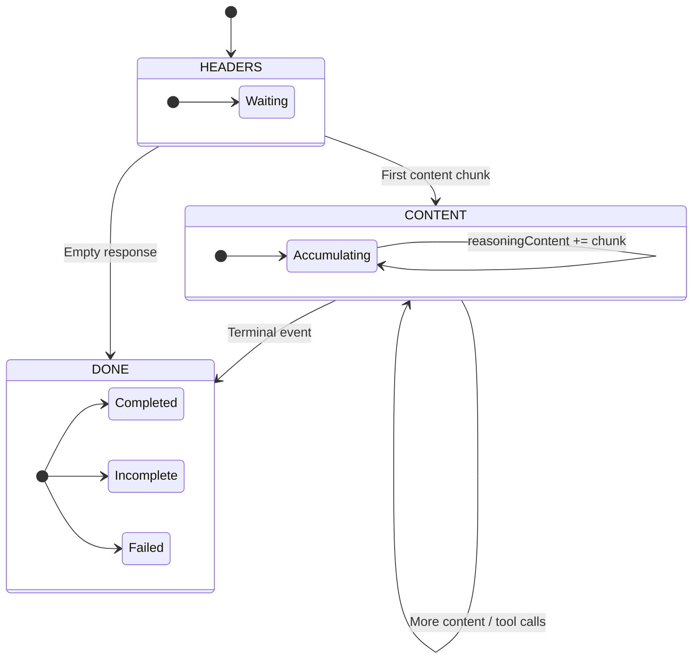

# Stream Pipeline

When a client sends a streaming request (`stream: true`), Godex processes upstream provider SSE chunks through a **3-stage TransformStream pipeline** before delivering them to the client. Each stage has a single responsibility: protocol translation, session persistence, or wire encoding.

## Why TransformStream

The pipeline uses the Web Streams API `TransformStream` rather than callbacks or event emitters because:

- **Backpressure** is built into the spec -- if the client reads slowly, the pipeline naturally slows upstream consumption
- **Composability** -- stages are chained via `pipeThrough()`, making it trivial to add or remove stages
- **Standards-based** -- `TransformStream` works identically in Bun, browsers, and Deni

The helper [`pipeTransform()`](https://github.com/Ahoo-Wang/Godex/blob/main/src/adapter/transformers/stream-utils.ts#L16) wraps the boilerplate:

```typescript
export function pipeTransform<I, O>(
  stream: ReadableStream<I>,
  transformer: Transformer<I, O>,
): ReadableStream<O> {
  return stream.pipeThrough(new TransformStream(transformer));
}
```

## Pipeline Overview



### At a Glance

| Stage | Input Type | Output Type | Side Effects | Key File | Source |
|-------|-----------|-------------|-------------|----------|--------|
| 1. ProviderEventToResponseTransformer | `JsonServerSentEvent` | `ResponseStreamEvent` | Updates `StreamState` | [`src/adapter/transformers/provider-event-to-response-transformer.ts`](https://github.com/Ahoo-Wang/Godex/blob/main/src/adapter/transformers/provider-event-to-response-transformer.ts) | [Lines 7-23](https://github.com/Ahoo-Wang/Godex/blob/main/src/adapter/transformers/provider-event-to-response-transformer.ts#L7) |
| 2. ResponseSessionPersistenceTransformer | `ResponseStreamEvent` | `ResponseStreamEvent` (pass-through) | Saves session on terminal event | [`src/adapter/transformers/response-session-persistence-transformer.ts`](https://github.com/Ahoo-Wang/Godex/blob/main/src/adapter/transformers/response-session-persistence-transformer.ts) | [Lines 23-77](https://github.com/Ahoo-Wang/Godex/blob/main/src/adapter/transformers/response-session-persistence-transformer.ts#L23) |
| 3. ResponseSseEncodeTransformer | `ResponseStreamEvent` | `Uint8Array` (SSE bytes) | Tracks sequence numbers | [`src/adapter/transformers/response-sse-encode-transformer.ts`](https://github.com/Ahoo-Wang/Godex/blob/main/src/adapter/transformers/response-sse-encode-transformer.ts) | [Lines 4-34](https://github.com/Ahoo-Wang/Godex/blob/main/src/adapter/transformers/response-sse-encode-transformer.ts#L4) |

## Single Chunk Flow

The following diagram shows how a single upstream SSE chunk travels through all three transformers:

```mermaid
sequenceDiagram
    autonumber
    participant Upstream as Upstream Provider
    participant CC as ChatClient
    participant T1 as ProviderEventToResponse
    participant T2 as SessionPersistence
    participant T3 as SseEncode
    participant Client

    Upstream->>CC: SSE: "event: chunk\ndata: {...}"
    CC->>T1: JsonServerSentEvent~ZhipuChunk~
    T1->>T1: mapper.stream.map(ctx, event)
    T1->>T2: ResponseStreamEvent[]
    T2->>T2: Check if terminal event
    T2->>T3: ResponseStreamEvent (pass-through)
    T3->>T3: sseEvent(event, seq)
    T3->>Client: "event: response.output_item.done\ndata: {...}\n\n"

    Note over T2: If terminal event detected:<br/>T2 persists session asynchronously

    style Upstream fill:#2d333b,stroke:#6d5dfc,color:#e6edf3
    style CC fill:#2d333b,stroke:#6d5dfc,color:#e6edf3
    style T1 fill:#2d333b,stroke:#6d5dfc,color:#e6edf3
    style T2 fill:#2d333b,stroke:#6d5dfc,color:#e6edf3
    style T3 fill:#2d333b,stroke:#6d5dfc,color:#e6edf3
    style Client fill:#2d333b,stroke:#6d5dfc,color:#e6edf3
```

## Stage 1: ProviderEventToResponseTransformer

[`ProviderEventToResponseTransformer`](https://github.com/Ahoo-Wang/Godex/blob/main/src/adapter/transformers/provider-event-to-response-transformer.ts#L7) converts provider-specific SSE chunks into OpenAI Responses API `ResponseStreamEvent` objects.



The transformer delegates entirely to the provider's `StreamMapper.map()` method. A single upstream chunk may produce zero, one, or multiple `ResponseStreamEvent` objects. The provider's stream mapper is also responsible for updating the `StreamState` stored in `ctx.attributes` ([`src/adapter/mapper/stream-state.ts:23-45`](https://github.com/Ahoo-Wang/Godex/blob/main/src/adapter/mapper/stream-state.ts#L23)).

The `enqueue()` helper ([`src/adapter/transformers/stream-utils.ts:1-14`](https://github.com/Ahoo-Wang/Godex/blob/main/src/adapter/transformers/stream-utils.ts#L1)) safely handles already-closed controllers without throwing.

## Stage 2: ResponseSessionPersistenceTransformer

[`ResponseSessionPersistenceTransformer`](https://github.com/Ahoo-Wang/Godex/blob/main/src/adapter/transformers/response-session-persistence-transformer.ts#L23) is a pass-through transformer that intercepts terminal events to persist the completed session.

### Terminal Event Detection

A terminal event is any `ResponseStreamEvent` with type `response.completed`, `response.incomplete`, or `response.failed` ([line 80](https://github.com/Ahoo-Wang/Godex/blob/main/src/adapter/transformers/response-session-persistence-transformer.ts#L80)). These events carry a full `ResponseObject` in their `response` field.

### Persistence Strategy



Key design decisions:

1. **Events are enqueued before persistence** ([line 41](https://github.com/Ahoo-Wang/Godex/blob/main/src/adapter/transformers/response-session-persistence-transformer.ts#L41)) -- the client receives events immediately; persistence happens asynchronously
2. **Single persistence guarantee** -- `persistenceAttempted` flag prevents duplicate saves ([line 59](https://github.com/Ahoo-Wang/Godex/blob/main/src/adapter/transformers/response-session-persistence-transformer.ts#L59))
3. **Flush fallback** -- if the stream ends without a terminal event but `StreamState` indicates completion, the `flush()` method builds a response object from the accumulated state ([line 49](https://github.com/Ahoo-Wang/Godex/blob/main/src/adapter/transformers/response-session-persistence-transformer.ts#L49))
4. **Save failures are non-fatal** -- logged as warnings, not propagated to the client ([line 71](https://github.com/Ahoo-Wang/Godex/blob/main/src/adapter/transformers/response-session-persistence-transformer.ts#L71))

This transformer is **skipped entirely** when `store === false` ([`src/adapter/default-adapter.ts:43-44`](https://github.com/Ahoo-Wang/Godex/blob/main/src/adapter/default-adapter.ts#L43)).

## Stage 3: ResponseSseEncodeTransformer

[`ResponseSseEncodeTransformer`](https://github.com/Ahoo-Wang/Godex/blob/main/src/adapter/transformers/response-sse-encode-transformer.ts#L4) serializes `ResponseStreamEvent` objects into the SSE wire format.

### SSE Wire Format

Each event is encoded as:

```
event: <type>
data: <json payload>

```

Where `<json payload>` includes the full event object with an auto-assigned `sequence_number`. The stream terminates with the `[DONE]` sentinel:

```
data: [DONE]

```

### Sequence Numbering

The transformer auto-increments a `seq` counter ([line 16](https://github.com/Ahoo-Wang/Godex/blob/main/src/adapter/transformers/response-sse-encode-transformer.ts#L16)). If a `ResponseStreamEvent` already has a `sequence_number`, that value is used instead and the internal counter is bumped to `max(seq, counter + 1)`.

### Flush Behavior

When the upstream stream closes, `flush()` emits the `[DONE]` sentinel ([line 22](https://github.com/Ahoo-Wang/Godex/blob/main/src/adapter/transformers/response-sse-encode-transformer.ts#L22)). The `terminalEmitted` flag ensures `[DONE]` is sent exactly once even if `flush()` is called multiple times.

## StreamState Lifecycle

[`StreamState`](https://github.com/Ahoo-Wang/Godex/blob/main/src/adapter/mapper/stream-state.ts#L23) is the mutable accumulator that tracks progress across the stream. It is stored in `ctx.attributes` and shared between the provider's stream mapper and the session persistence transformer.



### StreamPhase Enum

| Phase | Value | Meaning |
|-------|-------|---------|
| `HEADERS` | `0` | Waiting for first content chunk. Metadata like model name may arrive. |
| `CONTENT` | `1` | Actively accumulating output text, reasoning content, or tool call deltas. |
| `DONE` | `2` | Stream has reached a terminal state. |

### Key Fields

| Field | Type | Purpose |
|-------|------|---------|
| `outputText` | `string` | Accumulated output text content |
| `reasoningContent` | `string` | Accumulated reasoning/thinking content |
| `toolCalls` | `ToolCallAccumulator[]` | In-progress tool calls being built from delta chunks |
| `completedAt` | `number | null` | Timestamp when the stream completed |
| `finalStatus` | `StatusFields` | Final `status`, `error`, and `incomplete_details` |

The `StreamState.from()` static method ([line 33](https://github.com/Ahoo-Wang/Godex/blob/main/src/adapter/mapper/stream-state.ts#L33)) provides a singleton pattern per `ResponsesContext`, creating the state on first access and returning the same instance on subsequent calls.

### ToolCallAccumulator

Each in-progress tool call is tracked as a [`ToolCallAccumulator`](https://github.com/Ahoo-Wang/Godex/blob/main/src/adapter/mapper/stream-state.ts#L10):

| Field | Type | Purpose |
|-------|------|---------|
| `index` | `number` | Position in the tool calls array |
| `id` | `string` | Tool call ID (set on first delta) |
| `name` | `string` | Function name (set on first delta) |
| `arguments` | `string` | JSON arguments accumulated from deltas |

## SSE Response Headers

The [`sseHeaders()`](https://github.com/Ahoo-Wang/Godex/blob/main/src/server/routes/responses/sse.ts#L1) function sets the standard SSE response headers:

```
Content-Type: text/event-stream
Cache-Control: no-cache
Connection: keep-alive
```

These are set on the `Response` object in [`handleResponses()`](https://github.com/Ahoo-Wang/Godex/blob/main/src/server/routes/responses/index.ts#L70) when `body.stream` is true.

## Cross-References

- [Architecture Overview](./overview) -- high-level system diagram
- [Request Flow](./request-flow) -- full request lifecycle including streaming vs non-streaming branching
- [Adapter Pattern](./adapter-pattern) -- how the pipeline is assembled by `DefaultAdapter.stream()`

## References

- [`src/adapter/transformers/stream-utils.ts:1-37`](https://github.com/Ahoo-Wang/Godex/blob/main/src/adapter/transformers/stream-utils.ts#L1) -- pipeTransform, enqueue, enqueueEncoded
- [`src/adapter/transformers/provider-event-to-response-transformer.ts:7-23`](https://github.com/Ahoo-Wang/Godex/blob/main/src/adapter/transformers/provider-event-to-response-transformer.ts#L7) -- ProviderEventToResponseTransformer
- [`src/adapter/transformers/response-session-persistence-transformer.ts:23-91`](https://github.com/Ahoo-Wang/Godex/blob/main/src/adapter/transformers/response-session-persistence-transformer.ts#L23) -- ResponseSessionPersistenceTransformer
- [`src/adapter/transformers/response-sse-encode-transformer.ts:4-34`](https://github.com/Ahoo-Wang/Godex/blob/main/src/adapter/transformers/response-sse-encode-transformer.ts#L4) -- ResponseSseEncodeTransformer
- [`src/adapter/mapper/stream-state.ts:1-45`](https://github.com/Ahoo-Wang/Godex/blob/main/src/adapter/mapper/stream-state.ts#L1) -- StreamState, StreamPhase, ToolCallAccumulator
- [`src/server/routes/responses/sse.ts:1-7`](https://github.com/Ahoo-Wang/Godex/blob/main/src/server/routes/responses/sse.ts#L1) -- sseHeaders
- [`src/adapter/default-adapter.ts:31-58`](https://github.com/Ahoo-Wang/Godex/blob/main/src/adapter/default-adapter.ts#L31) -- DefaultAdapter.stream() pipeline assembly
- [`src/adapter/mapper/contract.ts:27-37`](https://github.com/Ahoo-Wang/Godex/blob/main/src/adapter/mapper/contract.ts#L27) -- StreamMapper interface
