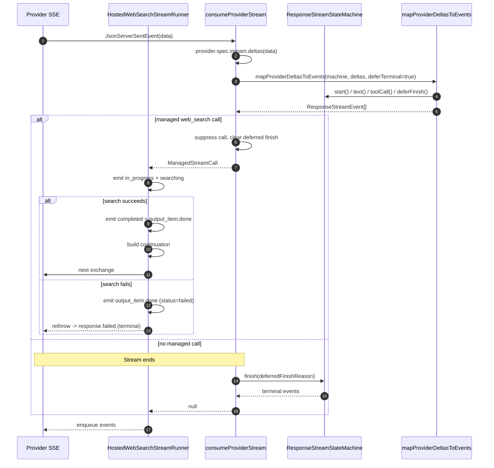
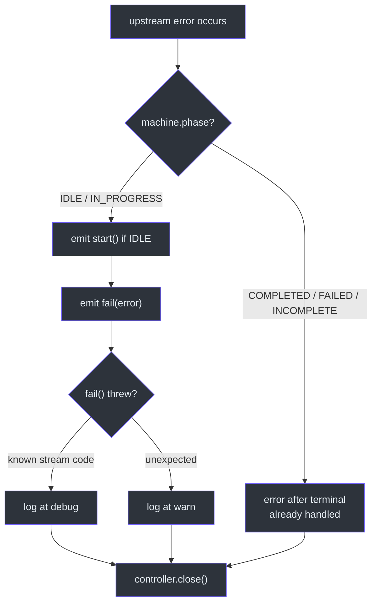

# Streaming Pipeline

The streaming pipeline is GodeX's most complex execution path. It connects to a provider's SSE stream, maps raw provider deltas into structured `ResponseStreamEvent` objects via the state machine, and then passes them through a composable chain of transform streams that handle error recovery, output contract validation, observability tracing, logging, session persistence, and compatibility diagnostics. Each transformer has a single responsibility, making the pipeline easy to extend and debug.

## At a Glance

| Concern | Component | Key File |
|---------|-----------|----------|
| Pipeline orchestrator | `StreamPipeline` | [stream-pipeline.ts:25](https://github.com/Ahoo-Wang/GodeX/blob/main/src/responses/stream-pipeline.ts#L25) |
| Delta-to-event mapping + web search loop | `HostedWebSearchStreamRunner` | [web-search/stream-runner.ts:60](https://github.com/Ahoo-Wang/GodeX/blob/main/src/responses/web-search/stream-runner.ts#L60) |
| Error handler | `wrapWithErrorHandler` | [stream-error-handler.ts:36](https://github.com/Ahoo-Wang/GodeX/blob/main/src/responses/stream-error-handler.ts#L36) |
| Trace transformer | `TraceTransformer` | [trace-transformer.ts:8](https://github.com/Ahoo-Wang/GodeX/blob/main/src/responses/stream-transforms/trace-transformer.ts#L8) |
| Log transformer | `ResponseLogTransformer` | [response-log-transformer.ts:13](https://github.com/Ahoo-Wang/GodeX/blob/main/src/responses/stream-transforms/response-log-transformer.ts#L13) |
| Contract validation | `ResponseOutputContractValidationTransformer` | [response-output-contract-validation-transformer.ts:13](https://github.com/Ahoo-Wang/GodeX/blob/main/src/responses/stream-transforms/response-output-contract-validation-transformer.ts#L13) |
| Session persistence | `ResponseSessionPersistenceTransformer` | [response-session-persistence-transformer.ts:19](https://github.com/Ahoo-Wang/GodeX/blob/main/src/responses/stream-transforms/response-session-persistence-transformer.ts#L19) |
| SSE encoder | `ResponseSseEncoder` | [response-sse-encoder.ts:4](https://github.com/Ahoo-Wang/GodeX/blob/main/src/responses/stream-transforms/response-sse-encoder.ts#L4) |
| Pipe utility | `pipeTransform` | [stream-utils.ts:6](https://github.com/Ahoo-Wang/GodeX/blob/main/src/responses/stream-transforms/stream-utils.ts#L6) |

## Two Stages: Event Production, Then the Transform Chain

The streaming path is split into two stages. The first stage **produces** `ResponseStreamEvent`s from provider deltas; the second stage **processes** those events through a transform chain. This split exists because the first stage must also run the web-search continuation loop, which can issue multiple upstream exchanges before the stream terminates.

`StreamPipeline.stream` ([stream-pipeline.ts:31](https://github.com/Ahoo-Wang/GodeX/blob/main/src/responses/stream-pipeline.ts#L31)) drives both stages:

1. It asks `HostedWebSearchStreamRunner` to produce an event stream plus the state machine.
2. It feeds that event stream into the transform chain via `pipeTransform` ([stream-utils.ts:6](https://github.com/Ahoo-Wang/GodeX/blob/main/src/responses/stream-transforms/stream-utils.ts#L6)).

```mermaid
flowchart LR
    subgraph "Stage 1 — Event Production"
        direction TB
        A["Provider SSE<br>ReadableStream"] --> B["TraceTransformer<br>(raw events)"]
        B --> C["HostedWebSearchStreamRunner<br>mapProviderDeltasToEvents<br>+ web search loop"]
    end

    subgraph "Stage 2 — Transform Chain"
        direction TB
        D["wrapWithErrorHandler<br>(error recovery)"] --> E["ResponseOutputContract<br>ValidationTransformer"]
        E --> F["TraceTransformer<br>(transformed events)"]
        F --> G["ResponseLogTransformer"]
        G --> H{"store = false?"}
        H -->|yes| I["CompatibilityLogTransformer"]
        H -->|no| J["ResponseSessionPersistence<br>Transformer"]
        J --> I
    end

    C --> D

    style A fill:#2d333b,stroke:#6d5dfc,color:#e6edf3
    style B fill:#2d333b,stroke:#6d5dfc,color:#e6edf3
    style C fill:#2d333b,stroke:#6d5dfc,color:#e6edf3
    style D fill:#2d333b,stroke:#6d5dfc,color:#e6edf3
    style E fill:#2d333b,stroke:#6d5dfc,color:#e6edf3
    style F fill:#2d333b,stroke:#6d5dfc,color:#e6edf3
    style G fill:#2d333b,stroke:#6d5dfc,color:#e6edf3
    style H fill:#2d333b,stroke:#6d5dfc,color:#e6edf3
    style I fill:#2d333b,stroke:#6d5dfc,color:#e6edf3
    style J fill:#2d333b,stroke:#6d5dfc,color:#e6edf3
```

| Stage | Class | Purpose |
|-------|-------|---------|
| 1 | `HostedWebSearchStreamRunner` | Map provider deltas to events; run the web search continuation loop (up to `max_iterations`) |
| 2 | `wrapWithErrorHandler` | Convert upstream errors to `response.failed` events |
| 3 | `ResponseOutputContractValidationTransformer` | Validate JSON output contracts on terminal events |
| 4 | `TraceTransformer("upstream.stream.event.transformed")` | Record transformed events for tracing |
| 5 | `ResponseLogTransformer` | Log stream completion with usage metrics |
| 6 | `ResponseSessionPersistenceTransformer` | Persist response session (if `store !== false`) |
| 7 | `CompatibilityLogTransformer` | Log compatibility diagnostics at stream end |

## Event Production: HostedWebSearchStreamRunner

`HostedWebSearchStreamRunner` ([web-search/stream-runner.ts:60](https://github.com/Ahoo-Wang/GodeX/blob/main/src/responses/web-search/stream-runner.ts#L60)) is the component that turns raw provider SSE into a `ReadableStream<ResponseStreamEvent>`. Its `stream(ctx)` method creates a `ResponseStreamStateMachine`, opens the upstream exchange, records upstream latency via `ctx.attributes.set(ATTR_UPSTREAM_LATENCY_MILLIS, ...)` ([web-search/stream-runner.ts:74](https://github.com/Ahoo-Wang/GodeX/blob/main/src/responses/web-search/stream-runner.ts#L74)), and then returns a `ReadableStream` whose `start` callback runs the loop.

The loop ([web-search/stream-runner.ts:91](https://github.com/Ahoo-Wang/GodeX/blob/main/src/responses/web-search/stream-runner.ts#L91)) iterates up to `config.max_iterations` (default `2`, see [Web Search config](../07-configuration/config-schema.md#web-search)):

1. Calls `consumeProviderStream`, which reads each SSE event, runs `provider.spec.stream.deltas(data)`, feeds the deltas to `mapProviderDeltasToEvents` with `deferTerminal: true`, and enqueues the resulting events.
2. If the provider emitted a managed `web_search` function call, it is **suppressed** from the output, the deferred finish is cleared, and the loop continues.
3. The runner emits the `web_search_call` lifecycle — `response.web_search_call.in_progress`, then `searching`. On a successful search it emits `completed` (plus `output_item.done`) and builds a **continuation request** that feeds the results back to the provider for another exchange. On a **failed** search the lifecycle helper emits `response.output_item.done` with `status: "failed"` (there is **no** `response.web_search_call.failed` event) and then rethrows, so the stream error handler emits the terminal `response.failed`.
4. When no managed search call remains, the loop ends and `consumeProviderStream` finalizes the stream by calling `machine.finish(machine.deferredFinishReason)`.

The `consumeProviderStream` function ([web-search/stream-runner.ts:182](https://github.com/Ahoo-Wang/GodeX/blob/main/src/responses/web-search/stream-runner.ts#L182)) wraps the provider stream in a `TraceTransformer("upstream.stream.event.raw")` so raw provider events are recorded before mapping.

The `deferTerminal: true` flag is critical: it prevents the state machine from transitioning to a terminal phase immediately, giving downstream transformers (especially the output contract validator) a chance to inspect and potentially rewrite the terminal event.

## Error Handler

`wrapWithErrorHandler` ([stream-error-handler.ts:36](https://github.com/Ahoo-Wang/GodeX/blob/main/src/responses/stream-error-handler.ts#L36)) wraps the event stream in a `ReadableStream` that catches read errors. When an error occurs:

1. Records the error via `recordTraceError`
2. If the state machine is still in `IDLE` or `IN_PROGRESS`, emits `machine.start()` (if needed) followed by `machine.fail(error)`
3. If the `fail()` call itself throws a known stream lifecycle error (e.g., already terminal), logs at debug level
4. Unexpected failures during error handling are logged at warn level
5. Closes the stream cleanly

## Individual Transformers

### TraceTransformer

`TraceTransformer<T>` ([trace-transformer.ts:8](https://github.com/Ahoo-Wang/GodeX/blob/main/src/responses/stream-transforms/trace-transformer.ts#L8)) is a generic pass-through transformer that records each chunk as a trace event when tracing is enabled (`ctx.app.traceEnabled`). It tracks a sequence number for ordered trace playback. Two instances run in the path: one (`"upstream.stream.event.raw"`) inside the runner over raw provider events, and one (`"upstream.stream.event.transformed"`) in the chain over transformed events.

### ResponseLogTransformer

`ResponseLogTransformer` ([response-log-transformer.ts:13](https://github.com/Ahoo-Wang/GodeX/blob/main/src/responses/stream-transforms/response-log-transformer.ts#L13)) counts events and logs completion when it encounters a terminal event (`response.completed`, `response.failed`, `response.incomplete`). It records usage metrics and upstream latency.

### ResponseOutputContractValidationTransformer

This transformer ([response-output-contract-validation-transformer.ts:13](https://github.com/Ahoo-Wang/GodeX/blob/main/src/responses/stream-transforms/response-output-contract-validation-transformer.ts#L13)) validates JSON output contracts on terminal events. If validation fails, it rewrites the event to `response.failed` and suppresses subsequent events. See [Output Contracts](./output-contracts.md) for details.

### ResponseSessionPersistenceTransformer

`ResponseSessionPersistenceTransformer` ([response-session-persistence-transformer.ts:19](https://github.com/Ahoo-Wang/GodeX/blob/main/src/responses/stream-transforms/response-session-persistence-transformer.ts#L19)) persists the response session when it encounters a terminal event. It uses a `persistenceAttempted` flag to ensure only one save attempt occurs. This stage is skipped entirely when `ctx.request.store === false` ([stream-pipeline.ts:54](https://github.com/Ahoo-Wang/GodeX/blob/main/src/responses/stream-pipeline.ts#L54)).

### CompatibilityLogTransformer

`CompatibilityLogTransformer` ([compatibility-log-transformer.ts:6](https://github.com/Ahoo-Wang/GodeX/blob/main/src/responses/stream-transforms/compatibility-log-transformer.ts#L6)) is the final transformer. It logs all accumulated compatibility diagnostics when the terminal event arrives or on flush, ensuring diagnostics are always emitted even if the stream closes abnormally.

## Upstream Latency Tracking

The pipeline records upstream latency (time to connect to the provider stream) in `upstreamLatencyMillis` via `ctx.attributes.set(ATTR_UPSTREAM_LATENCY_MILLIS, ...)` at [web-search/stream-runner.ts:74](https://github.com/Ahoo-Wang/GodeX/blob/main/src/responses/web-search/stream-runner.ts#L74). This value is later included in the `ResponseLogTransformer` completion log.

## SSE Encoding

After the transform chain, `ResponseSseEncoder` ([response-sse-encoder.ts:4](https://github.com/Ahoo-Wang/GodeX/blob/main/src/responses/stream-transforms/response-sse-encoder.ts#L4)) converts each `ResponseStreamEvent` into an SSE frame (`event: type\ndata: JSON\n\n`) with auto-incrementing sequence numbers.

## Cross-References

- [Stream Reconstruction](./stream-reconstruction.md) -- the state machine and delta-to-event mapping used inside `HostedWebSearchStreamRunner`
- [Sync Pipeline](./sync-pipeline.md) -- the simpler non-streaming counterpart
- [Output Contracts](./output-contracts.md) -- validation logic used in the transform chain
- [Tool Planning](./tool-planning.md) -- produces `ToolIdentityMap` used during event production
- [Config Schema - Web Search](../07-configuration/config-schema.md#web-search) -- the `web_search` config block that governs the managed search loop

## References

- [stream-pipeline.ts:25](https://github.com/Ahoo-Wang/GodeX/blob/main/src/responses/stream-pipeline.ts#L25) -- `StreamPipeline` class
- [web-search/stream-runner.ts:60](https://github.com/Ahoo-Wang/GodeX/blob/main/src/responses/web-search/stream-runner.ts#L60) -- `HostedWebSearchStreamRunner` class
- [web-search/stream-runner.ts:182](https://github.com/Ahoo-Wang/GodeX/blob/main/src/responses/web-search/stream-runner.ts#L182) -- `consumeProviderStream` function
- [stream-error-handler.ts:36](https://github.com/Ahoo-Wang/GodeX/blob/main/src/responses/stream-error-handler.ts#L36) -- `wrapWithErrorHandler` function
- [trace-transformer.ts:8](https://github.com/Ahoo-Wang/GodeX/blob/main/src/responses/stream-transforms/trace-transformer.ts#L8) -- `TraceTransformer` class
- [response-log-transformer.ts:13](https://github.com/Ahoo-Wang/GodeX/blob/main/src/responses/stream-transforms/response-log-transformer.ts#L13) -- `ResponseLogTransformer` class
- [response-output-contract-validation-transformer.ts:13](https://github.com/Ahoo-Wang/GodeX/blob/main/src/responses/stream-transforms/response-output-contract-validation-transformer.ts#L13) -- Contract validation transformer
- [response-session-persistence-transformer.ts:19](https://github.com/Ahoo-Wang/GodeX/blob/main/src/responses/stream-transforms/response-session-persistence-transformer.ts#L19) -- Session persistence transformer
- [compatibility-log-transformer.ts:6](https://github.com/Ahoo-Wang/GodeX/blob/main/src/responses/stream-transforms/compatibility-log-transformer.ts#L6) -- `CompatibilityLogTransformer` class
- [stream-utils.ts:6](https://github.com/Ahoo-Wang/GodeX/blob/main/src/responses/stream-transforms/stream-utils.ts#L6) -- `pipeTransform` utility
- [response-sse-encoder.ts:4](https://github.com/Ahoo-Wang/GodeX/blob/main/src/responses/stream-transforms/response-sse-encoder.ts#L4) -- `ResponseSseEncoder` class
