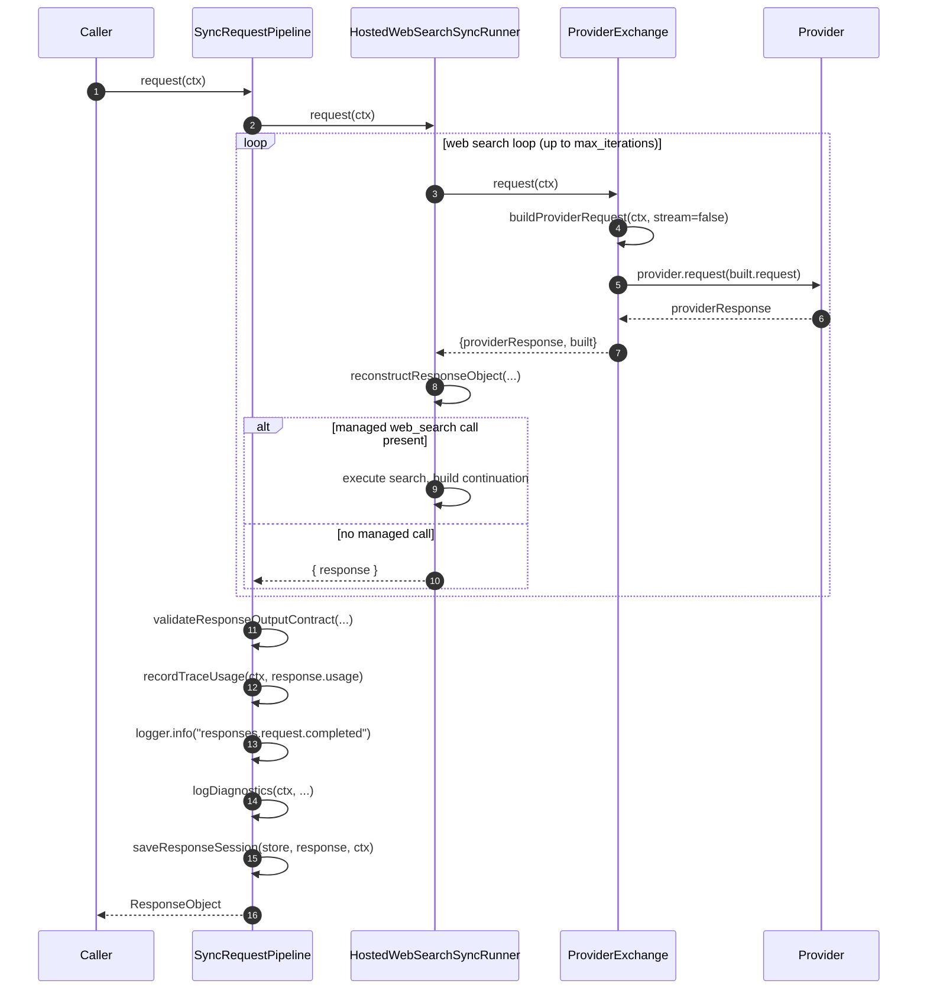
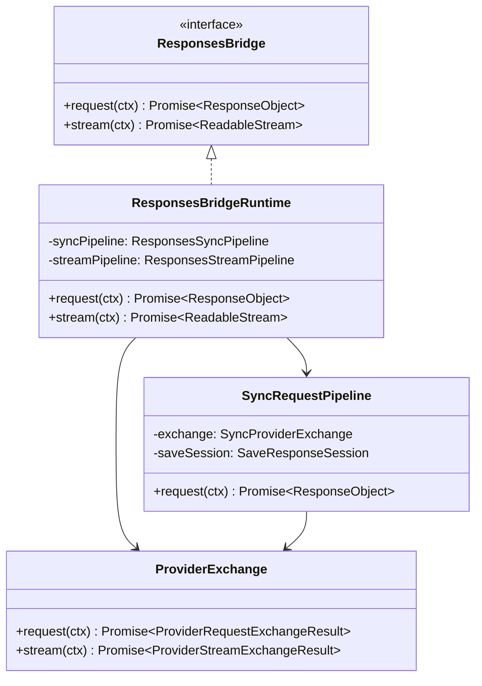

# Sync Pipeline

The sync pipeline handles non-streaming Requests API calls end to end. It is the simpler of GodeX's two execution paths: send a single request to the upstream provider, reconstruct the response into the OpenAI Responses format, validate any output contracts, persist the session, and return the complete `ResponseObject`. Understanding the sync pipeline is the foundation for understanding the more complex streaming pipeline.

## At a Glance

| Concern | Component | Key File |
|---------|-----------|----------|
| Pipeline orchestrator | `SyncRequestPipeline` | [sync-request-pipeline.ts:28](https://github.com/Ahoo-Wang/GodeX/blob/main/src/responses/sync-request-pipeline.ts#L28) |
| Upstream call + reconstruction + web search loop | `HostedWebSearchSyncRunner` | [web-search/sync-runner.ts:31](https://github.com/Ahoo-Wang/GodeX/blob/main/src/responses/web-search/sync-runner.ts#L31) |
| Provider exchange | `ProviderExchange` | [provider-exchange.ts:39](https://github.com/Ahoo-Wang/GodeX/blob/main/src/responses/provider-exchange.ts#L39) |
| Bridge interface | `ResponsesBridge` | [bridge.ts:7](https://github.com/Ahoo-Wang/GodeX/blob/main/src/responses/bridge.ts#L7) |
| Runtime wiring | `ResponsesBridgeRuntime` | [runtime.ts:19](https://github.com/Ahoo-Wang/GodeX/blob/main/src/responses/runtime.ts#L19) |
| Session persistence | `saveResponseSession` | [response-session-persistence.ts:5](https://github.com/Ahoo-Wang/GodeX/blob/main/src/responses/response-session-persistence.ts#L5) |

## Pipeline Steps

`SyncRequestPipeline.request` ([sync-request-pipeline.ts:34](https://github.com/Ahoo-Wang/GodeX/blob/main/src/responses/sync-request-pipeline.ts#L34)) delegates the upstream call, reconstruction, and web search loop to `HostedWebSearchSyncRunner`, then runs five post-processing steps on the resulting `ResponseObject`:

| Step | Operation | Key Code |
|------|-----------|----------|
| 1 | Upstream call + reconstruction + web search loop | `new HostedWebSearchSyncRunner(exchange).request(ctx)` |
| 2 | Validate output contract | `validateResponseOutputContract(...)` |
| 3 | Record trace usage | `recordTraceUsage(ctx, response.usage)` |
| 4 | Log completion | `ctx.logger.info("responses.request.completed")` |
| 5 | Log diagnostics | `logDiagnostics(ctx, ...)` |
| 6 | Save response session | `saveResponseSession(...)` |

## Upstream Call and Web Search Loop

`HostedWebSearchSyncRunner` ([web-search/sync-runner.ts:31](https://github.com/Ahoo-Wang/GodeX/blob/main/src/responses/web-search/sync-runner.ts#L31)) owns everything that was previously a direct pipeline concern: the upstream exchange, reconstruction, and the managed web search continuation loop. Its `request(ctx)` method ([web-search/sync-runner.ts:34](https://github.com/Ahoo-Wang/GodeX/blob/main/src/responses/web-search/sync-runner.ts#L34)) iterates up to `config.max_iterations`:

1. Calls `exchange.request(ctx)` to build the provider request and call upstream.
2. Reconstructs the response via `reconstructResponseObject(...)` ([web-search/sync-runner.ts:43](https://github.com/Ahoo-Wang/GodeX/blob/main/src/responses/web-search/sync-runner.ts#L43)).
3. Checks for a managed `web_search` function call. If none, returns the response (prepended with any `hostedItems` from prior rounds). If present, executes the search, records a `web_search_call` item, and builds a continuation request for another round.

## Provider Exchange

`ProviderExchange` ([provider-exchange.ts:39](https://github.com/Ahoo-Wang/GodeX/blob/main/src/responses/provider-exchange.ts#L39)) encapsulates the interaction with the upstream provider. For sync requests:

1. **Build request**: `buildProviderRequest(ctx, false)` constructs the provider-specific chat completion request, including tool planning and output contract setup ([provider-exchange.ts:103](https://github.com/Ahoo-Wang/GodeX/blob/main/src/responses/provider-exchange.ts#L103))
2. **Patch and trace request**: The provider edge applies `patchRequest`, then `onPatchedRequest` records the final patched provider request into `trace_requests` plus a body-less `provider.request.prepared` lifecycle event
3. **Call upstream**: Awaits `ctx.provider.request(providerRequest)` -- the actual HTTP call after patching
4. **Trace response**: Records the sync provider response body
5. **Return**: Provides both the raw response and the built request metadata

The exchange also records tool decision diagnostics ([provider-exchange.ts:146](https://github.com/Ahoo-Wang/GodeX/blob/main/src/responses/provider-exchange.ts#L146)) and sets the output contract slot on the context ([provider-exchange.ts:131](https://github.com/Ahoo-Wang/GodeX/blob/main/src/responses/provider-exchange.ts#L131)).

## Response Reconstruction

Inside the runner, `reconstructResponseObject` ([web-search/sync-runner.ts:43](https://github.com/Ahoo-Wang/GodeX/blob/main/src/responses/web-search/sync-runner.ts#L43)) is called with:

| Parameter | Source |
|-----------|--------|
| `requestId` | `ctx.requestId` |
| `responseId` | `ctx.responseId` |
| `createdAt` | `ctx.createdAt` |
| `completedAt` | `Math.floor(Date.now() / 1000)` |
| `provider` | `ctx.provider.name` |
| `model` | `ctx.resolved.model` |
| `providerResponse` | Raw provider response |
| `accessor` | `ctx.provider.spec.response` |
| `toolIdentity` | Built tool declarations |
| `outputContract` | Built output contract plan |
| `echo` | Request echo fields from `responseRequestEchoFields` |

The echo fields ([response-request-echo.ts:4](https://github.com/Ahoo-Wang/GodeX/blob/main/src/responses/response-request-echo.ts#L4)) mirror selected request parameters back onto the response object, including `instructions`, `temperature`, `tools`, `tool_choice`, and many others.

## Output Contract Validation

After reconstruction, `validateResponseOutputContract` checks that the output satisfies the planned contract. This is especially important when `json_schema` was degraded to `json_object`: the `requiresValidJson` flag triggers a `JSON.parse` on the output text. See [Output Contracts](./output-contracts.md) for the full validation logic.

## Session Persistence

`saveResponseSession` ([response-session-persistence.ts:5](https://github.com/Ahoo-Wang/GodeX/blob/main/src/responses/response-session-persistence.ts#L5)) stores the response session if `ctx.request.store !== false`. The stored session includes:

| Section | Fields |
|---------|--------|
| Session metadata | `id`, `previous_response_id`, `created_at`, `completed_at`, `status` |
| Request snapshot | `input`, `instructions`, `model`, `tools`, `tool_choice`, `reasoning`, `text`, `truncation` |
| Response snapshot | `id`, `output`, `output_text`, `usage`, `error`, `incomplete_details` |

Session save errors are caught and logged at warn level, never failing the request ([sync-request-pipeline.ts:53](https://github.com/Ahoo-Wang/GodeX/blob/main/src/responses/sync-request-pipeline.ts#L53)).

## Runtime Wiring

`ResponsesBridgeRuntime` ([runtime.ts:19](https://github.com/Ahoo-Wang/GodeX/blob/main/src/responses/runtime.ts#L19)) creates a shared `ProviderExchange` instance and wires it to both the `SyncRequestPipeline` and `StreamPipeline`. It implements the `ResponsesBridge` interface:

## Logging and Observability

The sync pipeline emits structured log events at key points:

| Event | Level | Context |
|-------|-------|---------|
| `provider.request.sending` | debug | provider, model, stream=false |
| `provider.response.received` | debug | provider, model, upstreamDurationMillis |
| `responses.request.completed` | info | status, model, outputCount, durationMillis, usage, cacheHitRatio |
| `session.save.error` | warn | request_id, response_id, error |

Trace records capture the final patched request body in `trace_requests`, the body-less `provider.request.prepared` lifecycle event in `trace_events`, the sync response body via `provider.response.body`, and usage metrics via `recordTraceUsage`.

## Cross-References

- [Streaming Pipeline](./streaming-pipeline.md) -- the streaming counterpart with a composable transform chain
- [Output Contracts](./output-contracts.md) -- validation logic used after reconstruction
- [Stream Reconstruction](./stream-reconstruction.md) -- how streaming deltas are reconstructed (contrast with sync reconstruction)
- [Tool Planning](./tool-planning.md) -- tool declarations consumed during request building
- [Config Schema - Web Search](../07-configuration/config-schema.md#web-search) -- the `web_search` config block that governs the managed search loop

## References

- [sync-request-pipeline.ts:28](https://github.com/Ahoo-Wang/GodeX/blob/main/src/responses/sync-request-pipeline.ts#L28) -- `SyncRequestPipeline` class
- [web-search/sync-runner.ts:31](https://github.com/Ahoo-Wang/GodeX/blob/main/src/responses/web-search/sync-runner.ts#L31) -- `HostedWebSearchSyncRunner` class
- [provider-exchange.ts:39](https://github.com/Ahoo-Wang/GodeX/blob/main/src/responses/provider-exchange.ts#L39) -- `ProviderExchange` class
- [bridge.ts:7](https://github.com/Ahoo-Wang/GodeX/blob/main/src/responses/bridge.ts#L7) -- `ResponsesBridge` interface
- [runtime.ts:19](https://github.com/Ahoo-Wang/GodeX/blob/main/src/responses/runtime.ts#L19) -- `ResponsesBridgeRuntime` class
- [response-session-persistence.ts:5](https://github.com/Ahoo-Wang/GodeX/blob/main/src/responses/response-session-persistence.ts#L5) -- `saveResponseSession` function
- [response-request-echo.ts:4](https://github.com/Ahoo-Wang/GodeX/blob/main/src/responses/response-request-echo.ts#L4) -- `responseRequestEchoFields` function
