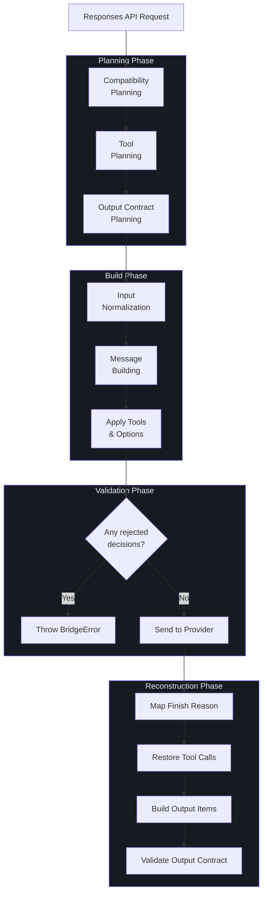
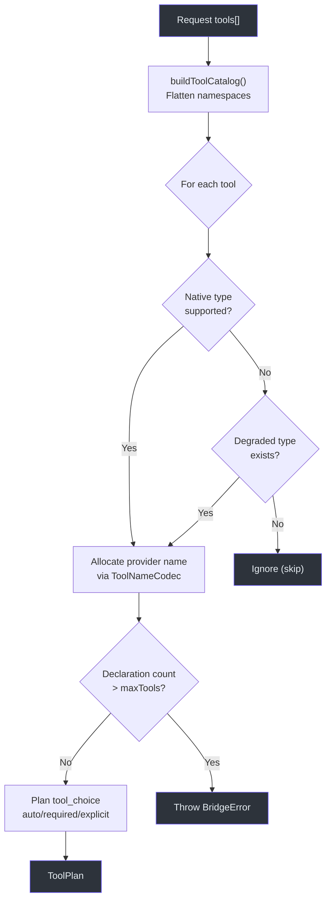
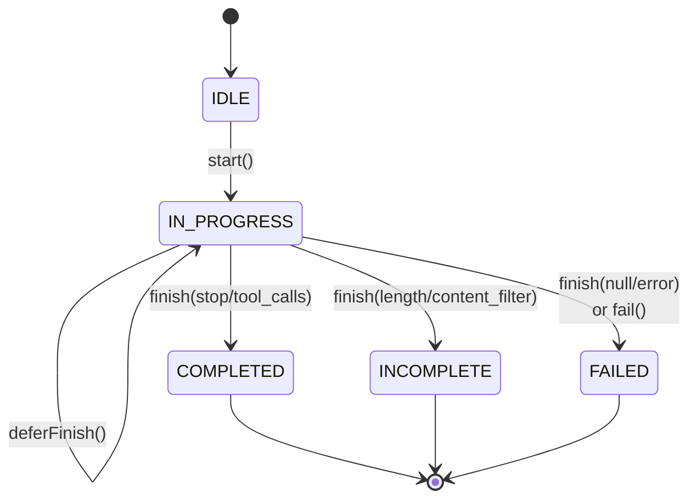
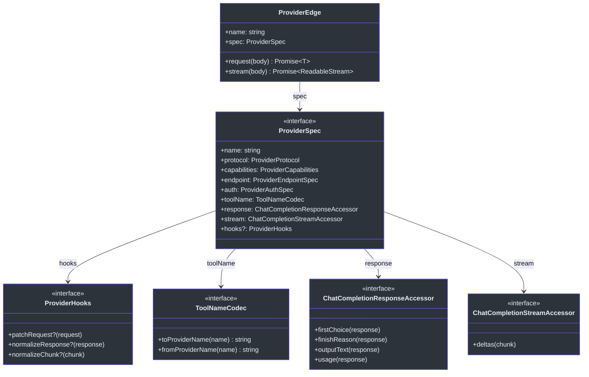
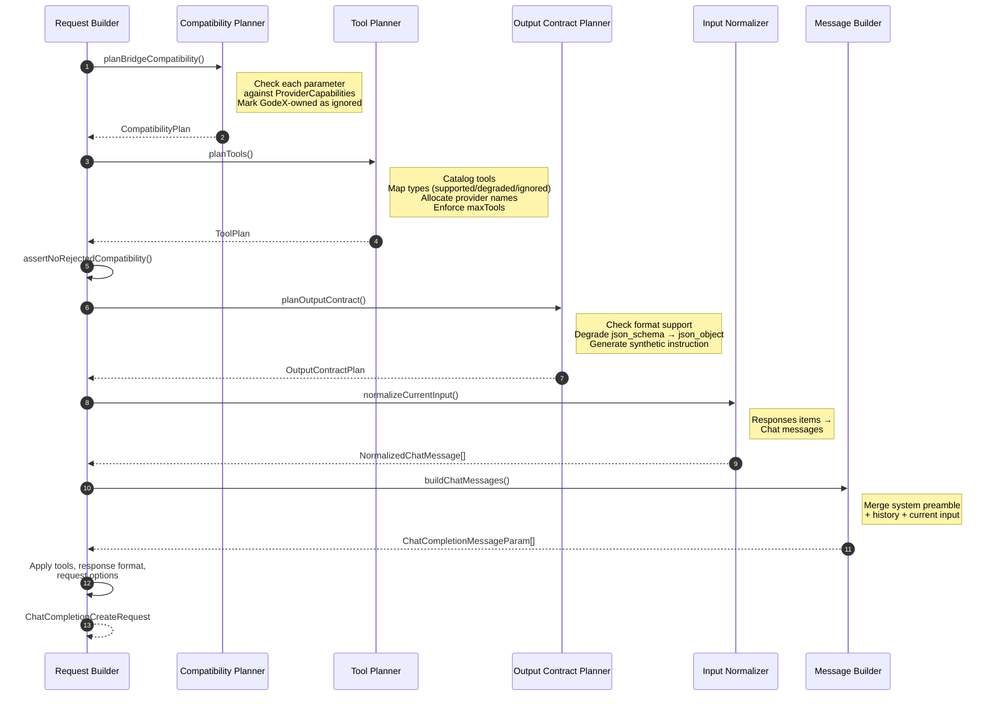

# Bridge Kernel

The bridge kernel is the heart of GodeX. It is the layer that makes GodeX a universal gateway rather than a collection of per-provider adapters. Every request passes through the same bridge pipeline regardless of which provider ultimately serves it. The bridge translates OpenAI Responses API semantics into Chat Completions API calls, handles capability negotiation, and reconstructs Responses objects from provider output. Understanding this layer is essential for debugging request translation issues, adding new tool types, or extending compatibility planning.

## At a Glance

| Module | Responsibility | Key File | Source |
|--------|---------------|----------|--------|
| Compatibility Planning | Decide support/degrade/ignore/reject for each parameter | `src/bridge/compatibility/planner.ts:25` | [planner.ts](https://github.com/Ahoo-Wang/GodeX/blob/main/src/bridge/compatibility/planner.ts) |
| Request Building | Normalize input, build messages, apply tools and options | `src/bridge/request/request-builder.ts:54` | [request-builder.ts](https://github.com/Ahoo-Wang/GodeX/blob/main/src/bridge/request/request-builder.ts) |
| Tool Planning | Catalog tools, plan declarations, enforce limits | `src/bridge/tools/tool-plan.ts:66` | [tool-plan.ts](https://github.com/Ahoo-Wang/GodeX/blob/main/src/bridge/tools/tool-plan.ts) |
| Output Contracts | Plan and validate structured output | `src/bridge/output/output-contract.ts` | [output-contract.ts](https://github.com/Ahoo-Wang/GodeX/blob/main/src/bridge/output/output-contract.ts) |
| Response Reconstruction | Build ResponseObject from provider ChatCompletion | `src/bridge/response/response-reconstructor.ts:34` | [response-reconstructor.ts](https://github.com/Ahoo-Wang/GodeX/blob/main/src/bridge/response/response-reconstructor.ts) |
| Stream Reconstruction | State machine for streaming delta-to-event mapping | `src/bridge/stream/response-stream-state-machine.ts:84` | [response-stream-state-machine.ts](https://github.com/Ahoo-Wang/GodeX/blob/main/src/bridge/stream/response-stream-state-machine.ts) |
| Finish Reason Mapping | Map provider stop reasons to Responses status | `src/bridge/finish-reason/finish-reason.ts` | [finish-reason.ts](https://github.com/Ahoo-Wang/GodeX/blob/main/src/bridge/finish-reason/finish-reason.ts) |
| Provider Spec | ProviderSpec interface, ProviderEdge factory | `src/bridge/provider-spec/contract.ts:54` | [contract.ts](https://github.com/Ahoo-Wang/GodeX/blob/main/src/bridge/provider-spec/contract.ts) |

## Bridge Decision Flow

The bridge kernel follows a strict plan-then-build-then-validate pipeline. Every decision about what to support, degrade, or reject is made before any provider request is constructed.



## Modules

### 1. Compatibility Planning

The compatibility planner ([planner.ts:25-36](https://github.com/Ahoo-Wang/GodeX/blob/main/src/bridge/compatibility/planner.ts#L25-L36)) is the first stage of the bridge. It inspects the incoming request against the provider's declared `ProviderCapabilities` and produces a `CompatibilityPlan` with one of four actions for each parameter:

| Action | Meaning |
|--------|---------|
| **supported** | Parameter passes through unchanged |
| **degraded** | Parameter is mapped to a lesser alternative (e.g., `json_schema` to `json_object`) |
| **ignored** | Parameter is consumed by GodeX and not forwarded upstream |
| **rejected** | Parameter cannot be satisfied — request must fail |

**GodeX-owned parameters** (`metadata`, `conversation`, `background`) are never forwarded. They are always marked `ignored` because GodeX handles them internally.

**Response format degradation** follows this logic ([planner.ts:63-93](https://github.com/Ahoo-Wang/GodeX/blob/main/src/bridge/compatibility/planner.ts#L63-L93)):
- If the provider supports the requested format, mark `supported`
- If `json_schema` is requested but the provider only supports `json_object`, degrade to `json_object` and inject a synthetic system instruction
- Otherwise, mark `rejected` (throws `BridgeError`)

The `ProviderCapabilities` interface ([compatibility-plan.ts:29-36](https://github.com/Ahoo-Wang/GodeX/blob/main/src/bridge/compatibility/compatibility-plan.ts#L29-L36)) declares:

```typescript
interface ProviderCapabilities {
  parameters: ParameterCapabilities;     // which request params are supported
  tools: ToolCapabilities;               // tool types, max count, degraded types
  toolChoice: ToolChoiceCapabilities;    // auto/required/function
  responseFormats: ResponseFormatCapabilities; // json_object/json_schema/text
  reasoning: ReasoningCapabilities;      // none/boolean/native effort mode
  streaming: StreamingCapabilities;      // usage in streams
}
```

### 2. Request Building

`buildChatCompletionRequest()` ([request-builder.ts:54-92](https://github.com/Ahoo-Wang/GodeX/blob/main/src/bridge/request/request-builder.ts#L54-L92)) is the central orchestrator. It calls all planning stages, then assembles the `ChatCompletionCreateRequest`:

1. **Plan compatibility** — `planBridgeCompatibility()` checks each parameter
2. **Plan tools** — `planTools()` catalogs and maps tool declarations
3. **Assert no rejections** — throws `BridgeError` if any decision is `rejected`
4. **Plan output contract** — `planOutputContract()` prepares structured output
5. **Build chat messages** — normalizes input items into Chat messages, merges session history
6. **Apply tools** — attaches tool declarations and tool choice to the request
7. **Apply response format** — sets `response_format` if output contract requires it
8. **Apply request options** — maps `temperature`, `top_p`, `max_output_tokens`, `stream`, `reasoning.effort`, `user`/`safety_identifier` based on capability support

**Input normalization** converts Responses API input items (messages, function call outputs, etc.) into Chat API messages. Session history is flattened and prepended. If the output contract produced a synthetic instruction (for `json_schema` degradation), it is injected as a system message.

### 3. Tool Planning

`planTools()` ([tool-plan.ts:66-106](https://github.com/Ahoo-Wang/GodeX/blob/main/src/bridge/tools/tool-plan.ts#L66-L106)) processes the request's `tools` array against the provider's `ToolPlanningProfile`:



Key behaviors:
- **ToolNameCodec** ([contract.ts:27-30](https://github.com/Ahoo-Wang/GodeX/blob/main/src/bridge/provider-spec/contract.ts#L27-L30)) maps tool names between Responses and provider namespaces (e.g., adding prefixes)
- **Max tools enforcement** — if a provider declares `maxTools: N` and the request exceeds it, a `BridgeError` is thrown
- **Tool choice planning** — maps `auto`, `required`, and explicit function choices to the provider's supported modes, degrading `required` to `auto` when necessary
- **Namespace flattening** — nested namespace tools are flattened with double-underscore separators

### 4. Output Contracts

`planOutputContract()` ([output-contract.ts:19-52](https://github.com/Ahoo-Wang/GodeX/blob/main/src/bridge/output/output-contract.ts#L19-L52)) decides how to handle structured output requests:

| Scenario | Action |
|----------|--------|
| No format requested | Pass through |
| Format supported by provider | Use `providerResponseFormat` directly |
| `json_schema` degraded to `json_object` | Inject synthetic system instruction with the JSON schema |
| Format rejected | No output contract (request will have been rejected earlier) |

When `json_schema` is degraded to `json_object`, the bridge injects a synthetic system instruction containing the full JSON Schema. The `requiresValidJson` flag is set to `true`, which causes `validateOutputContract()` ([output-validator.ts:6](https://github.com/Ahoo-Wang/GodeX/blob/main/src/bridge/output/output-validator.ts#L6)) to parse the response text as JSON and throw if validation fails.

### 5. Response Reconstruction

`reconstructResponseObject()` ([response-reconstructor.ts:34-79](https://github.com/Ahoo-Wang/GodeX/blob/main/src/bridge/response/response-reconstructor.ts#L34-L79)) converts a provider's ChatCompletion response into a GodeX `ResponseObject`:

1. Extract the first choice from the provider response
2. Get the output text via the provider's response accessor
3. Validate the output contract (JSON check if degraded)
4. Map the finish reason to a Responses status
5. Restore tool calls using `ToolIdentityMap`
6. Build output items: reasoning blocks, tool call items, assistant message

Tool call restoration ([call-restorer.ts](https://github.com/Ahoo-Wang/GodeX/blob/main/src/bridge/tools/call-restorer.ts)) maps provider function calls back to their original tool names and types using the declarations planned earlier.

### 6. Stream Reconstruction

The `ResponseStreamStateMachine` ([response-stream-state-machine.ts:84](https://github.com/Ahoo-Wang/GodeX/blob/main/src/bridge/stream/response-stream-state-machine.ts#L84)) manages the lifecycle of a streaming response. It tracks active blocks (text, refusal, reasoning, tool calls) and emits the correct sequence of `ResponseStreamEvent` types.



Phase descriptions:

| Phase | Meaning | Terminal? |
|-------|---------|-----------|
| **IDLE** | No events emitted yet | No |
| **IN_PROGRESS** | Actively receiving deltas | No |
| **COMPLETED** | Normal finish (stop or tool_calls) | Yes |
| **INCOMPLETE** | Hit limit (length, content_filter) | Yes |
| **FAILED** | Error or missing finish reason | Yes |

`mapProviderDeltasToEvents()` ([stream-reconstructor.ts:17-67](https://github.com/Ahoo-Wang/GodeX/blob/main/src/bridge/stream/stream-reconstructor.ts#L17-L67)) translates each provider delta into the appropriate state machine call. It supports deferred terminal events (`deferFinish`) so that remaining deltas after the finish reason can be processed before the terminal event is emitted.

### 7. Finish Reason Mapping

`mapProviderFinishReason()` ([finish-reason.ts:19-74](https://github.com/Ahoo-Wang/GodeX/blob/main/src/bridge/finish-reason/finish-reason.ts#L19-L74)) maps provider-specific finish reasons to Responses API statuses:

| Provider Reason | Responses Status | Incomplete Detail |
|----------------|-----------------|-------------------|
| `stop`, `tool_calls` | `completed` | — |
| `length`, `model_context_window_exceeded` | `incomplete` | `max_output_tokens` |
| `content_filter`, `sensitive` | `incomplete` | `content_filter` |
| `network_error` | `failed` | — |
| `null` / `undefined` | `failed` | — |
| any other value | `failed` | — |

### 8. Provider Spec

The `ProviderSpec` interface ([contract.ts:54-74](https://github.com/Ahoo-Wang/GodeX/blob/main/src/bridge/provider-spec/contract.ts#L54-L74)) is the contract between the bridge kernel and each provider implementation:



The `createProviderEdge()` factory ([factory.ts:34-88](https://github.com/Ahoo-Wang/GodeX/blob/main/src/bridge/provider-spec/factory.ts#L34-L88)) wraps a `ProviderSpec` into a `ProviderEdge` that:
- Applies `hooks.patchRequest()` before sending requests to the provider
- Applies `hooks.normalizeResponse()` after receiving sync responses
- Pipes stream chunks through `hooks.normalizeChunk()` via a `TransformStream`

## Request Building Sequence



## Related Pages

- [Architecture](../02-architecture/architecture.md) — Full system architecture overview
- [Streaming Pipeline](../05-streaming-pipeline/streaming-pipeline.md) — Stream transform stages
- [Provider Development](../04-provider-development/provider-development.md) — Implementing ProviderSpec
- [Error Handling](../09-error-handling/error-handling.md) — BridgeError and compatibility failures

## References

- [compatibility-plan.ts](https://github.com/Ahoo-Wang/GodeX/blob/main/src/bridge/compatibility/compatibility-plan.ts) — CompatibilityPlan and ProviderCapabilities types
- [planner.ts](https://github.com/Ahoo-Wang/GodeX/blob/main/src/bridge/compatibility/planner.ts) — planBridgeCompatibility()
- [diagnostic.ts](https://github.com/Ahoo-Wang/GodeX/blob/main/src/bridge/compatibility/diagnostic.ts) — CompatibilityDiagnostic type
- [request-builder.ts](https://github.com/Ahoo-Wang/GodeX/blob/main/src/bridge/request/request-builder.ts) — buildChatCompletionRequest()
- [tool-plan.ts](https://github.com/Ahoo-Wang/GodeX/blob/main/src/bridge/tools/tool-plan.ts) — planTools()
- [tool-catalog.ts](https://github.com/Ahoo-Wang/GodeX/blob/main/src/bridge/tools/tool-catalog.ts) — buildToolCatalog()
- [tool-identity.ts](https://github.com/Ahoo-Wang/GodeX/blob/main/src/bridge/tools/tool-identity.ts) — ToolIdentityMap and ToolNameCodec
- [output-contract.ts](https://github.com/Ahoo-Wang/GodeX/blob/main/src/bridge/output/output-contract.ts) — planOutputContract()
- [output-validator.ts](https://github.com/Ahoo-Wang/GodeX/blob/main/src/bridge/output/output-validator.ts) — validateOutputContract()
- [response-reconstructor.ts](https://github.com/Ahoo-Wang/GodeX/blob/main/src/bridge/response/response-reconstructor.ts) — reconstructResponseObject()
- [response-stream-state-machine.ts](https://github.com/Ahoo-Wang/GodeX/blob/main/src/bridge/stream/response-stream-state-machine.ts) — ResponseStreamStateMachine
- [stream-reconstructor.ts](https://github.com/Ahoo-Wang/GodeX/blob/main/src/bridge/stream/stream-reconstructor.ts) — mapProviderDeltasToEvents()
- [finish-reason.ts](https://github.com/Ahoo-Wang/GodeX/blob/main/src/bridge/finish-reason/finish-reason.ts) — mapProviderFinishReason()
- [contract.ts](https://github.com/Ahoo-Wang/GodeX/blob/main/src/bridge/provider-spec/contract.ts) — ProviderSpec and ProviderEdge interfaces
- [factory.ts](https://github.com/Ahoo-Wang/GodeX/blob/main/src/bridge/provider-spec/factory.ts) — createProviderEdge()
