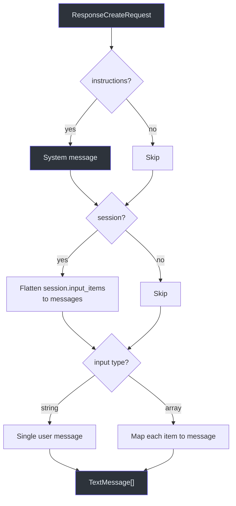
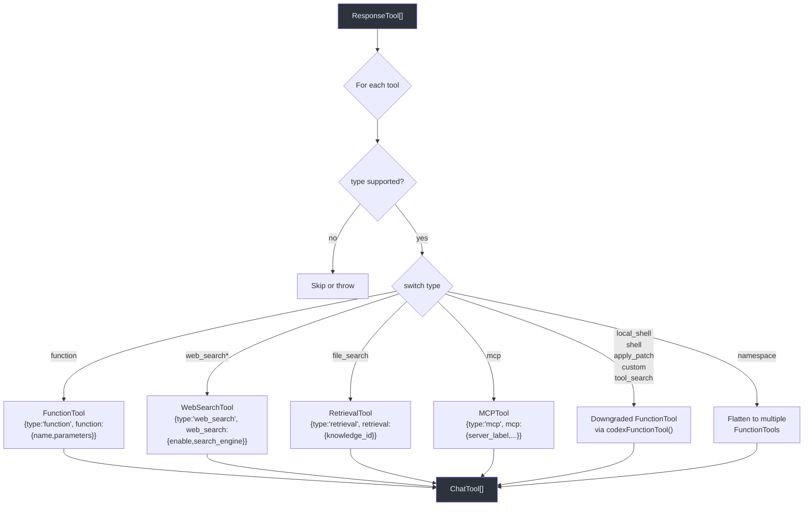
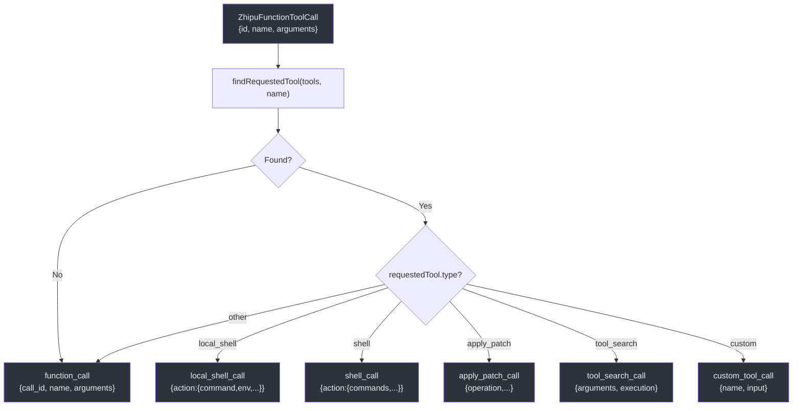

# Message & Tool Mapping

Godex translates between the OpenAI Responses API format and upstream Chat Completions APIs. This page covers the message conversion, tool type mapping, and function name sanitization that make this possible.

## Message Conversion

`buildZhipuMessages` ([src/providers/zhipu/messages.ts:25](https://github.com/Ahoo-Wang/Godex/blob/main/src/providers/zhipu/messages.ts#L25)) assembles a `TextMessage[]` array from three sources:



### Input Item Type Mapping

| Responses API Item Type | Chat Completions Message | Notes |
|---|---|---|
| `message` (role: user/assistant/system/developer) | Same role, extracted text content | `developer` → `system` |
| `function_call` | `assistant` message with `tool_calls` | Contains call_id, name, arguments |
| `function_call_output` | `tool` message with `tool_call_id` | Contains output text |
| `local_shell_call` | `assistant` message with `tool_calls` | Downgraded to function call |
| `shell_call` | `assistant` message with `tool_calls` | Downgraded |
| `apply_patch_call` | `assistant` message with `tool_calls` | Downgraded |
| `custom_tool_call` | `assistant` message with `tool_calls` | Downgraded |
| `tool_search_call` | `assistant` message with `tool_calls` | Downgraded |
| `mcp_call` | `assistant` message with `tool_calls` | Downgraded |
| `local_shell_call_output` | `tool` message | Downgraded output |
| `shell_call_output` | `tool` message | Downgraded output |
| `apply_patch_call_output` | `tool` message | Downgraded output |
| `custom_tool_call_output` | `tool` message | Downgraded output |
| `tool_search_output` | `tool` message | JSON-stringified tools |
| `mcp_list_tools` | `tool` message | JSON-stringified tools |
| `mcp_approval_response` | `tool` message | JSON-stringified response |

## Tool Type Mapping

`mapTools` ([src/providers/zhipu/tools.ts:26](https://github.com/Ahoo-Wang/Godex/blob/main/src/providers/zhipu/tools.ts#L26)) converts Responses API tool definitions to Zhipu Chat Completions format:



### Tool Type Mapping Table

| OpenAI Tool Type | Zhipu Tool Type | Downgraded? |
|---|---|---|
| `function` | `function` | No — direct mapping |
| `web_search` | `web_search` | No — native support |
| `web_search_2025_08_26` | `web_search` | Versioned variant |
| `web_search_preview` | `web_search` | Preview variant |
| `web_search_preview_2025_03_11` | `web_search` | Versioned variant |
| `file_search` | `retrieval` | No — native support via `knowledge_id` |
| `mcp` | `mcp` | No — native support |
| `local_shell` | `function` | Yes — downgraded to function |
| `shell` | `function` | Yes — downgraded to function |
| `apply_patch` | `function` | Yes — downgraded to function |
| `custom` | `function` | Yes — downgraded to function |
| `tool_search` | `function` | Yes — downgraded to function |
| `namespace` | Multiple `function` | Yes — each nested tool becomes a function |

## Function Name Sanitization

`toZhipuFunctionName` ([src/providers/zhipu/function-names.ts:3](https://github.com/Ahoo-Wang/Godex/blob/main/src/providers/zhipu/function-names.ts#L3)) replaces non-alphanumeric characters with underscores:

```typescript
export function toZhipuFunctionName(name: string): string {
  const sanitized = name.replace(/[^a-zA-Z0-9_]/g, "_");
  return sanitized || "codex_tool";
}
```

| Input Name | Sanitized Output |
|---|---|
| `web_search` | `web_search` |
| `apply-patch` | `apply_patch` |
| `my.custom.tool` | `my_custom_tool` |
| `""` (empty) | `codex_tool` |

This is used by both `tools.ts` (tool definition mapping) and `messages.ts` (downgraded tool call mapping) to ensure Zhipu's naming requirements are met.

## Tool Call Output Mapping

`mapZhipuToolCall` ([src/providers/zhipu/tool-calls.ts:30](https://github.com/Ahoo-Wang/Godex/blob/main/src/providers/zhipu/tool-calls.ts#L30)) maps upstream function call results back to Responses API items. It matches the provider function name against the original request tools to reconstruct the correct item type:



The mapping parses JSON arguments to reconstruct structured objects. If parsing fails, it falls back to a plain `function_call` item.

## Collision Detection

`mapTools` also checks for function name collisions via `assertNoFunctionNameCollisions` ([src/providers/zhipu/tools.ts:279](https://github.com/Ahoo-Wang/Godex/blob/main/src/providers/zhipu/tools.ts#L279)). If multiple tools map to the same Zhipu function name, it throws `ADAPTER_REQUEST_UNSUPPORTED_TOOL`.

## References

- [src/providers/zhipu/messages.ts](https://github.com/Ahoo-Wang/Godex/blob/main/src/providers/zhipu/messages.ts) — Input item to message conversion
- [src/providers/zhipu/tools.ts](https://github.com/Ahoo-Wang/Godex/blob/main/src/providers/zhipu/tools.ts) — Tool type mapping
- [src/providers/zhipu/tool-calls.ts](https://github.com/Ahoo-Wang/Godex/blob/main/src/providers/zhipu/tool-calls.ts) — Tool call output mapping
- [src/providers/zhipu/function-names.ts](https://github.com/Ahoo-Wang/Godex/blob/main/src/providers/zhipu/function-names.ts) — Function name sanitization
