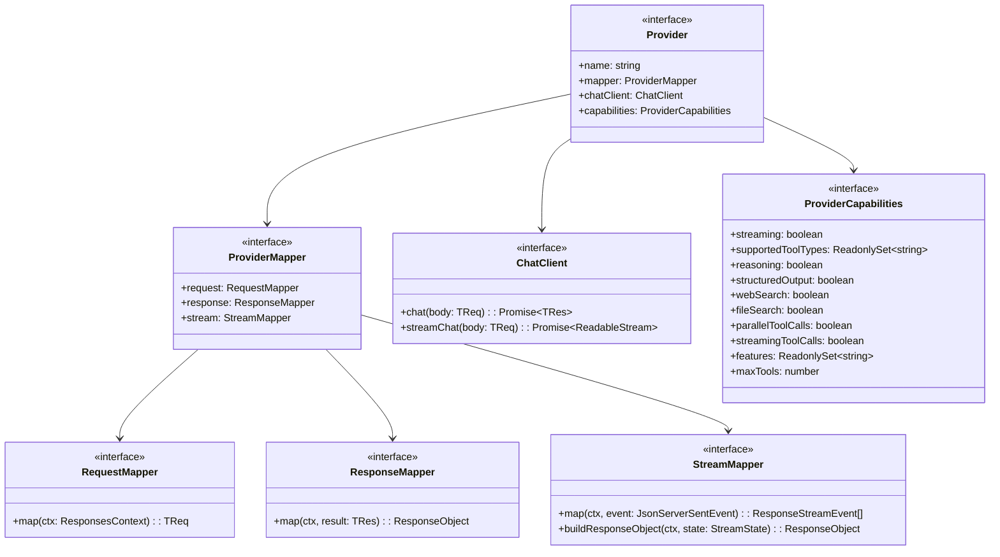
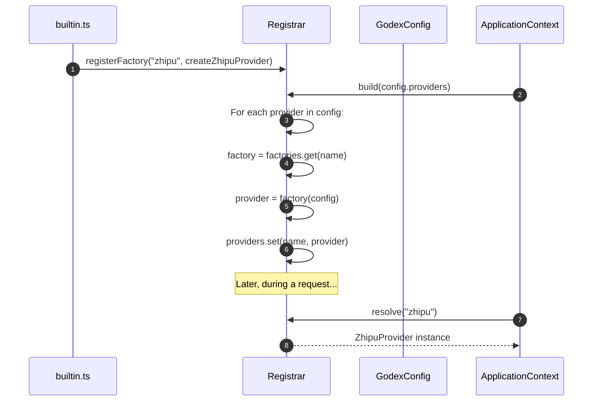
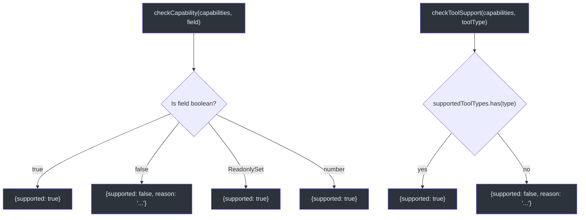
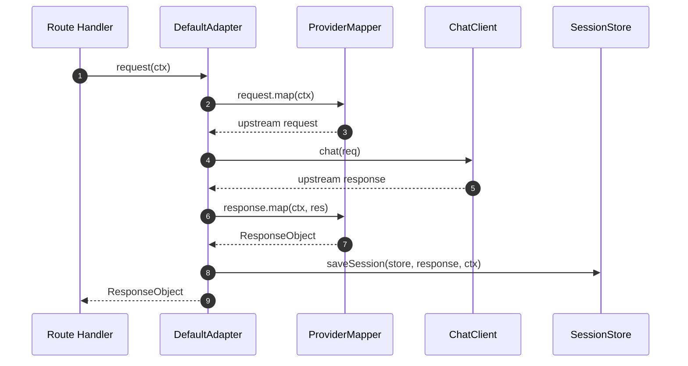

# Provider Interface

Godex uses a pluggable provider architecture. Each provider bundles a mapper (request/response/stream translation), a chat client (HTTP calls), and a capabilities declaration. Adding a new LLM backend means implementing these interfaces and registering a factory.

## Core Interfaces

| Interface | File | Purpose |
|---|---|---|
| `Provider<TReq, TRes, TChunk>` | [src/adapter/provider.ts:167](https://github.com/Ahoo-Wang/Godex/blob/main/src/adapter/provider.ts#L167) | Top-level bundle: name + mapper + chatClient + capabilities |
| `ProviderMapper<TReq, TRes, TChunk>` | [src/adapter/provider.ts:8](https://github.com/Ahoo-Wang/Godex/blob/main/src/adapter/provider.ts#L8) | Groups request, response, and stream mappers |
| `RequestMapper<TReq>` | [src/adapter/mapper/contract.ts:16](https://github.com/Ahoo-Wang/Godex/blob/main/src/adapter/mapper/contract.ts#L16) | Maps `ResponsesContext` → upstream request body |
| `ResponseMapper<TRes>` | [src/adapter/mapper/contract.ts:20](https://github.com/Ahoo-Wang/Godex/blob/main/src/adapter/mapper/contract.ts#L20) | Maps upstream response → `ResponseObject` |
| `StreamMapper<TChunk>` | [src/adapter/mapper/contract.ts:27](https://github.com/Ahoo-Wang/Godex/blob/main/src/adapter/mapper/contract.ts#L27) | Maps upstream SSE chunks → `ResponseStreamEvent[]` |
| `ChatClient<TReq, TRes, TChunk>` | [src/adapter/chatClient.ts:3](https://github.com/Ahoo-Wang/Godex/blob/main/src/adapter/chatClient.ts#L3) | HTTP boundary: `chat()` and `streamChat()` |
| `ProviderCapabilities` | [src/adapter/provider.ts:14](https://github.com/Ahoo-Wang/Godex/blob/main/src/adapter/provider.ts#L14) | Declares what the provider supports |

## Class Relationships



## Registration Flow

Providers are registered via `ProviderFactory` functions and assembled in the `Registrar`:



| Step | Code Location | Description |
|---|---|---|
| Register factory | [src/providers/builtin.ts:9](https://github.com/Ahoo-Wang/Godex/blob/main/src/providers/builtin.ts#L9) | `registrar.registerFactory("zhipu", createZhipuProvider)` |
| Build all providers | [src/providers/registrar.ts:21](https://github.com/Ahoo-Wang/Godex/blob/main/src/providers/registrar.ts#L21) | `registrar.build(config.providers)` |
| Resolve per request | [src/providers/registrar.ts:34](https://github.com/Ahoo-Wang/Godex/blob/main/src/providers/registrar.ts#L34) | `registrar.resolve(name)` |

`ProviderFactory` type signature:

```typescript
type ProviderFactory = (config: ProviderConfig) => Provider<unknown, unknown, unknown>;
```

## Capability System

`ProviderCapabilities` declares what a provider supports. Default values come from `DEFAULT_CAPABILITIES` ([src/adapter/provider.ts:74](https://github.com/Ahoo-Wang/Godex/blob/main/src/adapter/provider.ts#L74)):

| Field | Type | Default | Description |
|---|---|---|---|
| `streaming` | `boolean` | `true` | SSE streaming support |
| `supportedToolTypes` | `ReadonlySet<string>` | `{"function"}` | Accepted tool types |
| `reasoning` | `boolean` | `false` | Thinking/reasoning tokens |
| `structuredOutput` | `boolean` | `false` | JSON schema output |
| `webSearch` | `boolean` | `false` | Native web search |
| `fileSearch` | `boolean` | `false` | File/knowledge retrieval |
| `imageGeneration` | `boolean` | `false` | Image generation |
| `computerUse` | `boolean` | `false` | Computer use |
| `parallelToolCalls` | `boolean` | `false` | Parallel tool calls |
| `streamingToolCalls` | `boolean` | `false` | Streaming tool call deltas |
| `features` | `ReadonlySet<string>` | `{}` | Provider-specific features |
| `maxTools` | `number` | `-1` | Max tools per request (-1 = unlimited) |

### mergeCapabilities

`mergeCapabilities(...overrides)` creates a new capability set by layering overrides on top of defaults:

```typescript
const MY_CAPABILITIES = mergeCapabilities({
  streaming: true,
  reasoning: true,
  supportedToolTypes: new Set(["function", "web_search"]),
  maxTools: 128,
});
```

Sets (`supportedToolTypes`, `features`) are deep-copied into `ImmutableReadonlySet` instances that throw on mutation ([src/adapter/provider.ts:41](https://github.com/Ahoo-Wang/Godex/blob/main/src/adapter/provider.ts#L41)).

### checkCapability and checkToolSupport



## Adapter Orchestration

The `DefaultAdapter` ([src/adapter/default-adapter.ts:13](https://github.com/Ahoo-Wang/Godex/blob/main/src/adapter/default-adapter.ts#L13)) orchestrates mapper + chatClient calls:



## Adding a New Provider

1. Create `src/providers/myprovider/` with `provider.ts`, `request.ts`, `response.ts`, `stream.ts`, `chat-client.ts`
2. Implement `Provider<Req, Res, Chunk>` with mapper + chatClient + capabilities
3. Register in `src/providers/builtin.ts`:

```typescript
registrar.registerFactory("myprovider", (config) => createMyProvider(config));
```

4. Add provider config to `godex.yaml`

## References

- [src/adapter/provider.ts](https://github.com/Ahoo-Wang/Godex/blob/main/src/adapter/provider.ts) — Provider, ProviderCapabilities, mergeCapabilities
- [src/adapter/mapper/contract.ts](https://github.com/Ahoo-Wang/Godex/blob/main/src/adapter/mapper/contract.ts) — RequestMapper, ResponseMapper, StreamMapper
- [src/adapter/chatClient.ts](https://github.com/Ahoo-Wang/Godex/blob/main/src/adapter/chatClient.ts) — ChatClient interface
- [src/adapter/default-adapter.ts](https://github.com/Ahoo-Wang/Godex/blob/main/src/adapter/default-adapter.ts) — DefaultAdapter orchestration
- [src/providers/registrar.ts](https://github.com/Ahoo-Wang/Godex/blob/main/src/providers/registrar.ts) — Provider factory registry
- [src/providers/builtin.ts](https://github.com/Ahoo-Wang/Godex/blob/main/src/providers/builtin.ts) — Built-in provider registration
