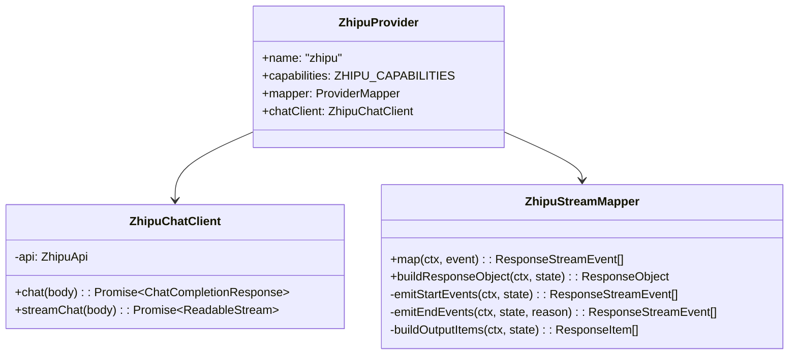
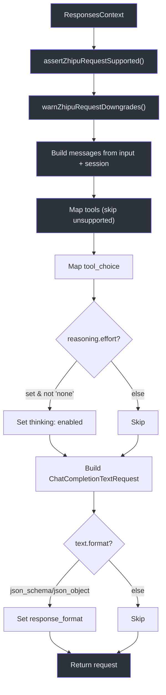
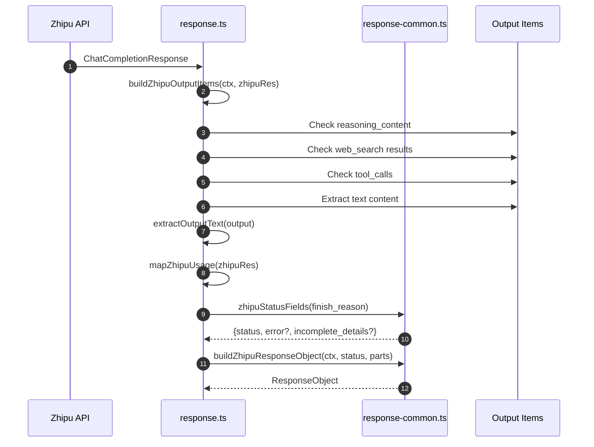
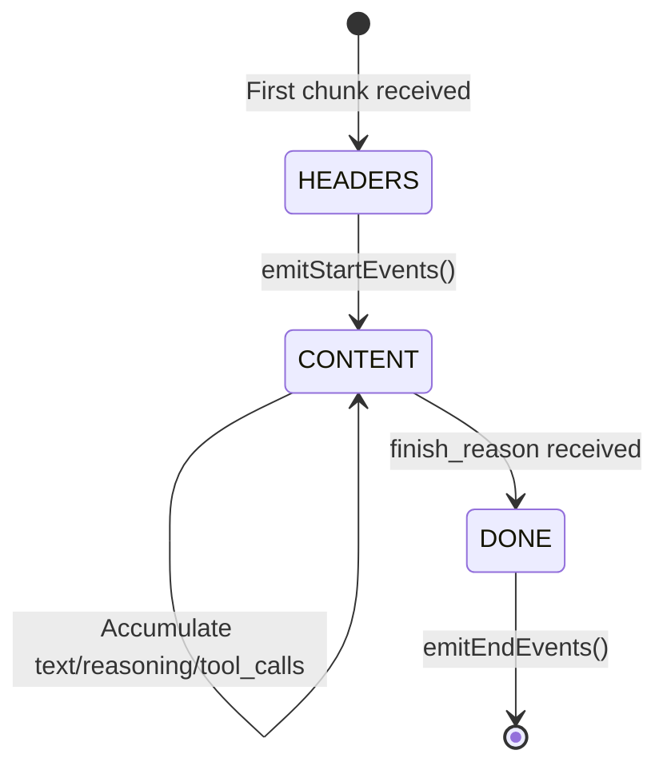
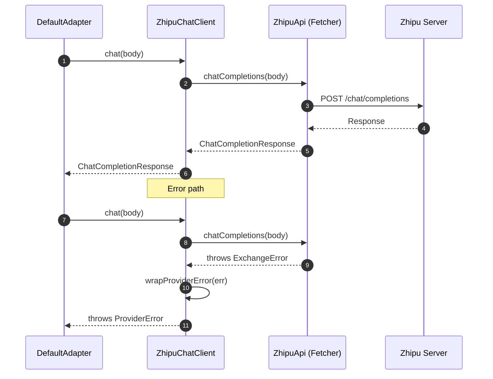

# Zhipu Reference Implementation

The Zhipu provider at `src/providers/zhipu/` is the reference implementation. This page walks through each file and its responsibilities.

## File Structure

| File | Responsibility |
|---|---|
| [index.ts](https://github.com/Ahoo-Wang/Godex/blob/main/src/providers/zhipu/index.ts) | Export `createZhipuProvider(config)` factory |
| [provider.ts](https://github.com/Ahoo-Wang/Godex/blob/main/src/providers/zhipu/provider.ts) | Assembles mapper + client + capabilities |
| [request.ts](https://github.com/Ahoo-Wang/Godex/blob/main/src/providers/zhipu/request.ts) | Builds upstream Chat Completions request |
| [response.ts](https://github.com/Ahoo-Wang/Godex/blob/main/src/providers/zhipu/response.ts) | Maps upstream response to ResponseObject |
| [response-common.ts](https://github.com/Ahoo-Wang/Godex/blob/main/src/providers/zhipu/response-common.ts) | Shared response building utilities |
| [stream.ts](https://github.com/Ahoo-Wang/Godex/blob/main/src/providers/zhipu/stream.ts) | StreamMapper with StreamState tracking |
| [chat-client.ts](https://github.com/Ahoo-Wang/Godex/blob/main/src/providers/zhipu/chat-client.ts) | HTTP client wrapping ZhipuApi |
| [capabilities.ts](https://github.com/Ahoo-Wang/Godex/blob/main/src/providers/zhipu/capabilities.ts) | Request validation and downgrade warnings |
| [messages.ts](https://github.com/Ahoo-Wang/Godex/blob/main/src/providers/zhipu/messages.ts) | Input item → chat message conversion |
| [tools.ts](https://github.com/Ahoo-Wang/Godex/blob/main/src/providers/zhipu/tools.ts) | OpenAI tool definitions → Zhipu format |
| [tool-calls.ts](https://github.com/Ahoo-Wang/Godex/blob/main/src/providers/zhipu/tool-calls.ts) | Upstream tool calls → Response items |
| [function-names.ts](https://github.com/Ahoo-Wang/Godex/blob/main/src/providers/zhipu/function-names.ts) | Function name sanitization |
| [protocol/](https://github.com/Ahoo-Wang/Godex/blob/main/src/providers/zhipu/protocol) | Zhipu-specific type definitions |

## Provider Assembly

`ZhipuProvider` ([src/providers/zhipu/provider.ts:39](https://github.com/Ahoo-Wang/Godex/blob/main/src/providers/zhipu/provider.ts#L39)) is a concrete `Provider<ChatCompletionTextRequest, ChatCompletionResponse, ChatCompletionChunk>`:



### Capabilities Declaration

```typescript
const ZHIPU_CAPABILITIES: ProviderCapabilities = mergeCapabilities({
  supportedToolTypes: new Set([
    "function", "web_search", "file_search", "mcp",
    "local_shell", "shell", "apply_patch", "custom",
    "tool_search", "namespace",
  ]),
  reasoning: true,
  structuredOutput: true,
  webSearch: true,
  fileSearch: true,
  parallelToolCalls: true,
  streamingToolCalls: true,
  features: new Set(["vision", "audio", "video"]),
  maxTools: 128,
});
```

## Request Mapping

`buildZhipuRequest` ([src/providers/zhipu/request.ts:18](https://github.com/Ahoo-Wang/Godex/blob/main/src/providers/zhipu/request.ts#L18)) converts a `ResponsesContext` into a `ChatCompletionTextRequest`:



| Responses API Field | Maps To | Notes |
|---|---|---|
| `model` | `model` (resolved) | After ModelResolver mapping |
| `input` | `messages` | Via `buildZhipuMessages` |
| `tools` | `tools` | Via `mapTools`, skips unsupported types |
| `tool_choice` | `tool_choice` | Only "auto" is forwarded |
| `reasoning.effort` | `thinking.type: "enabled"` | If set and not "none" |
| `text.format` | `response_format` | json_schema/json_object → json_object |
| `temperature` | `temperature` | Clamped to [0, 1.0] |
| `max_output_tokens` | `max_tokens` | Direct mapping |

## Response Mapping

`buildResponseObject` ([src/providers/zhipu/response.ts:114](https://github.com/Ahoo-Wang/Godex/blob/main/src/providers/zhipu/response.ts#L114)) maps a Zhipu `ChatCompletionResponse` to an OpenAI `ResponseObject`:



### Finish Reason → Status Mapping

| Zhipu `finish_reason` | Response `status` | Notes |
|---|---|---|
| `stop`, `tool_calls` | `completed` | Normal completion |
| `length`, `model_context_window_exceeded` | `incomplete` | `incomplete_details.reason = "max_output_tokens"` |
| `sensitive` | `incomplete` | `incomplete_details.reason = "content_filter"` |
| `network_error` | `failed` | `error.code = "server_error"` |
| Other | `failed` | `error.code = "server_error"` |

## Stream Mapping

`ZhipuStreamMapper` ([src/providers/zhipu/stream.ts:22](https://github.com/Ahoo-Wang/Godex/blob/main/src/providers/zhipu/stream.ts#L22)) implements `StreamMapper<ChatCompletionChunk>`. It tracks state via `StreamState` and emits typed events:



### Event Emission Phases

| Phase | Events Emitted |
|---|---|
| Start (HEADERS → CONTENT) | `response.created`, `response.in_progress`, `response.output_item.added`, `response.content_part.added` |
| Content (CONTENT) | `response.output_text.delta`, `response.reasoning_text.delta`, `response.function_call_arguments.delta` |
| End (CONTENT → DONE) | `response.output_text.done`, `response.content_part.done`, `response.output_item.done`, terminal event |

## Chat Client

`ZhipuChatClient` ([src/providers/zhipu/chat-client.ts:15](https://github.com/Ahoo-Wang/Godex/blob/main/src/providers/zhipu/chat-client.ts#L15)) wraps the `ZhipuApi` Fetcher-based client:



### Error Wrapping

The `wrapProviderError` function ([src/providers/zhipu/chat-client.ts:54](https://github.com/Ahoo-Wang/Godex/blob/main/src/providers/zhipu/chat-client.ts#L54)) translates Fetcher errors into `ProviderError`:

| Error Type | Mapped To |
|---|---|
| `FetchTimeoutError` / `TimeoutError` | `ProviderError(PROVIDER_UPSTREAM_TIMEOUT, ...)` |
| `ExchangeError` | `ProviderError(PROVIDER_UPSTREAM_ERROR, ...)` with upstream status/body |
| Other | Passed through unchanged |

## Capability Assertions

`capabilities.ts` provides two functions:

| Function | Purpose | Throws? |
|---|---|---|
| `assertZhipuRequestSupported` | Rejects `background`, `conversation`, `prompt` fields | Yes (`AdapterError`) |
| `warnZhipuRequestDowngrades` | Warns about `truncation`, `parallel_tool_calls` being ignored | No (logs warning) |

## References

- [src/providers/zhipu/index.ts](https://github.com/Ahoo-Wang/Godex/blob/main/src/providers/zhipu/index.ts)
- [src/providers/zhipu/provider.ts](https://github.com/Ahoo-Wang/Godex/blob/main/src/providers/zhipu/provider.ts)
- [src/providers/zhipu/request.ts](https://github.com/Ahoo-Wang/Godex/blob/main/src/providers/zhipu/request.ts)
- [src/providers/zhipu/response.ts](https://github.com/Ahoo-Wang/Godex/blob/main/src/providers/zhipu/response.ts)
- [src/providers/zhipu/response-common.ts](https://github.com/Ahoo-Wang/Godex/blob/main/src/providers/zhipu/response-common.ts)
- [src/providers/zhipu/stream.ts](https://github.com/Ahoo-Wang/Godex/blob/main/src/providers/zhipu/stream.ts)
- [src/providers/zhipu/chat-client.ts](https://github.com/Ahoo-Wang/Godex/blob/main/src/providers/zhipu/chat-client.ts)
- [src/providers/zhipu/capabilities.ts](https://github.com/Ahoo-Wang/Godex/blob/main/src/providers/zhipu/capabilities.ts)
- [src/providers/zhipu/protocol/completions.ts](https://github.com/Ahoo-Wang/Godex/blob/main/src/providers/zhipu/protocol/completions.ts)
