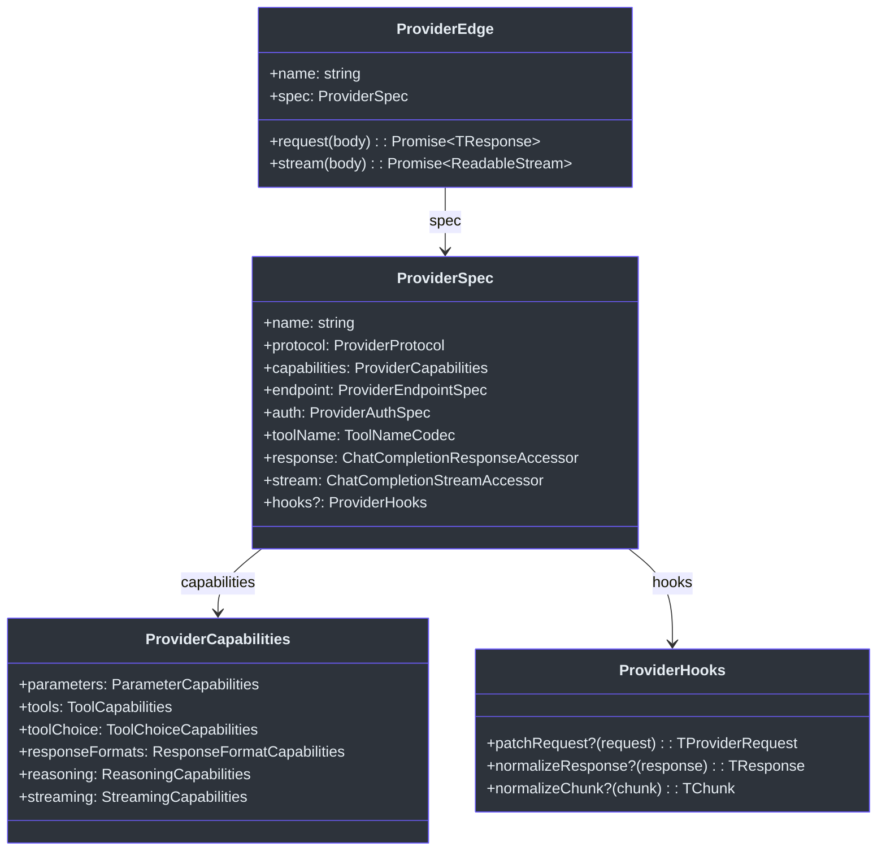
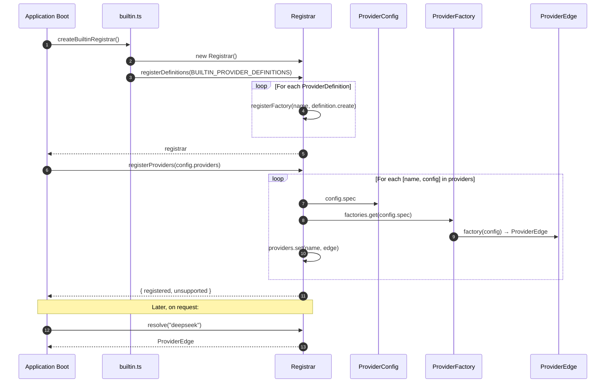
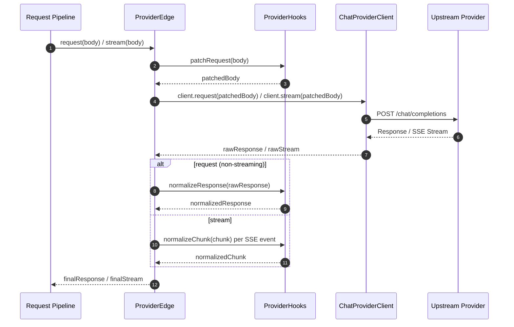
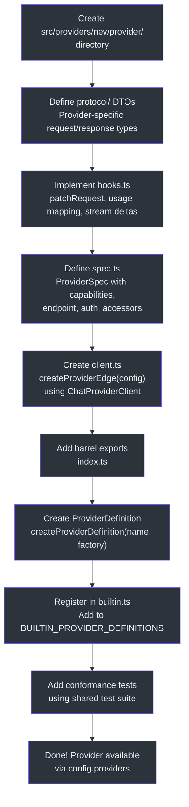
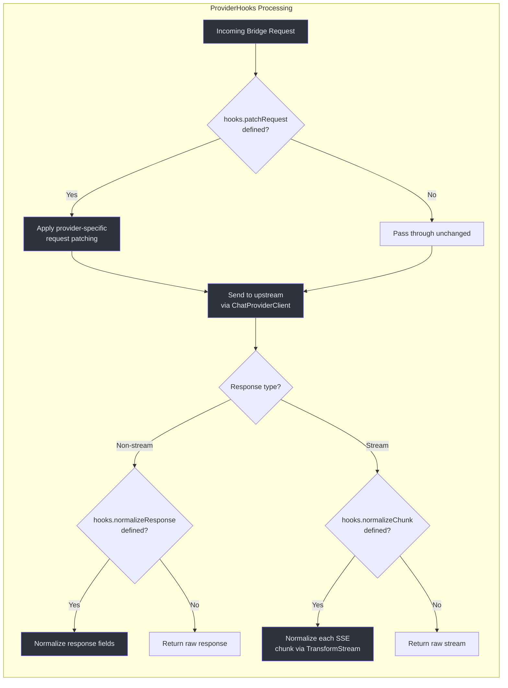

# Provider Development

GodeX acts as a universal gateway that normalises many upstream LLM providers behind a single OpenAI-compatible Responses API. Each provider is a self-contained module that translates between GodeX's bridge layer and the provider's native Chat Completions protocol. Understanding how providers are structured is essential for extending GodeX with new backends, whether that means adding a brand-new LLM vendor or a custom internal deployment.

## At a Glance

| Concept | Purpose | Key File |
|---|---|---|
| `ProviderSpec` | Declares capabilities, endpoint, auth, accessors, hooks | [contract.ts:54-74](https://github.com/Ahoo-Wang/GodeX/blob/main/src/bridge/provider-spec/contract.ts#L54-L74) |
| `ProviderEdge` | Runtime handle: holds spec + `request()` / `stream()` | [contract.ts:76-93](https://github.com/Ahoo-Wang/GodeX/blob/main/src/bridge/provider-spec/contract.ts#L76-L93) |
| `ProviderHooks` | Optional request patching, response/chunk normalisation | [contract.ts:43-52](https://github.com/Ahoo-Wang/GodeX/blob/main/src/bridge/provider-spec/contract.ts#L43-L52) |
| `ProviderCapabilities` | Feature flags: parameters, tools, reasoning, streaming | [compatibility-plan.ts:29-36](https://github.com/Ahoo-Wang/GodeX/blob/main/src/bridge/compatibility/compatibility-plan.ts#L29-L36) |
| `ProviderDefinition` | Name + factory function, registered at startup | [definition.ts](https://github.com/Ahoo-Wang/GodeX/blob/main/src/providers/definition.ts) |
| `Registrar` | Maps provider names to `ProviderEdge` instances | [registrar.ts:16](https://github.com/Ahoo-Wang/GodeX/blob/main/src/providers/registrar.ts#L16) |
| `ChatProviderClient` | Shared HTTP client for Chat Completions calls | [chat-provider-client.ts](https://github.com/Ahoo-Wang/GodeX/blob/main/src/providers/shared/chat-provider-client.ts) |

## Provider Package Layout

Every provider follows the same compact package structure under `src/providers/<name>/`:

```
src/providers/<name>/
  spec.ts        -- Capabilities, endpoint, auth, tool codec, accessors, hooks
  client.ts      -- createProviderEdge(config) factory function
  hooks.ts       -- Provider-specific request patching, usage mapping, stream deltas
  protocol/      -- Provider-specific Chat Completions DTOs (request/response types)
  index.ts       -- Barrel re-exports
```

## Provider Interface Hierarchy



## Provider Capabilities Comparison

The two built-in providers differ in reasoning strategy, tool types, and tool choice support:

| Capability | DeepSeek | Zhipu (智谱) |
|---|---|---|
| Reasoning effort | `native` (maps `reasoning_effort` directly) | `boolean` (maps to `thinking.type: enabled/disabled`) |
| Tool types | function, local_shell, shell, apply_patch, custom, tool_search, namespace | function, web_search, local_shell, shell, apply_patch, custom, tool_search, namespace |
| Tool degradation | local_shell/shell/apply_patch/custom/tool_search/namespace → function | Same + web_search variants → web_search, file_search → retrieval |
| Max tools | 128 | 128 |
| Tool choice | auto, none, required, function | auto, none |
| Response formats | text, json_object | text, json_object |
| Default base URL | `https://api.deepseek.com` | `https://open.bigmodel.cn/api/coding/paas/v4` |
| Stream usage | yes | yes |

### DeepSeek Reasoning Hook

DeepSeek uses **native** reasoning effort. The [`deepSeekPatchRequest`](https://github.com/Ahoo-Wang/GodeX/blob/main/src/providers/deepseek/hooks.ts#L113-L136) hook converts `reasoning_effort` into DeepSeek-specific `thinking` and `reasoning_effort` parameters:

- If `reasoning_effort` is `"high"` → passes `thinking: { type: "enabled" }` + `reasoning_effort: "high"`
- If `reasoning_effort` is `"xhigh"` → passes `thinking: { type: "enabled" }` + `reasoning_effort: "max"`
- If messages contain historical `reasoning_content` → enables thinking automatically
- Otherwise → `thinking: { type: "disabled" }`

### Zhipu Reasoning Hook

Zhipu uses **boolean** reasoning. The [`zhipuPatchRequest`](https://github.com/Ahoo-Wang/GodeX/blob/main/src/providers/zhipu/hooks.ts#L113-L134) hook converts effort to `thinking.type: enabled/disabled` and always adds `clear_thinking: false`:

- If `reasoning_effort` is present → converts to `thinking.type: enabled/disabled`
- If messages contain historical `reasoning_content` → enables thinking automatically
- Always sets `clear_thinking: false` when thinking is enabled

## Provider Registration Flow

The registrar wires provider names to `ProviderEdge` instances at startup. Configuration declares which provider spec to use, and the registrar resolves the matching factory.



### Key Registration Contracts

- **`Registrar.registerProviders()`** ([registrar.ts:42-75](https://github.com/Ahoo-Wang/GodeX/blob/main/src/providers/registrar.ts#L42-L75)) iterates `config.providers`, resolves factories by `config.spec`, and creates edges. Providers whose `spec` name has no registered factory are recorded as `unsupported`.
- **`Registrar.resolve(name)`** ([registrar.ts:77-86](https://github.com/Ahoo-Wang/GodeX/blob/main/src/providers/registrar.ts#L77-L86)) throws a `ServerError` if the requested provider is not registered.
- **`ProviderDefinition`** ([definition.ts:6-11](https://github.com/Ahoo-Wang/GodeX/blob/main/src/providers/definition.ts#L6-L11)) holds a `name` and a `create(config)` factory function.

## ProviderEdge Request/Stream Lifecycle

When GodeX receives a request, it flows through the provider's edge, hooks, and shared client:



## Shared Provider Infrastructure

| Component | File | Role |
|---|---|---|
| `ChatProviderClient` | [chat-provider-client.ts](https://github.com/Ahoo-Wang/GodeX/blob/main/src/providers/shared/chat-provider-client.ts) | Generic HTTP client wrapping `ChatApi`; handles `request()` and `stream()` with error wrapping |
| `ChatApi` | [chat-api.ts](https://github.com/Ahoo-Wang/GodeX/blob/main/src/providers/shared/chat-api.ts) | Fetcher-decorated API class; `POST /chat/completions` with SSE result extractor for streaming |
| `createProviderEdge()` | [factory.ts:34-88](https://github.com/Ahoo-Wang/GodeX/blob/main/src/bridge/provider-spec/factory.ts#L34-L88) | Factory that wires spec + config + request/stream implementations into a `ProviderEdge`, applying hooks automatically |
| `StreamDeltaMapper` | [shared/index.ts](https://github.com/Ahoo-Wang/GodeX/blob/main/src/providers/shared) | Common stream delta mapping helpers (`mapCommonChatStreamDelta`) |
| `StreamResultExtractor` | [stream-result-extractor.ts](https://github.com/Ahoo-Wang/GodeX/blob/main/src/providers/shared/stream-result-extractor.ts) | SSE stream parsing |

## Adding a New Provider

The following flowchart shows the complete process of adding a new provider:



### Step-by-Step Guide

**Step 1: Create the provider directory**

Create `src/providers/<name>/` with files: `spec.ts`, `client.ts`, `hooks.ts`, `protocol/` directory, and `index.ts`.

**Step 2: Define protocol DTOs**

In `protocol/`, define TypeScript interfaces for the provider's Chat Completions request, response, chunk, and stream delta types. These extend the generic types with provider-specific fields (e.g., DeepSeek's `reasoning_content`, Zhipu's `thinking` parameter).

**Step 3: Implement hooks**

In `hooks.ts`, implement:
- `patchRequest` — Convert the bridge's generic `ChatCompletionCreateRequest` into the provider's native format (e.g., mapping `reasoning_effort` to provider-specific parameters)
- Usage mapping — Convert provider-specific usage fields (e.g., `prompt_cache_hit_tokens`) into the standard `ResponseUsage` shape
- `streamDeltas` — Map provider SSE chunk choices into `ProviderStreamDelta[]` using the shared `mapCommonChatStreamDelta` helper

**Step 4: Define the spec**

In `spec.ts`, create a `ProviderSpec` constant that declares:
- `name` — Unique provider identifier
- `protocol` — Always `CHAT_COMPLETIONS_PROTOCOL`
- `capabilities` — `ProviderCapabilities` with supported parameters, tools, tool choice, response formats, reasoning effort type, and streaming support
- `endpoint` — `{ defaultBaseURL }` for the provider's API base URL
- `auth` — `BEARER_AUTH` for API key authentication
- `toolName` — Codec for translating tool names between GodeX and provider namespaces (typically `DEFAULT_TOOL_NAME_CODEC`)
- `response` — Accessors: `firstChoice`, `finishReason`, `outputText`, `usage`
- `stream` — Accessor: `deltas(chunk) → ProviderStreamDelta[]`
- `hooks` — The hooks from step 3

**Step 5: Create the client factory**

In `client.ts`, export a `create<Name>ProviderEdge(config)` function that:
1. Creates a `ChatProviderClient` with the spec's name, resolved base URL, API key, and timeout
2. Calls `createProviderEdge({ spec, config, request, stream })` to wire everything together

**Step 6: Register the provider**

In `src/providers/builtin.ts`:
1. Create a `ProviderDefinition` using `createProviderDefinition(name, factory)`
2. Add it to the `BUILTIN_PROVIDER_DEFINITIONS` array
3. Add the spec to `BUILTIN_PROVIDER_SPECS`

**Step 7: Add tests**

Write conformance tests that verify the provider's capability mapping, request patching, usage mapping, and stream delta extraction against the shared test utilities.

## Hook Processing Detail

This diagram shows the internal flow of a single provider hook during request processing:



## Related Pages

- [Streaming Pipeline](../05-streaming-pipeline/streaming-pipeline.md) — How provider deltas are translated into OpenAI Responses stream events
- [Compatibility System](../03-bridge-kernel/bridge-kernel.md) — How capabilities drive parameter filtering and tool degradation
- [Bridge Layer](../03-bridge-kernel/bridge-kernel.md) — The bridge that converts between Responses API and Chat Completions protocol

## References

- [src/bridge/provider-spec/contract.ts](https://github.com/Ahoo-Wang/GodeX/blob/main/src/bridge/provider-spec/contract.ts) — `ProviderSpec`, `ProviderEdge`, `ProviderHooks` interfaces
- [src/bridge/provider-spec/factory.ts](https://github.com/Ahoo-Wang/GodeX/blob/main/src/bridge/provider-spec/factory.ts) — `createProviderEdge()` factory
- [src/bridge/compatibility/compatibility-plan.ts](https://github.com/Ahoo-Wang/GodeX/blob/main/src/bridge/compatibility/compatibility-plan.ts) — `ProviderCapabilities` interface
- [src/providers/registrar.ts](https://github.com/Ahoo-Wang/GodeX/blob/main/src/providers/registrar.ts) — `Registrar` class
- [src/providers/definition.ts](https://github.com/Ahoo-Wang/GodeX/blob/main/src/providers/definition.ts) — `ProviderDefinition` type and factory
- [src/providers/builtin.ts](https://github.com/Ahoo-Wang/GodeX/blob/main/src/providers/builtin.ts) — Built-in provider definitions
- [src/providers/deepseek/spec.ts](https://github.com/Ahoo-Wang/GodeX/blob/main/src/providers/deepseek/spec.ts) — DeepSeek provider spec
- [src/providers/deepseek/hooks.ts](https://github.com/Ahoo-Wang/GodeX/blob/main/src/providers/deepseek/hooks.ts) — DeepSeek hooks (reasoning, usage, deltas)
- [src/providers/deepseek/client.ts](https://github.com/Ahoo-Wang/GodeX/blob/main/src/providers/deepseek/client.ts) — DeepSeek client factory
- [src/providers/zhipu/spec.ts](https://github.com/Ahoo-Wang/GodeX/blob/main/src/providers/zhipu/spec.ts) — Zhipu provider spec
- [src/providers/zhipu/hooks.ts](https://github.com/Ahoo-Wang/GodeX/blob/main/src/providers/zhipu/hooks.ts) — Zhipu hooks (reasoning, usage, deltas)
- [src/providers/shared/chat-provider-client.ts](https://github.com/Ahoo-Wang/GodeX/blob/main/src/providers/shared/chat-provider-client.ts) — Shared HTTP client
- [src/providers/shared/chat-api.ts](https://github.com/Ahoo-Wang/GodeX/blob/main/src/providers/shared/chat-api.ts) — ChatApi endpoint construction
