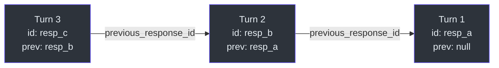
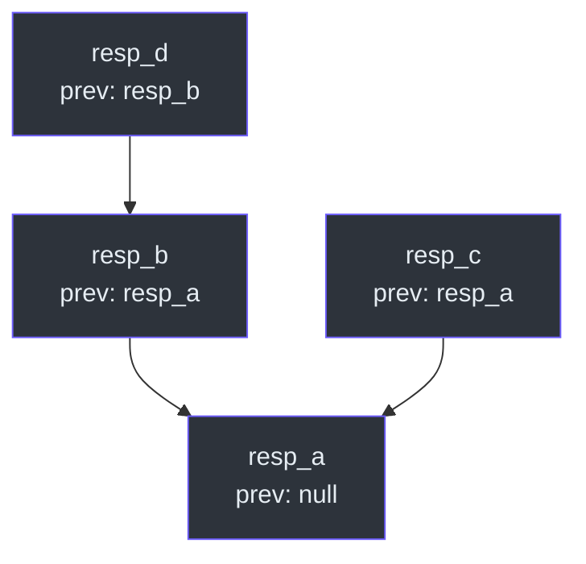
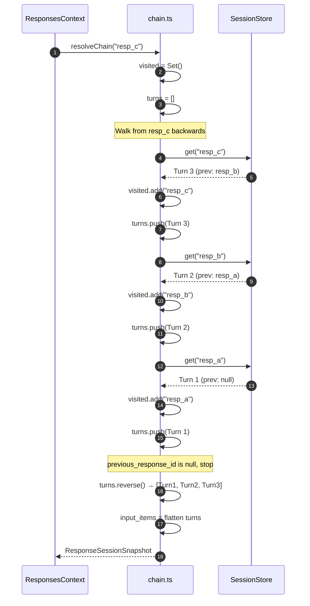

# Chain Resolution

When a request includes `previous_response_id`, Godex walks the parent pointer chain to reconstruct the full conversation history. This page covers the traversal algorithm, safety checks, and error handling.

## How Chains Work

Each `StoredResponseSession` has a `previous_response_id` field that acts as a parent pointer. This creates a linked list of conversation turns:



Multiple child responses can reference the same parent, allowing conversation forking:



## Chain Traversal Algorithm

`resolveResponseSessionChain` ([src/session/chain.ts:26](https://github.com/Ahoo-Wang/Godex/blob/main/src/session/chain.ts#L26)) walks parent pointers and returns turns in chronological order:



### Pseudocode

```
function resolveChain(startId, options):
    visited = new Set()
    turns = []
    current = startId

    while current is not null:
        if turns.length >= maxDepth: throw DEPTH_EXCEEDED
        if visited.has(current): throw CYCLE_DETECTED
        visited.add(current)

        turn = store.get(current)
        if turn is null: throw NOT_FOUND
        if turn.status !== "completed" and !includeIncomplete: throw UNAVAILABLE

        turns.push(turn)
        current = turn.previous_response_id

    turns.reverse()
    input_items = turns.flatMap(turn => [...requestInputItems(turn.request.input), ...turn.response.output])

    return { previous_response_id: startId, turns, input_items }
```

## Safety Checks

### Cycle Detection

A `visited` Set tracks all response IDs seen during traversal. If the same ID appears twice, the chain contains a cycle and `SESSION_CHAIN_CYCLE_DETECTED` is thrown.

### Depth Limits

`DEFAULT_MAX_DEPTH` is 64 ([src/session/chain.ts:17](https://github.com/Ahoo-Wang/Godex/blob/main/src/session/chain.ts#L17)). If the chain length exceeds this limit, `SESSION_CHAIN_DEPTH_EXCEEDED` is thrown. This prevents infinite loops from corrupted data.

### Status Filtering

By default, only responses with `status === "completed"` are accepted in a chain. Non-completed responses (in_progress, incomplete, failed) cause `SESSION_CHAIN_UNAVAILABLE` to be thrown. The `include_incomplete` option overrides this.

## Error Scenarios

| Error Code | HTTP Status | Trigger |
|---|---|---|
| `session.chain.not_found` | 400 | A response ID in the chain does not exist in the store |
| `session.chain.cycle_detected` | 400 | The same response ID appears twice during traversal |
| `session.chain.depth_exceeded` | 400 | Chain length exceeds `max_depth` (default 64) |
| `session.chain.unavailable` | 400 | A turn in the chain has status other than "completed" |

```mermaid
flowchart TD
    A["resolveChain(startId)"] --> B{"turns.length >= maxDepth?"}
    B -->|"yes"| C["SESSION_CHAIN_DEPTH_EXCEEDED"]
    B -->|"no"| D{"visited.has(currentId)?"}
    D -->|"yes"| E["SESSION_CHAIN_CYCLE_DETECTED"]
    D -->|"no"| F{"store.get(currentId)"}
    F -->|"null"| G["SESSION_CHAIN_NOT_FOUND"]
    F -->|"found"| H{"status !== completed<br/>and !includeIncomplete?"}
    H -->|"yes"| I["SESSION_CHAIN_UNAVAILABLE"]
    H -->|"no"| J["Add to turns, continue"]
    J --> B

    style A fill:#2d333b,stroke:#6d5dfc,color:#e6edf3
    style C fill:#2d333b,stroke:#6d5dfc,color:#e6edf3
    style E fill:#2d333b,stroke:#6d5dfc,color:#e6edf3
    style G fill:#2d333b,stroke:#6d5dfc,color:#e6edf3
    style I fill:#2d333b,stroke:#6d5dfc,color:#e6edf3
    style J fill:#2d333b,stroke:#6d5dfc,color:#e6edf3
```



## input_items Flattening

After reversing the turns list, the chain resolver flattens each turn's request input and response output into a single `input_items` array ([src/session/chain.ts:93](https://github.com/Ahoo-Wang/Godex/blob/main/src/session/chain.ts#L93)):

```typescript
input_items: turns.flatMap((turn) => [
  ...requestInputItems(turn.request.input),
  ...turn.response.output,
]),
```

`requestInputItems` ([src/session/chain.ts:100](https://github.com/Ahoo-Wang/Godex/blob/main/src/session/chain.ts#L100)) normalizes the input:
- `string` input → `[{ type: "message", role: "user", content: [{ type: "input_text", text }] }]`
- Array input → used directly as `ResponseItem[]`
- `null` / `undefined` → empty array

This flattened array is then passed to `buildZhipuMessages` which converts it to the upstream provider's message format.

## Where Chain Resolution Happens

Chain resolution occurs in `ResponsesContext.create()` ([src/context/responses-context.ts:66](https://github.com/Ahoo-Wang/Godex/blob/main/src/context/responses-context.ts#L66)):

```typescript
if (body.previous_response_id) {
  session = await app.sessionStore.resolveChain(
    body.previous_response_id,
  );
}
```

The resolved `session` is stored on the `ResponsesContext` and used by the provider mapper to prepend conversation history to the messages array.

## References

- [src/session/chain.ts](https://github.com/Ahoo-Wang/Godex/blob/main/src/session/chain.ts) — Chain traversal algorithm
- [src/session/index.ts](https://github.com/Ahoo-Wang/Godex/blob/main/src/session/index.ts) — Types and interfaces
- [src/context/responses-context.ts](https://github.com/Ahoo-Wang/Godex/blob/main/src/context/responses-context.ts) — Where chain resolution is triggered
- [src/error/session-error.ts](https://github.com/Ahoo-Wang/Godex/blob/main/src/error/session-error.ts) — Session error types
- [src/error/codes.ts](https://github.com/Ahoo-Wang/Godex/blob/main/src/error/codes.ts) — Error code constants
