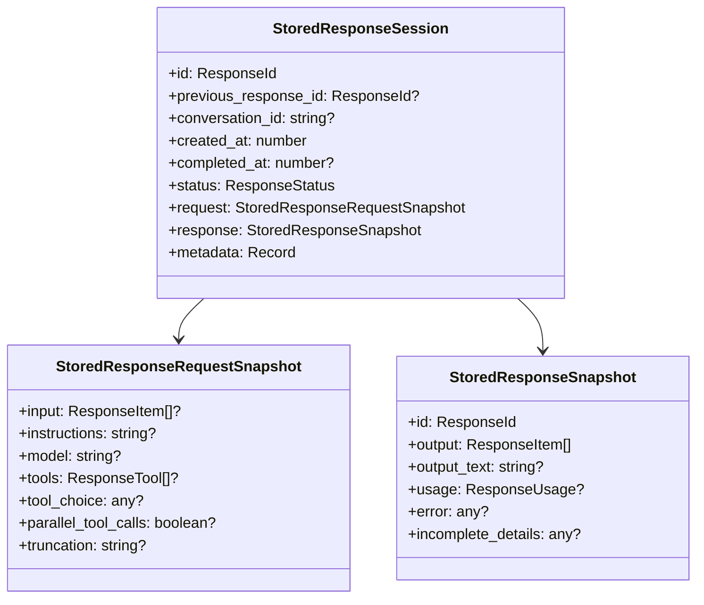
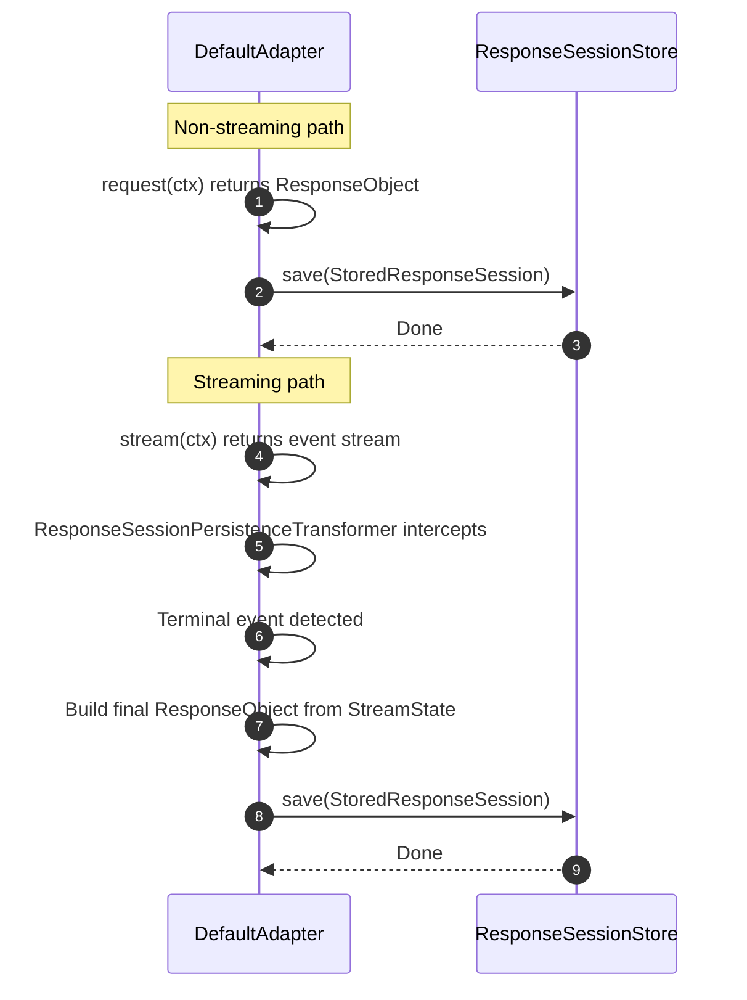
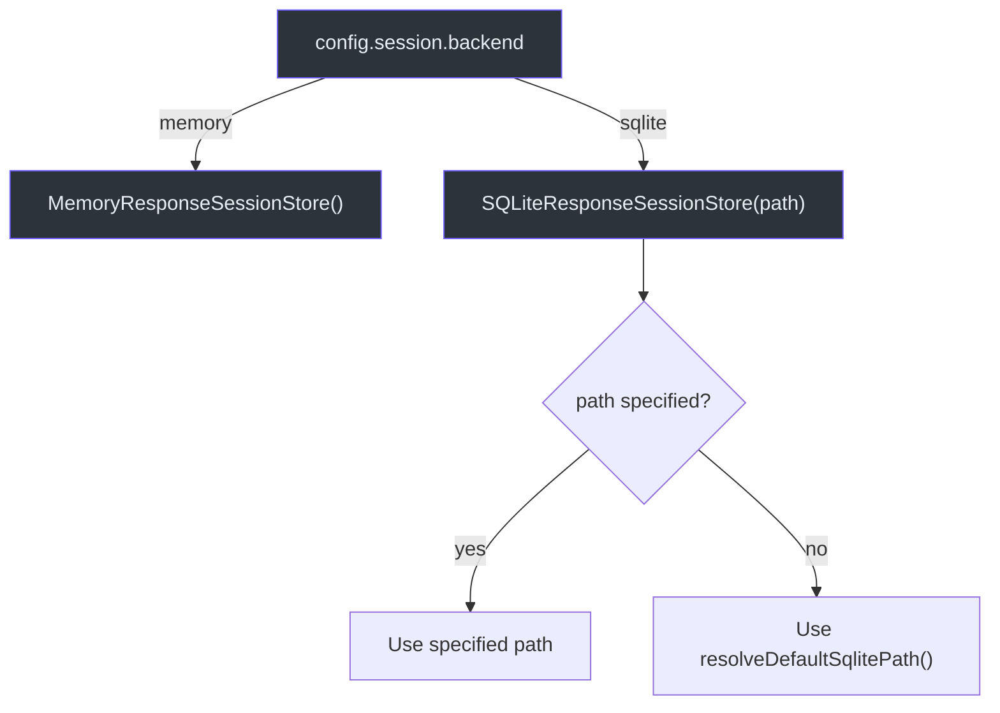

# Session Store

Sessions enable multi-turn conversations through `previous_response_id` chains. When a request includes `previous_response_id`, Godex resolves the full conversation history and feeds it as context to the upstream provider. After each response, the session is persisted for future turns.

## Why Sessions Exist

Without sessions, each request to `/v1/responses` is stateless. The `previous_response_id` mechanism allows clients to build conversations by referencing earlier responses, similar to OpenAI's Responses API. The session store persists the request/response snapshots needed to reconstruct conversation history.

## ResponseSessionStore Interface

Defined in [src/session/index.ts:99](https://github.com/Ahoo-Wang/Godex/blob/main/src/session/index.ts#L99):

| Method | Returns | Description |
|---|---|---|
| `get(responseId)` | `Promise<StoredResponseSession \| null>` | Retrieve one stored response by ID |
| `save(session, options?)` | `Promise<void>` | Persist a response snapshot |
| `resolveChain(previousResponseId, options?)` | `Promise<ResponseSessionSnapshot>` | Resolve full parent chain, oldest to newest |
| `delete(responseId)` | `Promise<void>` | Remove one response by ID |
| `close?()` | `void` | Release resources (optional) |

## StoredResponseSession Schema

Each stored session ([src/session/index.ts:25](https://github.com/Ahoo-Wang/Godex/blob/main/src/session/index.ts#L25)) contains:

| Field | Type | Description |
|---|---|---|
| `id` | `ResponseId` | Response ID (future `previous_response_id` target) |
| `previous_response_id` | `ResponseId \| null` | Parent pointer for chain traversal |
| `conversation_id` | `string \| null` | Reserved for future Conversation API |
| `created_at` | `number` | Unix timestamp |
| `completed_at` | `number \| null` | Completion timestamp |
| `status` | `ResponseStatus` | "completed", "incomplete", "failed", etc. |
| `request` | `StoredResponseRequestSnapshot` | Input, instructions, model, tools, etc. |
| `response` | `StoredResponseSnapshot` | Output, output_text, usage, error |
| `metadata` | `Record<string, unknown>` | Optional metadata |



## Backend Comparison

| Feature | MemoryResponseSessionStore | SQLiteResponseSessionStore |
|---|---|---|
| Persistence | In-memory `Map` | SQLite database |
| Survives restart | No | Yes |
| File | [src/session/memory.ts](https://github.com/Ahoo-Wang/Godex/blob/main/src/session/memory.ts) | [src/session/sqlite.ts](https://github.com/Ahoo-Wang/Godex/blob/main/src/session/sqlite.ts) |
| Config `session.backend` | `"memory"` | `"sqlite"` |
| Default path | N/A | Dev: `./data/sessions.db`, Prod: `~/.godex/data/sessions.db` |
| Cloning | `structuredClone` on read/write | JSON serialization |
| Resource cleanup | `clear()` | `close()` |
| Use case | Testing, demos, single-process | Production deployments |

## SQLite Schema

`SQLiteResponseSessionStore` ([src/session/sqlite.ts:36](https://github.com/Ahoo-Wang/Godex/blob/main/src/session/sqlite.ts#L36)) creates the following schema on construction:

```sql
CREATE TABLE IF NOT EXISTS response_sessions (
  id TEXT PRIMARY KEY,
  previous_response_id TEXT NULL,
  conversation_id TEXT NULL,
  created_at INTEGER NOT NULL,
  completed_at INTEGER NULL,
  status TEXT NOT NULL,
  request_json TEXT NOT NULL,
  response_json TEXT NOT NULL,
  metadata_json TEXT NULL
);

CREATE INDEX IF NOT EXISTS idx_response_sessions_previous_response_id
  ON response_sessions(previous_response_id);

CREATE INDEX IF NOT EXISTS idx_response_sessions_conversation_id
  ON response_sessions(conversation_id);
```

Request and response data are stored as JSON strings in `request_json` and `response_json` columns.

## Session Save Flow

The `saveSession` function in `DefaultAdapter` ([src/adapter/default-adapter.ts:61](https://github.com/Ahoo-Wang/Godex/blob/main/src/adapter/default-adapter.ts#L61)) handles both non-streaming and streaming paths:



### Save Behavior

| Condition | Action |
|---|---|
| `request.store === false` | Skip save entirely |
| Save throws error | Log warning, do not fail the response |
| `overwrite: false` (default) | Throw `SESSION_CONFLICT` if ID exists |
| `overwrite: true` | Upsert the session |

## Session Store Selection

`ApplicationContext` ([src/context/application-context.ts:13](https://github.com/Ahoo-Wang/Godex/blob/main/src/context/application-context.ts#L13)) selects the backend based on config:



## References

- [src/session/index.ts](https://github.com/Ahoo-Wang/Godex/blob/main/src/session/index.ts) — Types and ResponseSessionStore interface
- [src/session/memory.ts](https://github.com/Ahoo-Wang/Godex/blob/main/src/session/memory.ts) — In-memory implementation
- [src/session/sqlite.ts](https://github.com/Ahoo-Wang/Godex/blob/main/src/session/sqlite.ts) — SQLite implementation
- [src/adapter/default-adapter.ts](https://github.com/Ahoo-Wang/Godex/blob/main/src/adapter/default-adapter.ts) — saveSession function
- [src/context/application-context.ts](https://github.com/Ahoo-Wang/Godex/blob/main/src/context/application-context.ts) — Backend selection
