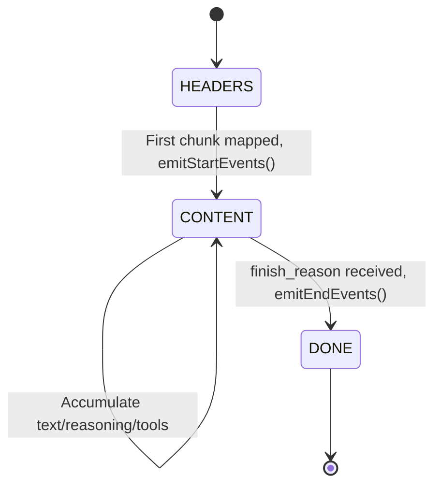
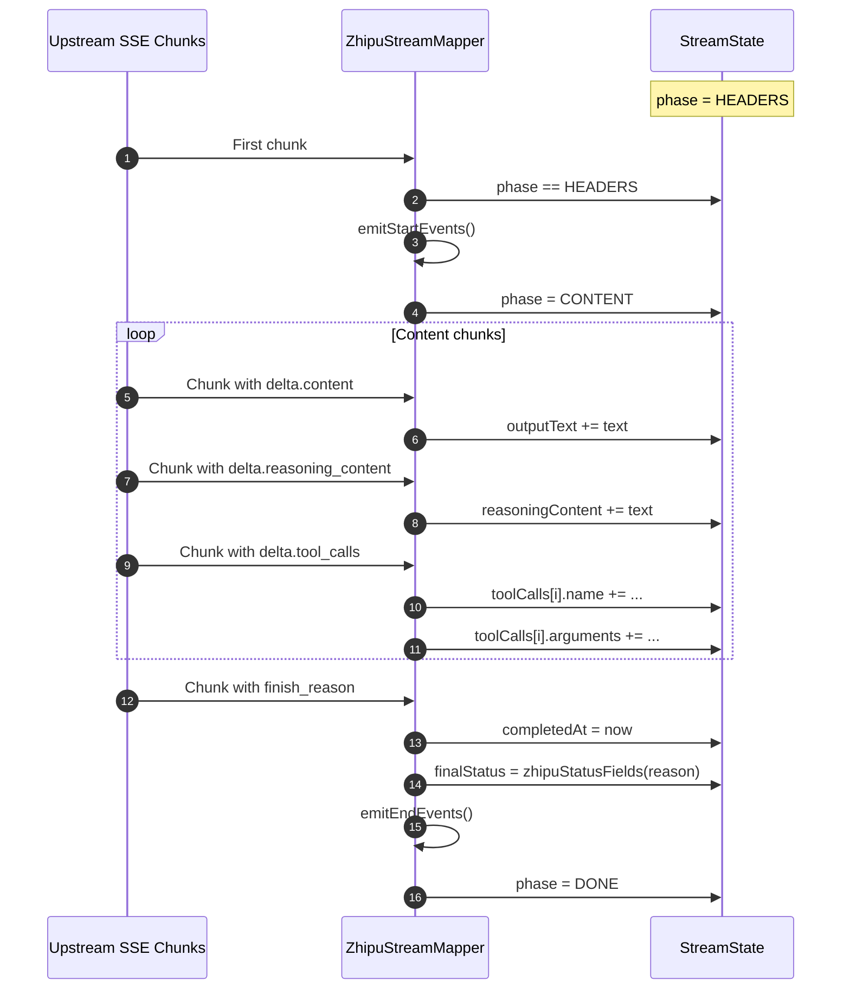
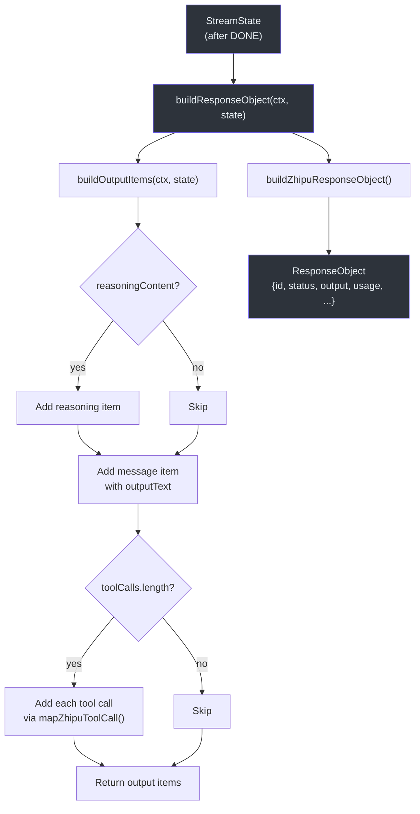

# Stream State

During streaming, Godex needs to accumulate partial outputs across many SSE chunks to build the final `ResponseObject` for session persistence. The `StreamState` class provides this shared mutable state that lives on the `ResponsesContext.attributes` map.

## StreamState Class

Defined in [src/adapter/mapper/stream-state.ts:23](https://github.com/Ahoo-Wang/Godex/blob/main/src/adapter/mapper/stream-state.ts#L23):

| Field | Type | Initial Value | Description |
|---|---|---|---|
| `phase` | `StreamPhase` | `HEADERS` | Current phase of the stream |
| `outputText` | `string` | `""` | Accumulated output text |
| `reasoningContent` | `string` | `""` | Accumulated reasoning/thinking text |
| `toolCalls` | `ToolCallAccumulator[]` | `[]` | Accumulated tool calls |
| `completedAt` | `number \| null` | `null` | Timestamp when stream completed |
| `finalStatus` | `StatusFields` | `{ status: "in_progress" }` | Terminal status and error info |

### StreamPhase Enum



| Phase | Description |
|---|---|
| `HEADERS` | Initial state, waiting for first chunk |
| `CONTENT` | Actively accumulating output from chunks |
| `DONE` | Stream finished, final events emitted |

### ToolCallAccumulator

```typescript
interface ToolCallAccumulator {
  index: number;
  id: string;
  name: string;
  arguments: string;
}
```

Tool calls arrive incrementally in SSE chunks. The accumulator tracks each tool call by `index` and progressively fills in `id`, `name`, and `arguments` as chunks arrive.

### StatusFields

```typescript
interface StatusFields {
  status: ResponseObject["status"];
  error?: ResponseObject["error"];
  incomplete_details?: ResponseObject["incomplete_details"];
}
```

## State Lifecycle



## How State Is Accessed

`StreamState.from()` ([src/adapter/mapper/stream-state.ts:33](https://github.com/Ahoo-Wang/Godex/blob/main/src/adapter/mapper/stream-state.ts#L33)) provides a singleton pattern on the context:

```typescript
static from<T extends StreamState>(
  this: new () => T,
  ctx: ResponsesContext,
): T {
  const key = StreamState.KEY; // "stream-state"
  let state = ctx.attributes.get(key) as T | undefined;
  if (!state) {
    state = new this();
    ctx.attributes.set(key, state);
  }
  return state;
}
```

This ensures:
- One `StreamState` per `ResponsesContext`
- Providers can subclass `StreamState` for custom tracking
- The state is accessible across transformers

## Building the Final Response

After the stream completes, `buildResponseObject` in the stream mapper reconstructs the full `ResponseObject`:



### Output Item Construction

The `buildOutputItems` method in `ZhipuStreamMapper` ([src/providers/zhipu/stream.ts:231](https://github.com/Ahoo-Wang/Godex/blob/main/src/providers/zhipu/stream.ts#L231)) constructs:

1. **Reasoning item** (if `reasoningContent` is non-empty): `{ type: "reasoning", summary: [...] }`
2. **Message item** (always): `{ type: "message", role: "assistant", content: [{ type: "output_text", text }] }`
3. **Tool call items** (if `toolCalls` is non-empty): Mapped via `mapZhipuToolCall()` which reconstructs `local_shell_call`, `shell_call`, `apply_patch_call`, etc.

## References

- [src/adapter/mapper/stream-state.ts](https://github.com/Ahoo-Wang/Godex/blob/main/src/adapter/mapper/stream-state.ts) — StreamState class definition
- [src/providers/zhipu/stream.ts](https://github.com/Ahoo-Wang/Godex/blob/main/src/providers/zhipu/stream.ts) — ZhipuStreamMapper usage of StreamState
- [src/adapter/transformers/response-session-persistence-transformer.ts](https://github.com/Ahoo-Wang/Godex/blob/main/src/adapter/transformers/response-session-persistence-transformer.ts) — Uses StreamState in flush()
