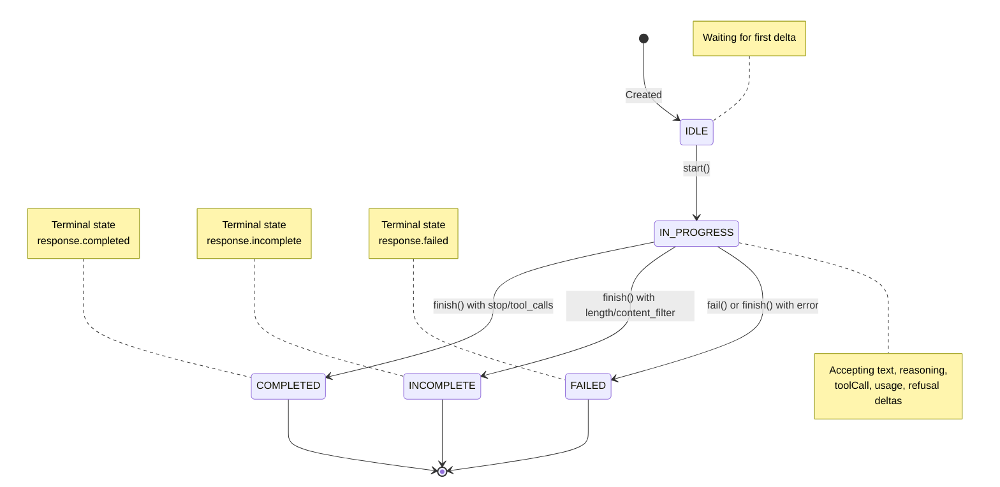
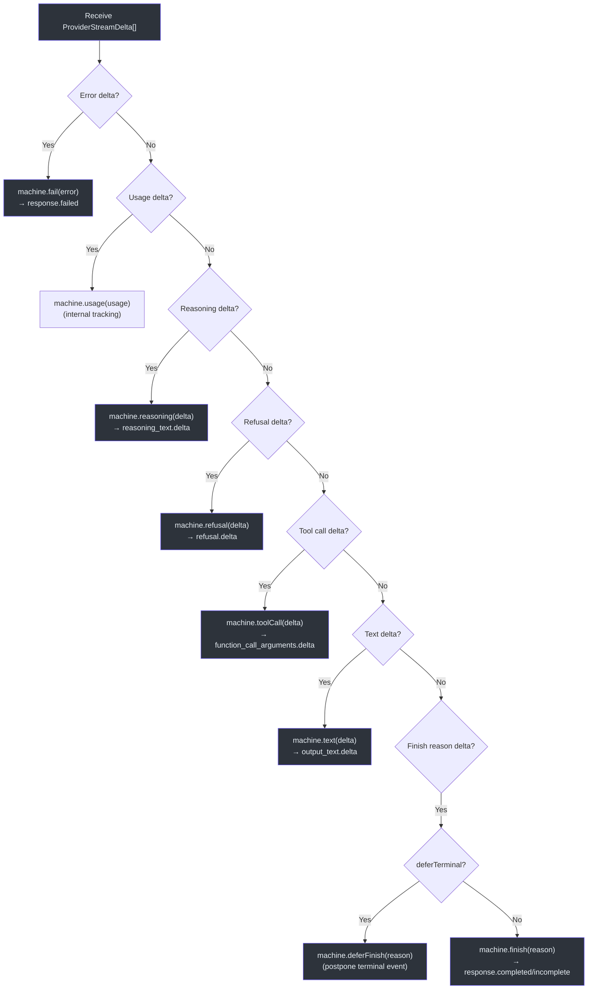
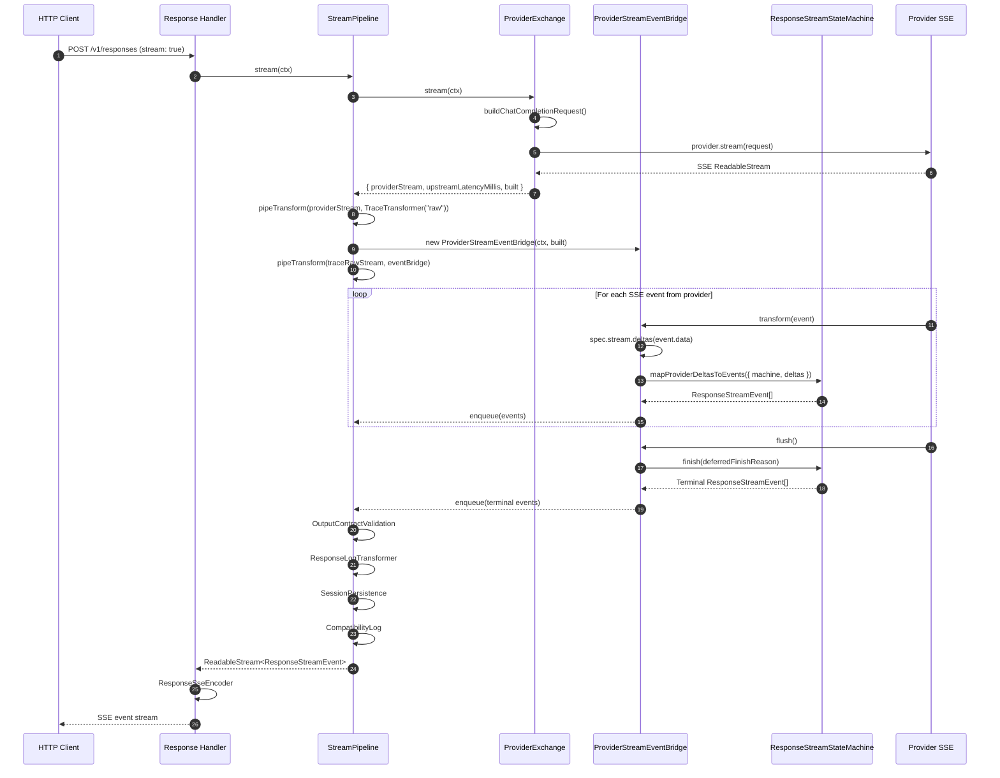
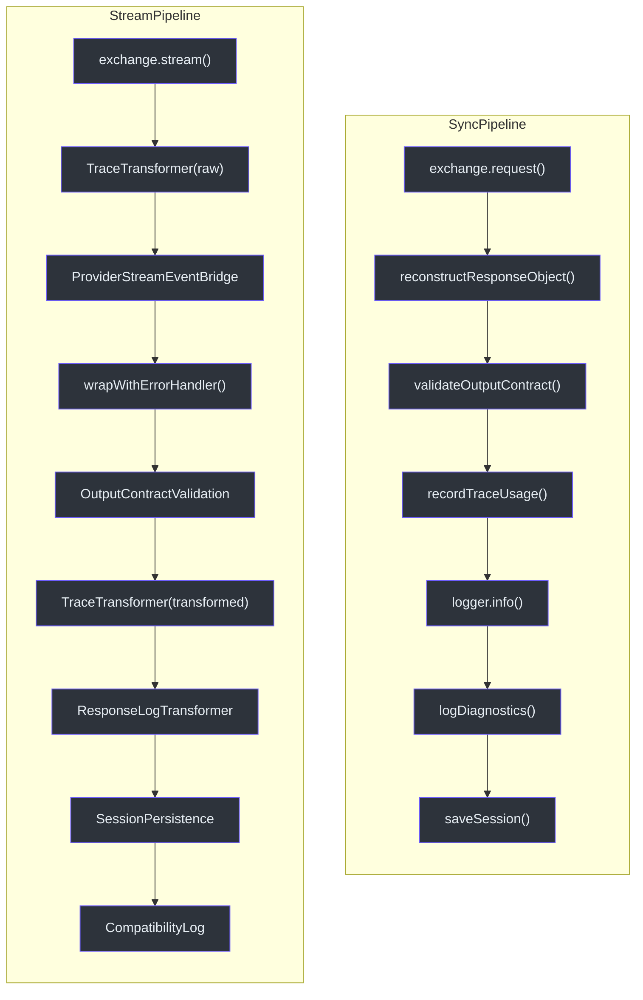

# Streaming Pipeline

GodeX's streaming pipeline is the core mechanism that converts raw provider SSE (Server-Sent Events) chunks into well-structured OpenAI Responses stream events. Rather than a monolithic handler, the pipeline assembles a chain of composable `TransformStream` stages, each with a single responsibility: tracing raw events, mapping deltas to Responses events, validating output contracts, logging, persisting sessions, and emitting compatibility diagnostics. This design makes the streaming path easy to extend, test, and reason about.

## At a Glance

| Stage | Class / Function | Purpose |
|---|---|---|
| Provider exchange | `ProviderExchange.stream()` | Build request, record trace, call provider |
| Raw trace | `TraceTransformer("upstream.stream.event.raw")` | Record raw provider events |
| Delta mapping | `ProviderStreamEventBridge` | Map provider deltas to Responses events via state machine |
| Error safety | `wrapWithErrorHandler()` | Catch stream errors, emit `response.failed` |
| Output validation | `ResponseOutputContractValidationTransformer` | Validate terminal output against contract |
| Transformed trace | `TraceTransformer("upstream.stream.event.transformed")` | Record transformed events |
| Logging | `ResponseLogTransformer` | Log usage, duration, cache hit ratio on terminal event |
| Session persistence | `ResponseSessionPersistenceTransformer` | Save completed response to session store |
| Compatibility log | `CompatibilityLogTransformer` | Log compatibility diagnostics |
| SSE encoding | `ResponseSseEncoder` | Encode `ResponseStreamEvent` to SSE wire format |

## Pipeline Architecture

The `StreamPipeline` class ([stream-pipeline.ts:31](https://github.com/Ahoo-Wang/GodeX/blob/main/src/responses/stream-pipeline.ts#L31)) orchestrates the entire streaming lifecycle. Each stage is a `TransformStream` connected via `pipeTransform()`:

```mermaid
flowchart LR
    subgraph StreamPipeline Chain
        direction LR
        A["ProviderExchange<br>.stream()"] --> B["TraceTransformer<br>upstream.stream.event.raw"]
        B --> C["ProviderStreamEventBridge<br>Delta → Events mapping"]
        C --> D["wrapWithErrorHandler<br>Error safety net"]
        D --> E["ResponseOutputContract<br>ValidationTransformer"]
        E --> F["TraceTransformer<br>upstream.stream.event.transformed"]
        F --> G["ResponseLogTransformer<br>Usage & duration logging"]
        G --> H["store ≠ false?"]
        H -- Yes --> I["ResponseSessionPersistence<br>Transformer"]
        H -- No --> J["CompatibilityLogTransformer<br>Diagnostic logging"]
        I --> J
    end

    J --> K["ResponseSseEncoder<br>SSE wire format"]
    K --> L["HTTP Response<br>EventStream"]

    style A fill:#2d333b,stroke:#6d5dfc,color:#e6edf3
    style B fill:#2d333b,stroke:#6d5dfc,color:#e6edf3
    style C fill:#2d333b,stroke:#6d5dfc,color:#e6edf3
    style D fill:#2d333b,stroke:#6d5dfc,color:#e6edf3
    style E fill:#2d333b,stroke:#6d5dfc,color:#e6edf3
    style F fill:#2d333b,stroke:#6d5dfc,color:#e6edf3
    style G fill:#2d333b,stroke:#6d5dfc,color:#e6edf3
    style I fill:#2d333b,stroke:#6d5dfc,color:#e6edf3
    style J fill:#2d333b,stroke:#6d5dfc,color:#e6edf3
    style K fill:#2d333b,stroke:#6d5dfc,color:#e6edf3
```



### Stage Details

**1. ProviderExchange.stream()** ([provider-exchange.ts:49-71](https://github.com/Ahoo-Wang/GodeX/blob/main/src/responses/provider-exchange.ts#L49-L71))
Builds the chat completion request via `buildChatCompletionRequest()`, records trace events, calls `ctx.provider.stream(providerRequest)`, and measures upstream latency.

**2. TraceTransformer("upstream.stream.event.raw")** ([trace-transformer.ts](https://github.com/Ahoo-Wang/GodeX/blob/main/src/responses/stream-transforms/trace-transformer.ts))
A pass-through transformer that records each raw provider SSE event via `recordTraceEvent()` when tracing is enabled.

**3. ProviderStreamEventBridge** ([stream-pipeline.ts:88-133](https://github.com/Ahoo-Wang/GodeX/blob/main/src/responses/stream-pipeline.ts#L88-L133))
The core mapping stage. Creates a `ResponseStreamStateMachine` per request and calls `mapProviderDeltasToEvents()` to translate provider-specific deltas into standard Responses stream events.

**4. wrapWithErrorHandler()** ([stream-error-handler.ts:34-104](https://github.com/Ahoo-Wang/GodeX/blob/main/src/responses/stream-error-handler.ts#L34-L104))
Wraps the event stream in a safety net. If the stream throws an error during read, it emits `machine.start()` (if still IDLE), then `machine.fail()`, producing a `response.failed` event. Known stream lifecycle errors are logged at debug level; unexpected failures are logged at warn level.

**5. ResponseOutputContractValidationTransformer** ([response-output-contract-validation-transformer.ts](https://github.com/Ahoo-Wang/GodeX/blob/main/src/responses/stream-transforms/response-output-contract-validation-transformer.ts))
Intercepts terminal events and validates the response against the output contract (e.g., required response format). If validation fails, the terminal event is rewritten to `response.failed` with an appropriate error message.

**6. TraceTransformer("upstream.stream.event.transformed")**
Records each transformed Responses event for trace analysis.

**7. ResponseLogTransformer** ([response-log-transformer.ts](https://github.com/Ahoo-Wang/GodeX/blob/main/src/responses/stream-transforms/response-log-transformer.ts))
On the terminal event, logs `status`, `model`, `outputCount`, `durationMillis`, `usage`, `cacheHitRatio`, `upstreamLatencyMillis`, and `streamEventCount`. Also records trace usage.

**8. ResponseSessionPersistenceTransformer** ([response-session-persistence-transformer.ts](https://github.com/Ahoo-Wang/GodeX/blob/main/src/responses/stream-transforms/response-session-persistence-transformer.ts))
Persists the completed response to the session store. Skipped when `ctx.request.store === false`. Errors are logged at warn level but do not propagate.

**9. CompatibilityLogTransformer** ([compatibility-log-transformer.ts](https://github.com/Ahoo-Wang/GodeX/blob/main/src/responses/stream-transforms/compatibility-log-transformer.ts))
Logs compatibility diagnostics on the terminal event or on flush.

**10. ResponseSseEncoder** ([response-sse-encoder.ts](https://github.com/Ahoo-Wang/GodeX/blob/main/src/responses/stream-transforms/response-sse-encoder.ts))
Applied outside the pipeline in the response dispatcher. Encodes each `ResponseStreamEvent` into SSE wire format: `event: <type>\ndata: <JSON>\n\n` with sequence numbering.

## ResponseStreamStateMachine

The `ResponseStreamStateMachine` ([response-stream-state-machine.ts:84](https://github.com/Ahoo-Wang/GodeX/blob/main/src/bridge/stream/response-stream-state-machine.ts#L84)) is the heart of delta-to-event mapping. It tracks the lifecycle of a streaming response through well-defined phases and manages active output blocks (text, refusal, reasoning, tool calls).

### Phase Lifecycle



### Phase Transition Rules

The state machine enforces strict phase transitions. Any invalid transition throws a `BridgeError`:

| Current Phase | Allowed Actions | Disallowed |
|---|---|---|
| `IDLE` | `start()` | `text()`, `toolCall()`, `finish()`, `fail()` |
| `IN_PROGRESS` | `text()`, `reasoning()`, `refusal()`, `toolCall()`, `usage()`, `deferFinish()`, `finish()`, `fail()` | — |
| `COMPLETED` / `INCOMPLETE` / `FAILED` | None (terminal) | Any action throws `BRIDGE_STREAM_DELTA_AFTER_TERMINAL` |

### Active Block Tracking

The state machine maintains several active blocks during `IN_PROGRESS`:

| Block Type | State Field | Events Emitted |
|---|---|---|
| Text | `activeText: MessageBlock` | `response.output_item.added`, `response.content_part.added`, `response.output_text.delta` |
| Refusal | `activeRefusal: MessageBlock` | `response.output_item.added`, `response.content_part.added`, `response.refusal.delta` |
| Reasoning | `activeReasoning: ReasoningBlock` | `response.output_item.added`, `response.reasoning_text_part.added`, `response.reasoning_text.delta` |
| Tool call | `activeToolCalls: Map<number, ToolCallBlock>` | `response.output_item.added`, `response.function_call_arguments.delta` |

### Deferred Finish Reason

The pipeline sets `deferTerminal: true` when calling `mapProviderDeltasToEvents()`. This means `finishReason` deltas call `machine.deferFinish()` instead of `machine.finish()`. The actual terminal event is emitted later in `ProviderStreamEventBridge.flush()`, after all downstream transforms (validation, logging) have processed the preceding events. This allows the `ResponseOutputContractValidationTransformer` to rewrite the terminal event if validation fails.

## Delta Mapping

### ProviderStreamDelta Types

Provider hooks return `ProviderStreamDelta[]` from each SSE chunk. The delta types are defined in [stream-delta.ts](https://github.com/Ahoo-Wang/GodeX/blob/main/src/bridge/stream/stream-delta.ts):

```typescript
interface ProviderStreamDelta {
  text?: string;                                    // Text content delta
  reasoning?: string;                               // Reasoning/thinking delta
  refusal?: string;                                 // Refusal content delta
  toolCall?: ProviderStreamToolCallDelta;            // Function call delta
  usage?: ResponseUsage;                             // Token usage update
  finishReason?: ProviderStreamFinishReason | null;  // Stream termination
  error?: ProviderStreamError;                       // Error from provider
}
```

### Delta-to-Event Mapping

The `mapProviderDeltasToEvents()` function ([stream-reconstructor.ts:17-67](https://github.com/Ahoo-Wang/GodeX/blob/main/src/bridge/stream/stream-reconstructor.ts#L17-L67)) processes deltas in a fixed priority order:



Each delta type maps to specific state machine methods, which in turn emit the appropriate Responses stream events. The processing order ensures that error deltas take priority and that `finishReason` terminates the loop.

## Streaming Request Sequence

The following diagram shows the end-to-end flow of a streaming request from the HTTP handler through the pipeline to the client:



## Sync vs Stream Pipeline Comparison

GodeX has two request pipelines: one for synchronous (non-streaming) requests and one for streaming. They share the same provider exchange and output contract validation, but differ significantly in structure.



| Aspect | Sync Pipeline | Stream Pipeline |
|---|---|---|
| Class | `SyncRequestPipeline` ([sync-request-pipeline.ts:25](https://github.com/Ahoo-Wang/GodeX/blob/main/src/responses/sync-request-pipeline.ts#L25)) | `StreamPipeline` ([stream-pipeline.ts:31](https://github.com/Ahoo-Wang/GodeX/blob/main/src/responses/stream-pipeline.ts#L31)) |
| Response construction | `reconstructResponseObject()` — one-shot | `ResponseStreamStateMachine` — incremental |
| Error handling | Standard async/await try/catch | `wrapWithErrorHandler()` emits `response.failed` |
| Output validation | Direct call in pipeline | `ResponseOutputContractValidationTransformer` rewrites terminal events |
| Session save | Direct `await saveSession()` | `ResponseSessionPersistenceTransformer` on terminal event |
| Logging | Single `logger.info()` call | `ResponseLogTransformer` on terminal event |
| Tracing | `recordTraceEvent()` calls | `TraceTransformer` pass-through stages |
| Compatibility diagnostics | `logDiagnostics()` call | `CompatibilityLogTransformer` on terminal event |
| SSE encoding | Not needed | `ResponseSseEncoder` applied by dispatcher |

## SSE Wire Format

The `ResponseSseEncoder` ([response-sse-encoder.ts](https://github.com/Ahoo-Wang/GodeX/blob/main/src/responses/stream-transforms/response-sse-encoder.ts)) converts each `ResponseStreamEvent` into the standard SSE format consumed by clients:

```
event: response.created
data: {"type":"response.created","response":{...},"sequence_number":0}

event: response.output_text.delta
data: {"type":"response.output_text.delta","delta":"Hello","sequence_number":1}

event: response.completed
data: {"type":"response.completed","response":{...},"sequence_number":5}
```

Sequence numbers auto-increment and are taken from the event's `sequence_number` field if present, or generated internally.

## Related Pages

- [Provider Development](../04-provider-development/provider-development.md) — How to build a provider that emits the deltas consumed by this pipeline
- [Compatibility and Bridge](../03-bridge-kernel/bridge-kernel.md) — How capabilities drive the request building that feeds into the pipeline
- [Architecture Overview](../02-architecture/architecture.md) — High-level system architecture

## References

- [src/responses/stream-pipeline.ts](https://github.com/Ahoo-Wang/GodeX/blob/main/src/responses/stream-pipeline.ts) — `StreamPipeline` class and `ProviderStreamEventBridge`
- [src/responses/sync-request-pipeline.ts](https://github.com/Ahoo-Wang/GodeX/blob/main/src/responses/sync-request-pipeline.ts) — `SyncRequestPipeline` class
- [src/responses/provider-exchange.ts](https://github.com/Ahoo-Wang/GodeX/blob/main/src/responses/provider-exchange.ts) — `ProviderExchange` (shared by both pipelines)
- [src/responses/stream-error-handler.ts](https://github.com/Ahoo-Wang/GodeX/blob/main/src/responses/stream-error-handler.ts) — `wrapWithErrorHandler()`
- [src/responses/stream-transforms/response-sse-encoder.ts](https://github.com/Ahoo-Wang/GodeX/blob/main/src/responses/stream-transforms/response-sse-encoder.ts) — SSE wire format encoder
- [src/responses/stream-transforms/trace-transformer.ts](https://github.com/Ahoo-Wang/GodeX/blob/main/src/responses/stream-transforms/trace-transformer.ts) — Trace recording pass-through
- [src/responses/stream-transforms/response-log-transformer.ts](https://github.com/Ahoo-Wang/GodeX/blob/main/src/responses/stream-transforms/response-log-transformer.ts) — Usage and duration logging
- [src/responses/stream-transforms/response-output-contract-validation-transformer.ts](https://github.com/Ahoo-Wang/GodeX/blob/main/src/responses/stream-transforms/response-output-contract-validation-transformer.ts) — Output contract validation
- [src/responses/stream-transforms/response-session-persistence-transformer.ts](https://github.com/Ahoo-Wang/GodeX/blob/main/src/responses/stream-transforms/response-session-persistence-transformer.ts) — Session persistence
- [src/responses/stream-transforms/compatibility-log-transformer.ts](https://github.com/Ahoo-Wang/GodeX/blob/main/src/responses/stream-transforms/compatibility-log-transformer.ts) — Compatibility diagnostics logging
- [src/bridge/stream/response-stream-state-machine.ts](https://github.com/Ahoo-Wang/GodeX/blob/main/src/bridge/stream/response-stream-state-machine.ts) — `ResponseStreamStateMachine`
- [src/bridge/stream/stream-delta.ts](https://github.com/Ahoo-Wang/GodeX/blob/main/src/bridge/stream/stream-delta.ts) — `ProviderStreamDelta` types
- [src/bridge/stream/stream-reconstructor.ts](https://github.com/Ahoo-Wang/GodeX/blob/main/src/bridge/stream/stream-reconstructor.ts) — `mapProviderDeltasToEvents()`
