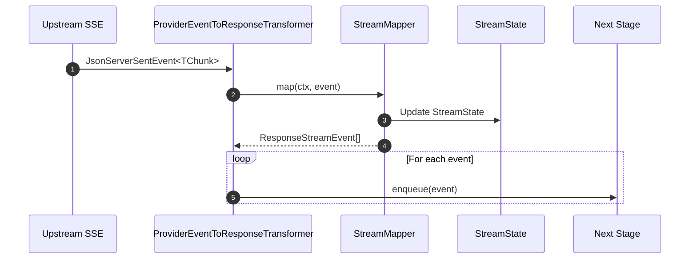
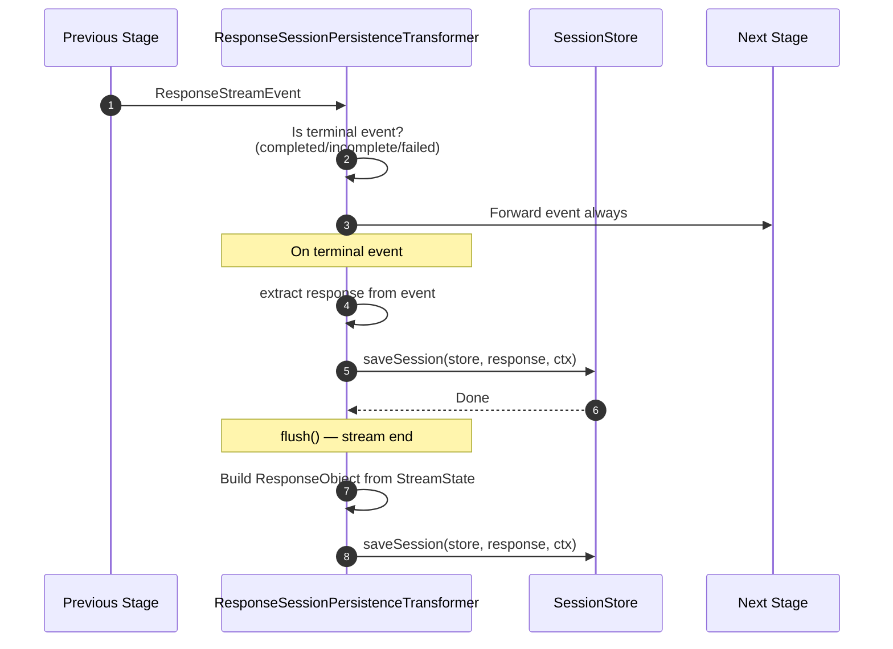
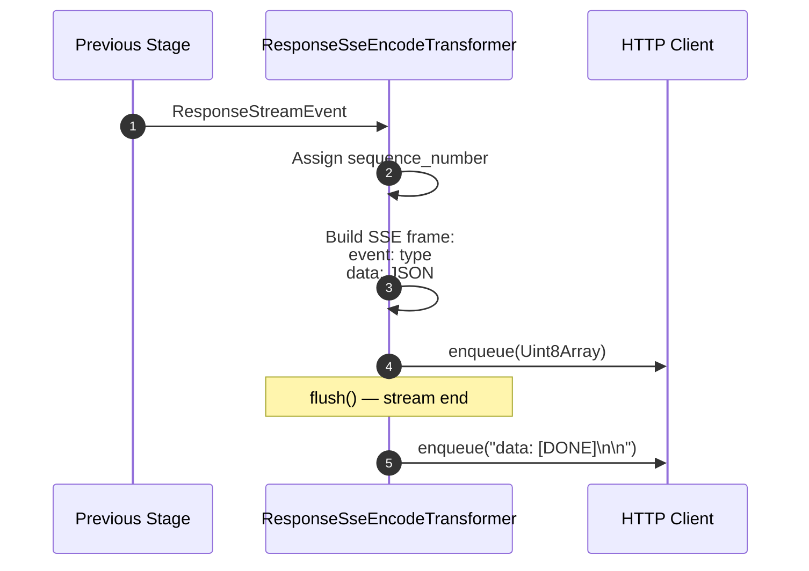
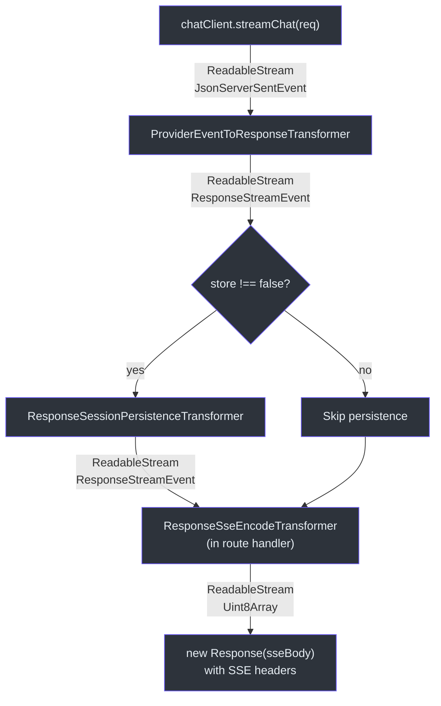

# Streaming Transformers

Godex's streaming pipeline uses `TransformStream` to process upstream SSE events through three stages before sending them to the client. Each transformer has a single responsibility and is composed via `pipeTransform()`.

## Three-Stage Pipeline

```mermaid
flowchart LR
    subgraph Stage1["Stage 1: Translate"]
        A["ProviderEventToResponseTransformer"]
    end
    subgraph Stage2["Stage 2: Persist"]
        B["ResponseSessionPersistenceTransformer"]
    end
    subgraph Stage3["Stage 3: Encode"]
        C["ResponseSseEncodeTransformer"]
    end

    Upstream["Upstream SSE<br/>JsonServerSentEvent"] --> A
    A -->|"ResponseStreamEvent"| B
    B -->|"ResponseStreamEvent"| C
    C -->|"Uint8Array (SSE)"| Client["HTTP Response"]

    style A fill:#2d333b,stroke:#6d5dfc,color:#e6edf3
    style B fill:#2d333b,stroke:#6d5dfc,color:#e6edf3
    style C fill:#2d333b,stroke:#6d5dfc,color:#e6edf3
    style Upstream fill:#2d333b,stroke:#6d5dfc,color:#e6edf3
    style Client fill:#2d333b,stroke:#6d5dfc,color:#e6edf3
```



Assembly in `DefaultAdapter.stream()` ([src/adapter/default-adapter.ts:33](https://github.com/Ahoo-Wang/Godex/blob/main/src/adapter/default-adapter.ts#L33)):

```typescript
const eventStream = pipeTransform(
  events,
  new ProviderEventToResponseTransformer(mapper.stream, ctx),
);

if (ctx.request.store === false) {
  return eventStream; // Skip persistence
}

return pipeTransform(
  eventStream,
  new ResponseSessionPersistenceTransformer({ ctx, saveSession, buildResponseObject }),
);
```

The third stage (`ResponseSseEncodeTransformer`) is applied in the route handler at [src/server/routes/responses/index.ts:66](https://github.com/Ahoo-Wang/Godex/blob/main/src/server/routes/responses/index.ts#L66).

## Stage 1: ProviderEventToResponseTransformer

Defined in [src/adapter/transformers/provider-event-to-response-transformer.ts:7](https://github.com/Ahoo-Wang/Godex/blob/main/src/adapter/transformers/provider-event-to-response-transformer.ts#L7).



| Method | Purpose |
|---|---|
| `transform(event, controller)` | Calls `mapper.map(ctx, event)` for each SSE chunk, enqueues resulting events |

This transformer delegates all mapping logic to the provider's `StreamMapper` implementation. The Zhipu stream mapper tracks state on the `ResponsesContext.attributes` map.

## Stage 2: ResponseSessionPersistenceTransformer

Defined in [src/adapter/transformers/response-session-persistence-transformer.ts:23](https://github.com/Ahoo-Wang/Godex/blob/main/src/adapter/transformers/response-session-persistence-transformer.ts#L23).



| Method | Purpose |
|---|---|
| `transform(chunk, controller)` | Forwards all events; intercepts terminal events to trigger session save |
| `flush()` | Ensures session is saved even if stream closes without a terminal event |

### Terminal Event Detection

The `responseFromTerminalEvent` function checks for three event types:

| Event Type | Contains Response? |
|---|---|
| `response.completed` | Yes — `chunk.response` |
| `response.incomplete` | Yes — `chunk.response` |
| `response.failed` | Yes — `chunk.response` |
| All others | No — forwarded without action |

### Persistence Safety

- `persistenceAttempted` flag prevents double-saves
- Save errors are caught and logged as warnings, never failing the stream
- If `store === false`, this transformer is skipped entirely

## Stage 3: ResponseSseEncodeTransformer

Defined in [src/adapter/transformers/response-sse-encode-transformer.ts:4](https://github.com/Ahoo-Wang/Godex/blob/main/src/adapter/transformers/response-sse-encode-transformer.ts#L4).



| Method | Purpose |
|---|---|
| `transform(chunk, controller)` | Serializes each event to `event: type\ndata: JSON\n\n` format |
| `flush(controller)` | Emits `data: [DONE]\n\n` terminal frame |

### SSE Wire Format

Each event is encoded as:

```
event: response.output_text.delta
data: {"type":"response.output_text.delta","delta":"Hello","sequence_number":3}

```

The sequence number is auto-incremented and can be overridden by `chunk.sequence_number`.

### Terminal `[DONE]`

After all events, the transformer emits:

```
data: [DONE]

```

The `terminalEmitted` flag prevents duplicate `[DONE]` frames.

## Pipeline Utility: pipeTransform

`pipeTransform` ([src/adapter/transformers/stream-utils.ts:17](https://github.com/Ahoo-Wang/Godex/blob/main/src/adapter/transformers/stream-utils.ts#L17)) is a thin wrapper:

```typescript
export function pipeTransform<I, O>(
  stream: ReadableStream<I>,
  transformer: Transformer<I, O>,
): ReadableStream<O> {
  return stream.pipeThrough(new TransformStream(transformer));
}
```

Helper functions:

| Function | Purpose |
|---|---|
| `enqueue(controller, chunk)` | Safely enqueue, catches "already closed" errors |
| `enqueueEncoded(controller, encoder, payload)` | Encode string to `Uint8Array` and enqueue |
| `isClosedControllerError(err)` | Check for closed controller TypeError |

## Full Pipeline Diagram



## References

- [src/adapter/transformers/provider-event-to-response-transformer.ts](https://github.com/Ahoo-Wang/Godex/blob/main/src/adapter/transformers/provider-event-to-response-transformer.ts)
- [src/adapter/transformers/response-session-persistence-transformer.ts](https://github.com/Ahoo-Wang/Godex/blob/main/src/adapter/transformers/response-session-persistence-transformer.ts)
- [src/adapter/transformers/response-sse-encode-transformer.ts](https://github.com/Ahoo-Wang/Godex/blob/main/src/adapter/transformers/response-sse-encode-transformer.ts)
- [src/adapter/transformers/stream-utils.ts](https://github.com/Ahoo-Wang/Godex/blob/main/src/adapter/transformers/stream-utils.ts)
- [src/adapter/default-adapter.ts](https://github.com/Ahoo-Wang/Godex/blob/main/src/adapter/default-adapter.ts)
- [src/server/routes/responses/index.ts](https://github.com/Ahoo-Wang/Godex/blob/main/src/server/routes/responses/index.ts)
