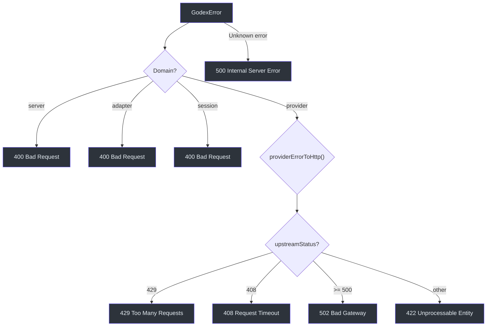

# Error Codes Reference

## Error Code Structure

Error codes follow a `domain.category.specific` naming convention:

```
server.request.invalid_json
adapter.request.unsupported_tool
provider.upstream.rate_limit
session.chain.cycle_detected
```

## Complete Error Codes by Domain

### Adapter Domain

| Code | HTTP Status | Description |
|---|---|---|
| `adapter.request.unsupported_parameter` | 400 | Request parameter not supported by the provider |
| `adapter.request.tool_skipped` | 400 | Tool type skipped during mapping |
| `adapter.request.unsupported_input_item` | 400 | Input item type not supported |
| `adapter.request.unsupported_input_content` | 400 | Input content type not supported |
| `adapter.request.unsupported_tool` | 400 | Tool type not supported by provider |

### Provider Domain

| Code | HTTP Status | Description |
|---|---|---|
| `provider.upstream.rate_limit` | 429 | Upstream rate limit exceeded |
| `provider.upstream.timeout` | 408 | Upstream request timed out |
| `provider.upstream.server_error` | 502 | Upstream returned a 5xx error |
| `provider.upstream.error` | 422/502 | Generic upstream error |

### Session Domain

| Code | HTTP Status | Description |
|---|---|---|
| `session.chain.not_found` | 400 | Response ID in chain not found in store |
| `session.chain.cycle_detected` | 400 | Same response ID visited twice in chain |
| `session.chain.depth_exceeded` | 400 | Chain length exceeds max depth (default 64) |
| `session.chain.unavailable` | 400 | Turn in chain has status other than "completed" |
| `session.store.conflict` | 400 | Session already exists or parent mismatch |

### Server Domain

| Code | HTTP Status | Description |
|---|---|---|
| `server.request.invalid_json` | 400 | Request body is not valid JSON |
| `server.request.missing_model` | 400 | Required `model` field is missing |
| `server.request.invalid_parameter` | 400 | Parameter validation failed |
| `server.provider.not_registered` | 400 | Provider has no registered factory |
| `server_error` | 500 | Unexpected internal error |

## HTTP Status Mapping



| HTTP Status | Error Domain | Typical Causes |
|---|---|---|
| `400` | server, adapter, session | Invalid request, unsupported params, chain errors |
| `408` | provider | Upstream timeout |
| `422` | provider | Upstream non-5xx error |
| `429` | provider | Upstream rate limit |
| `500` | (none) | Unexpected internal error |
| `502` | provider | Upstream 5xx error |

## Error Response JSON Format

All error responses follow the same structure:

```json
{
  "error": {
    "code": "session.chain.cycle_detected",
    "message": "Previous response chain contains a cycle."
  }
}
```

### Response Headers

| Header | Present When | Description |
|---|---|---|
| `Content-Type` | Always | `application/json` |
| `x-request-id` | When available | The Godex request ID (`req_...`) |

### Examples

**Missing model:**
```json
{
  "error": {
    "code": "server.request.missing_model",
    "message": "Missing required field: model"
  }
}
```

**Unsupported tool:**
```json
{
  "error": {
    "code": "adapter.request.unsupported_tool",
    "message": "Unsupported Responses tool for Zhipu: code_interpreter. This Responses tool type is not supported by the Zhipu adapter."
  }
}
```

**Rate limit:**
```json
{
  "error": {
    "code": "rate_limit_exceeded",
    "message": "Rate limit exceeded"
  }
}
```

**Chain not found:**
```json
{
  "error": {
    "code": "session.chain.not_found",
    "message": "Previous response was not found."
  }
}
```

**Internal error:**
```json
{
  "error": {
    "code": "server_error",
    "message": "Internal server error"
  }
}
```

## References

- [src/error/codes.ts](https://github.com/Ahoo-Wang/Godex/blob/main/src/error/codes.ts) — All error code constants
- [src/error/godex-error.ts](https://github.com/Ahoo-Wang/Godex/blob/main/src/error/godex-error.ts) — Base error class
- [src/server/errors.ts](https://github.com/Ahoo-Wang/Godex/blob/main/src/server/errors.ts) — HTTP mapping functions
- [src/server/routes/responses/index.ts](https://github.com/Ahoo-Wang/Godex/blob/main/src/server/routes/responses/index.ts) — Route error handling
