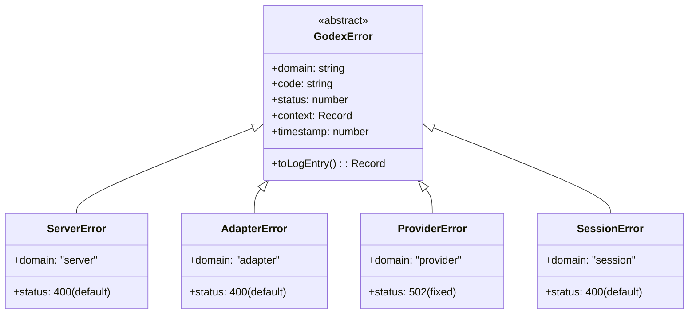
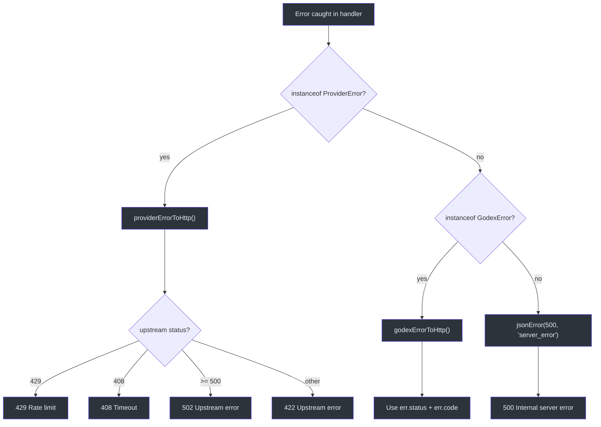
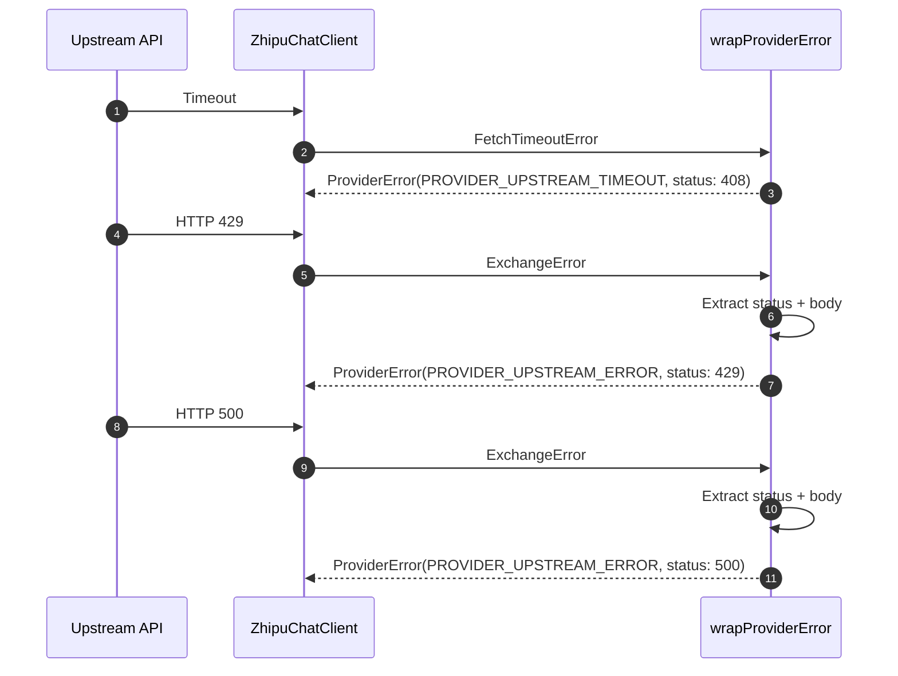

# Error Hierarchy

All domain errors in Godex extend the abstract `GodexError` base class. This hierarchy provides structured error context, consistent HTTP status mapping, and machine-readable error codes.

## Class Hierarchy



## GodexError Base Class

Defined in [src/error/godex-error.ts:2](https://github.com/Ahoo-Wang/Godex/blob/main/src/error/godex-error.ts#L2):

| Property | Type | Description |
|---|---|---|
| `domain` | `string` (abstract) | Error domain: "server", "adapter", "provider", "session" |
| `code` | `string` | Machine-readable error code (e.g., `session.chain.not_found`) |
| `status` | `number` | HTTP status code |
| `context` | `Record<string, unknown>` | Additional context (model, provider, response IDs, etc.) |
| `timestamp` | `number` | `Date.now()` when the error was created |
| `message` | `string` | Human-readable description (from `Error`) |
| `cause` | `Error \| undefined` | Optional wrapped error |

### toLogEntry()

Produces a structured log entry:

```typescript
{
  domain: "session",
  code: "session.chain.cycle_detected",
  message: "Previous response chain contains a cycle.",
  status: 400,
  timestamp: 1716000000000,
  responseId: "resp_abc",
  previousResponseId: "resp_xyz"
}
```

## Four Error Subclasses

### ServerError (domain: "server")

[Source](https://github.com/Ahoo-Wang/Godex/blob/main/src/error/server-error.ts)

| Default Status | Use Case |
|---|---|
| `400` | Request validation, missing model, invalid parameters, unknown provider |

Context fields: `path?`, `method?`

### AdapterError (domain: "adapter")

[Source](https://github.com/Ahoo-Wang/Godex/blob/main/src/error/adapter-error.ts)

| Default Status | Use Case |
|---|---|
| `400` | Unsupported parameters, unsupported tools, unsupported input items |

Context fields: `provider`, `model`, `parameter?`

### ProviderError (domain: "provider")

[Source](https://github.com/Ahoo-Wang/Godex/blob/main/src/error/provider-error.ts)

| Fixed Status | Use Case |
|---|---|
| `502` | Upstream HTTP errors (rate limits, timeouts, 5xx) |

Context fields: `provider`, `model`, `upstreamStatus`, `upstreamBody?`

### SessionError (domain: "session")

[Source](https://github.com/Ahoo-Wang/Godex/blob/main/src/error/session-error.ts)

| Default Status | Use Case |
|---|---|
| `400` | Chain not found, cycles, depth exceeded, conflicts |

Context fields: `responseId?`, `previousResponseId?`, `maxDepth?`

## Error-to-HTTP Mapping

The route handler at [src/server/routes/responses/index.ts:77](https://github.com/Ahoo-Wang/Godex/blob/main/src/server/routes/responses/index.ts#L77) maps errors to HTTP responses:



### Provider Error HTTP Mapping

`providerErrorToHttp` ([src/server/errors.ts:20](https://github.com/Ahoo-Wang/Godex/blob/main/src/server/errors.ts#L20)):

| Upstream Status | HTTP Response | Error Code |
|---|---|---|
| `429` | `429` | `rate_limit_exceeded` |
| `408` | `408` | `request_timeout` |
| `>= 500` | `502` | `upstream_error` |
| Other | `422` | `upstream_error` |

### Standard Error Response Format

All errors return JSON:

```json
{
  "error": {
    "code": "session.chain.not_found",
    "message": "Previous response was not found."
  }
}
```

With an `x-request-id` header when available.

## Provider Error Wrapping

`wrapProviderError` in the Zhipu chat client ([src/providers/zhipu/chat-client.ts:54](https://github.com/Ahoo-Wang/Godex/blob/main/src/providers/zhipu/chat-client.ts#L54)) translates Fetcher errors:



## Error Handling in Route Handler

The `/v1/responses` handler ([src/server/routes/responses/index.ts:77](https://github.com/Ahoo-Wang/Godex/blob/main/src/server/routes/responses/index.ts#L77)) follows this priority:

1. `ProviderError` → log as error, map to HTTP via `providerErrorToHttp`
2. Other `GodexError` → log as warning, map via `godexErrorToHttp`
3. Unknown errors → log as error, return 500 with `server_error` code

## References

- [src/error/godex-error.ts](https://github.com/Ahoo-Wang/Godex/blob/main/src/error/godex-error.ts) — Base class
- [src/error/codes.ts](https://github.com/Ahoo-Wang/Godex/blob/main/src/error/codes.ts) — Error code constants
- [src/error/server-error.ts](https://github.com/Ahoo-Wang/Godex/blob/main/src/error/server-error.ts) — Server errors
- [src/error/adapter-error.ts](https://github.com/Ahoo-Wang/Godex/blob/main/src/error/adapter-error.ts) — Adapter errors
- [src/error/provider-error.ts](https://github.com/Ahoo-Wang/Godex/blob/main/src/error/provider-error.ts) — Provider errors
- [src/error/session-error.ts](https://github.com/Ahoo-Wang/Godex/blob/main/src/error/session-error.ts) — Session errors
- [src/server/errors.ts](https://github.com/Ahoo-Wang/Godex/blob/main/src/server/errors.ts) — HTTP error mapping functions
- [src/server/routes/responses/index.ts](https://github.com/Ahoo-Wang/Godex/blob/main/src/server/routes/responses/index.ts) — Route error handling
