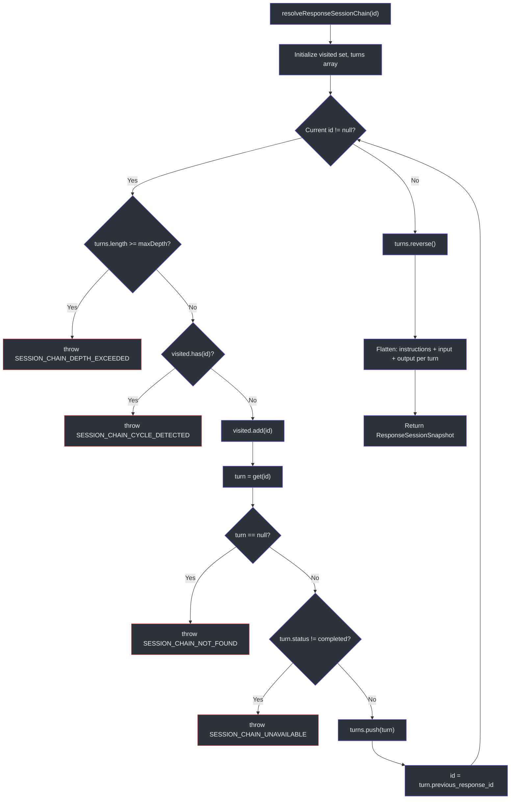
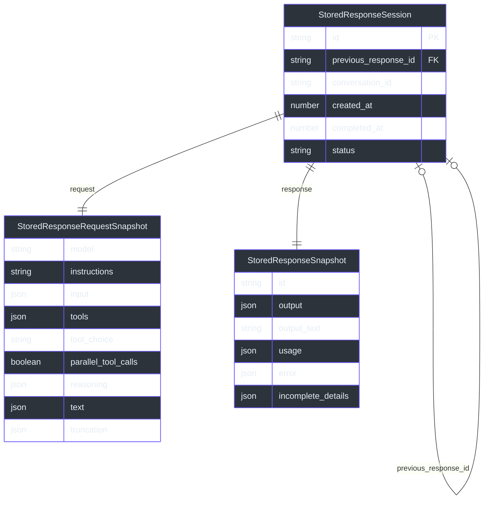

# Session Management

Session management is the subsystem that gives GodeX multi-turn conversation memory without requiring the client to replay the entire history on every request. When a client sends `previous_response_id`, GodeX walks a parent-pointer chain backwards, reassembles all prior turns into a flat item list, and feeds that context into the bridge kernel. This means tools like Codex, Cursor, and Windsurf get stateful conversations through the stateless OpenAI Responses API with zero client-side bookkeeping.

## At a Glance

| Aspect | Detail |
|--------|--------|
| Chain model | Parent-pointer via `previous_response_id` — immutable, forkable |
| Resolution | Walk chain backwards; reverse to chronological order |
| Max depth | 64 turns (configurable) |
| Cycle detection | Visited set during traversal |
| Storage backends | `memory` (Map) or `sqlite` (persistent) |
| Save policy | `store: false` skips persistence; conflict detection on overwrite |
| Store interface | `get()`, `save()`, `resolveChain()`, `delete()`, `close()` |

## Core Concept: Parent Pointer, Not Cursor

Each stored session holds a `previous_response_id` that points to its parent turn. This is a **parent pointer**, not a mutable conversation cursor. Multiple child responses can reference the same parent, enabling history forking without corrupting shared state.

Source: [src/session/types.ts:22-27](https://github.com/Ahoo-Wang/GodeX/blob/main/src/session/types.ts#L22-L27)

## Chain Resolution

The function `resolveResponseSessionChain()` is the heart of session management. Given a `previous_response_id`, it:

1. Walks the parent pointer chain backwards from the most recent response to the root.
2. Validates each link: parent must exist and be `completed` (unless `include_incomplete` is set).
3. Detects cycles via a visited set.
4. Enforces a maximum depth (default 64) to prevent stack overflow.
5. Reverses the collected turns into chronological order (oldest first).
6. Flattens each turn into input items: request instructions, request input, and response output.

Source: [src/session/chain.ts:26-98](https://github.com/Ahoo-Wang/GodeX/blob/main/src/session/chain.ts#L26-L98)



## Session Save Sequence

After a response completes, `saveResponseSession()` persists the full turn snapshot to the configured store.

Source: [src/responses/response-session-persistence.ts:5-41](https://github.com/Ahoo-Wang/GodeX/blob/main/src/responses/response-session-persistence.ts#L5-L41)

```mermaid
sequenceDiagram
    autonumber
    participant Pipeline as Responses Pipeline
    participant Save as saveResponseSession()
    participant Policy as assertCanSaveSession()
    participant Store as SessionStore

    Pipeline->>Save: response completed
    Save->>Save: check store == false
    Save->>Save: build StoredResponseSession
    Save->>Store: save(session, options)
    Store->>Policy: assertCanSaveSession({session, existing, options})
    Policy->>Policy: validate parent ID match
    Policy->>Policy: check overwrite / conflict
    alt Validation passes
        Store->>Store: persist (INSERT or UPSERT)
    else Conflict detected
        Policy-->>Pipeline: throw SESSION_CONFLICT
    end
    Save-->>Pipeline: done

    style Pipeline fill:#2d333b,stroke:#6d5dfc,color:#e6edf3
    style Save fill:#2d333b,stroke:#6d5dfc,color:#e6edf3
    style Policy fill:#2d333b,stroke:#6d5dfc,color:#e6edf3
    style Store fill:#2d333b,stroke:#6d5dfc,color:#e6edf3
```

## Session Lifecycle

A session transitions through several states from creation to persistence.

```mermaid
stateDiagram-v2
    [*] --> RequestReceived: client sends request
    RequestReceived --> ChainResolving: previous_response_id present
    RequestReceived --> NoSession: no previous_response_id
    ChainResolving --> Resolved: chain valid
    ChainResolving --> Error: chain error
    Error --> [*]
    Resolved --> Generating: bridge kernel processes
    NoSession --> Generating: bridge kernel processes
    Generating --> Completed: response finished
    Generating --> Failed: upstream error
    Failed --> [*]
    Completed --> Persisting: store != false
    Completed --> [*]: store == false
    Persisting --> Saved: write to store
    Persisting --> Conflict: save policy violation
    Conflict --> [*]
    Saved --> [*]

    state Error {
        [*] -> NotFound
        [*] -> CycleDetected
        [*] -> DepthExceeded
        [*] -> Unavailable
    }
```

## Stored Session Data Model

Each stored session contains a request snapshot and a response snapshot, linked by a parent pointer.



## Session Stores

### MemoryStore

The in-memory store uses a `Map<string, StoredResponseSession>`. It clones snapshots on read and write so callers cannot mutate persisted state through object references. Data is lost on process restart.

Source: [src/session/memory.ts:19-66](https://github.com/Ahoo-Wang/GodeX/blob/main/src/session/memory.ts#L19-L66)

### SQLiteStore

The persistent store writes to a SQLite database. It uses `INSERT ... ON CONFLICT DO UPDATE` for upsert semantics and delegates chain resolution to `resolveResponseSessionChain()`. The database file is created automatically, including parent directories.

Source: [src/session/sqlite.ts:36-149](https://github.com/Ahoo-Wang/GodeX/blob/main/src/session/sqlite.ts#L36-L149)

Both stores implement the `ResponseSessionStore` interface:

| Method | Purpose |
|--------|---------|
| `get(id)` | Retrieve one stored session by ID |
| `save(session, options?)` | Persist a session snapshot |
| `resolveChain(id, options?)` | Walk parent chain and return full history |
| `delete(id)` | Remove a session by ID |
| `close()` | Release resources |

Source: [src/session/types.ts:99-120](https://github.com/Ahoo-Wang/GodeX/blob/main/src/session/types.ts#L99-L120)

## Save Policy

The save policy enforces conflict detection before persisting:

- **Expected parent mismatch**: If `options.expected_previous_response_id` is provided and does not match the session's actual `previous_response_id`, a `SESSION_CONFLICT` error is thrown.
- **Duplicate without overwrite**: If a session with the same ID already exists and `options.overwrite` is not set, a `SESSION_CONFLICT` error is thrown.

Source: [src/session/save-policy.ts:13-40](https://github.com/Ahoo-Wang/GodeX/blob/main/src/session/save-policy.ts#L13-L40)

## Session Error Codes

| Error Code | Description |
|------------|-------------|
| `session.chain.not_found` | A parent response in the chain was not found |
| `session.chain.cycle_detected` | The parent chain contains a circular reference |
| `session.chain.depth_exceeded` | The chain exceeds the configured maximum depth |
| `session.chain.unavailable` | A parent response exists but is not yet completed |
| `session.store.conflict` | Save policy violation (duplicate or parent mismatch) |

Source: [src/error/codes.ts:39-43](https://github.com/Ahoo-Wang/GodeX/blob/main/src/error/codes.ts#L39-L43)

## Context Integration

Two functions integrate session management into the request lifecycle:

1. **`resolveResponsesSession()`** — called before bridge processing to resolve the conversation context from `previous_response_id`.
   Source: [src/context/responses-session.ts:6-20](https://github.com/Ahoo-Wang/GodeX/blob/main/src/context/responses-session.ts#L6-L20)

2. **`saveResponseSession()`** — called after a response completes to persist the turn snapshot.
   Source: [src/responses/response-session-persistence.ts:5-41](https://github.com/Ahoo-Wang/GodeX/blob/main/src/responses/response-session-persistence.ts#L5-L41)

## Configuration

Session storage is configured in `godex.yaml` under the `session` key:

```yaml
session:
  backend: sqlite          # "memory" or "sqlite"
  sqlite:
    path: ./data/sessions.db  # required when backend is "sqlite"
```

When `backend` is `sqlite` and no `path` is provided, GodeX uses a default path.

Source: [src/config/sections/session.ts:6-27](https://github.com/Ahoo-Wang/GodeX/blob/main/src/config/sections/session.ts#L6-L27)

## Related Pages

- [Configuration](../07-configuration/configuration.md) — godex.yaml schema including session settings
- [Error Handling](../09-error-handling/error-handling.md) — session error codes and the GodeXError hierarchy
- [Architecture](../02-architecture/architecture.md) — how sessions fit into the request pipeline
- [Bridge Kernel](../03-bridge-kernel/bridge-kernel.md) — how session context feeds into the bridge

## References

- [src/session/chain.ts](https://github.com/Ahoo-Wang/GodeX/blob/main/src/session/chain.ts) — chain resolution algorithm
- [src/session/memory.ts](https://github.com/Ahoo-Wang/GodeX/blob/main/src/session/memory.ts) — in-memory session store
- [src/session/sqlite.ts](https://github.com/Ahoo-Wang/GodeX/blob/main/src/session/sqlite.ts) — SQLite session store
- [src/session/save-policy.ts](https://github.com/Ahoo-Wang/GodeX/blob/main/src/session/save-policy.ts) — save conflict detection
- [src/session/types.ts](https://github.com/Ahoo-Wang/GodeX/blob/main/src/session/types.ts) — session type definitions
- [src/context/responses-session.ts](https://github.com/Ahoo-Wang/GodeX/blob/main/src/context/responses-session.ts) — session context resolution
- [src/responses/response-session-persistence.ts](https://github.com/Ahoo-Wang/GodeX/blob/main/src/responses/response-session-persistence.ts) — response persistence
