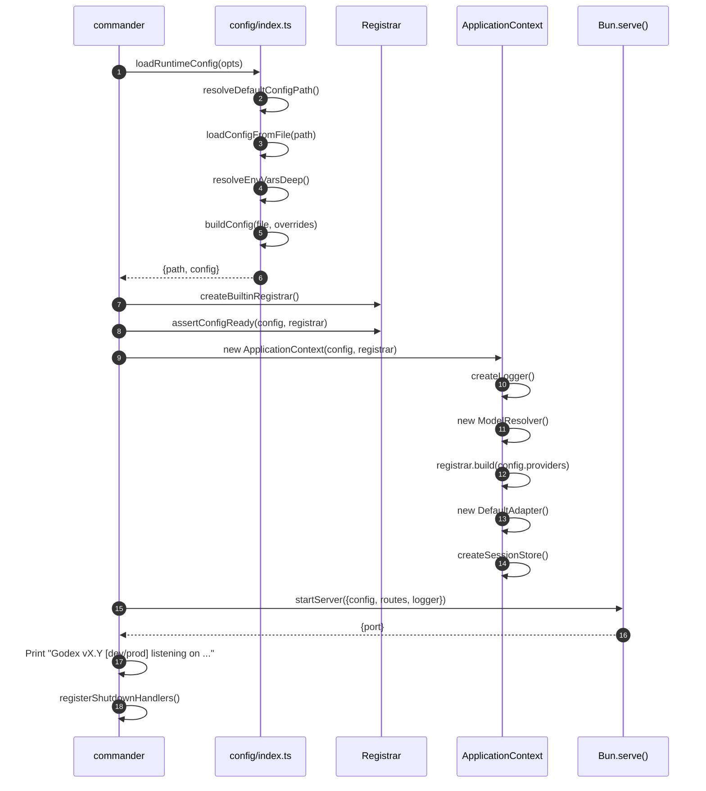
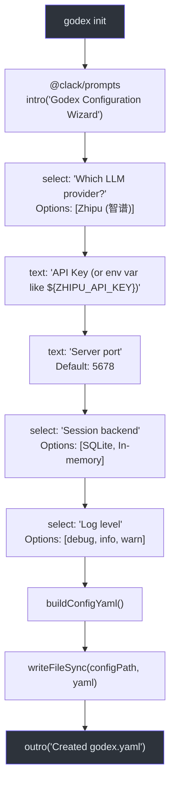

# CLI Commands

Godex uses `commander` for CLI parsing. The entry point is [src/cli/index.ts](https://github.com/Ahoo-Wang/Godex/blob/main/src/cli/index.ts).

## Command Overview

| Command | Default? | Description |
|---|---|---|
| `godex serve` | Yes (default) | Start the Responses API proxy |
| `godex init` | No | Interactively create a `godex.yaml` |
| `godex config check` | No | Validate config without starting |
| `godex config print` | No | Print config with secrets redacted |

## godex serve

```bash
godex serve [options]
godex [options]  # serve is the default command
```

| Flag | Env Var | Config File | Default |
|---|---|---|---|
| `--port <number>` | `GODEX_PORT` | `server.port` | `5678` |
| `--host <address>` | `GODEX_HOST` | `server.host` | `0.0.0.0` |
| `--config <path>` | — | — | Dev: `./godex.yaml`, Prod: `~/.godex/config.yaml` |
| `--log-level <level>` | `GODEX_LOG_LEVEL` | `logging.level` | `info` |

### Startup Sequence



## godex init

```bash
godex init [--config <path>]
```

### Wizard Flow



Each step supports cancellation via Ctrl+C, which calls `clack.cancel("Operation cancelled")`.

## godex config check

```bash
godex config check [options]
```

Same flags as `serve`. Validates the effective config and prints a summary:

```bash
$ godex config check
Config OK: godex.yaml
server: http://0.0.0.0:5678
default provider: zhipu
providers: zhipu
session: sqlite (./data/sessions.db)
```

If validation fails:

```bash
$ godex config check
Config check failed:
- No providers are configured. Fix: add providers.<name> to the config file.
- Default provider is not configured: zhipu Fix: set default_provider to one of the configured providers.
```

## godex config print

```bash
godex config print [options]
```

Prints the effective config with API keys replaced by `"<redacted>"`:

```json
{
  "server": {
    "port": 5678,
    "host": "0.0.0.0",
    "idle_timeout": 0
  },
  "default_provider": "zhipu",
  "providers": {
    "zhipu": {
      "api_key": "<redacted>",
      "base_url": "https://open.bigmodel.cn/api/paas/v4",
      "models": {
        "gpt-4o": "glm-4.7"
      }
    }
  },
  "session": {
    "backend": "sqlite",
    "sqlite": {
      "path": "./data/sessions.db"
    }
  },
  "logging": {
    "level": "info"
  }
}
```

## References

- [src/cli/index.ts](https://github.com/Ahoo-Wang/Godex/blob/main/src/cli/index.ts) — CLI command definitions
- [src/cli/serve.ts](https://github.com/Ahoo-Wang/Godex/blob/main/src/cli/serve.ts) — Serve command implementation
- [src/cli/init.ts](https://github.com/Ahoo-Wang/Godex/blob/main/src/cli/init.ts) — Init wizard
- [src/cli/config.ts](https://github.com/Ahoo-Wang/Godex/blob/main/src/cli/config.ts) — Config loading, validation, redaction
