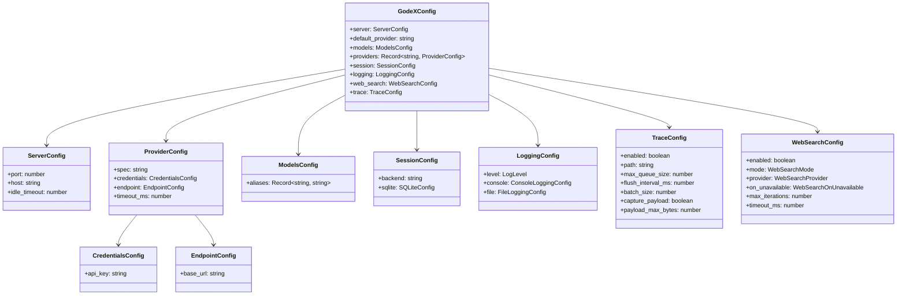

# Config Schema

GodeX is configured via a `godex.yaml` file, typically created by `godex init`. Environment variables are interpolated using `${VAR_NAME}` syntax.

## Full Schema

```yaml
server:
  port: 5678              # HTTP listen port
  host: "0.0.0.0"         # Listen address
  idle_timeout: 30000     # Idle connection timeout (ms)
                         # Default: 0 (disabled)

default_provider: deepseek   # Provider used when model has no slash prefix

models:
  aliases:
    "gpt-5.5": deepseek/deepseek-v4-pro   # Maps alias to provider/model
    "glm": zhipu/glm-5.1                   # Maps alias to provider/model
    "*": deepseek/deepseek-v4-flash        # Catch-all fallback

providers:
  deepseek:
    spec: deepseek                      # Provider spec name (required)
    credentials:
      api_key: ${DEEPSEEK_API_KEY}
    endpoint:
      base_url: https://api.deepseek.com
    timeout_ms: 30000

  zhipu:
    spec: zhipu                         # Provider spec name (required)
    credentials:
      api_key: ${ZHIPU_API_KEY}
    endpoint:
      base_url: https://open.bigmodel.cn/api/coding/paas/v4
    timeout_ms: 30000

  minimax:
    spec: minimax                        # Provider spec name (required)
    credentials:
      api_key: ${MINIMAX_API_KEY}
    endpoint:
      base_url: https://api.minimaxi.com/v1
    timeout_ms: 30000

session:
  backend: sqlite         # "sqlite" or "memory"
  sqlite:
    path: ./data/sessions.db

logging:
  level: info             # trace | debug | info | warn | error
  console:
    enabled: true
    level: info
  file:
    enabled: false
    level: debug
    dir: ./logs
    filename: godex.log
    max_size: 10485760    # 10MB
    max_files: 5

web_search:                      # Built-in web search (default: enabled, no provider)
  enabled: true                  # Master switch
  mode: auto                     # auto | provider_native | godex_managed | disabled
  provider: none                 # none | mock | zhipu (search backend for godex_managed)
  on_unavailable: client_tool_call  # client_tool_call | fail | ignore
  max_iterations: 2              # Max managed search rounds per request
  timeout_ms: 10000              # Per-search timeout

trace:
  enabled: true
  path: ./data/trace.db
  max_queue_size: 10000
  flush_interval_ms: 1000
  batch_size: 100
  capture_payload: false
  payload_max_bytes: 65536
```

## Type Definitions



## Provider Config

Each provider entry must include a `spec` field that matches a registered provider definition name. Legacy provider config without `spec` is rejected at startup.

```yaml
providers:
  myprovider:
    spec: myprovider           # Required: matches registered definition
    credentials:
      api_key: ${MY_API_KEY}
    endpoint:
      base_url: https://api.example.com/v1
    timeout_ms: 30000
```

## Web Search

GodeX can run web search in two ways: let the provider handle it natively, or run the search itself ("GodeX-managed" / "hosted") and feed results back into a continuation request. The `web_search` block ([src/config/sections/web-search.ts:10](https://github.com/Ahoo-Wang/GodeX/blob/main/src/config/sections/web-search.ts#L10)) controls this.

| Field | Default | Description |
|-------|---------|-------------|
| `enabled` | `true` | Master switch. When `false`, no web search handling occurs. |
| `mode` | `auto` | Execution strategy — see the table below. |
| `provider` | `none` | The search backend GodeX uses in `godex_managed` mode. |
| `on_unavailable` | `client_tool_call` | What to do when managed search is configured but unavailable. |
| `max_iterations` | `2` | Maximum number of managed search rounds per request. |
| `timeout_ms` | `10000` | Per-search timeout in milliseconds. |

### `mode` — execution strategy

| Mode | Behavior |
|------|----------|
| `auto` | Prefer the provider's native web search when the provider supports it; otherwise fall back to `godex_managed` if a search `provider` is configured. |
| `provider_native` | Always delegate search to the upstream provider. The provider emits its own `web_search_call` events. |
| `godex_managed` | GodeX intercepts the provider's `web_search` function call, runs the search itself via the configured `provider` backend, emits the `web_search_call` lifecycle (`in_progress` → `searching` → `completed` / `failed`), and submits a continuation request with the results. Up to `max_iterations` rounds. |
| `disabled` | Web search is turned off entirely. |

### `provider` — managed search backend

| Provider | Description |
|----------|-------------|
| `none` | No backend. `godex_managed` mode is unavailable (the `on_unavailable` policy then applies). |
| `mock` | Returns canned results; used for testing. |
| `zhipu` | [Zhipu Web Search API](https://open.bigmodel.cn/dev/api/search-tool/websearch). Requires `ZHIPU_API_KEY`. |

### `on_unavailable` — fallback policy

Applies when `mode` resolves to `godex_managed` but no search backend is configured.

| Policy | Behavior |
|--------|----------|
| `client_tool_call` | Forward the `web_search` call to the client as a normal function call (the client handles it). |
| `fail` | Fail the request with a `BridgeError`. |
| `ignore` | Silently drop the search call. |

::: tip
With the shipped defaults (`mode: auto`, `provider: none`), providers that support native web search (Zhipu, Xiaomi) use it directly, while other providers forward `web_search` calls to the client. To enable GodeX-managed search for any provider, set `provider: zhipu` and provide `ZHIPU_API_KEY`.
:::

The managed search loop is implemented by `HostedWebSearchStreamRunner` / `HostedWebSearchSyncRunner` in `src/responses/web-search/`. See [Streaming Pipeline](../02-architecture/streaming-pipeline.md) for how it integrates into the event production stage.

## Environment Interpolation

Values like `${DEEPSEEK_API_KEY}` are resolved at load time from environment variables. Missing variables produce a startup error.

## Environment Variable Overrides

BESIDES YAML interpolation, these environment variables directly override config fields at load time (CLI flags take precedence over both):

| Variable | Config Field | Notes |
|----------|-------------|-------|
| `GODEX_PORT` | `server.port` | Overrides the listen port |
| `GODEX_HOST` | `server.host` | Overrides the bind address |
| `GODEX_LOG_LEVEL` | `logging.level` | Overrides the log level |
| `GODEX_DEFAULT_PROVIDER` | `default_provider` | Falls back to `deepseek` if both are unset |

[CLI Commands](/07-configuration/cli-commands)

