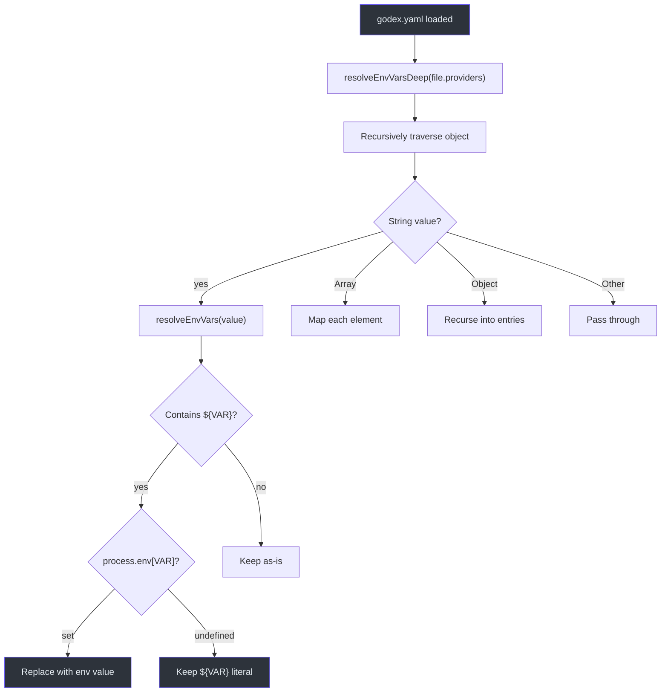
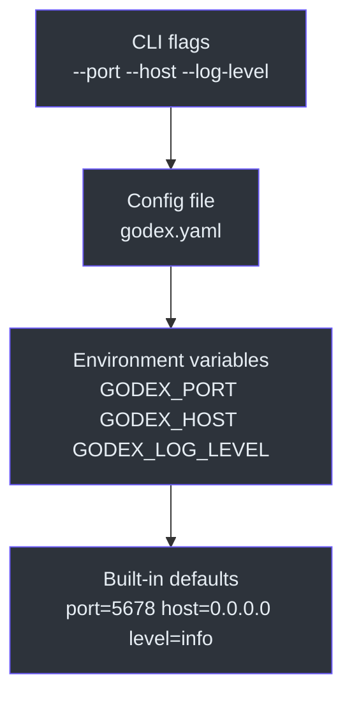

# Configuration Schema

## GodexConfig Type

The complete configuration schema is defined in [src/config/schema.ts:26](https://github.com/Ahoo-Wang/Godex/blob/main/src/config/schema.ts#L26):

```typescript
interface GodexConfig {
  server: ServerConfig;
  default_provider: string;
  providers: Record<string, ProviderConfig>;
  session: SessionConfig;
  logging: LoggingConfig;
}
```

### ServerConfig

| Field | Type | Default | Description |
|---|---|---|---|
| `port` | `number` | `5678` | HTTP server port (1–65535) |
| `host` | `string` | `"0.0.0.0"` | Bind address |
| `idle_timeout` | `number` | `0` | Idle connection timeout in seconds (0 = no timeout) |

### ProviderConfig

| Field | Type | Required | Description |
|---|---|---|---|
| `api_key` | `string` | Yes | API key or `${ENV_VAR}` reference |
| `base_url` | `string` | Yes | Upstream API base URL |
| `models` | `Record<string, string>` | No | Model name mappings (alias → native name) |

### SessionConfig

| Field | Type | Default | Description |
|---|---|---|---|
| `backend` | `"memory" \| "sqlite"` | `"memory"` | Storage backend |
| `sqlite.path` | `string` | Varies | SQLite database file path |

### LoggingConfig

| Field | Type | Default | Description |
|---|---|---|---|
| `level` | `"trace" \| "debug" \| "info" \| "warn" \| "error"` | `"info"` | Log verbosity |

## Environment Variable Interpolation

Config values support `${VAR_NAME}` syntax. The `resolveEnvVarsDeep` function ([src/config/index.ts:17](https://github.com/Ahoo-Wang/Godex/blob/main/src/config/index.ts#L17)) recursively replaces placeholders:



Example:

```yaml
providers:
  zhipu:
    api_key: ${ZHIPU_API_KEY}    # → replaced with env var
    base_url: https://open.bigmodel.cn/api/paas/v4  # → kept as-is
```

If `ZHIPU_API_KEY` is not set, the literal `${ZHIPU_API_KEY}` remains. The `collectConfigDiagnostics` function detects unresolved variables and reports them.

## Config Precedence

Values are resolved in this order (highest priority first):



This is implemented in `buildConfig` ([src/config/index.ts:114](https://github.com/Ahoo-Wang/Godex/blob/main/src/config/index.ts#L114)):

```typescript
const port =
  overrides.port !== undefined     ? validatePort(overrides.port)
  : server.port !== undefined      ? validatePort(server.port)
  : process.env.GODEX_PORT !== undefined ? validatePort(process.env.GODEX_PORT)
  : 5678;
```

## Dev Mode Detection

`isDevMode` ([src/config/index.ts:30](https://github.com/Ahoo-Wang/Godex/blob/main/src/config/index.ts#L30)) returns `true` when:

| Condition | Effect |
|---|---|
| `NODE_ENV=development` or `NODE_ENV=dev` | Dev paths used |
| `godex.yaml` exists in current working directory | Dev paths used |

### Path Resolution

| Path | Dev Mode | Production Mode |
|---|---|---|
| Config file | `./godex.yaml` | `~/.godex/config.yaml` |
| SQLite database | `./data/sessions.db` | `~/.godex/data/sessions.db` |

## Config Validation

`collectConfigDiagnostics` ([src/cli/config.ts:87](https://github.com/Ahoo-Wang/Godex/blob/main/src/cli/config.ts#L87)) checks for common issues:

| Check | Message |
|---|---|
| No providers configured | "No providers are configured." |
| Default provider missing from providers | "Default provider is not configured: {name}" |
| Invalid port | "Invalid server port: {port}" |
| Provider not supported by build | "Provider is configured but not supported: {name}" |
| Missing API key | "Provider {name} is missing api_key." |
| Unresolved env var in api_key | "providers.{name}.api_key uses unresolved environment variable {var}." |
| Unresolved env var in base_url | "providers.{name}.base_url uses unresolved environment variable {var}." |

Run via `godex config check`:

```bash
$ godex config check
Config OK: godex.yaml
server: http://0.0.0.0:5678
default provider: zhipu
providers: zhipu
session: sqlite (./data/sessions.db)
```

## Complete godex.yaml Example

```yaml
server:
  port: 5678
  host: "0.0.0.0"
  idle_timeout: 0

default_provider: zhipu

providers:
  zhipu:
    api_key: ${ZHIPU_API_KEY}
    base_url: https://open.bigmodel.cn/api/paas/v4
    models:
      gpt-5.5: glm-5.1
      gpt-5: glm-5.1
      gpt-5-mini: glm-5-turbo
      gpt-4o: glm-4.7
      gpt-4o-mini: glm-4.7-flash
      "*": glm-4.7-flash

session:
  backend: sqlite
  sqlite:
    path: ./data/sessions.db

logging:
  level: info
```

## References

- [src/config/schema.ts](https://github.com/Ahoo-Wang/Godex/blob/main/src/config/schema.ts) — Type definitions
- [src/config/index.ts](https://github.com/Ahoo-Wang/Godex/blob/main/src/config/index.ts) — Config loading, env vars, dev mode
- [src/cli/config.ts](https://github.com/Ahoo-Wang/Godex/blob/main/src/cli/config.ts) — Validation and diagnostics
