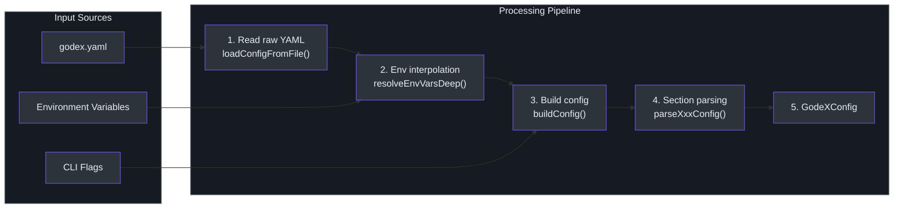
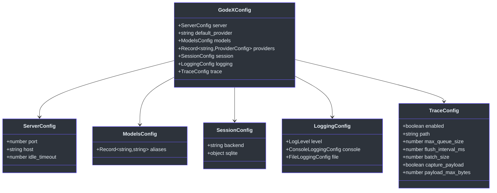
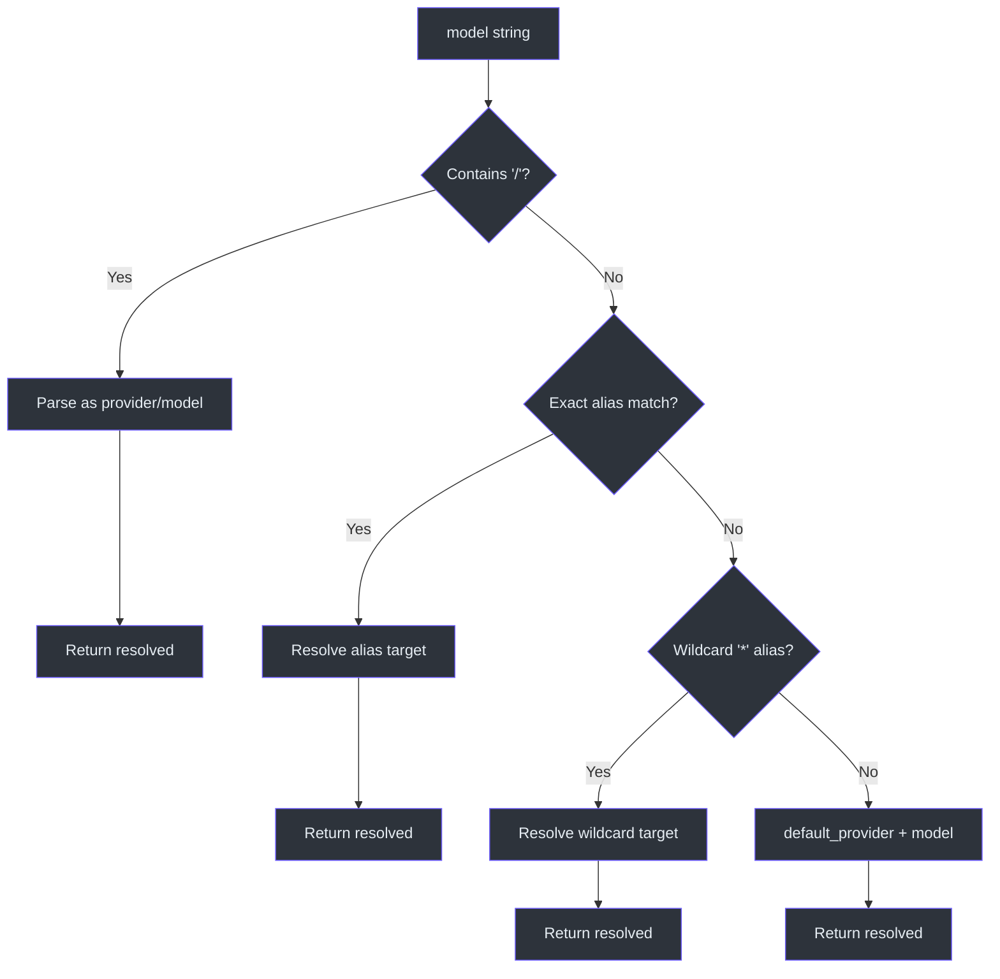

# Configuration

GodeX's configuration system transforms a single `godex.yaml` file (augmented by environment variables and CLI flags) into a fully validated `GodeXConfig` object that drives every subsystem. The pipeline is designed so that raw YAML values like `${DEEPSEEK_API_KEY}` are interpolated before validation, defaults are applied consistently, and CLI overrides always win. This ensures providers get real credentials without hard-coding secrets, and operators can fine-tune behavior without editing files.

## At a Glance

| Aspect | Detail |
|--------|--------|
| Config file | `godex.yaml` (search: `./godex.yaml` then `~/.godex/config.yaml`) |
| Schema | `GodeXConfig` interface with seven top-level sections |
| Env interpolation | `${VAR}` syntax replaced in all string values |
| CLI overrides | `--port`, `--host`, `--config`, `--log-level` |
| Default provider | `zhipu` (or env `GODEX_DEFAULT_PROVIDER`) |
| Default port | `5678` (or env `GODEX_PORT`) |

## Config Sections

| Section | Key | Description | Default |
|---------|-----|-------------|---------|
| Server | `server.port` | Listen port | `5678` |
| Server | `server.host` | Listen host | `0.0.0.0` |
| Server | `server.idle_timeout` | Idle timeout in seconds | `0` |
| Default Provider | `default_provider` | Fallback provider for bare model names | `zhipu` |
| Models | `models.aliases` | Map OpenAI model names to `provider/model` | `{}` |
| Providers | `providers.<name>.spec` | Upstream provider spec definition | — |
| Providers | `providers.<name>.credentials` | API keys and auth (supports `${VAR}`) | — |
| Providers | `providers.<name>.endpoint` | Custom upstream base URL | — |
| Providers | `providers.<name>.timeout_ms` | Request timeout | — |
| Session | `session.backend` | Storage backend: `"memory"` or `"sqlite"` | `"memory"` |
| Session | `session.sqlite.path` | SQLite database file path | auto-resolved |
| Logging | `logging.level` | Root log level | `"info"` |
| Logging | `logging.console.enabled` | Console output | — |
| Logging | `logging.file.enabled` | File output | — |
| Trace | `trace.enabled` | Enable trace recording | `true` |
| Trace | `trace.path` | SQLite trace database path | auto-resolved |
| Trace | `trace.max_queue_size` | Bounded queue size | `10000` |
| Trace | `trace.flush_interval_ms` | Flush interval | `1000` |
| Trace | `trace.batch_size` | Rows per batch flush | `100` |
| Trace | `trace.capture_payload` | Store full payload JSON | `false` |
| Trace | `trace.payload_max_bytes` | Max payload size in bytes | `65536` |

## Config Processing Pipeline

Configuration loading follows a strict multi-stage pipeline. Each stage has a single responsibility.



### Stage Details

**1. Read raw YAML** — Loads the file from disk using `js-yaml`. Returns `null` if the file does not exist.
Source: [src/config/raw.ts:6-35](https://github.com/Ahoo-Wang/GodeX/blob/main/src/config/raw.ts#L6-L35)

**2. Environment interpolation** — Recursively replaces `${VAR}` patterns with `process.env[VAR]`. Unresolved variables are left as-is.
Source: [src/config/env-interpolation.ts:3-20](https://github.com/Ahoo-Wang/GodeX/blob/main/src/config/env-interpolation.ts#L3-L20)

**3. Build config** — Orchestrates all section parsers. CLI overrides are applied at this stage (port, host, log level).
Source: [src/config/builder.ts:17-47](https://github.com/Ahoo-Wang/GodeX/blob/main/src/config/builder.ts#L17-L47)

**4. Section parsing** — Each section has a dedicated parser that applies defaults and validates values:
- [src/config/sections/server.ts](https://github.com/Ahoo-Wang/GodeX/blob/main/src/config/sections/server.ts)
- [src/config/sections/providers.ts](https://github.com/Ahoo-Wang/GodeX/blob/main/src/config/sections/providers.ts)
- [src/config/sections/models.ts](https://github.com/Ahoo-Wang/GodeX/blob/main/src/config/sections/models.ts)
- [src/config/sections/session.ts](https://github.com/Ahoo-Wang/GodeX/blob/main/src/config/sections/session.ts)
- [src/config/sections/logging.ts](https://github.com/Ahoo-Wang/GodeX/blob/main/src/config/sections/logging.ts)
- [src/config/sections/trace.ts](https://github.com/Ahoo-Wang/GodeX/blob/main/src/config/sections/trace.ts)

## GodeXConfig Schema

The `GodeXConfig` interface is the typed output of the config pipeline.



Source: [src/config/schema.ts:62-70](https://github.com/Ahoo-Wang/GodeX/blob/main/src/config/schema.ts#L62-L70)

## Config Loading Sequence

The following diagram shows the full loading flow from CLI invocation to a ready `ApplicationContext`.

```mermaid
sequenceDiagram
    autonumber
    participant CLI as CLI Parser
    participant Reader as Config Reader
    participant Raw as loadConfigFromFile()
    participant Interp as resolveEnvVarsDeep()
    participant Builder as buildConfig()
    participant Sections as Section Parsers

    CLI->>Reader: --config path, overrides
    Reader->>Raw: load YAML from path
    Raw-->>Reader: raw object or null
    Reader->>Interp: interpolate ${VAR}
    Interp-->>Reader: interpolated object
    Reader->>Builder: buildConfig(fileConfig, overrides)
    Builder->>Sections: parseServerConfig(server, overrides)
    Builder->>Sections: parseProvidersConfig(providers)
    Builder->>Sections: parseModelsConfig(models)
    Builder->>Sections: parseSessionConfig(session)
    Builder->>Sections: parseLoggingConfig(logging, logLevel)
    Builder->>Sections: parseTraceConfig(trace)
    Sections-->>Builder: section values
    Builder-->>CLI: GodeXConfig

    style CLI fill:#2d333b,stroke:#6d5dfc,color:#e6edf3
    style Reader fill:#2d333b,stroke:#6d5dfc,color:#e6edf3
    style Raw fill:#2d333b,stroke:#6d5dfc,color:#e6edf3
    style Interp fill:#2d333b,stroke:#6d5dfc,color:#e6edf3
    style Builder fill:#2d333b,stroke:#6d5dfc,color:#e6edf3
    style Sections fill:#2d333b,stroke:#6d5dfc,color:#e6edf3
```

## Model Resolution

Once the config is loaded, `ModelResolver` maps an incoming model string to a `{provider, model}` pair.

Resolution priority:

1. **Provider-qualified**: If the model contains `/` (e.g. `deepseek/deepseek-chat`), it is parsed directly as `provider/model`.
2. **Exact alias match**: If the model matches a key in `models.aliases`, it resolves to the alias target.
3. **Wildcard alias**: If `*` is defined in aliases and no exact match was found, the wildcard target is used.
4. **Default provider**: The model name is used as-is with `default_provider` as the provider.

Source: [src/resolver/model-resolver.ts:19-32](https://github.com/Ahoo-Wang/GodeX/blob/main/src/resolver/model-resolver.ts#L19-L32)



## CLI Overrides

CLI flags take precedence over config file values and environment variables:

| Flag | Overrides | Env Fallback |
|------|-----------|-------------|
| `--port <n>` | `server.port` | `GODEX_PORT` |
| `--host <addr>` | `server.host` | `GODEX_HOST` |
| `--config <path>` | Config file location | — |
| `--log-level <level>` | `logging.level` | `GODEX_LOG_LEVEL` |

Additional environment variables:

| Variable | Overrides |
|----------|-----------|
| `GODEX_DEFAULT_PROVIDER` | `default_provider` |
| `DEEPSEEK_API_KEY` | Interpolated in provider credentials |
| `ZHIPU_API_KEY` | Interpolated in provider credentials |

## Example Configuration

```yaml
server:
  port: 5678
  host: 0.0.0.0

default_provider: deepseek

models:
  aliases:
    gpt-5.5: deepseek/deepseek-chat
    claude-sonnet: deepseek/deepseek-chat
    "*": deepseek/deepseek-chat

providers:
  deepseek:
    spec:
      api_key: ${DEEPSEEK_API_KEY}
      base_url: https://api.deepseek.com
    timeout_ms: 30000
  zhipu:
    spec:
      api_key: ${ZHIPU_API_KEY}
      base_url: https://open.bigmodel.cn/api/paas/v4

session:
  backend: sqlite
  sqlite:
    path: ./data/sessions.db

logging:
  level: info
  console:
    enabled: true
  file:
    enabled: true
    dir: ./logs
    filename: godex.log

trace:
  enabled: true
  path: ./data/trace.db
  capture_payload: false
```

## Related Pages

- [Session Management](../06-session-management/session-management.md) — session storage configuration in action
- [Trace & Observability](../08-trace-observability/trace-observability.md) — trace configuration explained
- [Error Handling](../09-error-handling/error-handling.md) — config validation errors
- [Architecture](../02-architecture/architecture.md) — how config feeds ApplicationContext

## References

- [src/config/schema.ts](https://github.com/Ahoo-Wang/GodeX/blob/main/src/config/schema.ts) — GodeXConfig type definitions
- [src/config/raw.ts](https://github.com/Ahoo-Wang/GodeX/blob/main/src/config/raw.ts) — YAML file loading
- [src/config/env-interpolation.ts](https://github.com/Ahoo-Wang/GodeX/blob/main/src/config/env-interpolation.ts) — `${VAR}` interpolation
- [src/config/validation.ts](https://github.com/Ahoo-Wang/GodeX/blob/main/src/config/validation.ts) — value validators
- [src/config/builder.ts](https://github.com/Ahoo-Wang/GodeX/blob/main/src/config/builder.ts) — config assembly and defaults
- [src/config/reader.ts](https://github.com/Ahoo-Wang/GodeX/blob/main/src/config/reader.ts) — pipeline orchestrator
- [src/config/sections/](https://github.com/Ahoo-Wang/GodeX/blob/main/src/config/sections/) — per-section parsers
- [src/resolver/model-resolver.ts](https://github.com/Ahoo-Wang/GodeX/blob/main/src/resolver/model-resolver.ts) — model name resolution
- [src/resolver/model-selector.ts](https://github.com/Ahoo-Wang/GodeX/blob/main/src/resolver/model-selector.ts) — model string parsing
- [src/resolver/model-aliases.ts](https://github.com/Ahoo-Wang/GodeX/blob/main/src/resolver/model-aliases.ts) — alias catalog with wildcard support
