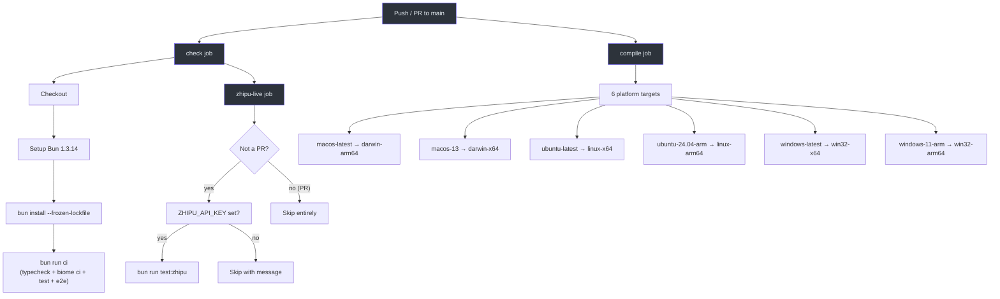
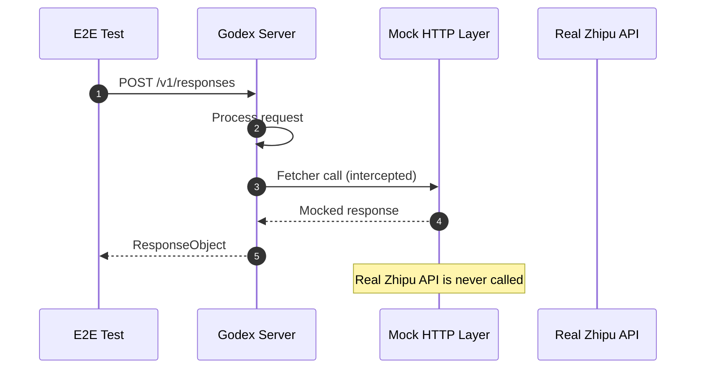

# Testing Guide

Godex uses Bun's built-in test runner (`bun test`) with three test categories: unit tests, E2E tests with mocked upstream, and live Zhipu integration tests.

## Test Categories

| Category | Command | Scope | Requires API Key? |
|---|---|---|---|
| Unit | `bun test` | `src/**` excluding `src/e2e/` | No |
| E2E (mocked) | `bun run test:e2e` | `src/e2e/` | No |
| Live Zhipu | `bun run test:zhipu` | `src/e2e/zhipu-live.test.ts` | Yes (`ZHIPU_API_KEY`) |

## Commands

| Script | Command | Description |
|---|---|---|
| `dev` | `bun --hot src/index.ts --port 13145` | Dev server with hot reload |
| `test` | `bun test --path-ignore-patterns 'src/e2e/**'` | Unit tests only |
| `test:e2e` | `bun test src/e2e` | E2E tests with mock upstream |
| `test:zhipu` | `ZHIPU_LIVE_TESTS=1 bun test src/e2e/zhipu-live.test.ts` | Live Zhipu tests |
| `test:coverage` | `bun test --coverage` | Unit tests with coverage |
| `check` | `typecheck && lint && test` | Quick validation |
| `ci` | `typecheck && biome ci && test && test:e2e` | Full CI pipeline |
| `lint` | `biome check src` | Lint check |
| `format` | `biome format --write src` | Auto-format |
| `typecheck` | `tsc --noEmit` | Type checking |

## CI Pipeline



## How E2E Tests Mock Upstream

E2E tests mock the upstream provider using the Fetcher decorator pattern. Instead of calling the real Zhipu API, tests inject a mock HTTP layer.



The E2E test files are:

| File | Description |
|---|---|
| [src/e2e/e2e.test.ts](https://github.com/Ahoo-Wang/Godex/blob/main/src/e2e/e2e.test.ts) | General E2E tests with mocked upstream |
| [src/e2e/zhipu-api.test.ts](https://github.com/Ahoo-Wang/Godex/blob/main/src/e2e/zhipu-api.test.ts) | Zhipu-specific E2E tests |
| [src/e2e/zhipu-live.test.ts](https://github.com/Ahoo-Wang/Godex/blob/main/src/e2e/zhipu-live.test.ts) | Live Zhipu API tests |
| [src/e2e/ports.ts](https://github.com/Ahoo-Wang/Godex/blob/main/src/e2e/ports.ts) | Port allocation utilities |

## Live Zhipu Tests

Live tests require two conditions:

```bash
export ZHIPU_API_KEY="your-api-key"
export ZHIPU_LIVE_TESTS=1
bun run test:zhipu
```

In CI, live Zhipu tests only run on pushes to `main` (not on PRs), and are skipped if `ZHIPU_API_KEY` is not configured as a repository secret.

## Writing New Provider Tests

When adding a new provider, follow this pattern:

### 1. Unit Tests

Create test files alongside source files:

```
src/providers/myprovider/
  request.ts
  request.test.ts
  response.ts
  response.test.ts
  stream.ts
  stream.test.ts
```

### 2. E2E Tests

Add an E2E test in `src/e2e/` that:
1. Creates an `ApplicationContext` with a mock `Registrar`
2. Starts the server on a test port
3. Sends requests via HTTP
4. Asserts response shape and content

### 3. Live Tests (Optional)

If the provider has a public API, add a live test gated behind an environment variable:

```typescript
const describeLive = process.env.MYPROVIDER_LIVE_TESTS ? describe : describe.skip;
```

## Test File Naming Convention

| Pattern | Scope |
|---|---|
| `*.test.ts` | Unit test alongside source file |
| `src/e2e/*.test.ts` | E2E test with mock or live upstream |

## References

- [package.json](https://github.com/Ahoo-Wang/Godex/blob/main/package.json) — Test scripts
- [.github/workflows/ci.yml](https://github.com/Ahoo-Wang/Godex/blob/main/.github/workflows/ci.yml) — CI workflow
- [src/e2e/e2e.test.ts](https://github.com/Ahoo-Wang/Godex/blob/main/src/e2e/e2e.test.ts) — E2E test example
