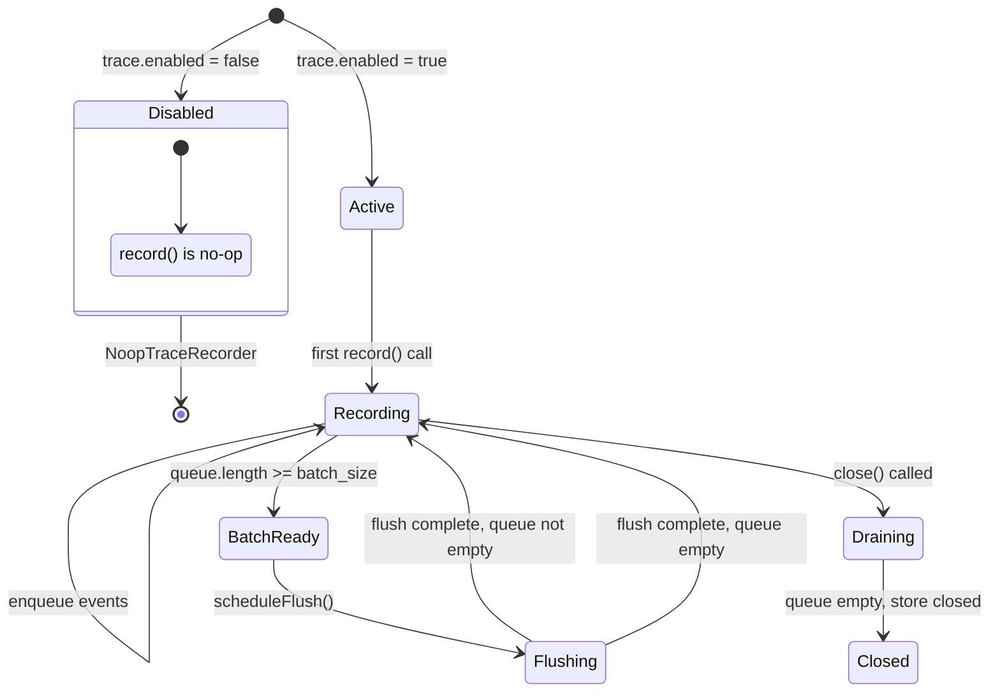
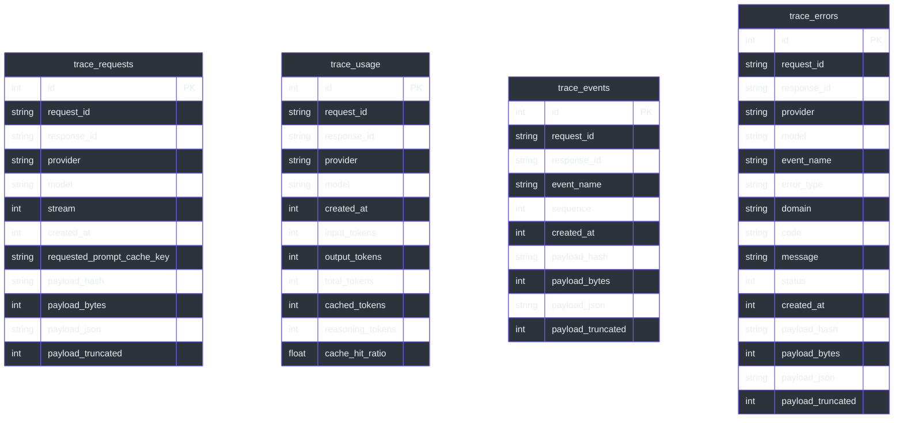

# Trace and Observability

GodeX's trace subsystem gives operators full visibility into every request without impacting response latency. Trace events are enqueued on a bounded in-memory queue and flushed to SQLite in batches by a background timer. When tracing is disabled, a `NoopTraceRecorder` discards all events with zero overhead. This design means the critical request path never blocks on I/O, while every response, usage metric, stream event, and error is durably recorded for debugging and analytics.

## At a Glance

| Aspect | Detail |
|--------|--------|
| Architecture | Async: bounded queue, batch flush, SQLite storage |
| When disabled | `NoopTraceRecorder` — zero overhead, no allocations |
| Event types | request, usage, event, error |
| Queue bound | `max_queue_size` (default 10,000) — drops on overflow |
| Flush triggers | Periodic timer (`flush_interval_ms`) or batch-size threshold |
| Batch size | `batch_size` (default 100 rows per flush) |
| Payload capture | Off by default; stores hash + byte count only |
| Storage | Separate `trace.db` from `sessions.db` |

## TraceRecorder Interface

The `TraceRecorder` interface defines the contract for all trace implementations:

```typescript
interface TraceRecorder {
  record(event: TraceRecordEvent): void;
  close?(): void | Promise<void>;
}
```

Source: [src/trace/recorder.ts:5-8](https://github.com/Ahoo-Wang/GodeX/blob/main/src/trace/recorder.ts#L5-L8)

## Implementations

### NoopTraceRecorder

When `trace.enabled` is `false`, this recorder discards all events. Methods are empty stubs with no side effects.

Source: [src/trace/recorder.ts:25-28](https://github.com/Ahoo-Wang/GodeX/blob/main/src/trace/recorder.ts#L25-L28)

### AsyncTraceRecorder

The production recorder uses a bounded array queue and periodic flush to SQLite:

- **Queue**: Events are pushed to an in-memory array. If the queue is full (`>= max_queue_size`), the event is dropped and a warning is logged.
- **Batch trigger**: When the queue reaches `batch_size`, a flush is scheduled on the next microtask. A periodic `setInterval` also triggers flushes at `flush_interval_ms` intervals.
- **Flush**: Splices up to `batch_size` events from the queue, maps them to SQLite rows, and inserts them as a single transaction.
- **Close**: Clears the interval timer, then drains all remaining events before closing the store.

Source: [src/trace/recorder.ts:30-110](https://github.com/Ahoo-Wang/GodeX/blob/main/src/trace/recorder.ts#L30-L110)

## Async Trace Pipeline

```mermaid
flowchart LR
    subgraph HotPath["Request Hot Path"]
        Req["Request Handler"]
        Rec["record(event)"]
    end

    subgraph Queue["Bounded Queue"]
        Arr["Event Array"]
    end

    subgraph Flush["Flush Cycle"]
        Timer["Periodic Timer"]
        Batch["Batch Splice"]
        Map["Row Mapper"]
        SQLite["SQLite TraceStore"]
    end

    Req --> Rec
    Rec -->|"enqueue"| Arr
    Arr -->|"batch_size reached or timer fires"| Timer
    Timer --> Batch
    Batch -->|"splice up to batch_size"| Map
    Map -->|"mapTraceRecordToRow()"| SQLite

    style HotPath fill:#161b22,stroke:#8b949e,color:#e6edf3
    style Queue fill:#161b22,stroke:#8b949e,color:#e6edf3
    style Flush fill:#161b22,stroke:#8b949e,color:#e6edf3
    style Req fill:#2d333b,stroke:#6d5dfc,color:#e6edf3
    style Rec fill:#2d333b,stroke:#6d5dfc,color:#e6edf3
    style Arr fill:#2d333b,stroke:#6d5dfc,color:#e6edf3
    style Timer fill:#2d333b,stroke:#6d5dfc,color:#e6edf3
    style Batch fill:#2d333b,stroke:#6d5dfc,color:#e6edf3
    style Map fill:#2d333b,stroke:#6d5dfc,color:#e6edf3
    style SQLite fill:#2d333b,stroke:#6d5dfc,color:#e6edf3
```



## Trace Event Recording Sequence

```mermaid
sequenceDiagram
    autonumber
    participant Pipeline as Responses Pipeline
    participant Recorder as AsyncTraceRecorder
    participant Queue as Event Queue
    participant Flush as Flush Cycle
    participant Mapper as Row Mapper
    participant Store as SQLiteTraceStore

    Pipeline->>Recorder: record(requestEvent)
    Recorder->>Queue: push(event)
    Note over Recorder,Queue: Queue not full, event enqueued

    Pipeline->>Recorder: record(usageEvent)
    Recorder->>Queue: push(event)

    Pipeline->>Recorder: record(streamEvent)
    Recorder->>Queue: push(event)
    Note over Recorder,Queue: Queue reaches batch_size

    Recorder->>Flush: scheduleFlush()
    Flush->>Queue: splice(0, batch_size)
    Queue-->>Flush: batch array
    Flush->>Mapper: mapTraceRecordToRow(events)
    Mapper-->>Flush: TraceStoreRow[]
    Flush->>Store: insertBatch(rows)
    Store-->>Flush: done

    Note over Recorder,Store: Close signal
    Pipeline->>Recorder: close()
    Recorder->>Flush: drain remaining
    Flush->>Store: insertBatch(final batch)
    Store->>Store: close()

    style Pipeline fill:#2d333b,stroke:#6d5dfc,color:#e6edf3
    style Recorder fill:#2d333b,stroke:#6d5dfc,color:#e6edf3
    style Queue fill:#2d333b,stroke:#6d5dfc,color:#e6edf3
    style Flush fill:#2d333b,stroke:#6d5dfc,color:#e6edf3
    style Mapper fill:#2d333b,stroke:#6d5dfc,color:#e6edf3
    style Store fill:#2d333b,stroke:#6d5dfc,color:#e6edf3
```

## Event Types

Each event type captures a different facet of the request lifecycle. All events share a common `TraceRecordBase` with `request_id`, `response_id`, `provider`, `model`, and `created_at`.

| Event Kind | Fields | Purpose |
|------------|--------|---------|
| `request` | `stream`, `requested_prompt_cache_key`, `payload` | Records request metadata and optionally the full request body |
| `usage` | `usage: {input_tokens, output_tokens, total_tokens, cached_tokens, reasoning_tokens, cache_hit_ratio}` | Token consumption metrics |
| `event` | `event_name`, `sequence`, `payload` | Stream events (raw and transformed SSE chunks) |
| `error` | `event_name`, `error_type`, `domain`, `code`, `message`, `status`, `payload` | Error details with domain context |

Source: [src/trace/types.ts:19-74](https://github.com/Ahoo-Wang/GodeX/blob/main/src/trace/types.ts#L19-L74)

The `event_name` field for event records distinguishes between:

- `provider.request.body` — the request body sent upstream
- `provider.response.body` — the response body received (non-streaming)
- `upstream.stream.event.raw` — raw SSE chunks from the provider
- `upstream.stream.event.transformed` — transformed SSE chunks after bridge processing

## Recorder Lifecycle



## Payload Capture

The trace subsystem can capture full request/response payloads, but this is **off by default** for performance and privacy:

| Setting | `capture_payload: false` (default) | `capture_payload: true` |
|---------|-------------------------------------|-------------------------|
| Stored | `payload_hash` + `payload_bytes` | Full JSON up to `payload_max_bytes` |
| `payload_json` | `null` | Truncated JSON string |
| `payload_truncated` | `false` | `true` if exceeds limit |
| Overhead | Minimal (hash + byte count) | Serialization cost |

Payloads are hashed with SHA-256 and their byte length is always recorded, enabling size-based analysis without storing sensitive content.

Source: [src/trace/payload.ts:10-35](https://github.com/Ahoo-Wang/GodeX/blob/main/src/trace/payload.ts#L10-L35)

## SQLite Storage Schema

Trace data is stored in four tables within a dedicated `trace.db` database, separate from session storage.



Source: [src/trace/sqlite.ts:69-297](https://github.com/Ahoo-Wang/GodeX/blob/main/src/trace/sqlite.ts#L69-L297)

### Indexes

The store creates indexes for common query patterns:

- `idx_trace_requests_request_id` and `idx_trace_requests_response_id` on `trace_requests`
- `idx_trace_usage_request_id` and `idx_trace_usage_response_id` on `trace_usage`
- `idx_trace_events_request_id_sequence` and `idx_trace_events_event_name` on `trace_events`
- `idx_trace_errors_request_id`, `idx_trace_errors_response_id`, and `idx_trace_errors_code` on `trace_errors`

## Integration Points

Trace recording is woven into the request pipeline at specific points:

| Integration | Event Kind | Where |
|------------|------------|-------|
| `ProviderExchange` | `request`, `event` | Records request metadata and provider response body |
| `SyncRequestPipeline` | `usage` | Records token usage after non-streaming completion |
| `StreamPipeline` | `event` | Records raw and transformed stream events via `TraceTransformer` |
| `wrapWithErrorHandler` | `error` | Records stream errors with context |

## Configuration

```yaml
trace:
  enabled: true
  path: ./data/trace.db
  max_queue_size: 10000
  flush_interval_ms: 1000
  batch_size: 100
  capture_payload: false
  payload_max_bytes: 65536
```

Source: [src/config/sections/trace.ts:6-49](https://github.com/Ahoo-Wang/GodeX/blob/main/src/config/sections/trace.ts#L6-L49)

## Related Pages

- [Configuration](../07-configuration/configuration.md) — trace configuration options and defaults
- [Streaming Pipeline](../05-streaming-pipeline/streaming-pipeline.md) — how trace integrates with stream processing
- [Error Handling](../09-error-handling/error-handling.md) — how errors are recorded in trace
- [Architecture](../02-architecture/architecture.md) — trace subsystem placement in the architecture

## References

- [src/trace/recorder.ts](https://github.com/Ahoo-Wang/GodeX/blob/main/src/trace/recorder.ts) — TraceRecorder interface, NoopTraceRecorder, AsyncTraceRecorder
- [src/trace/types.ts](https://github.com/Ahoo-Wang/GodeX/blob/main/src/trace/types.ts) — event type definitions
- [src/trace/sqlite.ts](https://github.com/Ahoo-Wang/GodeX/blob/main/src/trace/sqlite.ts) — SQLite storage and schema
- [src/trace/row-mapper.ts](https://github.com/Ahoo-Wang/GodeX/blob/main/src/trace/row-mapper.ts) — event-to-row mapping
- [src/trace/payload.ts](https://github.com/Ahoo-Wang/GodeX/blob/main/src/trace/payload.ts) — payload hashing and capture
- [src/config/sections/trace.ts](https://github.com/Ahoo-Wang/GodeX/blob/main/src/config/sections/trace.ts) — trace config parsing
