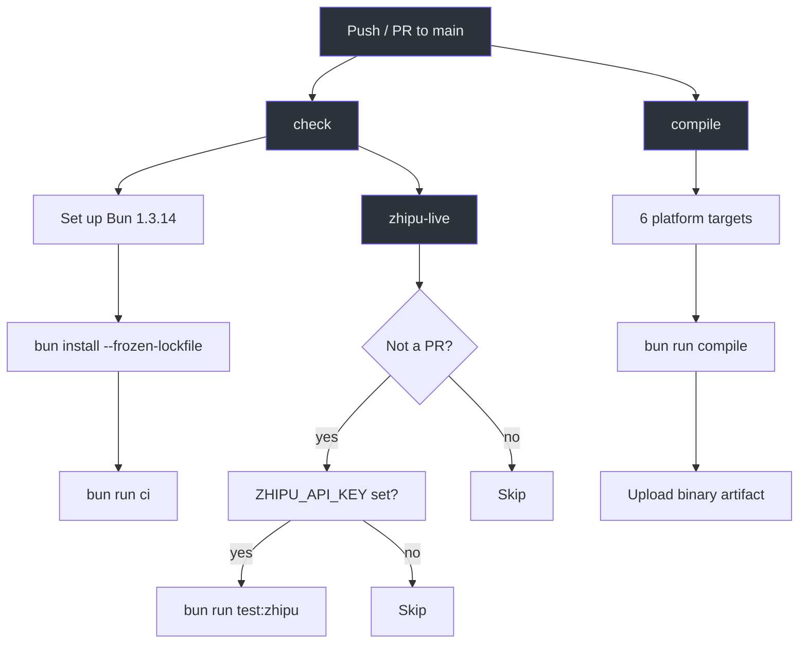
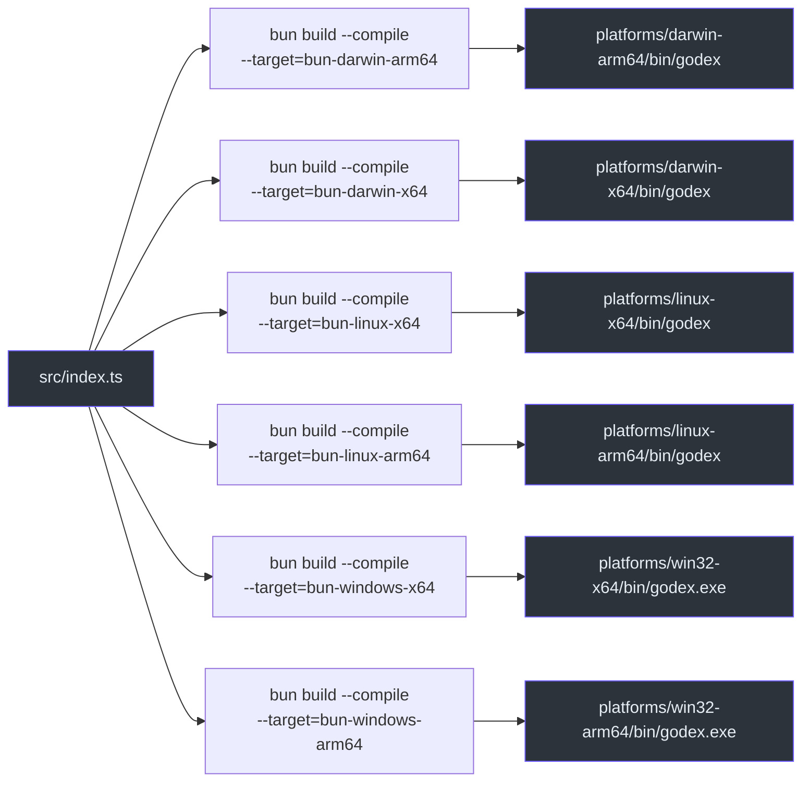
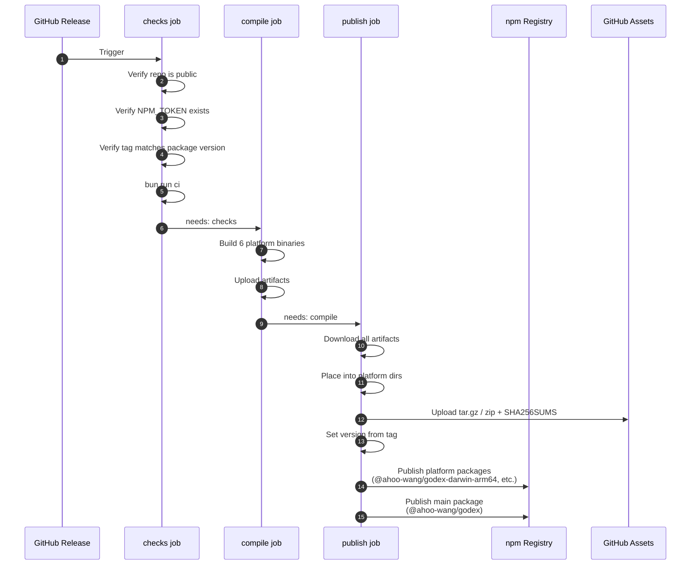
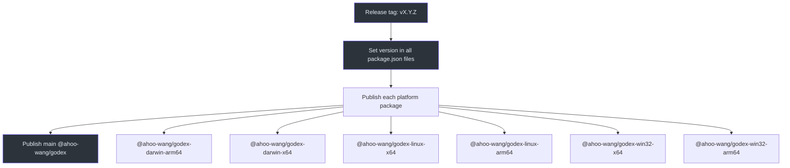

# CI/CD

Godex uses GitHub Actions for continuous integration and release automation. The build produces standalone native binaries via `bun build --compile` for 6 platform targets.

## CI Workflow

Defined in [.github/workflows/ci.yml](https://github.com/Ahoo-Wang/Godex/blob/main/.github/workflows/ci.yml).

Triggers: push to `main`, PRs to `main`, manual dispatch.

### Jobs

| Job | Runner | Purpose |
|---|---|---|
| `check` | `ubuntu-latest` | Typecheck, lint, unit tests, E2E tests |
| `compile` | Platform matrix | Build native binary for each target |
| `zhipu-live` | `ubuntu-latest` | Live Zhipu tests (main only) |



## Cross-Compilation

The compile script ([scripts/compile.ts](https://github.com/Ahoo-Wang/Godex/blob/main/scripts/compile.ts)) uses `bun build --compile` for each platform:



| Target | Runner | Output |
|---|---|---|
| `darwin-arm64` | `macos-latest` | `platforms/darwin-arm64/bin/godex` |
| `darwin-x64` | `macos-13` | `platforms/darwin-x64/bin/godex` |
| `linux-x64` | `ubuntu-latest` | `platforms/linux-x64/bin/godex` |
| `linux-arm64` | `ubuntu-24.04-arm` | `platforms/linux-arm64/bin/godex` |
| `win32-x64` | `windows-latest` | `platforms/win32-x64/bin/godex.exe` |
| `win32-arm64` | `windows-11-arm` | `platforms/win32-arm64/bin/godex.exe` |

## Release Workflow

Defined in [.github/workflows/release.yml](https://github.com/Ahoo-Wang/Godex/blob/main/.github/workflows/release.yml).

Trigger: release published on GitHub.



## npm Package Structure

The main package `@ahoo-wang/godex` acts as a wrapper. Platform-specific binaries are optional dependencies:

```json
{
  "name": "@ahoo-wang/godex",
  "optionalDependencies": {
    "@ahoo-wang/godex-darwin-arm64": "0.0.1",
    "@ahoo-wang/godex-darwin-x64": "0.0.1",
    "@ahoo-wang/godex-linux-x64": "0.0.1",
    "@ahoo-wang/godex-linux-arm64": "0.0.1",
    "@ahoo-wang/godex-win32-x64": "0.0.1",
    "@ahoo-wang/godex-win32-arm64": "0.0.1"
  }
}
```

A `postinstall` script ([scripts/install.cjs](https://github.com/Ahoo-Wang/Godex/blob/main/scripts/install.cjs)) selects the correct platform binary at install time.

### Publishing Flow



## References

- [.github/workflows/ci.yml](https://github.com/Ahoo-Wang/Godex/blob/main/.github/workflows/ci.yml) — CI workflow
- [.github/workflows/release.yml](https://github.com/Ahoo-Wang/Godex/blob/main/.github/workflows/release.yml) — Release workflow
- [scripts/compile.ts](https://github.com/Ahoo-Wang/Godex/blob/main/scripts/compile.ts) — Cross-compilation script
- [package.json](https://github.com/Ahoo-Wang/Godex/blob/main/package.json) — Package metadata and scripts
