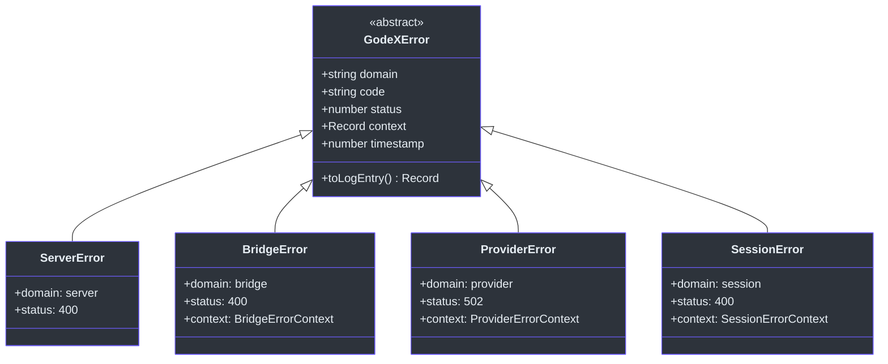
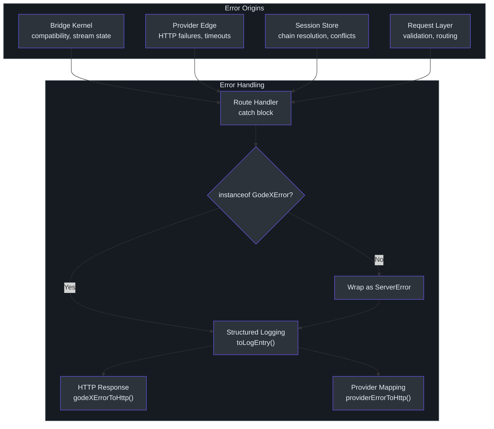
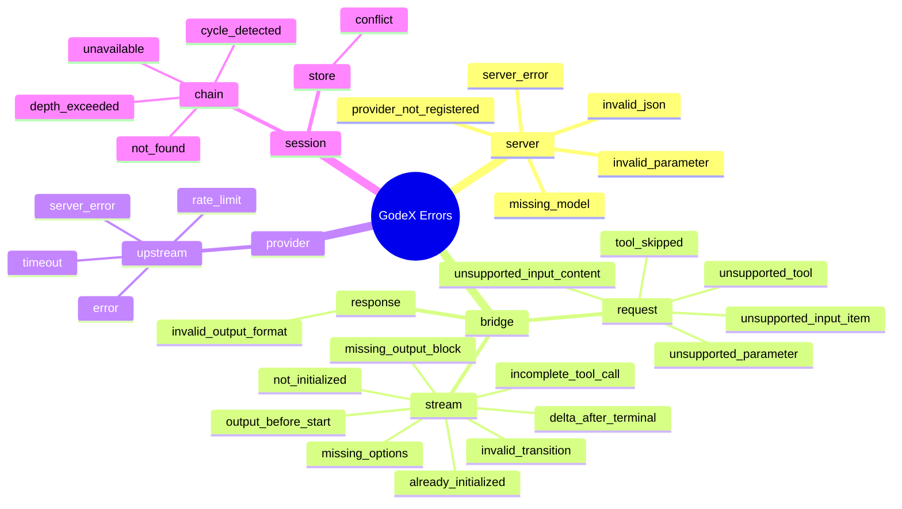

# Error Handling

GodeX uses a single structured error hierarchy rooted at `GodeXError` to classify every failure that can occur in the gateway. Each error carries a domain, a machine-readable code, an HTTP status, structured context, and a timestamp. This means every error — from a malformed request to an upstream timeout to a session chain cycle — can be logged, traced, and returned to the caller with consistent, machine-parseable structure. Non-GodeXError exceptions are wrapped at the boundary so callers never see raw, unstructured errors.

## At a Glance

| Aspect | Detail |
|--------|--------|
| Base class | `GodeXError` — abstract, carries domain, code, status, context, timestamp |
| Subclasses | `ServerError`, `BridgeError`, `ProviderError`, `SessionError` |
| Domain codes | Dot-notation: `bridge.request.unsupported_parameter`, `provider.upstream.timeout`, etc. |
| HTTP mapping | Each subclass maps to appropriate status codes (400, 408, 429, 502) |
| Streaming | `wrapWithErrorHandler` ensures SSE streams terminate with `response.failed` |
| Logging | `toLogEntry()` produces structured log records from any error |

## GodeXError Class Hierarchy

All domain errors extend `GodeXError`. Each subclass pins the `domain` field and provides context-specific constructors.



### Subclass Details

| Class | Domain | Default Status | Context |
|-------|--------|---------------|---------|
| `ServerError` | `server` | 400 | `path`, `method` |
| `BridgeError` | `bridge` | 400 | `provider`, `model`, `parameter` |
| `ProviderError` | `provider` | 502 | `provider`, `model`, `upstreamStatus`, `upstreamBody` |
| `SessionError` | `session` | 400 | `responseId`, `previousResponseId`, `maxDepth` |

Source: [src/error/godex-error.ts:2-40](https://github.com/Ahoo-Wang/GodeX/blob/main/src/error/godex-error.ts#L2-L40)

## Domain Error Codes

All error codes use dot-notation namespacing: `domain.subdomain.code`.

### Bridge Domain

| Code | Description |
|------|-------------|
| `bridge.request.unsupported_parameter` | Request contains an unsupported parameter |
| `bridge.request.tool_skipped` | A tool was skipped during compatibility planning |
| `bridge.request.unsupported_input_item` | Input item type not supported by provider |
| `bridge.request.unsupported_input_content` | Input content type not supported |
| `bridge.request.unsupported_tool` | Tool type not supported by provider |
| `bridge.response.invalid_output_format` | Response reconstruction failed |

### Bridge Stream Domain

| Code | Description |
|------|-------------|
| `bridge.stream.not_initialized` | Stream operation before initialization |
| `bridge.stream.already_initialized` | Double initialization attempt |
| `bridge.stream.invalid_transition` | Illegal state machine transition |
| `bridge.stream.output_before_start` | Output emitted before stream started |
| `bridge.stream.delta_after_terminal` | Delta received after terminal event |
| `bridge.stream.missing_options` | Required stream options not provided |
| `bridge.stream.missing_output_block` | Expected output block not present |
| `bridge.stream.incomplete_tool_call` | Tool call ended without completion |

### Provider Domain

| Code | Description |
|------|-------------|
| `provider.upstream.rate_limit` | Upstream returned 429 |
| `provider.upstream.timeout` | Upstream request timed out |
| `provider.upstream.server_error` | Upstream returned 5xx |
| `provider.upstream.error` | Generic upstream failure |

### Session Domain

| Code | Description |
|------|-------------|
| `session.chain.not_found` | Parent response not found in store |
| `session.chain.cycle_detected` | Circular reference in parent chain |
| `session.chain.depth_exceeded` | Chain exceeds max depth limit |
| `session.chain.unavailable` | Parent response is incomplete |
| `session.store.conflict` | Save policy violation (duplicate or parent mismatch) |

### Server Domain

| Code | Description |
|------|-------------|
| `server.request.invalid_json` | Request body is not valid JSON |
| `server.request.missing_model` | Required `model` field is absent |
| `server.request.invalid_parameter` | Parameter validation failed |
| `server.provider.not_registered` | Referenced provider has no registration |
| `server_error` | Generic server error |

Source: [src/error/codes.ts:1-52](https://github.com/Ahoo-Wang/GodeX/blob/main/src/error/codes.ts#L1-L52)

## Error Propagation Flow

Errors flow upward from their origin through the pipeline layers to the HTTP response.



## HTTP Status Code Mapping

Different error subclasses map to different HTTP status codes. `ProviderError` has special upstream-status-aware mapping.

| Error Class | Condition | HTTP Status | Response Code |
|------------|-----------|-------------|---------------|
| `ServerError` | Default | 400 | (domain code) |
| `BridgeError` | Default | 400 | (domain code) |
| `SessionError` | Default | 400 | (domain code) |
| `ProviderError` | Upstream 429 | 429 | `rate_limit_exceeded` |
| `ProviderError` | Upstream 408 | 408 | `request_timeout` |
| `ProviderError` | Upstream 5xx | 502 | `upstream_error` |
| `ProviderError` | Other upstream | 422 | `upstream_error` |
| Any `GodeXError` | Generic | `err.status` | `err.code` |

Source: [src/server/errors.ts:13-48](https://github.com/Ahoo-Wang/GodeX/blob/main/src/server/errors.ts#L13-L48)

## Error Handling in Streaming

Streaming errors require special treatment because the response has already started. The `wrapWithErrorHandler` function wraps the event stream to ensure graceful termination.

```mermaid
sequenceDiagram
    autonumber
    participant Client as Client
    participant Stream as Event Stream
    participant Handler as wrapWithErrorHandler()
    participant Machine as Stream State Machine
    participant Trace as TraceRecorder

    Client->>Stream: SSE connection
    Stream->>Handler: read chunks
    Handler->>Handler: enqueue events to client
    Note over Stream,Handler: Normal operation

    Stream--xHandler: upstream error
    Handler->>Trace: recordTraceError()
    Handler->>Machine: check phase
    alt Phase: IDLE or IN_PROGRESS
        Handler->>Machine: start() if IDLE
        Handler->>Machine: fail(error)
        Machine-->>Handler: response.failed events
        Handler->>Client: emit response.failed
    else Phase: already terminal
        Handler->>Handler: log debug (expected)
    end
    Handler->>Client: close SSE stream

    style Client fill:#2d333b,stroke:#6d5dfc,color:#e6edf3
    style Stream fill:#2d333b,stroke:#6d5dfc,color:#e6edf3
    style Handler fill:#2d333b,stroke:#6d5dfc,color:#e6edf3
    style Machine fill:#2d333b,stroke:#6d5dfc,color:#e6edf3
    style Trace fill:#2d333b,stroke:#6d5dfc,color:#e6edf3
```

Key behaviors of the stream error handler:

- If the stream state machine is in `IDLE` or `IN_PROGRESS`, it transitions to a failed state and emits a `response.failed` event before closing.
- If the machine is already in a terminal state (e.g., `COMPLETED` or `FAILED`), a known stream lifecycle error is caught and logged at debug level — this is expected, not a bug.
- The error is always recorded via `recordTraceError()` before handling.

Source: [src/responses/stream-error-handler.ts:34-104](https://github.com/Ahoo-Wang/GodeX/blob/main/src/responses/stream-error-handler.ts#L34-L104)

## Error Domain Taxonomy

This diagram shows how error codes are organized by domain and the typical failure scenarios each domain covers.



## Structured Logging

Every `GodeXError` can produce a structured log entry via `toLogEntry()`:

```typescript
{
  domain: "provider",
  code: "provider.upstream.timeout",
  message: "Upstream request timed out",
  status: 502,
  timestamp: 1700000000000,
  provider: "deepseek",
  model: "deepseek-chat",
  cause: "fetch timeout"
}
```

The standalone `toLogEntry(err)` function handles non-GodeXError values by wrapping them in a simple `{message}` object.

Source: [src/error/godex-error.ts:24-40](https://github.com/Ahoo-Wang/GodeX/blob/main/src/error/godex-error.ts#L24-L40)

## Related Pages

- [Session Management](../06-session-management/session-management.md) — session-specific error codes in action
- [Trace & Observability](../08-trace-observability/trace-observability.md) — how errors are recorded in the trace system
- [Streaming Pipeline](../05-streaming-pipeline/streaming-pipeline.md) — stream state machine and error boundaries
- [Bridge Kernel](../03-bridge-kernel/bridge-kernel.md) — bridge compatibility errors and stream lifecycle errors

## References

- [src/error/godex-error.ts](https://github.com/Ahoo-Wang/GodeX/blob/main/src/error/godex-error.ts) — abstract GodeXError base class
- [src/error/codes.ts](https://github.com/Ahoo-Wang/GodeX/blob/main/src/error/codes.ts) — all domain error code constants
- [src/error/server-error.ts](https://github.com/Ahoo-Wang/GodeX/blob/main/src/error/server-error.ts) — ServerError subclass
- [src/error/bridge-error.ts](https://github.com/Ahoo-Wang/GodeX/blob/main/src/error/bridge-error.ts) — BridgeError subclass
- [src/error/provider-error.ts](https://github.com/Ahoo-Wang/GodeX/blob/main/src/error/provider-error.ts) — ProviderError subclass
- [src/error/session-error.ts](https://github.com/Ahoo-Wang/GodeX/blob/main/src/error/session-error.ts) — SessionError subclass
- [src/server/errors.ts](https://github.com/Ahoo-Wang/GodeX/blob/main/src/server/errors.ts) — HTTP error mapping utilities
- [src/responses/stream-error-handler.ts](https://github.com/Ahoo-Wang/GodeX/blob/main/src/responses/stream-error-handler.ts) — streaming error handler
