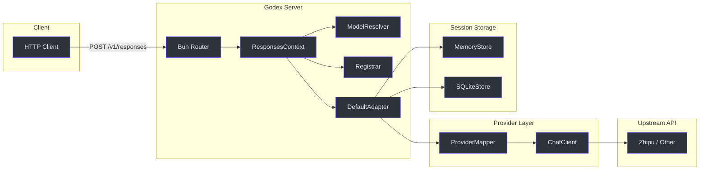
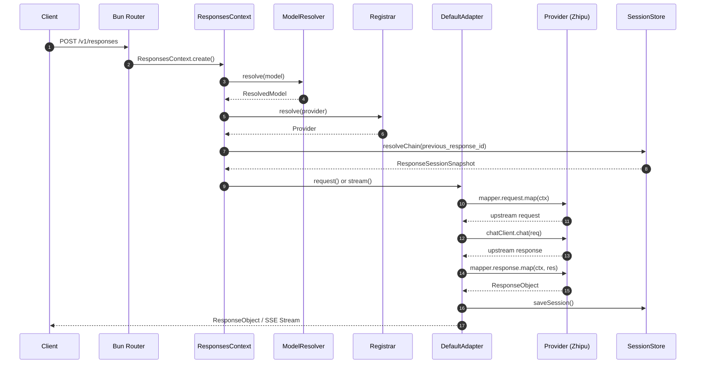

# Godex — Documentation

Godex is an OpenAI Responses API gateway that translates `/v1/responses` requests into upstream Chat Completions API calls. It exposes an OpenAI-compatible HTTP API while proxying to provider-specific backends, starting with Zhipu (智谱). Built with **Bun** and **TypeScript**, it uses the `@ahoo-wang/fetcher` ecosystem for HTTP clients and SSE streaming.

## Quick Start

```bash
# Clone and install
git clone https://github.com/Ahoo-Wang/Godex.git
cd Godex
bun install

# Create configuration (interactive wizard)
bun run start -- init

# Start dev server with hot reload on port 13145
bun run dev

# Or start production server
bun run start -- serve
```

## Architecture Overview



## Request Flow



## Documentation Map

| Section | Description |
|---|---|
| [Getting Started](./01-getting-started/overview) | Prerequisites, installation, first request |
| [Installation & Setup](./01-getting-started/installation-setup) | npm install, init wizard, godex.yaml, env vars |
| [Quick Reference](./01-getting-started/quick-reference) | CLI commands, API endpoints, model selectors, curl examples |
| [Provider Interface](./03-provider-development/provider-interface) | Core interfaces, capabilities, registration |
| [Zhipu Reference](./03-provider-development/zhipu-reference) | Reference provider implementation walkthrough |
| [Message & Tool Mapping](./03-provider-development/message-tool-mapping) | Input item conversion, tool type mapping, function names |
| [Session Store](./04-session-management/session-store) | Session storage backends, save flow |
| [Chain Resolution](./04-session-management/chain-resolution) | previous_response_id traversal, cycle detection, depth limits |
| [Streaming Transformers](./05-streaming-pipeline/transformers) | Three-stage pipeline: translate, persist, encode |
| [Stream State](./05-streaming-pipeline/stream-state) | StreamState tracking, output accumulation, tool calls |
| [Error Hierarchy](./06-error-handling/error-hierarchy) | GodexError base class, subclasses, HTTP mapping |
| [Error Codes](./06-error-handling/error-codes) | Complete error code reference by domain |
| [Config Schema](./07-configuration/config-schema) | GodexConfig type, env var interpolation, dev mode |
| [CLI Commands](./07-configuration/cli-commands) | serve, init, config check, config print |
| [Testing Guide](./08-testing/testing-guide) | Unit, E2E, live tests, CI pipeline |
| [CI/CD](./09-deployment/ci-cd) | Workflows, cross-compilation, npm publishing |

## Key Files

| File | Purpose | Source |
|---|---|---|
| `src/index.ts` | CLI entry point | [src/index.ts:1](https://github.com/Ahoo-Wang/Godex/blob/main/src/index.ts#L1) |
| `src/cli/serve.ts` | Server startup orchestration | [src/cli/serve.ts:1](https://github.com/Ahoo-Wang/Godex/blob/main/src/cli/serve.ts#L1) |
| `src/config/schema.ts` | GodexConfig type definitions | [src/config/schema.ts:1](https://github.com/Ahoo-Wang/Godex/blob/main/src/config/schema.ts#L1) |
| `src/context/application-context.ts` | Application-wide dependencies | [src/context/application-context.ts:23](https://github.com/Ahoo-Wang/Godex/blob/main/src/context/application-context.ts#L23) |
| `src/adapter/default-adapter.ts` | Request/stream orchestration | [src/adapter/default-adapter.ts:13](https://github.com/Ahoo-Wang/Godex/blob/main/src/adapter/default-adapter.ts#L13) |
| `src/providers/zhipu/provider.ts` | Zhipu provider assembly | [src/providers/zhipu/provider.ts:1](https://github.com/Ahoo-Wang/Godex/blob/main/src/providers/zhipu/provider.ts#L1) |
| `src/server/routes/responses/index.ts` | HTTP handler for `/v1/responses` | [src/server/routes/responses/index.ts:1](https://github.com/Ahoo-Wang/Godex/blob/main/src/server/routes/responses/index.ts#L1) |

## Tech Stack

| Technology | Purpose |
|---|---|
| **Bun** | Runtime, bundler, test runner, SQLite driver |
| **TypeScript** | Language |
| `@ahoo-wang/fetcher` | HTTP client with decorator pattern |
| `@ahoo-wang/fetcher-decorator` | Declarative API client generation |
| `@ahoo-wang/fetcher-eventstream` | SSE stream parsing |
| `commander` | CLI framework |
| `@clack/prompts` | Interactive init wizard |
| `biome` | Linting and formatting |

## References

- [src/index.ts](https://github.com/Ahoo-Wang/Godex/blob/main/src/index.ts)
- [src/server/index.ts](https://github.com/Ahoo-Wang/Godex/blob/main/src/server/index.ts)
- [src/context/application-context.ts](https://github.com/Ahoo-Wang/Godex/blob/main/src/context/application-context.ts)
- [src/adapter/default-adapter.ts](https://github.com/Ahoo-Wang/Godex/blob/main/src/adapter/default-adapter.ts)
- [package.json](https://github.com/Ahoo-Wang/Godex/blob/main/package.json)
