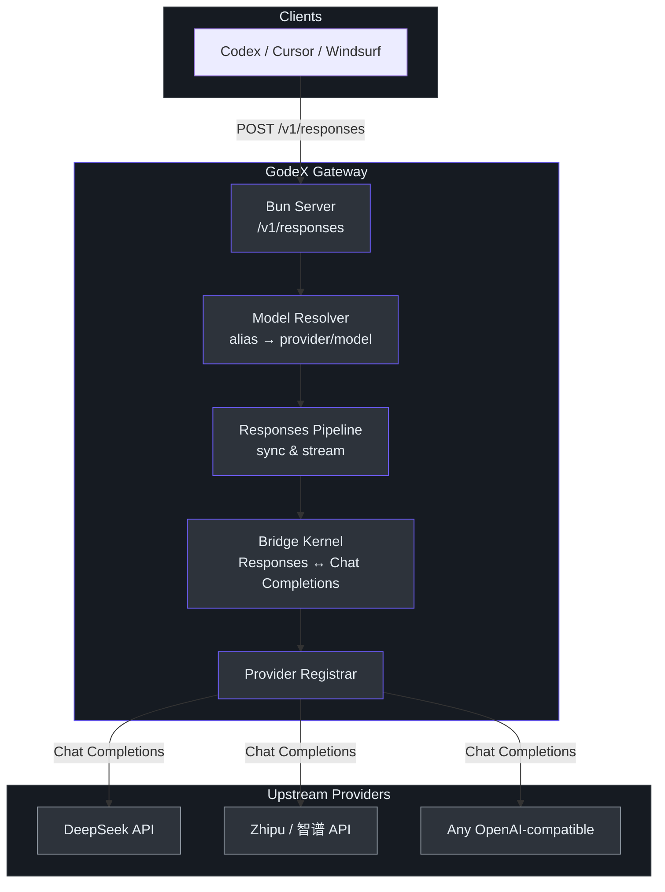

# GodeX

**Make every model a Codex engine.**

GodeX is a gateway that translates the [OpenAI Responses API](https://platform.openai.com/docs/api-reference/responses) into any provider's Chat Completions API — enabling tools like Codex, Windsurf, and Cursor to use DeepSeek, Zhipu (智谱), and any OpenAI-compatible provider without code changes.

## Quick Start

```bash
# Install globally
npm install -g @ahoo-wang/godex

# Create config interactively
godex init

# Set your API key
export DEEPSEEK_API_KEY=sk-...
export ZHIPU_API_KEY=...

# Start the gateway
godex serve --config ./godex.yaml
```

```bash
# Or run directly with Bun
bun run dev   # dev server on port 13145
```

Send your first request:

```bash
curl -X POST http://localhost:5678/v1/responses \
  -H "Content-Type: application/json" \
  -d '{
    "model": "gpt-5.5",
    "input": "Explain quantum computing in one sentence."
  }'
```

## Architecture Overview



<!-- Sources: src/server/server.ts, src/responses/runtime.ts, src/bridge/provider-spec/contract.ts -->

## Documentation Map

| Section | Description | Link |
|---------|-------------|------|
| **Overview** | What GodeX is and why it exists | [Overview](/01-getting-started/overview) |
| **Quick Start** | Install and run in 5 minutes | [Quick Start](/01-getting-started/quick-start) |
| **CLI Reference** | All commands, flags, and env vars | [CLI Reference](/01-getting-started/cli-reference) |
| **Architecture** | System layers and request flow | [Architecture](/02-architecture/architecture) |
| **Bridge Kernel** | Responses ↔ Chat translation core | [Bridge Kernel](/03-bridge-kernel/bridge-kernel) |
| **Provider Development** | Add a new LLM provider | [Provider Dev](/04-provider-development/provider-development) |
| **Streaming Pipeline** | Transform chain and state machine | [Streaming](/05-streaming-pipeline/streaming-pipeline) |
| **Session Management** | Conversation chains and stores | [Sessions](/06-session-management/session-management) |
| **Configuration** | godex.yaml schema and options | [Configuration](/07-configuration/configuration) |
| **Trace & Observability** | Async SQLite tracing | [Trace](/08-trace-observability/trace-observability) |
| **Error Handling** | Error hierarchy and codes | [Errors](/09-error-handling/error-handling) |

## Onboarding Guides

| Audience | Guide |
|----------|-------|
| New Contributors | [Contributor Guide](/onboarding/contributor/contributor-guide) |
| Staff/Principal Engineers | [Staff Engineer Guide](/onboarding/staff-engineer/staff-engineer-guide) |
| Engineering Leaders | [Executive Guide](/onboarding/executive/executive-guide) |
| Product Managers | [PM Guide](/onboarding/product-manager/product-manager-guide) |

## Key Files

| File | Responsibility | Source |
|------|---------------|--------|
| [src/index.ts](https://github.com/Ahoo-Wang/GodeX/blob/main/src/index.ts) | Entry point | `runCli(process.argv)` |
| [src/context/application-context.ts](https://github.com/Ahoo-Wang/GodeX/blob/main/src/context/application-context.ts) | App-wide services container | Config, Logger, Resolver, Registrar, Bridge, Session, Trace |
| [src/responses/runtime.ts](https://github.com/Ahoo-Wang/GodeX/blob/main/src/responses/runtime.ts) | Sync & stream pipeline orchestration | `ResponsesBridgeRuntime` |
| [src/bridge/request/request-builder.ts](https://github.com/Ahoo-Wang/GodeX/blob/main/src/bridge/request/request-builder.ts) | Responses → Chat Completions request | `buildChatCompletionRequest()` |
| [src/bridge/stream/stream-reconstructor.ts](https://github.com/Ahoo-Wang/GodeX/blob/main/src/bridge/stream/stream-reconstructor.ts) | Chat deltas → Responses events | `mapProviderDeltasToEvents()` |
| [src/providers/registrar.ts](https://github.com/Ahoo-Wang/GodeX/blob/main/src/providers/registrar.ts) | Provider name → ProviderEdge | `Registrar` |
| [src/config/schema.ts](https://github.com/Ahoo-Wang/GodeX/blob/main/src/config/schema.ts) | Configuration schema | `GodeXConfig` |
| [src/session/chain.ts](https://github.com/Ahoo-Wang/GodeX/blob/main/src/session/chain.ts) | Session chain resolution | `resolveResponseSessionChain()` |

## Tech Stack

| Technology | Purpose |
|-----------|---------|
| TypeScript (strict) | Language |
| Bun | Runtime, test runner, bundler, native compilation |
| SQLite | Session and trace storage |
| Commander.js | CLI framework |
| LogTape | Structured logging |
| Biome | Formatting and linting |
