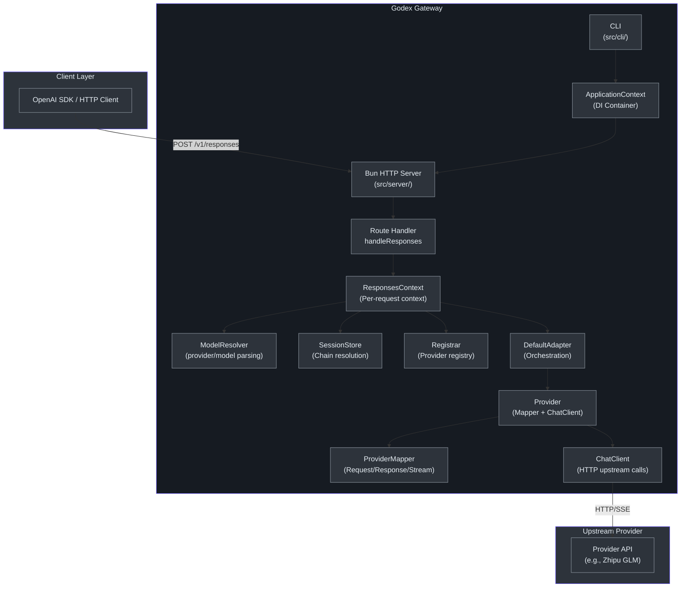
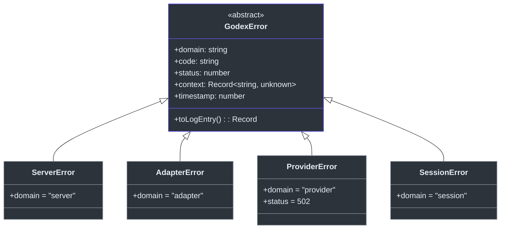

# Contributor Guide

This guide assumes you have professional TypeScript/JavaScript proficiency and are comfortable with async programming, HTTP APIs, and build tooling. If you come from Python or Go, we provide cross-language comparisons throughout.

---

## Part I: TypeScript and Bun Foundations

### Why Bun, not Node

Godex uses [Bun](https://bun.sh/) as its runtime and build tool. Bun is a drop-in Node.js replacement with faster startup, native TypeScript support, and built-in test runner. For Godex specifically, Bun provides:

- Native `Bun.serve()` HTTP server with route-based routing
- Built-in `bun:sqlite` for session persistence (zero external dependencies)
- Hot-reload via `--hot` flag during development
- `bun test` runner with built-in assertions (no Jest needed)

**Python developer comparison**: Bun is to Node.js what `uv` is to `pip` -- a faster, more integrated toolchain. You do not need `ts-node`, `tsx`, `nodemon`, or `jest`.

**Go developer comparison**: Bun gives you single-binary compilation via `bun build --compile` (see `bun run build`), similar to `go build`. The HTTP server API is closer to Go's `net/http` simplicity than Express.js.

### TypeScript Patterns Used in Godex

#### Structural typing with interfaces (not classes for data)

Godex uses TypeScript interfaces extensively for protocol shapes and adapter contracts. Classes are reserved for stateful components:

```typescript
// Interface for data contracts (no class)
interface ProviderMapper<TReq, TRes, TChunk> {
  readonly request: RequestMapper<TReq>;
  readonly response: ResponseMapper<TRes>;
  readonly stream: StreamMapper<TChunk>;
}

// Class for stateful components
class StreamState {
  phase = StreamPhase.HEADERS;
  outputText = "";
  // ...
}
```

**Python comparison**: TypeScript interfaces are like `typing.Protocol` or `typing.TypedDict`. Classes are used similarly to Python dataclasses for stateful objects.

**Go comparison**: Interfaces are satisfied implicitly (structural typing), just like Go interfaces. No `implements` keyword is strictly required, but Godex uses it for documentation clarity.

#### Readonly modifiers and immutability

Godex heavily uses `readonly` on properties and `ReadonlySet<T>` for capability collections. The `ImmutableReadonlySet` class in [`src/adapter/provider.ts`](https://github.com/Ahoo-Wang/Godex/blob/main/src/adapter/provider.ts) throws on mutation after construction.

**Python comparison**: This is similar to `frozenset` and `@property` on dataclasses, but enforced at compile time.

**Go comparison**: Go lacks equivalent readonly enforcement; this is a TypeScript advantage for API safety.

#### Async/await throughout

All I/O in Godex is async. The codebase uses `async`/`await` consistently -- there are no callbacks, no event emitters for request flow, and no `Promise.then()` chains.

#### Generics for provider type safety

The `Provider<TReq, TRes, TChunk>` interface is parameterized over the provider-specific request, response, and chunk types. When you implement a new provider, the type system catches mapping errors at compile time.

### Project Tooling Overview

| Tool | Purpose | Command |
|------|---------|---------|
| Bun | Runtime + bundler + test runner | `bun run dev`, `bun test` |
| TypeScript | Static type checking | `bun run typecheck` |
| Biome | Linting + formatting | `bun run lint`, `bun run format` |
| Commander | CLI argument parsing | Used in `src/cli/` |

---

## Part II: Godex Architecture and Domain Model

### High-Level Architecture

Godex is a **protocol translation gateway**. It accepts OpenAI Responses API (`/v1/responses`) requests and translates them into upstream provider-specific Chat Completions API calls. The core value proposition is: write your client code once against the OpenAI Responses API, and Godex routes to any configured provider.



### Entry Point and CLI

The application starts at [`src/index.ts`](https://github.com/Ahoo-Wang/Godex/blob/main/src/index.ts), which delegates to the Commander-based CLI defined in [`src/cli/index.ts`](https://github.com/Ahoo-Wang/Godex/blob/main/src/cli/index.ts).

```typescript
// src/index.ts:5
process.exitCode = await runCli(process.argv);
```

The CLI provides three commands:
- **`serve`** (default) -- starts the HTTP server ([`src/cli/serve.ts`](https://github.com/Ahoo-Wang/Godex/blob/main/src/cli/serve.ts))
- **`config check`** -- validates configuration without starting
- **`config print`** -- prints redacted config
- **`init`** -- interactively creates `godex.yaml`

The `serve` command ([`src/cli/serve.ts:12`](https://github.com/Ahoo-Wang/Godex/blob/main/src/cli/serve.ts#L12)) loads configuration, creates an `ApplicationContext`, registers signal handlers for graceful shutdown, and starts the Bun HTTP server.

### ApplicationContext: The DI Container

[`ApplicationContext`](https://github.com/Ahoo-Wang/Godex/blob/main/src/context/application-context.ts) is the application's composition root. It assembles all components from the [`GodexConfig`](https://github.com/Ahoo-Wang/Godex/blob/main/src/config/schema.ts):

| Property | Type | Purpose |
|----------|------|---------|
| `config` | `GodexConfig` | Full configuration |
| `logger` | `Logger` | Structured logger |
| `resolver` | `ModelResolver` | Parses `"provider/model"` selectors |
| `registrar` | `Registrar` | Registry of provider instances |
| `adapter` | `Adapter` | Request/stream orchestration |
| `sessionStore` | `ResponseSessionStore` | Session persistence backend |

The constructor flow:
1. Creates a scoped logger
2. Instantiates `ModelResolver` with default provider and provider configs
3. Creates a `Registrar` and calls `build()` to instantiate all providers
4. Creates a `DefaultAdapter` for request orchestration
5. Creates either `MemoryResponseSessionStore` or `SQLiteResponseSessionStore` based on config

### Configuration System

Configuration is defined in [`src/config/schema.ts`](https://github.com/Ahoo-Wang/Godex/blob/main/src/config/schema.ts) and loaded in [`src/config/index.ts`](https://github.com/Ahoo-Wang/Godex/blob/main/src/config/index.ts).

The [`GodexConfig`](https://github.com/Ahoo-Wang/Godex/blob/main/src/config/schema.ts) type defines:

- **`server`**: port, host, idle_timeout
- **`default_provider`**: which provider to use when no slash in model selector
- **`providers`**: map of provider name to `{api_key, base_url, models}`
- **`session`**: `{backend: "memory"|"sqlite", sqlite?: {path}}`
- **`logging`**: `{level: "trace"|"debug"|"info"|"warn"|"error"}`

Environment variable interpolation: any string value can use `${ENV_VAR}` syntax. The [`resolveEnvVars`](https://github.com/Ahoo-Wang/Godex/blob/main/src/config/index.ts) function recursively replaces these with `process.env` values.

Dev mode detection: when `godex.yaml` exists in cwd or `NODE_ENV=development`, Godex uses local paths (e.g., `./data/sessions.db` instead of `~/.godex/data/sessions.db`).

### HTTP Server and Routing

[`src/server/index.ts`](https://github.com/Ahoo-Wang/Godex/blob/main/src/server/index.ts) uses `Bun.serve()` with a route map. Three built-in routes:

| Route | Handler | Purpose |
|-------|---------|---------|
| `/health` | `handleHealth` | Health check |
| `/v1/models` | `handleModels` | List available models |
| `/v1/responses` | `handleResponses` | Main API endpoint |

### Request Processing Flow

When a `POST /v1/responses` arrives, [`handleResponses`](https://github.com/Ahoo-Wang/Godex/blob/main/src/server/routes/responses/index.ts) orchestrates the full flow:

```mermaid
sequenceDiagram
    autonumber
    participant Client
    participant handleResponses
    participant ResponsesContext
    participant ModelResolver
    participant SessionStore
    participant Registrar
    participant DefaultAdapter
    participant ProviderMapper
    participant ChatClient
    participant Upstream

    Client->>handleResponses: POST /v1/responses (JSON body)
    handleResponses->>handleResponses: Parse JSON body
    handleResponses->>ResponsesContext: create(app, body)
    ResponsesContext->>ModelResolver: resolve(body.model)
    ModelResolver-->>ResponsesContext: ResolvedModel {provider, model}
    ResponsesContext->>SessionStore: resolveChain(previous_response_id)
    SessionStore-->>ResponsesContext: ResponseSessionSnapshot | null
    ResponsesContext->>Registrar: resolve(provider)
    Registrar-->>ResponsesContext: Provider instance
    ResponsesContext-->>handleResponses: ResponsesContext ready

    alt Non-streaming (stream=false or absent)
        handleResponses->>DefaultAdapter: request(ctx)
        DefaultAdapter->>ProviderMapper: request.map(ctx)
        ProviderMapper-->>DefaultAdapter: upstream request
        DefaultAdapter->>ChatClient: chat(req)
        ChatClient->>Upstream: POST /chat/completions
        Upstream-->>ChatClient: ChatCompletionResponse
        ChatClient-->>DefaultAdapter: response
        DefaultAdapter->>ProviderMapper: response.map(ctx, res)
        ProviderMapper-->>DefaultAdapter: ResponseObject
        DefaultAdapter->>SessionStore: save(session)
        DefaultAdapter-->>handleResponses: ResponseObject
        handleResponses-->>Client: 200 JSON
    else Streaming (stream=true)
        handleResponses->>DefaultAdapter: stream(ctx)
        DefaultAdapter->>ProviderMapper: request.map(ctx)
        DefaultAdapter->>ChatClient: streamChat(req)
        ChatClient->>Upstream: POST /chat/completions (stream)
        Upstream-->>ChatClient: SSE ReadableStream
        DefaultAdapter->>DefaultAdapter: pipeTransform pipeline
        Note over DefaultAdapter: ProviderEventToResponseTransformer<br>> ResponseSessionPersistenceTransformer<br>> ResponseSseEncodeTransformer
        DefaultAdapter-->>handleResponses: SSE ReadableStream
        handleResponses-->>Client: 200 SSE stream
    end

    style Client fill:#2d333b,stroke:#6d5dfc,color:#e6edf3
    style handleResponses fill:#2d333b,stroke:#8b949e,color:#e6edf3
    style ResponsesContext fill:#2d333b,stroke:#8b949e,color:#e6edf3
    style ModelResolver fill:#2d333b,stroke:#8b949e,color:#e6edf3
    style SessionStore fill:#2d333b,stroke:#8b949e,color:#e6edf3
    style Registrar fill:#2d333b,stroke:#8b949e,color:#e6edf3
    style DefaultAdapter fill:#2d333b,stroke:#8b949e,color:#e6edf3
    style ProviderMapper fill:#2d333b,stroke:#8b949e,color:#e6edf3
    style ChatClient fill:#2d333b,stroke:#8b949e,color:#e6edf3
    style Upstream fill:#2d333b,stroke:#6d5dfc,color:#e6edf3
```

### ResponsesContext: Per-Request Context

[`ResponsesContext`](https://github.com/Ahoo-Wang/Godex/blob/main/src/context/responses-context.ts) is created per request via the static `create()` factory. It carries:

- **`responseId`** and **`requestId`**: Generated using `nanoid` for tracing
- **`request`**: The parsed `ResponseCreateRequest` body
- **`session`**: Resolved session chain (null if no `previous_response_id`)
- **`resolved`**: The `ResolvedModel` from `ModelResolver`
- **`provider`**: The resolved `Provider` instance
- **`attributes`**: A `Map` used for sharing state across stream transformers (e.g., `StreamState`)

The `create()` factory method handles all validation:
1. Resolves the model selector via `ModelResolver`
2. Looks up provider config
3. Resolves session chain if `previous_response_id` is present
4. Resolves provider from `Registrar`
5. Returns a fully-constructed `ResponsesContext`

Any failure during context creation throws a typed error (`ServerError`, `SessionError`) that the route handler catches and maps to HTTP responses.

### Model Resolution

[`ModelResolver`](https://github.com/Ahoo-Wang/Godex/blob/main/src/resolver/index.ts) parses model selectors:

- `"zhipu/glm-4-plus"` resolves to `{provider: "zhipu", model: "glm-4-plus"}`
- `"glm-4-plus"` resolves to `{provider: <default_provider>, model: "glm-4-plus"}`
- Provider configs can include a `models` map for aliases: `"gpt-4": "glm-4-plus"` or wildcard `"*": "glm-4-flash"`

The wildcard mapping means any unrecognized model name maps to the configured fallback model for that provider.

### Provider Registry

The [`Registrar`](https://github.com/Ahoo-Wang/Godex/blob/main/src/providers/registrar.ts) maintains a two-phase lifecycle:

1. **Register phase**: Provider factories are registered by name (`registerFactory`)
2. **Build phase**: All configured providers are instantiated from their configs (`build`)

[`createBuiltinRegistrar`](https://github.com/Ahoo-Wang/Godex/blob/main/src/providers/builtin.ts) registers the Zhipu factory. To add a new provider, you register a new factory and implement the `Provider` interface.

### Provider: The Core Abstraction

The [`Provider`](https://github.com/Ahoo-Wang/Godex/blob/main/src/adapter/provider.ts) interface bundles three concerns:

| Property | Type | Responsibility |
|----------|------|---------------|
| `mapper` | `ProviderMapper<TReq, TRes, TChunk>` | Protocol translation |
| `chatClient` | `ChatClient<TReq, TRes, TChunk>` | HTTP communication |
| `capabilities` | `ProviderCapabilities` | Feature declaration |

The generic parameters ensure type safety across the entire adapter chain:
- `TReq`: Provider-specific request type (e.g., `ChatCompletionTextRequest`)
- `TRes`: Provider-specific response type (e.g., `ChatCompletionResponse`)
- `TChunk`: Provider-specific SSE chunk type (e.g., `ChatCompletionChunk`)

### ProviderMapper: Protocol Translation

[`ProviderMapper`](https://github.com/Ahoo-Wang/Godex/blob/main/src/adapter/provider.ts) contains three mapping functions defined in [`src/adapter/mapper/contract.ts`](https://github.com/Ahoo-Wang/Godex/blob/main/src/adapter/mapper/contract.ts):

- **`RequestMapper.map(ctx)`**: Converts `ResponsesContext` into an upstream request
- **`ResponseMapper.map(ctx, result)`**: Converts upstream response into `ResponseObject`
- **`StreamMapper.map(ctx, event)`**: Converts each upstream SSE chunk into `ResponseStreamEvent[]`
- **`StreamMapper.buildResponseObject(ctx, state)`**: Builds final `ResponseObject` from accumulated `StreamState`

### Adapter: Request Orchestration

The [`Adapter`](https://github.com/Ahoo-Wang/Godex/blob/main/src/adapter/adapter.ts) interface has two methods:

- **`request(ctx)`**: Non-streaming path -- map request, call upstream, map response, save session
- **`stream(ctx)`**: Streaming path -- map request, open SSE stream, assemble pipeline

[`DefaultAdapter`](https://github.com/Ahoo-Wang/Godex/blob/main/src/adapter/default-adapter.ts) implements both paths. The non-streaming path is straightforward. The streaming path assembles a `TransformStream` pipeline.

### Stream Pipeline Architecture

The stream pipeline is Godex's most complex subsystem. It uses the Web Streams `TransformStream` API via the [`pipeTransform`](https://github.com/Ahoo-Wang/Godex/blob/main/src/adapter/transformers/stream-utils.ts) helper:

```mermaid
graph LR
    subgraph Pipeline["Stream Pipeline"]
        direction LR
        UPSTREAM["Upstream SSE<br>(ChatClient)"]
        T1["ProviderEventToResponseTransformer<br>(Protocol translation)"]
        T2["ResponseSessionPersistenceTransformer<br>(Session save)"]
        T3["ResponseSseEncodeTransformer<br>(SSE encoding)"]
        CLIENT["Client Response<br>(ReadableStream)"]
    end

    UPSTREAM -->|"JsonServerSentEvent<TChunk>"| T1
    T1 -->|"ResponseStreamEvent[]"| T2
    T2 -->|"ResponseStreamEvent"| T3
    T3 -->|"Uint8Array (SSE bytes)"| CLIENT

    style Pipeline fill:#161b22,stroke:#6d5dfc,color:#e6edf3
    style UPSTREAM fill:#2d333b,stroke:#8b949e,color:#e6edf3
    style T1 fill:#2d333b,stroke:#8b949e,color:#e6edf3
    style T2 fill:#2d333b,stroke:#8b949e,color:#e6edf3
    style T3 fill:#2d333b,stroke:#8b949e,color:#e6edf3
    style CLIENT fill:#2d333b,stroke:#8b949e,color:#e6edf3
```



Each transformer:

1. **`ProviderEventToResponseTransformer`** ([source](https://github.com/Ahoo-Wang/Godex/blob/main/src/adapter/transformers/provider-event-to-response-transformer.ts)): Calls `StreamMapper.map()` on each upstream SSE event, enqueues resulting `ResponseStreamEvent`s.

2. **`ResponseSessionPersistenceTransformer`** ([source](https://github.com/Ahoo-Wang/Godex/blob/main/src/adapter/transformers/response-session-persistence-transformer.ts)): Intercepts terminal events (`response.completed`, `response.incomplete`, `response.failed`), saves the session, then passes events through. Falls back to building `ResponseObject` from `StreamState` in `flush()`.

3. **`ResponseSseEncodeTransformer`** ([source](https://github.com/Ahoo-Wang/Godex/blob/main/src/adapter/transformers/response-sse-encode-transformer.ts)): Serializes each `ResponseStreamEvent` to `event: type\ndata: JSON\n\n` format and appends `data: [DONE]\n\n` at stream end.

### StreamState: Accumulating Stream Data

[`StreamState`](https://github.com/Ahoo-Wang/Godex/blob/main/src/adapter/mapper/stream-state.ts) is stored in `ResponsesContext.attributes` and tracks:

- **`phase`**: `HEADERS` -> `CONTENT` -> `DONE`
- **`outputText`**: Accumulated text content
- **`reasoningContent`**: Accumulated reasoning/thinking content
- **`toolCalls`**: Array of `ToolCallAccumulator` (index, id, name, arguments)
- **`completedAt`**: Timestamp when generation finishes
- **`finalStatus`**: Status fields from finish reason

The `StreamState.from(ctx)` factory method uses the `KEY` constant to ensure a single instance per request context.

### Session Storage and Chain Resolution

Sessions persist the request/response history needed for multi-turn conversations via `previous_response_id`.

The [`ResponseSessionStore`](https://github.com/Ahoo-Wang/Godex/blob/main/src/session/index.ts) interface defines:

| Method | Purpose |
|--------|---------|
| `get(id)` | Retrieve one session by ID |
| `save(session, options?)` | Persist a session snapshot |
| `resolveChain(id, options?)` | Walk parent pointers to build full history |
| `delete(id)` | Remove a session |
| `close()` | Release resources |

Two implementations:

- **`MemoryResponseSessionStore`** ([source](https://github.com/Ahoo-Wang/Godex/blob/main/src/session/memory.ts)): Uses a `Map` with `structuredClone` for isolation. Suitable for single-process deployments and tests.

- **`SQLiteResponseSessionStore`** ([source](https://github.com/Ahoo-Wang/Godex/blob/main/src/session/sqlite.ts)): Uses Bun's built-in `bun:sqlite`. Stores request/response as JSON columns. Creates indexes on `previous_response_id` and `conversation_id`.

Chain resolution in [`src/session/chain.ts`](https://github.com/Ahoo-Wang/Godex/blob/main/src/session/chain.ts) walks parent pointers with:
- **Cycle detection**: Tracks visited IDs, throws `SESSION_CHAIN_CYCLE_DETECTED`
- **Depth limiting**: Default 64 hops, throws `SESSION_CHAIN_DEPTH_EXCEEDED`
- **Status filtering**: Skips non-completed sessions (unless `include_incomplete`)

The resolved `ResponseSessionSnapshot` contains `input_items` -- a flattened list of all request inputs and response outputs across turns, used by `buildZhipuMessages` to reconstruct the chat history.

### Error Hierarchy

All errors extend [`GodexError`](https://github.com/Ahoo-Wang/Godex/blob/main/src/error/godex-error.ts):



Error codes are constants in [`src/error/codes.ts`](https://github.com/Ahoo-Wang/Godex/blob/main/src/error/codes.ts), organized by domain:

| Domain | Example Codes | HTTP Status |
|--------|--------------|-------------|
| server | `server.request.missing_model`, `server.provider.not_registered` | 400 |
| adapter | `adapter.request.unsupported_parameter`, `adapter.request.unsupported_tool` | 400 |
| provider | `provider.upstream.rate_limit`, `provider.upstream.timeout` | 502 |
| session | `session.chain.not_found`, `session.chain.cycle_detected` | 400 |

### Provider Implementation Reference: Zhipu

The Zhipu provider in [`src/providers/zhipu/`](https://github.com/Ahoo-Wang/Godex/blob/main/src/providers/zhipu/) is the reference implementation. Its structure serves as the template for adding new providers:

| File | Class/Function | Role |
|------|---------------|------|
| [`provider.ts`](https://github.com/Ahoo-Wang/Godex/blob/main/src/providers/zhipu/provider.ts) | `ZhipuProvider` | Assembles mapper + client + capabilities |
| [`request.ts`](https://github.com/Ahoo-Wang/Godex/blob/main/src/providers/zhipu/request.ts) | `buildZhipuRequest` | Maps ResponsesContext to Zhipu request |
| [`response.ts`](https://github.com/Ahoo-Wang/Godex/blob/main/src/providers/zhipu/response.ts) | `buildResponseObject` | Maps Zhipu response to ResponseObject |
| [`stream.ts`](https://github.com/Ahoo-Wang/Godex/blob/main/src/providers/zhipu/stream.ts) | `ZhipuStreamMapper` | Maps SSE chunks to ResponseStreamEvents |
| [`chat-client.ts`](https://github.com/Ahoo-Wang/Godex/blob/main/src/providers/zhipu/chat-client.ts) | `ZhipuChatClient` | HTTP calls to Zhipu API |
| [`messages.ts`](https://github.com/Ahoo-Wang/Godex/blob/main/src/providers/zhipu/messages.ts) | `buildZhipuMessages` | Input items to chat messages |
| [`tools.ts`](https://github.com/Ahoo-Wang/Godex/blob/main/src/providers/zhipu/tools.ts) | `mapTools`, `mapToolChoice` | Tool definition conversion |

#### Request mapping trace

When [`buildZhipuRequest`](https://github.com/Ahoo-Wang/Godex/blob/main/src/providers/zhipu/request.ts) is called:

1. `assertZhipuRequestSupported` validates that all requested features are supported by the provider capabilities
2. [`buildZhipuMessages`](https://github.com/Ahoo-Wang/Godex/blob/main/src/providers/zhipu/messages.ts) reconstructs chat history from session `input_items` + current `input`
3. Tool definitions are mapped via [`mapTools`](https://github.com/Ahoo-Wang/Godex/blob/main/src/providers/zhipu/tools.ts) (each OpenAI tool type to Zhipu format)
4. Parameters like `temperature`, `top_p`, `max_output_tokens` are mapped to Zhipu equivalents
5. Reasoning is mapped to Zhipu's `thinking` parameter
6. Structured output maps `json_schema` to Zhipu's `response_format`

#### Response mapping trace

When [`buildResponseObject`](https://github.com/Ahoo-Wang/Godex/blob/main/src/providers/zhipu/response.ts) is called:

1. Extracts the first choice from `ChatCompletionResponse`
2. Maps reasoning content to a `reasoning` output item
3. Maps web search results to a `web_search_call` output item
4. Maps tool calls to `function_call` output items
5. Maps text content to a `message` output item with `output_text`
6. Maps usage statistics (prompt_tokens, completion_tokens, total_tokens)
7. Assembles the final `ResponseObject` with status from finish_reason

#### Stream mapping trace

[`ZhipuStreamMapper.map()`](https://github.com/Ahoo-Wang/Godex/blob/main/src/providers/zhipu/stream.ts) processes each SSE chunk:

1. First chunk triggers `emitStartEvents` (creates `response.created`, `response.in_progress`, output item added)
2. Text deltas accumulate into `state.outputText` and emit `response.output_text.delta`
3. Reasoning deltas accumulate into `state.reasoningContent` and emit `response.reasoning_text.delta`
4. Tool call deltas accumulate into `state.toolCalls` and emit `response.function_call_arguments.delta`
5. When `finish_reason` appears, `emitEndEvents` emits terminal events with the final `ResponseObject`

#### Tool type mapping

The [`mapTools`](https://github.com/Ahoo-Wang/Godex/blob/main/src/providers/zhipu/tools.ts) function handles rich tool type mapping:

| OpenAI Tool Type | Zhipu Mapping |
|-----------------|---------------|
| `function` | Direct function tool |
| `web_search` / `web_search_preview` | `web_search` tool with `search_engine: "search_pro"` |
| `file_search` | `retrieval` tool with `knowledge_id` |
| `mcp` | `mcp` tool with `streamable-http` transport |
| `local_shell` / `shell` / `apply_patch` | Downgraded to function tools |
| `custom` / `namespace` | Downgraded to function tools |

#### ChatClient implementation

[`ZhipuChatClient`](https://github.com/Ahoo-Wang/Godex/blob/main/src/providers/zhipu/chat-client.ts) wraps the Fetcher-based HTTP client. Key behaviors:

- **Error wrapping**: All upstream errors are caught and converted to `ProviderError` with structured context
- **Timeout handling**: `FetchTimeoutError` and `TimeoutError` are mapped to `PROVIDER_UPSTREAM_TIMEOUT`
- **HTTP errors**: `ExchangeError` from Fetcher is mapped to `PROVIDER_UPSTREAM_ERROR` with upstream status and body
- **Streaming**: `streamChat` appends `stream: true` to the request body and returns a `ReadableStream` of parsed SSE events

### ProviderCapabilities: Feature Declaration

[`ProviderCapabilities`](https://github.com/Ahoo-Wang/Godex/blob/main/src/adapter/provider.ts) declares what a provider supports. The `ImmutableReadonlySet` ensures capability sets cannot be mutated after construction. `mergeCapabilities` creates a new capabilities object by layering overrides on top of `DEFAULT_CAPABILITIES`.

For Zhipu, capabilities include: streaming, reasoning, structured output, web search, file search, parallel tool calls, streaming tool calls, and a `maxTools` limit of 128.

### Messages Reconstruction

[`buildZhipuMessages`](https://github.com/Ahoo-Wang/Godex/blob/main/src/providers/zhipu/messages.ts) is responsible for reconstructing the full chat message array from the request and session history. The process:

1. Converts `instructions` to a system message (if present)
2. Iterates through session `input_items` (previous turns' inputs and outputs)
3. Appends current request `input` (string or item array)
4. Each `ResponseItem` is converted to a Zhipu `TextMessage`:
   - Message items (user/assistant/developer) become role/content messages
   - Function calls become assistant messages with `tool_calls`
   - Function call outputs become tool messages with `tool_call_id`
   - Special tool types (local_shell, shell, apply_patch, MCP) are downgraded to function calls
5. Unsupported item types either throw `AdapterError` or are skipped depending on the context

### Session Chain Resolution in Detail

When a request includes `previous_response_id`, the chain resolution process in [`src/session/chain.ts`](https://github.com/Ahoo-Wang/Godex/blob/main/src/session/chain.ts) works as follows:

1. Start with the referenced response ID
2. Look up the stored session for that ID
3. Verify the session status is `completed` (unless `include_incomplete` is set)
4. Add the session to the turns array
5. Follow the `previous_response_id` pointer to the parent session
6. Repeat until no more parent pointers exist
7. Reverse the turns array (oldest first)
8. Flatten all turn inputs and outputs into `input_items`

The cycle detection uses a `visited` set to prevent infinite loops. The depth limit (default 64) prevents excessively long chains from consuming resources.

---

## Part III: Getting Productive

### Prerequisites

- [Bun](https://bun.sh/) >= 1.2.0
- Node.js >= 18.0.0 (for the postinstall script)
- Git

### Setup

```bash
# Clone the repository
git clone https://github.com/Ahoo-Wang/Godex.git
cd Godex

# Install dependencies
bun install

# Create a configuration file
bun run src/index.ts init
# Or manually create godex.yaml
```

A minimal `godex.yaml`:

```yaml
default_provider: zhipu
providers:
  zhipu:
    api_key: ${ZHIPU_API_KEY}
    base_url: https://open.bigmodel.cn/api/paas/v4

server:
  port: 13145
  host: 0.0.0.0

session:
  backend: memory

logging:
  level: info
```

### Development

```bash
# Start dev server with hot reload on port 13145
bun run dev
```

This runs `bun --hot src/index.ts --port 13145`. The `--hot` flag reloads on file changes without losing client connections.

### Running Tests

```bash
# Unit + integration tests (excludes e2e)
bun run test
# Or: bun test --path-ignore-patterns 'src/e2e/**'

# Run a specific test file
bun test src/providers/zhipu/stream.test.ts

# E2E tests (mock upstream)
bun run test:e2e
# Or: bun test src/e2e

# Live Zhipu integration tests (requires ZHIPU_API_KEY)
ZHIPU_LIVE_TESTS=1 bun run test:zhipu

# Test with coverage
bun run test:coverage
```

Test conventions:
- Test files use `.test.ts` suffix, co-located with source
- E2E tests live in `src/e2e/` and mock upstream via Fetcher's decorator pattern
- Live tests are gated behind `ZHIPU_LIVE_TESTS=1` environment variable

### Type Checking and Linting

```bash
# TypeScript type checking (no emit)
bun run typecheck

# Biome linting
bun run lint

# Auto-fix lint issues
bun run lint:fix

# Format code
bun run format

# Combined check (typecheck + lint + test)
bun run check
```

### Building

```bash
# Build standalone binary
bun run build
# Output: dist/index.js with bun shebang

# Build for all platforms
bun run compile:all
```

### CI Pipeline

The full CI pipeline runs:

```bash
bun run ci
# Equivalent to: typecheck + biome ci + test + test:e2e
```

### Contributing Workflow

1. **Fork and branch**: Create a feature branch from `main`
2. **Implement**: Follow existing patterns (see provider structure above)
3. **Test**: Write tests for new functionality
4. **Check**: Run `bun run check` to verify typecheck + lint + tests pass
5. **Commit**: Use descriptive commit messages
6. **Push and PR**: Open a pull request against `main`

### Adding a New Provider

To add a new provider (e.g., "ollama"):

1. Create `src/providers/ollama/` directory
2. Implement `ProviderMapper` (request, response, stream mapping)
3. Implement `ChatClient` (HTTP calls to Ollama API)
4. Create the `Provider` class with capabilities
5. Register the factory in `src/providers/builtin.ts`
6. Add tests co-located with source
7. Add E2E tests in `src/e2e/`

Follow the Zhipu provider structure as reference.

### Testing Patterns

#### Unit Testing Mappers

Mapper functions are pure (or nearly pure) and easy to test in isolation:

```typescript
// Example: testing buildZhipuRequest
import { test, expect } from "bun:test";
import { buildZhipuRequest } from "./request";

test("maps basic text input", () => {
  const ctx = createMockResponsesContext({
    input: "Hello, world!",
    model: "glm-4-plus",
  });
  const result = buildZhipuRequest(ctx);
  expect(result.model).toBe("glm-4-plus");
  expect(result.messages).toContainEqual({
    role: "user",
    content: "Hello, world!",
  });
});
```

#### Testing with Mock ChatClient

The `ChatClient` interface makes it easy to inject mocks:

```typescript
const mockChatClient: ChatClient<Req, Res, Chunk> = {
  async chat(body) {
    return { choices: [{ message: { content: "test response" } }] };
  },
  async streamChat(body) {
    return new ReadableStream({...});
  },
};
```

#### E2E Testing Pattern

E2E tests in `src/e2e/` use Fetcher's decorator-based HTTP client to intercept upstream calls. This avoids needing external mock servers and keeps tests deterministic.

#### Testing Session Chains

Session chain resolution is tested by constructing a series of `StoredResponseSession` objects linked by `previous_response_id` and verifying the resolved `input_items`:

```typescript
import { test, expect } from "bun:test";
import { MemoryResponseSessionStore } from "../memory";
import type { StoredResponseSession } from "..";

test("resolves 3-turn chain", async () => {
  const store = new MemoryResponseSessionStore([
    turn("resp_1", null, "Hello", "Hi there!"),
    turn("resp_2", "resp_1", "How are you?", "I'm doing well!"),
    turn("resp_3", "resp_2", "What is 2+2?", "4"),
  ]);

  const snapshot = await store.resolveChain("resp_3");
  expect(snapshot.turns).toHaveLength(3);
  expect(snapshot.input_items).toHaveLength(6); // 3 inputs + 3 outputs
});
```

#### Testing Stream Mappers

Stream mapper tests create a sequence of `JsonServerSentEvent` objects and verify the emitted `ResponseStreamEvent` array:

```typescript
import { test, expect } from "bun:test";
import { ZhipuStreamMapper } from "./stream";
import type { ChatCompletionChunk } from "./protocol/completions";

test("emits start events on first chunk", async () => {
  const mapper = new ZhipuStreamMapper();
  const ctx = createMockResponsesContext();

  const events = await mapper.map(ctx, {
    data: { choices: [{ delta: { content: "Hello" } }] },
  });

  expect(events[0].type).toBe("response.created");
  expect(events[1].type).toBe("response.in_progress");
  expect(events[2].type).toBe("response.output_item.added");
  // Text delta event
  expect(events).toHaveLength(4);
});
```

#### Testing Error Mapping

Error mapping tests verify that upstream HTTP errors are correctly wrapped:

```typescript
import { test, expect } from "bun:test";
import { ExchangeError } from "@ahoo-wang/fetcher";
import { ProviderError } from "../../error";

test("wraps timeout error as ProviderError", async () => {
  const client = new ZhipuChatClient(baseURL, apiKey);
  // Mock the fetcher to throw a timeout
  const err = await getError(() => client.chat(request));
  expect(err).toBeInstanceOf(ProviderError);
  expect(err.code).toBe("provider.upstream.timeout");
});
```

---

## Part IV: Deep Dives

### Non-Streaming Request Lifecycle (Step by Step)

This section traces a complete non-streaming request through every function call. Follow along with the source code.

**Step 1: Request arrives at Bun.serve()**

`Bun.serve()` in [`src/server/index.ts:32`](https://github.com/Ahoo-Wang/Godex/blob/main/src/server/index.ts#L32) receives the incoming HTTP request and matches it against the route map. The `/v1/responses` route maps to `handleResponses`.

**Step 2: handleResponses parses the body**

[`handleResponses`](https://github.com/Ahoo-Wang/Godex/blob/main/src/server/routes/responses/index.ts) parses the JSON body via `req.json()`. If parsing fails, it returns a 400 error with code `server.request.invalid_json`.

**Step 3: ResponsesContext.create() assembles the context**

[`ResponsesContext.create()`](https://github.com/Ahoo-Wang/Godex/blob/main/src/context/responses-context.ts) performs:
- Model resolution: `app.resolver.resolve(body.model)` returns `ResolvedModel`
- Provider config lookup: validates `app.config.providers[resolved.provider]` exists
- Session chain resolution (if `body.previous_response_id` is present): `app.sessionStore.resolveChain()` walks the chain
- Provider resolution: `app.registrar.resolve(resolved.provider)` returns the `Provider` instance

**Step 4: DefaultAdapter.request() executes the flow**

[`DefaultAdapter.request()`](https://github.com/Ahoo-Wang/Godex/blob/main/src/adapter/default-adapter.ts) performs:
- Request mapping: `mapper.request.map(ctx)` calls [`buildZhipuRequest`](https://github.com/Ahoo-Wang/Godex/blob/main/src/providers/zhipu/request.ts)
- Upstream call: `chatClient.chat(req)` calls [`ZhipuChatClient.chat()`](https://github.com/Ahoo-Wang/Godex/blob/main/src/providers/zhipu/chat-client.ts)
- Response mapping: `mapper.response.map(ctx, res)` calls [`buildResponseObject`](https://github.com/Ahoo-Wang/Godex/blob/main/src/providers/zhipu/response.ts)
- Session save: `saveSession()` persists the `StoredResponseSession`

**Step 5: Response returned to client**

The route handler returns `Response.json(responseObject)` with a 200 status code.

### Streaming Request Lifecycle (Step by Step)

**Steps 1-3**: Same as non-streaming.

**Step 4: DefaultAdapter.stream() assembles the pipeline**

[`DefaultAdapter.stream()`](https://github.com/Ahoo-Wang/Godex/blob/main/src/adapter/default-adapter.ts) performs:
- Request mapping (same as non-streaming)
- Upstream stream call: `chatClient.streamChat(req)` returns `ReadableStream<JsonServerSentEvent<ChatCompletionChunk>>`
- Pipeline assembly: three `pipeTransform` calls chain the transformers

**Step 5: Pipeline execution**

As upstream SSE chunks arrive:
- `ProviderEventToResponseTransformer.transform()` calls `mapper.stream.map(ctx, event)` and enqueues each resulting `ResponseStreamEvent`
- `ResponseSessionPersistenceTransformer.transform()` passes events through, but intercepts terminal events and triggers session save
- `ResponseSseEncodeTransformer.transform()` serializes each event to SSE bytes

**Step 6: Route handler wraps in Response**

The `ReadableStream<Uint8Array>` is wrapped in a `new Response(sseBody, { headers: sseHeaders() })`.

### Adding a New Provider: Complete Walkthrough

This section walks through adding a hypothetical "acme" provider step by step.

**Step 1: Create the directory structure**

```
src/providers/acme/
  protocol/        -- Acme-specific type definitions
  provider.ts      -- AcmeProvider class
  request.ts       -- Request mapper
  response.ts      -- Response mapper
  stream.ts        -- Stream mapper
  chat-client.ts   -- AcmeChatClient
  messages.ts      -- Message conversion
  tools.ts         -- Tool mapping
  capabilities.ts  -- Capability assertions
```

**Step 2: Define protocol types**

Create `src/providers/acme/protocol/completions.ts` with Acme's request and response types. These are the provider-specific shapes that your mapper will convert to/from.

**Step 3: Implement ChatClient**

Create `src/providers/acme/chat-client.ts` implementing `ChatClient<AcmeRequest, AcmeResponse, AcmeChunk>`. Use `@ahoo-wang/fetcher` for HTTP calls. Wrap all errors in `ProviderError`.

**Step 4: Implement request mapper**

Create `src/providers/acme/request.ts` with a function implementing `RequestMapper<AcmeRequest>`. This converts `ResponsesContext` into an Acme request. Follow the pattern from [`buildZhipuRequest`](https://github.com/Ahoo-Wang/Godex/blob/main/src/providers/zhipu/request.ts).

**Step 5: Implement response mapper**

Create `src/providers/acme/response.ts` with a function implementing `ResponseMapper<AcmeResponse>`. This converts an Acme response into a `ResponseObject`. Follow the pattern from [`buildResponseObject`](https://github.com/Ahoo-Wang/Godex/blob/main/src/providers/zhipu/response.ts).

**Step 6: Implement stream mapper**

Create `src/providers/acme/stream.ts` with a class implementing `StreamMapper<AcmeChunk>`. This is the most complex piece -- it must track state via `StreamState` and emit properly typed events. Follow the pattern from [`ZhipuStreamMapper`](https://github.com/Ahoo-Wang/Godex/blob/main/src/providers/zhipu/stream.ts).

**Step 7: Implement message and tool conversion**

Create `src/providers/acme/messages.ts` and `src/providers/acme/tools.ts` following the Zhipu patterns.

**Step 8: Create the provider class**

Create `src/providers/acme/provider.ts` that assembles mapper + chatClient + capabilities:

```typescript
import { mergeCapabilities, type Provider } from "../../adapter/provider";
// ... imports

export function createAcmeProvider(config: ProviderConfig): Provider<AcmeReq, AcmeRes, AcmeChunk> {
  const chatClient = new AcmeChatClient(config.base_url, config.api_key);
  return {
    name: "acme",
    mapper: {
      request: { map: buildAcmeRequest },
      response: { map: buildAcmeResponse },
      stream: new AcmeStreamMapper(),
    },
    chatClient,
    capabilities: ACME_CAPABILITIES,
  };
}
```

**Step 9: Register in builtin.ts**

Add the factory registration in [`src/providers/builtin.ts`](https://github.com/Ahoo-Wang/Godex/blob/main/src/providers/builtin.ts):

```typescript
registrar.registerFactory(
  "acme",
  (config: ProviderConfig) =>
    createAcmeProvider(config) as Provider<unknown, unknown, unknown>,
);
```

**Step 10: Write tests**

Add unit tests for each mapper function, integration tests with a mock `ChatClient`, and E2E tests in `src/e2e/`.

### Understanding the Stream Event Protocol

The OpenAI Responses API defines a specific sequence of stream events. Your stream mapper must emit them in the correct order:

```mermaid
sequenceDiagram
    autonumber
    participant Mapper as StreamMapper
    participant State as StreamState
    participant Pipeline as Stream Pipeline

    Note over Mapper: First chunk received
    Mapper->>State: phase = HEADERS
    Mapper->>Pipeline: response.created
    Mapper->>Pipeline: response.in_progress
    Mapper->>Pipeline: response.output_item.added (message)
    Mapper->>Pipeline: response.content_part.added
    Mapper->>State: phase = CONTENT

    loop Each text chunk
        Mapper->>State: outputText += delta
        Mapper->>Pipeline: response.output_text.delta
    end

    loop Each tool call chunk
        Mapper->>State: toolCalls[index].accumulate(delta)
        Mapper->>Pipeline: response.output_item.added (function_call)
        Mapper->>Pipeline: response.function_call_arguments.delta
    end

    Note over Mapper: finish_reason received
    Mapper->>State: phase = DONE
    Mapper->>Pipeline: response.output_text.done
    Mapper->>Pipeline: response.content_part.done
    Mapper->>Pipeline: response.output_item.done (message)
    Mapper->>Pipeline: response.function_call_arguments.done (per tool call)
    Mapper->>Pipeline: response.output_item.done (per tool call)
    Mapper->>Pipeline: response.completed (or incomplete/failed)

    style Mapper fill:#2d333b,stroke:#6d5dfc,color:#e6edf3
    style State fill:#2d333b,stroke:#8b949e,color:#e6edf3
    style Pipeline fill:#2d333b,stroke:#8b949e,color:#e6edf3
```

The critical ordering rules:
1. `response.created` and `response.in_progress` must come before any content events
2. `response.output_item.added` must come before any events referencing that item
3. `response.content_part.added` must come before text deltas
4. Terminal events (`response.completed`, `response.incomplete`, `response.failed`) must come last
5. `response.output_text.done` and `response.content_part.done` must precede the terminal event

### Understanding the Configuration Layer

The configuration system in [`src/config/index.ts`](https://github.com/Ahoo-Wang/Godex/blob/main/src/config/index.ts) has several important behaviors:

**Environment variable interpolation** happens recursively. Any string value in the YAML config can contain `${VAR_NAME}` patterns. The `resolveEnvVarsDeep` function walks the entire config object tree:

```typescript
// From src/config/index.ts:17
function resolveEnvVarsDeep(obj: unknown): unknown {
    if (typeof obj === "string") return resolveEnvVars(obj);
    if (Array.isArray(obj)) return obj.map(resolveEnvVarsDeep);
    if (obj !== null && typeof obj === "object") {
        const result: Record<string, unknown> = {};
        for (const [key, value] of Object.entries(obj)) {
            result[key] = resolveEnvVarsDeep(value);
        }
        return result;
    }
    return obj;
}
```

**Provider validation** ensures that every provider has a `base_url` and an `api_key` (even if empty). Model mappings must be string-to-string records.

**Port resolution** follows a priority chain: CLI `--port` flag, then config file `server.port`, then `GODEX_PORT` environment variable, then default 5678.

**Dev mode** affects default paths. In dev mode (`godex.yaml` exists in cwd or `NODE_ENV=development`):
- Config path defaults to `./godex.yaml` (not `~/.godex/config.yaml`)
- SQLite path defaults to `./data/sessions.db` (not `~/.godex/data/sessions.db`)

### Understanding the Logger

The logger is created per `ApplicationContext` with a configurable level and component name. Child loggers are created per `ResponsesContext` with additional default fields (requestId, responseId).

Structured log entries include:
- Event name (e.g., `"request_received"`, `"session_saved"`, `"provider_error"`)
- Context fields (model, provider, status, duration)
- Default fields from the logger scope

The logger writes to standard output in a structured format suitable for log aggregation systems.

### Directory Structure Reference

```
src/
  index.ts                          # Entry point
  cli/
    index.ts                        # Commander CLI setup
    serve.ts                        # Serve command
    config.ts                       # Config loading and validation
    init.ts                         # Interactive init command
  config/
    schema.ts                       # GodexConfig type definition
    index.ts                        # Config loading, env vars, dev mode
  context/
    application-context.ts          # DI container
    responses-context.ts            # Per-request context
  adapter/
    adapter.ts                      # Adapter interface
    default-adapter.ts              # DefaultAdapter implementation
    provider.ts                     # Provider interface + capabilities
    chatClient.ts                   # ChatClient interface
    mapper/
      contract.ts                   # RequestMapper, ResponseMapper, StreamMapper
      stream-state.ts               # StreamState, StreamPhase
    transformers/
      stream-utils.ts               # pipeTransform, enqueue helpers
      provider-event-to-response-transformer.ts
      response-session-persistence-transformer.ts
      response-sse-encode-transformer.ts
  providers/
    registrar.ts                    # Provider registry
    builtin.ts                      # Built-in provider registration
    zhipu/
      provider.ts                   # ZhipuProvider assembly
      request.ts                    # Request mapping
      response.ts                   # Response mapping
      response-common.ts            # Shared response helpers
      stream.ts                     # Stream mapping
      chat-client.ts                # HTTP client
      messages.ts                   # Message conversion
      tools.ts                      # Tool conversion
      tool-calls.ts                 # Tool call mapping
      function-names.ts             # Function name utilities
      capabilities.ts               # Capability validation
      protocol/
        completions.ts              # Zhipu API types
        models.ts                   # Model type definitions
        api.ts                      # Fetcher API definition
  resolver/
    index.ts                        # ModelResolver
  server/
    index.ts                        # Bun.serve setup
    errors.ts                       # JSON error response helpers
    routes/
      health/                       # Health check route
      models/                       # Models listing route
      responses/
        index.ts                    # Main responses handler
        sse.ts                      # SSE header helpers
  session/
    index.ts                        # Types and ResponseSessionStore interface
    chain.ts                        # Chain resolution logic
    memory.ts                       # In-memory store
    sqlite.ts                       # SQLite store
  error/
    index.ts                        # Error exports
    godex-error.ts                  # Base error class
    codes.ts                        # Error code constants
    server-error.ts                 # ServerError
    adapter-error.ts                # AdapterError
    provider-error.ts               # ProviderError
    session-error.ts                # SessionError
  logger/
    index.ts                        # Logger factory
  protocol/
    openai/
      responses.ts                  # OpenAI Responses API types
  version.ts                        # Version constant
```

### Common Gotchas

1. **`bun:sqlite` is Bun-only**: The SQLite store imports from `bun:sqlite`. This module is not available in Node.js. Tests that import SQLite files will only run under Bun.

2. **`structuredClone` availability**: `MemoryResponseSessionStore` uses `structuredClone` for deep cloning. This is available in Bun and modern Node.js (17+).

3. **`nanoid` import**: The codebase uses `nanoid` (v5) which is ESM-only. This is fine with Bun but may cause issues with CommonJS tooling.

4. **`@ahoo-wang/fetcher-eventstream`**: The SSE parsing library returns `JsonServerSentEvent<T>` objects with `{event, data, id, retry}` fields. The `data` field is typed as the generic parameter `T`.

5. **`ReadonlySet` vs `Set`**: TypeScript's `ReadonlySet` is a type-only annotation. The `ImmutableReadonlySet` class provides runtime enforcement on top of this.

6. **`pipeThrough` returns a new stream**: Each `pipeTransform` call creates a new `ReadableStream`. The original stream is consumed. You cannot pipe the same stream twice.

7. **`TransformStream` backpressure**: If the consumer (client) reads slowly, backpressure propagates up the pipeline to the upstream provider. This is handled automatically by the Web Streams API.


---

## Glossary

| Term | Definition |
|------|-----------|
| **Responses API** | OpenAI's `/v1/responses` endpoint that accepts input items and returns output items with tools, reasoning, and multi-turn support |
| **Chat Completions API** | OpenAI's `/v1/chat/completions` endpoint that uses a messages array (the upstream format Godex translates to) |
| **Provider** | A named adapter bundling mapper, chat client, and capabilities for a specific upstream API |
| **ProviderMapper** | Three mapping functions: request (Responses -> upstream), response (upstream -> Responses), stream (SSE chunk -> ResponseStreamEvent) |
| **ChatClient** | The HTTP boundary that makes actual calls to upstream provider APIs |
| **Adapter** | Orchestrates mapper + chatClient calls, session persistence, and stream pipeline assembly |
| **ResponsesContext** | Per-request context carrying parsed body, resolved model, session snapshot, provider, and scoped logger |
| **ApplicationContext** | Application-wide DI container holding config, resolver, registrar, adapter, and session store |
| **Session Chain** | A linked list of `previous_response_id` pointers enabling multi-turn conversation history |
| **StreamState** | Accumulated state during streaming: output text, reasoning content, tool calls, and status |
| **Registrar** | Registry that maps provider names to factory functions and instantiates provider instances |
| **ModelResolver** | Parses model selectors (`"provider/model"` or bare name) and applies alias mappings |
| **TransformStream** | Web Streams API primitive used to build the streaming pipeline |
| **ProviderCapabilities** | Immutable declaration of what features a provider supports |
| **Stream Pipeline** | A chain of `TransformStream` stages: protocol translation -> session persistence -> SSE encoding |
| **ImmutableReadonlySet** | A Set subclass that throws on mutation after construction, used for capability sets |
| **StreamPhase** | Enum for stream lifecycle: HEADERS (initial), CONTENT (processing), DONE (finished) |
| **ToolCallAccumulator** | Interface tracking incremental tool call data (index, id, name, arguments) during streaming |
| **StoredResponseSession** | Persisted snapshot of a request/response turn for multi-turn chain reconstruction |
| **ResolvedModel** | The result of model resolution: `{provider: string, model: string}` |
| **pipeTransform** | Helper that creates a `TransformStream` from a `Transformer` and pipes a `ReadableStream` through it |
| **SSE** | Server-Sent Events -- the text-based streaming protocol used for real-time AI output |
| **nanoid** | Small, URL-safe unique ID generator used for response and request IDs |
| **Biome** | Fast linting and formatting tool for JavaScript/TypeScript, replacing ESLint + Prettier |

---

## Key File Reference

| File | Key Export | Purpose | Source |
|------|-----------|---------|--------|
| `src/index.ts` | `runCli` | Application entry point | [`src/index.ts:1`](https://github.com/Ahoo-Wang/Godex/blob/main/src/index.ts#L1) |
| `src/cli/index.ts` | `runCli`, `createProgram` | Commander CLI with serve/config/init | [`src/cli/index.ts:26`](https://github.com/Ahoo-Wang/Godex/blob/main/src/cli/index.ts#L26) |
| `src/cli/serve.ts` | `serve` | Starts Bun HTTP server | [`src/cli/serve.ts:12`](https://github.com/Ahoo-Wang/Godex/blob/main/src/cli/serve.ts#L12) |
| `src/config/schema.ts` | `GodexConfig` | Configuration type definition | [`src/config/schema.ts:26`](https://github.com/Ahoo-Wang/Godex/blob/main/src/config/schema.ts#L26) |
| `src/config/index.ts` | `buildConfig`, `resolveEnvVars` | Config loading and env var interpolation | [`src/config/index.ts:11`](https://github.com/Ahoo-Wang/Godex/blob/main/src/config/index.ts#L11) |
| `src/context/application-context.ts` | `ApplicationContext` | DI container | [`src/context/application-context.ts:23`](https://github.com/Ahoo-Wang/Godex/blob/main/src/context/application-context.ts#L23) |
| `src/context/responses-context.ts` | `ResponsesContext` | Per-request context factory | [`src/context/responses-context.ts:15`](https://github.com/Ahoo-Wang/Godex/blob/main/src/context/responses-context.ts#L15) |
| `src/adapter/adapter.ts` | `Adapter` | Adapter interface | [`src/adapter/adapter.ts:28`](https://github.com/Ahoo-Wang/Godex/blob/main/src/adapter/adapter.ts#L28) |
| `src/adapter/default-adapter.ts` | `DefaultAdapter` | Default request/stream implementation | [`src/adapter/default-adapter.ts:13`](https://github.com/Ahoo-Wang/Godex/blob/main/src/adapter/default-adapter.ts#L13) |
| `src/adapter/provider.ts` | `Provider`, `ProviderCapabilities` | Provider interface + capability types | [`src/adapter/provider.ts:167`](https://github.com/Ahoo-Wang/Godex/blob/main/src/adapter/provider.ts#L167) |
| `src/adapter/mapper/contract.ts` | `RequestMapper`, `ResponseMapper`, `StreamMapper` | Mapper interfaces | [`src/adapter/mapper/contract.ts:16`](https://github.com/Ahoo-Wang/Godex/blob/main/src/adapter/mapper/contract.ts#L16) |
| `src/adapter/chatClient.ts` | `ChatClient` | HTTP client interface | [`src/adapter/chatClient.ts:3`](https://github.com/Ahoo-Wang/Godex/blob/main/src/adapter/chatClient.ts#L3) |
| `src/adapter/transformers/stream-utils.ts` | `pipeTransform` | TransformStream helper | [`src/adapter/transformers/stream-utils.ts:16`](https://github.com/Ahoo-Wang/Godex/blob/main/src/adapter/transformers/stream-utils.ts#L16) |
| `src/adapter/transformers/provider-event-to-response-transformer.ts` | `ProviderEventToResponseTransformer` | Provider event to response event translation | [`src/adapter/transformers/provider-event-to-response-transformer.ts:7`](https://github.com/Ahoo-Wang/Godex/blob/main/src/adapter/transformers/provider-event-to-response-transformer.ts#L7) |
| `src/adapter/transformers/response-session-persistence-transformer.ts` | `ResponseSessionPersistenceTransformer` | Stream session persistence | [`src/adapter/transformers/response-session-persistence-transformer.ts:23`](https://github.com/Ahoo-Wang/Godex/blob/main/src/adapter/transformers/response-session-persistence-transformer.ts#L23) |
| `src/adapter/transformers/response-sse-encode-transformer.ts` | `ResponseSseEncodeTransformer` | SSE byte encoding | [`src/adapter/transformers/response-sse-encode-transformer.ts:4`](https://github.com/Ahoo-Wang/Godex/blob/main/src/adapter/transformers/response-sse-encode-transformer.ts#L4) |
| `src/adapter/mapper/stream-state.ts` | `StreamState`, `StreamPhase` | Stream accumulation state | [`src/adapter/mapper/stream-state.ts:23`](https://github.com/Ahoo-Wang/Godex/blob/main/src/adapter/mapper/stream-state.ts#L23) |
| `src/providers/registrar.ts` | `Registrar` | Provider factory registry | [`src/providers/registrar.ts:8`](https://github.com/Ahoo-Wang/Godex/blob/main/src/providers/registrar.ts#L8) |
| `src/providers/builtin.ts` | `createBuiltinRegistrar` | Registers built-in providers | [`src/providers/builtin.ts:6`](https://github.com/Ahoo-Wang/Godex/blob/main/src/providers/builtin.ts#L6) |
| `src/providers/zhipu/provider.ts` | `ZhipuProvider` | Zhipu provider assembly | [`src/providers/zhipu/provider.ts:39`](https://github.com/Ahoo-Wang/Godex/blob/main/src/providers/zhipu/provider.ts#L39) |
| `src/providers/zhipu/request.ts` | `buildZhipuRequest` | Request mapping | [`src/providers/zhipu/request.ts:18`](https://github.com/Ahoo-Wang/Godex/blob/main/src/providers/zhipu/request.ts#L18) |
| `src/providers/zhipu/response.ts` | `buildResponseObject` | Response mapping | [`src/providers/zhipu/response.ts:114`](https://github.com/Ahoo-Wang/Godex/blob/main/src/providers/zhipu/response.ts#L114) |
| `src/providers/zhipu/stream.ts` | `ZhipuStreamMapper` | Stream mapping | [`src/providers/zhipu/stream.ts:22`](https://github.com/Ahoo-Wang/Godex/blob/main/src/providers/zhipu/stream.ts#L22) |
| `src/providers/zhipu/chat-client.ts` | `ZhipuChatClient` | Upstream HTTP client | [`src/providers/zhipu/chat-client.ts:15`](https://github.com/Ahoo-Wang/Godex/blob/main/src/providers/zhipu/chat-client.ts#L15) |
| `src/providers/zhipu/messages.ts` | `buildZhipuMessages` | Input to messages conversion | [`src/providers/zhipu/messages.ts:25`](https://github.com/Ahoo-Wang/Godex/blob/main/src/providers/zhipu/messages.ts#L25) |
| `src/providers/zhipu/tools.ts` | `mapTools`, `mapToolChoice` | Tool definition mapping | [`src/providers/zhipu/tools.ts:26`](https://github.com/Ahoo-Wang/Godex/blob/main/src/providers/zhipu/tools.ts#L26) |
| `src/resolver/index.ts` | `ModelResolver` | Model selector parsing | [`src/resolver/index.ts:13`](https://github.com/Ahoo-Wang/Godex/blob/main/src/resolver/index.ts#L13) |
| `src/server/index.ts` | `startServer`, `createBuiltinRoutes` | Bun HTTP server | [`src/server/index.ts:29`](https://github.com/Ahoo-Wang/Godex/blob/main/src/server/index.ts#L29) |
| `src/server/routes/responses/index.ts` | `handleResponses` | Main route handler | [`src/server/routes/responses/index.ts:17`](https://github.com/Ahoo-Wang/Godex/blob/main/src/server/routes/responses/index.ts#L17) |
| `src/session/index.ts` | `ResponseSessionStore` | Session store interface | [`src/session/index.ts:99`](https://github.com/Ahoo-Wang/Godex/blob/main/src/session/index.ts#L99) |
| `src/session/chain.ts` | `resolveResponseSessionChain` | Chain resolution with cycle detection | [`src/session/chain.ts:26`](https://github.com/Ahoo-Wang/Godex/blob/main/src/session/chain.ts#L26) |
| `src/session/memory.ts` | `MemoryResponseSessionStore` | In-memory session store | [`src/session/memory.ts:18`](https://github.com/Ahoo-Wang/Godex/blob/main/src/session/memory.ts#L18) |
| `src/session/sqlite.ts` | `SQLiteResponseSessionStore` | SQLite session store | [`src/session/sqlite.ts:36`](https://github.com/Ahoo-Wang/Godex/blob/main/src/session/sqlite.ts#L36) |
| `src/error/godex-error.ts` | `GodexError` | Base error class | [`src/error/godex-error.ts:2`](https://github.com/Ahoo-Wang/Godex/blob/main/src/error/godex-error.ts#L2) |
| `src/error/codes.ts` | Error code constants | Domain-specific error codes | [`src/error/codes.ts:1`](https://github.com/Ahoo-Wang/Godex/blob/main/src/error/codes.ts#L1) |
