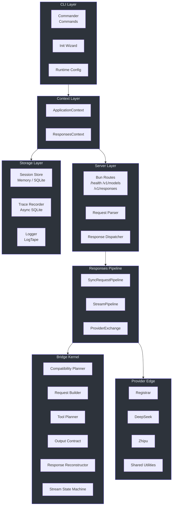
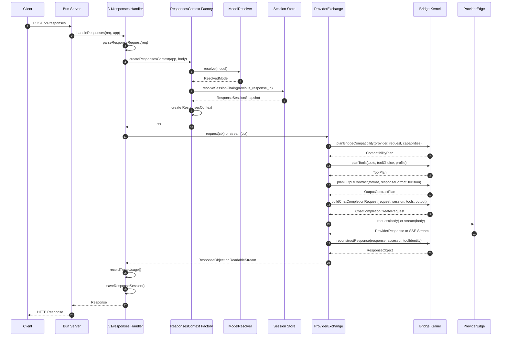
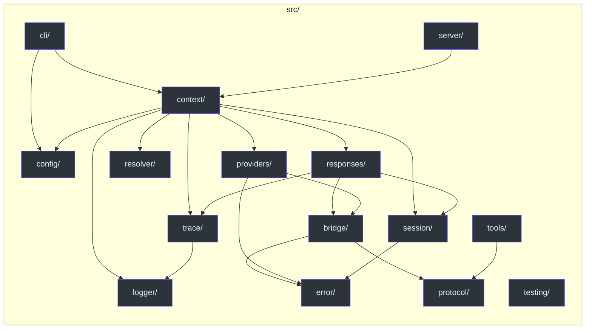
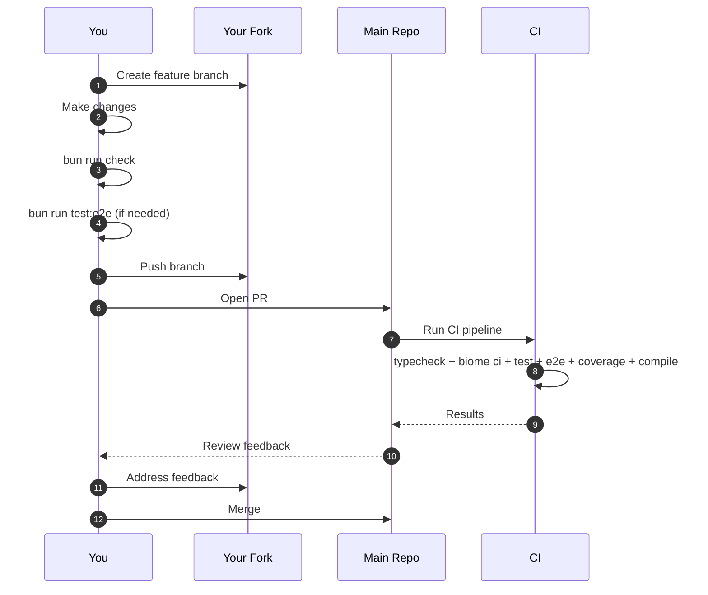

# Contributor Onboarding Guide

> **Audience**: New contributors with TypeScript/Bun proficiency who want to work on GodeX effectively.
> **Prerequisite**: Read [AGENTS.md](/AGENTS.md) first -- it is the single source of truth for coding-agent instructions.

---

## Table of Contents

- [Part I: Language and Framework Foundations](#part-i-language-and-framework-foundations)
  - [TypeScript Configuration](#typescript-configuration)
  - [Bun Runtime](#bun-runtime)
  - [Biome for Formatting and Linting](#biome-for-formatting-and-linting)
  - [Key Dependencies](#key-dependencies)
- [Part II: Architecture and Domain Model](#part-ii-architecture-and-domain-model)
  - [What GodeX Does](#what-godex-does)
  - [Core Domain Concepts](#core-domain-concepts)
  - [Architecture Layers](#architecture-layers)
  - [Request Flow](#request-flow)
  - [Module Dependency Graph](#module-dependency-graph)
  - [Module Map](#module-map)
  - [Deep Dive: Bridge Kernel](#deep-dive-bridge-kernel)
  - [Deep Dive: Stream Pipeline](#deep-dive-stream-pipeline)
  - [Deep Dive: Error Handling](#deep-dive-error-handling)
  - [Deep Dive: Provider Pattern](#deep-dive-provider-pattern)
- [Part III: Getting Productive](#part-iii-getting-productive)
  - [Setup](#setup)
  - [Testing](#testing)
  - [Contributing Workflow](#contributing-workflow)
  - [Code Style](#code-style)
  - [Boundaries](#boundaries)
  - [Common Tasks](#common-tasks)
- [Appendix: Glossary](#appendix-glossary)

---

## Part I: Language and Framework Foundations

### TypeScript Configuration

GodeX uses strict TypeScript with modern compiler options. Understanding these settings is non-negotiable for contributing.

**Key `tsconfig.json` settings:**

| Setting | Value | Impact |
|---|---|---|
| `strict` | `true` | Enables all strict type-checking options |
| `target` | `ESNext` | Targets the latest ECMAScript features |
| `module` | `Preserve` | Preserves module structure for Bun |
| `verbatimModuleSyntax` | `true` | Requires explicit `import type` for type-only imports |
| `noEmit` | `true` | No JS output -- Bun runs TypeScript directly |
| `noUncheckedIndexedAccess` | `true` | Array/object index access returns `T \| undefined` |
| `noImplicitOverride` | `true` | Subclass overrides must use `override` keyword |
| `moduleResolution` | `bundler` | Resolves modules like a bundler |

**What this means for you:**

1. **Always use `import type`** for type-only imports. The compiler will error if you forget:

   ```typescript
   // Correct
   import type { GodeXConfig } from "../config";
   import { GodeXError } from "../error";

   // Wrong -- compiler error with verbatimModuleSyntax
   import { GodeXConfig } from "../config";
   ```

2. **Handle `undefined` from indexed access.** With `noUncheckedIndexedAccess`, accessing `array[0]` or `record["key"]` returns `T | undefined`. You must narrow:

   ```typescript
   const firstChoice = response.choices?.[0]; // ChatCompletionChoice | undefined
   if (!firstChoice) {
     // handle missing choice
   }
   ```

3. **Use `override`** when subclassing:

   ```typescript
   class BridgeError extends GodeXError {
     override readonly domain = "bridge"; // override keyword required
   }
   ```

### Bun Runtime

GodeX targets the **Bun** runtime exclusively. Bun is not "Node but faster" -- it has distinct APIs and conventions.

**Bun-specific features used in GodeX:**

| Feature | Usage |
|---|---|
| `Bun.serve()` | HTTP server with native routing |
| `bun test` | Built-in test runner with `describe/it/expect` |
| `--hot` flag | Hot module reloading during development |
| SQLite built-in | `bun:sqlite` for trace and session storage |
| Native binary compilation | `bun build --compile` for distributable binaries |

**Test runner conventions:**

```typescript
import { describe, it, expect } from "bun:test";

describe("MyModule", () => {
  it("should do something", () => {
    expect(myFunction("input")).toBe("expected");
  });
});
```

Tests are colocated with source as `*.test.ts` files. The test runner discovers them automatically.

**Dev server:**

```bash
bun run dev    # Runs src/index.ts with --hot on port 13145
```

The `--hot` flag reloads changed modules without restarting the process.

### Biome for Formatting and Linting

GodeX uses **Biome** (not ESLint, not Prettier). Biome is a single tool for formatting and linting.

**Key configuration from `biome.json`:**

- **Indentation**: Tabs (not spaces). This is non-negotiable.
- **Linter**: Enabled with recommended rules
- **Import organization**: Auto-enabled via `assist.actions.source.organizeImports`
- **Exception**: `noTemplateCurlyInString` is disabled because GodeX uses `${VAR}` in config env interpolation

**Commands:**

```bash
bun run lint         # Check for lint issues
bun run lint:fix     # Auto-fix lint issues
bun run format       # Auto-format all source files
```

**What this means for you:**

- Never configure editor settings to use spaces for this project.
- Run `bun run lint:fix && bun run format` before committing if your editor does not auto-format.
- Do not add ESLint, Prettier, or other formatting tools.

### Key Dependencies

| Package | Purpose | Notes |
|---|---|---|
| `commander` | CLI framework | Powers `godex init`, `godex serve`, `godex config` |
| `js-yaml` | YAML parsing | Reads `godex.yaml` configuration files |
| `nanoid` | Unique ID generation | Generates request and response IDs |
| `@ahoo-wang/fetcher` | HTTP client | Base fetch abstraction |
| `@ahoo-wang/fetcher-decorator` | HTTP middleware | Request/response decorators |
| `@ahoo-wang/fetcher-eventstream` | SSE parsing | Parses Server-Sent Events from providers |
| `@logtape/logtape` | Structured logging | Logging framework with sinks |
| `@logtape/file` | File logging sink | Writes logs to files |
| `@logtape/pretty` | Console logging sink | Pretty-printed console output |
| `@clack/prompts` | Interactive prompts | Powers the `godex init` wizard |

---

## Part II: Architecture and Domain Model

### What GodeX Does

GodeX is an **OpenAI-compatible Responses API gateway**. It translates the OpenAI Responses API protocol into provider-specific Chat Completions API calls, enabling tools like Codex and AI agents to use any LLM provider without code changes.

**The core translation:**

```
Client (Codex/Agent)                    Provider (DeepSeek/Zhipu/...)
      |                                       |
      |  Responses API request                |
      |  POST /v1/responses                   |
      |-------------------------------------->|
      |                                       |
      |     GodeX Bridge Kernel               |
      |     - Plan compatibility              |
      |     - Plan tools                      |
      |     - Plan output contract            |
      |     - Build Chat Completions request  |
      |                                       |
      |  Chat Completions API request         |
      |  POST /chat/completions               |
      |-------------------------------------->|
      |                                       |
      |  Chat Completions response            |
      |<--------------------------------------|
      |                                       |
      |     GodeX Bridge Kernel               |
      |     - Reconstruct ResponseObject       |
      |     - Validate output contract        |
      |     - Restore tool identities         |
      |                                       |
      |  Responses API response               |
      |<--------------------------------------|
```

The bridge kernel is the central insight: it plans compatibility **before** building requests, enabling transparent degradation, diagnostics, and multi-provider support.

### Core Domain Concepts

#### Responses API

The OpenAI Responses API is a stateful, high-level API. Key concepts:

- **ResponseCreateRequest**: The input -- includes model, instructions, input items, tools, and stream preference
- **ResponseObject**: The output -- includes status, output items (messages, tool calls), usage, and metadata
- **ResponseStreamEvent**: SSE events for streaming -- includes created, in_progress, delta, done, completed
- **previous_response_id**: Parent pointer for conversation continuity

#### Chat Completions API

The OpenAI Chat Completions API is a stateless, lower-level API. Key concepts:

- **ChatCompletionCreateRequest**: Messages array, tools, tool_choice, response_format, stream flag
- **ChatCompletionResponse**: Choices array with message content, tool calls, finish reason
- **ChatCompletionChunk**: SSE chunks for streaming deltas

#### ProviderSpec

A `ProviderSpec` is a declarative package that describes a provider's capabilities and behavior:

- **capabilities**: What the provider supports (parameters, tools, response formats, reasoning, streaming)
- **endpoint**: Default base URL
- **auth**: Authentication scheme (always Bearer)
- **toolName**: Codec for translating tool names between Responses and provider formats
- **response**: Accessor functions for extracting data from provider responses
- **stream**: Accessor functions for extracting deltas from provider SSE chunks
- **hooks**: Optional provider-specific request patching and response normalization

#### Bridge Kernel

The bridge kernel is the provider-agnostic translation layer. It has six sub-modules:

1. **compatibility/**: Plans support/degrade/ignore/reject decisions for every request feature
2. **request/**: Normalizes Responses input and session history into Chat Completions messages
3. **tools/**: Plans tool declarations, tool_choice, degradation, identity mapping, and call restoration
4. **output/**: Plans structured-output contracts and validates downgraded JSON output
5. **response/**: Reconstructs sync ResponseObject results from provider responses
6. **stream/**: Maps provider deltas into Responses SSE events through a state machine

#### Session Chains

Sessions use a **parent-pointer chain** -- each response stores a `previous_response_id` pointing to its parent. Chain resolution walks the chain backward, collecting input items from all turns:

```
response_3.previous_response_id -> response_2
response_2.previous_response_id -> response_1
response_1.previous_response_id -> null
```

The chain detects: missing parents, cycles, depth overflow (max 64), and incomplete responses.

#### Trace Recorder

The trace system records request, usage, event, and error rows in SQLite asynchronously. It uses a bounded queue with batch flushing to avoid blocking responses.

### Architecture Layers



### Request Flow



### Module Dependency Graph



### Module Map

#### `src/cli/` -- Commander CLI

| File | Purpose |
|---|---|
| `cli.ts` | Entry point -- parses argv, runs program |
| `program.ts` | Creates Commander program with subcommands |
| `commands/serve.ts` | `godex serve` -- starts the server |
| `commands/init.ts` | `godex init` -- interactive config wizard |
| `commands/config.ts` | `godex config check/print` -- config validation |
| `init/` | Init wizard prompts, defaults, YAML generation |
| `runtime-config/` | Runtime config loading, CLI options, diagnostics |

#### `src/config/` -- YAML Config Parsing

| File | Purpose |
|---|---|
| `schema.ts` | `GodeXConfig` type definition -- the config contract |
| `raw.ts` | Raw config loading from YAML |
| `reader.ts` | Config reading with validation |
| `builder.ts` | Config construction with defaults |
| `env-interpolation.ts` | `${VAR}` substitution in config values |
| `validation.ts` | Config validation logic |
| `sections/` | Per-section config parsing (server, providers, models, session, logging, trace) |

#### `src/context/` -- Application and Request Contexts

| File | Purpose |
|---|---|
| `application-context.ts` | `ApplicationContext` -- holds all app-level services |
| `application-services.ts` | Factory for ApplicationContext dependencies |
| `responses-context.ts` | `ResponsesContext` -- per-request state (diagnostics, attributes, output contract) |
| `responses-context-factory.ts` | Creates ResponsesContext from request + app context |
| `provider-bootstrap.ts` | Registers provider factories with the Registrar |
| `session-store-factory.ts` | Creates memory or SQLite session stores |
| `trace-services.ts` | Creates trace recorder from config |
| `request-identity.ts` | Generates request and response IDs |
| `output-contract-slot.ts` | Mutable slot for output contract plan (set during exchange) |
| `responses-session.ts` | Session resolution from request |

#### `src/bridge/` -- Provider-Agnostic Bridge Kernel

| File | Purpose |
|---|---|
| `compatibility/planner.ts` | `planBridgeCompatibility()` -- plans parameter decisions |
| `compatibility/compatibility-plan.ts` | `CompatibilityPlan`, `ProviderCapabilities`, `CompatibilityDecision` types |
| `compatibility/diagnostic.ts` | `CompatibilityDiagnostic` type |
| `request/request-builder.ts` | `buildChatCompletionRequest()` -- main request builder |
| `request/input-normalizer.ts` | Normalizes Responses input items to Chat messages |
| `request/message-builder.ts` | Builds ChatCompletionMessageParam arrays |
| `tools/tool-plan.ts` | `planTools()` -- plans tool declarations and tool_choice |
| `tools/tool-catalog.ts` | Builds tool catalog from request |
| `tools/tool-identity.ts` | Tool name codec and identity mapping |
| `tools/tool-choice.ts` | Tool choice rendering |
| `tools/call-restorer.ts` | Restores tool calls from provider format |
| `tools/declaration-renderer.ts` | Renders tool declarations for provider format |
| `tools/custom-tool-degradation.ts` | Custom tool degradation logic |
| `output/output-contract.ts` | `planOutputContract()` -- plans output format |
| `output/output-validator.ts` | Validates output against contract |
| `output/validator.ts` | JSON output validation for degraded contracts |
| `response/response-reconstructor.ts` | `reconstructResponseObject()` -- builds ResponseObject |
| `stream/response-stream-state-machine.ts` | `ResponseStreamStateMachine` -- stream event state machine |
| `stream/stream-reconstructor.ts` | Maps provider deltas to Response events |
| `stream/stream-delta.ts` | Provider stream delta types |
| `finish-reason/finish-reason.ts` | Maps provider finish reasons to Responses terminal states |
| `provider-spec/contract.ts` | `ProviderSpec`, `ProviderEdge`, accessor interfaces |
| `provider-spec/factory.ts` | ProviderEdge factory utilities |
| `provider-spec/validation.ts` | ProviderSpec validation |

#### `src/responses/` -- Sync and Streaming Orchestration

| File | Purpose |
|---|---|
| `bridge.ts` | `ResponsesBridge` interface -- request() and stream() |
| `runtime.ts` | `ResponsesBridgeRuntime` -- wires sync and stream pipelines |
| `sync-request-pipeline.ts` | `SyncRequestPipeline` -- non-streaming request handling |
| `stream-pipeline.ts` | `StreamPipeline` -- streaming request handling |
| `provider-exchange.ts` | `ProviderExchange` -- builds request, calls provider, records trace |
| `compatibility-diagnostics.ts` | Logs compatibility diagnostics |
| `response-output-contract-validation.ts` | Validates output contract on sync responses |
| `response-request-echo.ts` | Echo fields for response metadata |
| `response-session-persistence.ts` | Saves response to session store |
| `stream-error-handler.ts` | Wraps stream with error handling |
| `stream-transforms/` | Composable TransformStream stages |

#### `src/providers/` -- Provider Registry and Implementations

| File | Purpose |
|---|---|
| `registrar.ts` | `Registrar` -- provider factory registry and resolution |
| `builtin.ts` | Registers built-in providers |
| `definition.ts` | `ProviderDefinition` interface |
| `factory-options.ts` | Factory option types |
| `deepseek/spec.ts` | DeepSeek ProviderSpec |
| `deepseek/client.ts` | Creates DeepSeek ProviderEdge |
| `deepseek/hooks.ts` | DeepSeek-specific capabilities, request patching, stream deltas |
| `deepseek/protocol/` | DeepSeek Chat Completions DTOs |
| `zhipu/spec.ts` | Zhipu ProviderSpec |
| `zhipu/client.ts` | Creates Zhipu ProviderEdge |
| `zhipu/hooks.ts` | Zhipu-specific capabilities, request patching, stream deltas |
| `zhipu/protocol/` | Zhipu Chat Completions DTOs |
| `example/` | Example provider spec (not a runtime provider) |
| `shared/` | Shared provider utilities (ChatProviderClient, stream delta mappers) |

#### `src/session/` -- Session Chain Stores

| File | Purpose |
|---|---|
| `chain.ts` | `resolveResponseSessionChain()` -- walks parent-pointer chain |
| `memory.ts` | In-memory session store |
| `sqlite.ts` | SQLite-backed session store |
| `types.ts` | Session type definitions |
| `save-policy.ts` | Session save policy logic |
| `snapshot-clone.ts` | Deep clone for session snapshots |

#### `src/trace/` -- Async SQLite Trace Recorder

| File | Purpose |
|---|---|
| `recorder.ts` | `AsyncTraceRecorder` -- bounded queue, batch flush to SQLite |
| `request-recorder.ts` | Records trace request rows |
| `usage-recorder.ts` | Records trace usage rows |
| `event-recorder.ts` | Records trace event rows |
| `error-recorder.ts` | Records trace error rows |
| `sqlite.ts` | SQLite trace store (table creation, batch insert) |
| `row-mapper.ts` | Maps trace events to store rows |
| `payload.ts` | Payload capture and summarization |
| `usage.ts` | Usage tracking utilities |
| `types.ts` | Trace event types |
| `context.ts` | Trace context helpers |
| `time.ts` | Timestamp utilities |

#### `src/error/` -- GodeXError Hierarchy

| File | Purpose |
|---|---|
| `godex-error.ts` | Abstract `GodeXError` base class |
| `codes.ts` | Domain error code constants |
| `server-error.ts` | `ServerError` -- route/request/config errors |
| `bridge-error.ts` | `BridgeError` -- compatibility and reconstruction errors |
| `provider-error.ts` | `ProviderError` -- upstream HTTP/fetch errors |
| `session-error.ts` | `SessionError` -- session chain and persistence errors |

#### `src/server/` -- Bun Routes

| File | Purpose |
|---|---|
| `server.ts` | `Bun.serve()` setup with route map |
| `routes/health.ts` | `GET /health` -- registered and unsupported providers |
| `routes/models.ts` | `GET /v1/models` -- configured model aliases |
| `routes/responses/handler.ts` | `POST /v1/responses` -- main compatibility endpoint |
| `routes/responses/request-parser.ts` | Parses and validates request body |
| `routes/responses/response-dispatcher.ts` | Dispatches to sync or stream pipeline |
| `routes/responses/error-handler.ts` | Converts errors to HTTP responses |
| `routes/responses/sse.ts` | SSE response headers |

#### `src/protocol/` -- OpenAI Type Definitions

| File | Purpose |
|---|---|
| `openai/responses/` | Responses API types (request, object, items, tools, stream events) |
| `openai/completions.ts` | Chat Completions API types |
| `openai/models.ts` | Model listing types |
| `openai/shared.ts` | Shared types (error codes, reasoning effort) |

#### `src/tools/` -- Codex Built-in Tool Definitions

| File | Purpose |
|---|---|
| `builtin.ts` | Built-in tool registry |
| `definition.ts` | Tool definition types |
| `apply-patch.ts` | Apply-patch tool definition |
| `shell.ts` | Shell tool definition |
| `local-shell.ts` | Local shell tool definition |

#### `src/resolver/` -- Model Selector and Alias Resolution

| File | Purpose |
|---|---|
| `model-resolver.ts` | `ModelResolver` -- resolves model name to provider + model |
| `model-aliases.ts` | `ModelAliasCatalog` -- alias mapping |
| `model-selector.ts` | Parses `provider/model` selectors |
| `model-reference.ts` | `ResolvedModel` type |

---

### Deep Dive: Bridge Kernel

The bridge kernel (`src/bridge/`) is the most important module to understand. It is the provider-agnostic translation engine that converts between the Responses API and the Chat Completions API.

#### Compatibility Planning

Compatibility planning is the first step for every request. The `planBridgeCompatibility()` function in `src/bridge/compatibility/planner.ts` examines the request against the provider's declared capabilities and produces a `CompatibilityPlan`.

**How it works:**

1. GodeX-owned parameters (`metadata`, `conversation`, `background`) are always **ignored** -- they are handled by GodeX itself, not forwarded upstream
2. Response format (`text.format`) is checked against `capabilities.responseFormats.supported`:
   - If the requested format type is in the supported set -- **supported**
   - If `json_schema` is requested but only `json_object` is supported -- **degraded** to `json_object`
   - Otherwise -- **rejected** (throws `BridgeError`)
3. Each decision is recorded as a `CompatibilityDiagnostic` with code, severity, path, action, and message

**Diagnostic codes:**

| Code | Action | Meaning |
|---|---|---|
| `bridge.param.ignored` | ignored | Parameter is GodeX-owned |
| `bridge.param.degraded` | degraded | Parameter downgraded to provider alternative |
| `bridge.param.unsupported` | rejected | Parameter not supported by provider |

#### Tool Planning

Tool planning (`src/bridge/tools/tool-plan.ts`) handles the translation of Responses API tool declarations into provider-specific tool declarations.

**The tool planning flow:**

1. If `tool_choice` is `"none"`, tools are disabled entirely
2. For each requested tool in the catalog:
   - Check if the tool type is in the provider's native support set -- **supported**
   - Check if the tool type has a degraded mapping (e.g., `local_shell` -> `function`) -- **degraded**
   - Otherwise -- **ignored** (tool declaration is dropped)
3. Provider tool names are allocated via a collision-resolution strategy (append `_2`, `_3`, etc. up to 64 chars)
4. `tool_choice` is planned: mode choices (`auto`, `required`) are checked against capability, explicit choices are matched to declarations
5. The tool plan includes identity mapping (`requestedName` -> `providerName`) used later for call restoration

**Tool identity mapping:**

When a tool is degraded (e.g., `shell` -> `function`), the tool's name and type change in the provider request. The `ToolIdentityMap` tracks these mappings so that when the provider returns a tool call with the degraded name, GodeX can restore it to the original tool type and name.

**Call restoration** (`src/bridge/tools/call-restorer.ts`):

When a provider returns a function call, GodeX checks the identity map to determine the original tool type:
- `local_shell` calls: Parse JSON arguments for `command`, `env`, etc. -> reconstruct `LocalShellCall`
- `shell` calls: Parse JSON arguments for `commands` -> reconstruct `ShellCall`
- `apply_patch` calls: Parse JSON arguments for `operation` -> reconstruct `ApplyPatchCall`
- Everything else: Return as generic `function_call`

#### Output Contract Planning

Output contract planning (`src/bridge/output/output-contract.ts`) handles the `json_schema` -> `json_object` degradation path.

**The degradation strategy:**

1. If the provider supports `json_schema` natively -- forward as-is
2. If the provider only supports `json_object` -- degrade:
   - Set `response_format` to `{ type: "json_object" }`
   - Inject a **synthetic system instruction** containing the JSON Schema, schema name, description, and formatting rules
   - Set `requiresValidJson: true` for post-response validation
3. After the response is received, if `requiresValidJson` is true, the output is validated against the expected JSON structure

The synthetic instruction tells the provider to output JSON matching the schema, and GodeX validates the result after receiving it.

#### Request Building

Request building (`src/bridge/request/request-builder.ts`) is the central function `buildChatCompletionRequest()` that combines all planning outputs:

1. Plan compatibility -> `CompatibilityPlan`
2. Plan tools -> `ToolPlan`
3. Assert no rejected compatibility (throws `BridgeError` for rejected response format)
4. Plan output contract -> `OutputContractPlan`
5. Normalize input items:
   - Current input from the request (instructions + input items)
   - Session history (previous turns from session chain)
   - System prefix messages are collected first, then history, then user messages
   - Synthetic output contract instruction is injected as a system message
6. Build ChatCompletionMessageParam array via `message-builder.ts`
7. Apply tools (declarations + tool_choice)
8. Apply response_format from output contract
9. Apply request options (stream, temperature, top_p, max_output_tokens, reasoning, user/safety_identifier)

**Input normalization** (`src/bridge/request/input-normalizer.ts`) handles the conversion of Responses API input items to Chat Completions messages:

- `message` items (system/user/assistant/developer roles) -> corresponding Chat messages
- `developer` role -> `system` role
- `function_call` items -> assistant message with `tool_calls`
- `function_call_output` items -> tool message with content
- `shell_call`, `local_shell_call`, `apply_patch_call` -> assistant message with function tool calls (JSON-serialized action)
- `shell_call_output`, `local_shell_call_output`, `apply_patch_call_output` -> tool messages
- `reasoning` items -> attached as `reasoning_content` on the next assistant message
- Unsupported item types throw `BridgeError`

#### Response Reconstruction

Response reconstruction (`src/bridge/response/response-reconstructor.ts`) builds a `ResponseObject` from a provider response:

1. Extract first choice from provider response
2. If no choices -> return failed ResponseObject
3. Extract output text
4. Validate output contract (JSON validation if degraded)
5. Map provider finish reason to Responses status (completed/incomplete/failed)
6. Build output items:
   - Reasoning text (if present) -> reasoning item
   - Tool calls (if present) -> restored tool call items
   - Assistant message (if text output exists or no tool calls)
7. Assemble ResponseObject with IDs, timestamps, usage, error, and incomplete_details

**Finish reason mapping** (`src/bridge/finish-reason/finish-reason.ts`):

| Provider Reason | Responses Status | Notes |
|---|---|---|
| `stop`, `tool_calls` | completed | Normal completion |
| `length`, `model_context_window_exceeded` | incomplete | Max output tokens reached |
| `content_filter`, `sensitive` | incomplete | Content policy |
| `network_error` | failed | Upstream network issue |
| `null` / `undefined` | failed | Provider returned no reason |
| Any other value | failed | Unexpected reason |

### Deep Dive: Stream Pipeline

The stream pipeline (`src/responses/stream-pipeline.ts`) is one of the most complex subsystems. It uses composable `TransformStream` stages to process provider SSE events into Responses API SSE events.

**Stream pipeline stages (in order):**

1. **TraceTransformer (raw)**: Records raw provider SSE events to trace
2. **ProviderStreamEventBridge**: Transforms provider deltas into ResponseStreamEvents using the state machine
3. **Error handler wrapper**: Catches stream errors and converts to failed events
4. **ResponseOutputContractValidationTransformer**: Validates terminal output against contract
5. **TraceTransformer (transformed)**: Records transformed events to trace
6. **ResponseLogTransformer**: Logs response completion with usage and diagnostics
7. **ResponseSessionPersistenceTransformer**: Saves completed response to session store (unless `store: false`)
8. **CompatibilityLogTransformer**: Logs compatibility diagnostics

**The stream state machine** (`src/bridge/stream/response-stream-state-machine.ts`):

The `ResponseStreamStateMachine` manages the lifecycle of a streaming response through five phases:

| Phase | Description |
|---|---|
| `IDLE` | Initial state, waiting for first delta |
| `IN_PROGRESS` | Actively receiving deltas |
| `COMPLETED` | Normal termination |
| `INCOMPLETE` | Terminated due to token limit or content filter |
| `FAILED` | Terminated due to error |

**Phase transitions:**

- `IDLE` -> `IN_PROGRESS`: First delta received (emits `response.created` + `response.in_progress`)
- `IN_PROGRESS` -> `COMPLETED` / `INCOMPLETE` / `FAILED`: Finish reason, error, or end of stream

**Block management:**

The state machine manages four types of concurrent output blocks:
- **Text blocks**: Assistant message text content
- **Refusal blocks**: Refusal message content
- **Reasoning blocks**: Reasoning text content
- **Tool call blocks**: Function call arguments being accumulated

Each block type has its own lifecycle: created on first delta, accumulated with subsequent deltas, closed on finish. When the stream terminates, all active blocks are closed automatically.

**Deferred finish:**

In streaming mode, the finish reason is deferred until after all remaining deltas are processed. This ensures that content deltas received in the same chunk as the finish reason are not lost. The `deferFinish()` method stores the finish reason without terminating, and `finish()` is called in the transformer's `flush()` method.

### Deep Dive: Error Handling

GodeX uses a structured error hierarchy. All expected runtime failures use `GodeXError` subclasses, never raw `Error`.

**Error hierarchy:**

```
GodeXError (abstract)
  +-- ServerError      -- domain: "server"    -- route/request/config errors
  +-- BridgeError      -- domain: "bridge"    -- compatibility/reconstruction errors
  +-- ProviderError    -- domain: "provider"  -- upstream HTTP/fetch errors
  +-- SessionError     -- domain: "session"   -- session chain/persistence errors
```

**Each error carries:**

| Field | Type | Description |
|---|---|---|
| `domain` | `string` | Error domain (server, bridge, provider, session) |
| `code` | `string` | Specific error code from `src/error/codes.ts` |
| `message` | `string` | Human-readable description |
| `status` | `number` | HTTP status code |
| `context` | `Record<string, unknown>` | Additional context (provider, model, parameter) |
| `timestamp` | `number` | Unix timestamp |
| `cause` | `Error \| undefined` | Underlying error |

**Error code domains:**

| Domain | Code Prefix | Example Codes |
|---|---|---|
| Bridge request | `bridge.request.*` | `unsupported_parameter`, `tool_skipped`, `unsupported_input_item` |
| Bridge stream | `bridge.stream.*` | `not_initialized`, `invalid_transition`, `incomplete_tool_call` |
| Provider | `provider.upstream.*` | `rate_limit`, `timeout`, `server_error` |
| Session | `session.chain.*` | `not_found`, `cycle_detected`, `depth_exceeded` |
| Server | `server.*` | `invalid_json`, `missing_model`, `provider_not_registered` |

**Error handling in routes:**

The `responseRouteErrorToResponse()` function in `src/server/routes/responses/error-handler.ts` converts any thrown error to an HTTP response:
- `GodeXError` subclasses: Use the error's status code and structured body
- Unknown errors: 500 Internal Server Error

### Deep Dive: Provider Pattern

Each provider follows a consistent pattern. Understanding this pattern is essential for adding new providers.

**Provider directory structure:**

```
src/providers/<name>/
  spec.ts       -- ProviderSpec definition (capabilities, endpoint, auth, accessors)
  client.ts     -- create<Name>ProviderEdge(config) factory
  hooks.ts      -- Provider-specific capabilities, request patching, stream deltas
  protocol/     -- Provider-specific Chat Completions DTOs
  index.ts      -- Barrel exports
```

**ProviderSpec fields:**

| Field | Type | Description |
|---|---|---|
| `name` | `string` | Provider identifier |
| `protocol` | `ProviderProtocol` | Always `chat_completions` |
| `capabilities` | `ProviderCapabilities` | Declared feature support |
| `endpoint` | `ProviderEndpointSpec` | Default base URL |
| `auth` | `ProviderAuthSpec` | Always `bearer` |
| `toolName` | `ToolNameCodec` | Tool name translation codec |
| `response` | `ChatCompletionResponseAccessor` | Functions to extract data from sync responses |
| `stream` | `ChatCompletionStreamAccessor` | Functions to extract deltas from SSE chunks |
| `hooks` | `ProviderHooks` (optional) | Provider-specific patching |

**ProviderCapabilities fields:**

| Field | Type | Description |
|---|---|---|
| `parameters.supported` | `Set<string>` | Supported request parameters |
| `tools.supported` | `Set<string>` | Supported tool types |
| `tools.degraded` | `Map<string, string>` | Tool type degradation mappings |
| `tools.maxTools` | `number` (optional) | Maximum tool declarations |
| `toolChoice.supported` | `Set<string>` | Supported tool_choice modes |
| `responseFormats.supported` | `Set<string>` | Supported response format types |
| `reasoning.effort` | `"none" \| "boolean" \| "native"` | Reasoning effort mode |
| `streaming.usage` | `boolean` | Whether streaming includes usage data |

**DeepSeek capabilities:**

- Parameters: stream, temperature, top_p, max_output_tokens, safety_identifier, user, reasoning, text.format
- Tools: function (native), local_shell/shell/apply_patch/custom/tool_search/namespace (degraded to function)
- Tool choice: auto, none, required, function
- Response formats: text, json_object
- Reasoning: native effort
- Streaming: includes usage

**Zhipu capabilities:**

- Parameters: stream, temperature, top_p, max_output_tokens, safety_identifier, user, reasoning, text.format
- Tools: function, web_search variants (native), file_search, local_shell/shell/apply_patch/custom (degraded)
- Tool choice: auto, none
- Response formats: text, json_object
- Reasoning: boolean effort
- Streaming: includes usage

**Provider hooks:**

Hooks are the escape hatch for protocol differences:

- `patchRequest(request)`: Transform the bridge request before sending to the provider. Used for provider-specific request fields (e.g., DeepSeek's `thinking` field, Zhipu's `clear_thinking` field).
- `normalizeResponse(response)`: Transform the provider response after receiving.
- `normalizeChunk(chunk)`: Transform SSE chunks after receiving.

**Important**: Hooks should only handle protocol differences, never compatibility decisions. The bridge kernel owns all support/degrade/ignore/reject decisions.

---

## Part III: Getting Productive

### Setup

```bash
# Clone your fork
git clone https://github.com/<you>/GodeX.git
cd GodeX

# Install dependencies
bun install

# Start dev server (hot reload on port 13145)
bun run dev

# Verify everything works
bun run check

# Initialize a config file for testing
bun run src/index.ts init
```

**Default ports:**

- `bun run dev` uses port **13145** (hardcoded in the dev script)
- Production default is port **5678** (from `GodeXConfig`)

### Testing

**The full check command:**

```bash
bun run check    # typecheck + lint + test (excluding e2e)
```

This runs three steps in sequence:
1. `tsc --noEmit` -- type checking
2. `biome check src` -- lint checking
3. `bun test --path-ignore-patterns 'src/e2e/**'` -- unit and integration tests

**Running specific tests:**

```bash
# Run a single test file
bun test src/bridge/tools/tool-plan.test.ts

# Run tests matching a pattern
bun test --test-name-pattern "planTools"

# Run E2E tests (mocked upstream)
bun run test:e2e

# Run live Zhipu tests (needs ZHIPU_API_KEY)
ZHIPU_API_KEY=your_key bun run test:zhipu

# Run with coverage
bun run test:coverage
```

**When to run E2E tests:**

Run `bun run test:e2e` whenever you change:
- Request routing
- Provider implementations
- Session behavior
- Trace recording
- Stream behavior
- CLI runtime behavior

### Contributing Workflow



**Branch naming:** Use descriptive names like `feat/add-provider`, `fix/stream-state-machine`, `docs/contributor-guide`.

**PR titles:** Use concise conventional style:
- `feat: add mistral provider support`
- `fix: handle empty tool call deltas in stream`
- `refactor: extract output contract validation`
- `docs: add contributor onboarding guide`

**CI pipeline runs:**
1. `tsc --noEmit` -- type checking
2. `biome ci src` -- lint in CI mode (no fixes)
3. `bun test` -- unit and integration tests
4. `bun run test:e2e` -- mocked E2E tests
5. Coverage reporting
6. Native binary compilation

Live Zhipu tests run only on push to `main` when `ZHIPU_API_KEY` is configured.

### Code Style

**Naming:**

| Element | Convention | Example |
|---|---|---|
| Variables and functions | camelCase | `planBridgeCompatibility` |
| Classes and interfaces | PascalCase | `ResponsesContext` |
| Types | PascalCase | `ProviderCapabilities` |
| Constants | UPPER_SNAKE_CASE | `DEEPSEEK_MAX_TOOLS` |
| Files | kebab-case | `response-reconstructor.ts` |
| Directories | kebab-case | `stream-transforms/` |

**Module organization:**

- Small, focused modules with explicit data boundaries
- Colocated tests: `response-reconstructor.ts` next to `response-reconstructor.test.ts`
- Barrel exports via `index.ts` files in each module

**Comments:**

- Add comments **only when they explain why** a non-obvious decision exists
- Do not comment **what** the code does -- the code should be self-documenting
- Do not leave TODO comments without a linked issue

**Import order:**

Biome auto-organizes imports. Do not fight it. The order is typically:
1. External package imports
2. Internal module imports
3. Type-only imports

### Boundaries

**Always:**

- Run `bun run check` before commits that change source or tests
- Run `bun run test:e2e` for route, provider, session, stream, trace, or CLI runtime behavior changes
- Keep shared Responses-to-Chat policy in `src/bridge/`
- Keep orchestration in `src/responses/`
- Keep provider-specific quirks in provider `hooks.ts` or protocol DTOs
- Add tests for behavior changes

**Ask first (in a GitHub issue or PR discussion):**

- Adding a new provider implementation
- Changing `ProviderSpec` or `ProviderEdge` contracts
- Changing `GodeXConfig` schema
- Reordering stream pipeline transformers
- Changing trace payload retention semantics
- Adding runtime dependencies

**Never:**

- Recreate `src/adapter/mapper`, `src/adapter/provider.ts`, or provider-specific mapper forests
- Duplicate compatibility decisions across providers
- Bypass the `GodeXError` hierarchy for expected failures
- Commit secrets, API keys, local trace databases, or session databases
- Hand-edit generated build output
- Add another test framework

### Common Tasks

#### Adding a New Request Parameter

1. Add the parameter name to `ProviderCapabilities.parameters.supported` in relevant provider specs
2. Add handling in `applyRequestOptions()` in `src/bridge/request/request-builder.ts`
3. Add mapping logic in `planBridgeCompatibility()` if the parameter needs compatibility decisions
4. Add tests for the new parameter in both the planner and request builder test files
5. Run `bun run check` and `bun run test:e2e`

#### Adding a New Tool Type

1. Define the tool type in `src/tools/`
2. Add the tool type to `ProviderCapabilities.tools.supported` in providers that support it natively
3. Add degraded mappings in `ProviderCapabilities.tools.degraded` for providers that map it to another type
4. Add input normalization handling in `src/bridge/request/input-normalizer.ts` (convert tool call input items to Chat messages)
5. Add call restoration handling in `src/bridge/tools/call-restorer.ts` (convert provider tool calls back to the original type)
6. Add declaration rendering in `src/bridge/tools/declaration-renderer.ts`
7. Add tests for normalization, restoration, and rendering
8. Run `bun run check` and `bun run test:e2e`

#### Adding a New Provider

1. Create `src/providers/<name>/` directory
2. Define `spec.ts` with `ProviderSpec`:
   - Declare capabilities (parameters, tools, response formats, reasoning, streaming)
   - Set endpoint (default base URL)
   - Set auth (`BEARER_AUTH`)
   - Set tool name codec (use `DEFAULT_TOOL_NAME_CODEC` if no translation needed)
   - Define response accessors (firstChoice, finishReason, outputText, usage)
   - Define stream accessors (deltas)
3. Define `hooks.ts`:
   - `patchRequest()` if the provider needs request fields not in the standard Chat Completions format
   - Usage mapping function
   - Finish reason mapping (if non-standard)
   - Stream delta extraction
4. Define `client.ts` with `create<Name>ProviderEdge(config)` using `ChatProviderClient`
5. Define `protocol/` with provider-specific Chat Completions DTOs (if different from standard)
6. Define `index.ts` barrel exports
7. Register in `src/providers/builtin.ts`
8. Add conformance tests
9. Run `bun run check` and `bun run test:e2e`

Reference the `src/providers/example/` directory for a minimal template.

#### Debugging a Compatibility Issue

1. Enable trace with `capture_payload: true` in your config
2. Send the failing request
3. Check the trace database for:
   - `request` rows: Shows the provider request that was built
   - `event` rows: Shows compatibility diagnostics
   - `usage` rows: Shows token consumption
   - `error` rows: Shows any errors
4. Check the logs for compatibility diagnostics (logged at warn level for degradations, error level for rejections)
5. Check the `CompatibilityPlan.diagnostics` array in the `ResponsesContext` -- each diagnostic includes the parameter path, action, and reason

---

## Appendix: Glossary

### GodeXError

The base error class for all GodeX domain errors. It carries a `domain`, `code`, `status`, `context` record, and `timestamp`. Subclasses are `ServerError`, `BridgeError`, `ProviderError`, and `SessionError`. Never throw raw `Error` for expected runtime failures.

### ProviderSpec

A declarative package that describes a provider's capabilities, endpoint, auth, tool name codec, response accessors, stream accessors, and optional hooks. Each provider (DeepSeek, Zhipu) defines one. See `src/bridge/provider-spec/contract.ts`.

### ProviderEdge

The runtime interface for calling a provider. Wraps a `ProviderSpec` with actual HTTP request and stream methods. Created by provider client factories (e.g., `createDeepSeekProviderEdge`).

### ResponsesContext

Per-request state object. Holds the parsed request, resolved model, provider edge, session snapshot, diagnostics, attributes map, and output contract slot. Created by `createResponsesContext` in the responses route handler.

### ApplicationContext

Application-level singleton. Holds the parsed config, logger, model resolver, provider registrar, responses bridge, session store, and trace recorder. Created once at server startup.

### Bridge Kernel

The provider-agnostic translation layer in `src/bridge/`. Plans compatibility, builds Chat Completions requests from Responses API input, and reconstructs ResponseObjects from provider responses. The key insight is that compatibility planning happens **before** request building.

### CompatibilityPlan

The output of `planBridgeCompatibility()`. Contains a `ProviderCapabilities` snapshot, an array of `CompatibilityDiagnostic` entries, and a `parameters` record mapping each request parameter to a `CompatibilityDecision` (supported, degraded, ignored, or rejected).

### CompatibilityDecision

A decision about a specific request feature: `action` (supported, degraded, ignored, rejected), optional `reason`, and optional `effectiveValue`. For example, `json_schema` might be degraded to `json_object` with an effectiveValue of `{ type: "json_object" }`.

### Session Chain

An immutable linked list of responses connected by `previous_response_id` parent pointers. Chain resolution walks backward, collecting input items from all turns. Detects cycles, missing parents, depth overflow (max 64), and incomplete responses.

### Trace Recorder

An async bounded queue that records request, usage, event, and error rows to SQLite without blocking the response path. Uses configurable queue size, batch size, and flush interval.

### ModelResolver

Resolves a model name from the request to a `{ provider, model }` tuple. Supports bare model names (resolved against default provider), aliases (from config), and explicit `provider/model` selectors.

### Registrar

The provider factory registry. Maps provider spec names to factory functions. At startup, iterates config providers and registers each using the matching factory. Provides `resolve(name)` to look up a `ProviderEdge` by provider name.

### ToolPlan

The output of `planTools()`. Contains enabled flag, planned tool declarations with identity mapping, provider tool_choice, and an array of tool decisions (supported, degraded, ignored, rejected per tool type).

### OutputContractPlan

The output of `planOutputContract()`. Contains the requested format, the effective provider response_format, an optional synthetic instruction (for degraded json_schema), and a `requiresValidJson` flag.

### ResponseStreamStateMachine

A state machine that tracks the phase of a streaming response (IDLE, IN_PROGRESS, COMPLETED, INCOMPLETE, FAILED). Accepts provider deltas and emits ResponseStreamEvents. Manages text blocks, refusal blocks, reasoning blocks, and tool call blocks.

### ProviderHooks

Optional provider-specific callbacks: `patchRequest` (transform the request before sending), `normalizeResponse` (transform the response after receiving), `normalizeChunk` (transform SSE chunks). Hooks expose protocol differences; the bridge decides support, downgrade, rejection, and diagnostics.

### Finish Reason

A value returned by the provider indicating why the response ended. Common values: `stop` (normal), `tool_calls` (wants to call tools), `length` (hit token limit), `content_filter` (blocked by policy). GodeX maps these to Responses API statuses: completed, incomplete, or failed.

### Tool Identity Map

A bidirectional mapping between Responses API tool names and provider tool names. Created during tool planning, used during request building (to translate tool declarations) and during response reconstruction (to restore original tool types and names).

### Input Normalizer

The subsystem that converts Responses API input items (messages, tool calls, tool outputs, reasoning) into Chat Completions message arrays. Handles role mapping (developer -> system), tool call serialization (action -> JSON arguments), and reasoning content attachment.

### ChatProviderClient

A shared HTTP client in `src/providers/shared/` that makes Chat Completions API requests to providers. Used by all provider implementations unless there is a clear transport reason for a custom client.

### Session Store

An abstraction for persisting and retrieving response sessions. Two implementations: `MemorySessionStore` (in-memory, lost on restart) and `SqliteSessionStore` (persistent, stored in local SQLite). The store keeps API-shaped snapshots -- provider-specific conversion happens in the bridge.

### Output Contract Slot

A mutable container in `ResponsesContext` that holds the `OutputContractPlan`. Set during the `ProviderExchange` phase (when the request is built), read during output validation (after the response is received). This indirection exists because the output contract is determined during request building but validated after response reconstruction.
