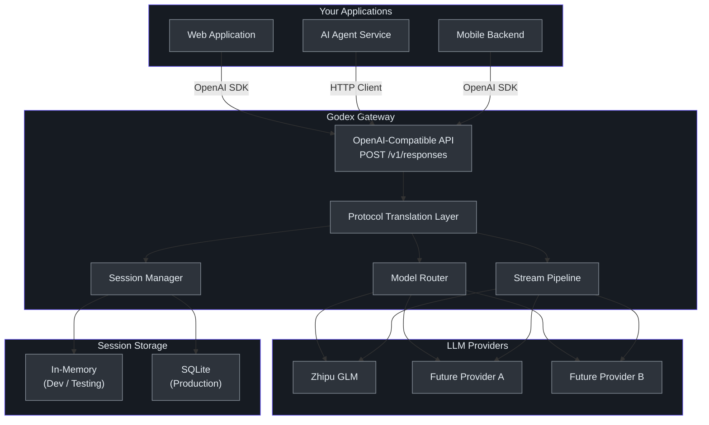
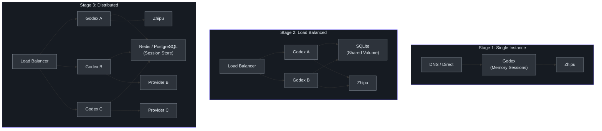

# Executive Guide

## What Godex Does

Godex is an API gateway that sits between your AI-powered applications and LLM provider backends. Your applications send requests using the OpenAI Responses API format, and Godex translates those requests into whatever format the upstream provider expects. Today, the supported upstream provider is Zhipu (with more providers planned).

The business value: your application teams write integration code once, against a single API standard. When you switch or add LLM providers, only the gateway configuration changes -- no application code changes required.

## Capability Map

| Capability | Description | Business Impact |
|-----------|-------------|-----------------|
| Protocol Translation | Converts OpenAI Responses API to provider-specific formats | Eliminates provider lock-in; zero app changes when switching providers |
| Multi-Turn Sessions | Server-side conversation history with chain-of-turns tracking | Reduces client complexity; conversation state managed centrally |
| Streaming Support | Real-time token-by-token output via Server-Sent Events | Enables responsive user experiences; live output as it generates |
| Tool Use Translation | Converts rich tool types (web search, shell, file search) to provider equivalents | Future-proofs tool integration; supports advanced agent workflows |
| Model Routing | Selects provider based on model name with alias and wildcard support | Simplifies model management; easy A/B testing between providers |
| Session Persistence | Stores conversation history in memory or SQLite | Enables resumable conversations; supports compliance requirements |
| Health Monitoring | Built-in health check endpoint | Supports load balancer integration and operational monitoring |
| Configuration Management | YAML-based config with environment variable interpolation | Standardizes deployment; secrets managed through environment variables |
| Reasoning Support | Passes through reasoning/thinking tokens from providers | Enables chain-of-thought applications; transparency in AI decision-making |
| Structured Output | Enforces JSON output format when needed | Reliable integration with downstream systems |
| Error Isolation | Typed error hierarchy with domain-specific codes and context | Faster debugging; clearer error messages for application teams |
| Graceful Shutdown | Signal handlers for clean process termination | No dropped connections during deployments |

## Service-Level Architecture

## How It Works: A Day in the Life

### Scenario 1: Simple Text Generation

1. Your application sends a POST request to Godex with a prompt
2. Godex translates the request to the provider's format
3. Godex forwards to the configured provider (e.g., Zhipu)
4. The provider returns a response
5. Godex translates back to OpenAI format
6. Your application receives the response

**Latency impact**: Microseconds for translation (in-process, no network hops).

### Scenario 2: Multi-Turn Conversation

1. First request: application sends a prompt, receives a response with an ID
2. Second request: application includes the previous response ID
3. Godex looks up the full conversation history from its session store
4. Godex reconstructs the chat context and sends to the provider
5. The provider sees the full conversation and generates a contextually-aware response
6. Godex saves the new turn for future reference

**Business value**: Application teams do not build conversation management logic. The gateway handles it.

### Scenario 3: Switching Providers

1. Platform engineer adds a new provider to the configuration file
2. Platform engineer updates the default provider or model routing rules
3. Godex restarts with new configuration (or hot-reloads in dev mode)
4. All applications automatically route to the new provider
5. No application code changes. No redeployments of application services.

**Time to switch**: Minutes, not weeks.

## Risk Assessment

| Risk Category | Risk | Likelihood | Impact | Mitigation |
|---------------|------|------------|--------|------------|
| **Vendor Lock-in** | Application teams become dependent on gateway-specific features | Medium | High | Godex exposes only OpenAI-standard APIs; no proprietary extensions |
| **Provider Coverage** | Only Zhipu supported today; teams need other providers | High | Medium | Adapter pattern makes adding providers straightforward (7-10 files per provider) |
| **Availability** | Gateway is a single point of failure | Medium | High | Stateless design allows horizontal scaling behind load balancer |
| **Latency** | Translation layer adds overhead to every request | Low | Low | In-process translation; minimal overhead (microseconds for mapping) |
| **Session Data Loss** | Memory sessions lost on process restart | Medium | Medium | SQLite backend available for production deployments |
| **Upstream Errors** | Provider outages propagate to all dependent applications | High | High | Error isolation per provider; structured error codes enable client-side fallback |
| **Configuration Drift** | Different environments have inconsistent provider configs | Medium | Medium | YAML-based config with environment variable interpolation; `config check` command |
| **Scalability Ceiling** | Single-process SQLite limits concurrent session writes | Low | Medium | Architecture supports swapping to Redis or PostgreSQL; interface-based design |
| **Protocol Changes** | OpenAI changes the Responses API spec | Low | Medium | Godex isolates applications from spec changes; only gateway needs updating |
| **Security** | API keys stored in configuration | Medium | High | Environment variable interpolation; `config print` redacts secrets |
| **Operational Maturity** | Early-stage project with limited production hardening | High | Medium | Start with non-critical workloads; increase traffic gradually |
| **Team Knowledge** | Small community; limited external documentation | Medium | Medium | This wiki; well-structured codebase with comprehensive inline documentation |

## Technology Investment Thesis

### Why This Matters Now

1. **API fragmentation is accelerating**: Every major LLM provider has a different API format. Teams maintaining multi-provider integrations spend significant engineering time on adapter code rather than product features.

2. **The Responses API is the emerging standard**: OpenAI's Responses API is richer than Chat Completions (multi-turn sessions, rich tool types, reasoning). Standardizing on it future-proofs your integration layer.

3. **Agent workflows demand server-side sessions**: As AI agents execute multi-step plans, managing conversation state on the client becomes unwieldy. Godex's server-side session chains solve this.

4. **Single-language stacks are a strategic risk**: Relying on one provider creates business continuity risk. A translation layer enables provider diversification without multiplying integration costs.

### Investment Profile

| Dimension | Assessment |
|-----------|-----------|
| **Technology maturity** | Early release (v0.0.1); core architecture is solid and tested |
| **Market fit** | Addresses a real and growing pain point (API fragmentation) |
| **Extensibility** | Provider adapter pattern makes adding new providers a bounded task |
| **Operational simplicity** | Single binary, YAML config, built-in health checks |
| **Team velocity** | Small, focused codebase; high code quality; comprehensive test coverage |
| **Community** | Open source (Apache-2.0); growing adoption potential |

### Build vs Buy Analysis

| Option | Effort | Flexibility | Maintenance |
|--------|--------|-------------|-------------|
| **Direct integration per provider** | High (per app, per provider) | Low (hard-coded) | High (each app independently) |
| **Build custom gateway** | Very high (months) | High | High (owned by your team) |
| **Godex** | Low (configuration) | High (adapter pattern) | Shared (open source community) |
| **Managed gateway (OpenRouter)** | Low (sign up) | Medium (their protocol) | Low (their responsibility) |

Godex occupies the sweet spot: high flexibility with low initial effort, and the option to self-host for data sovereignty.

### Cost Model

| Component | Cost Driver | Estimate |
|-----------|------------|----------|
| **Compute** | Godex process (CPU bound by JSON parsing and stream transformation) | Minimal; a single instance handles thousands of concurrent streams |
| **Memory** | Session storage (scales with active conversations) | ~1KB per session; 100K sessions is approximately 100MB |
| **Storage** | SQLite database (if enabled) | ~2KB per session; grows linearly with conversation volume |
| **Network** | Request/response passthrough; no additional data storage | Same as direct provider API calls |
| **Operational** | Monitoring, deployment, configuration management | Standard gateway operational costs |
| **Provider API costs** | Usage-based pricing from the LLM provider | Unchanged from direct integration |

**Key insight**: Godex does not add meaningful per-request cost. The dominant cost remains the upstream provider's API pricing.

### Scaling Model

**Stage 1** (0-10K requests/day): Single Godex instance with in-memory sessions. Suitable for development, staging, and low-traffic production. Zero operational complexity.

**Stage 2** (10K-100K requests/day): Multiple Godex instances behind a load balancer with SQLite on a shared volume. Sessions survive individual instance restarts. Moderate operational complexity.

**Stage 3** (100K+ requests/day): Distributed deployment with Redis or PostgreSQL for session storage. Multiple LLM providers. Higher operational complexity but full horizontal scalability. This stage requires implementing a new `ResponseSessionStore` backend (a well-scoped task given the interface-based design).

## Actionable Recommendations

### Immediate (This Quarter)

1. **Deploy Godex in staging** alongside existing direct API integrations. Route a small percentage of traffic through the gateway to validate latency and reliability.

2. **Establish provider SLA monitoring**. Use the built-in health check endpoint (`/health`) for load balancer health checks. Track provider error rates via structured logs.

3. **Evaluate session persistence needs**. If your applications use multi-turn conversations, start with SQLite backend in staging to validate session chain behavior.

4. **Document provider migration path**. Create a runbook for switching providers. The process should be: update config, restart, verify.

### Short-Term (Next Quarter)

5. **Plan provider diversification**. If teams need providers beyond Zhipu, assess the adapter pattern's extensibility. Each new provider follows the same 7-file template. Estimate 1-2 engineering weeks per provider.

6. **Establish configuration management**. Use environment variable interpolation in `godex.yaml` to separate secrets from configuration. Integrate with your existing secrets management tool.

7. **Set up CI/CD**. The `bun run ci` command covers typecheck, lint, and all tests. Integrate it into your pipeline.

8. **Define error handling standards**. Communicate Godex error codes and HTTP status mapping to application teams. Structured error codes enable consistent error handling across services.

### Medium-Term (Next 6 Months)

9. **Plan for horizontal scaling**. If traffic grows beyond a single instance, implement a distributed session store (Redis or PostgreSQL). The `ResponseSessionStore` interface abstracts the backend -- this is a bounded task.

10. **Evaluate streaming requirements**. If your applications need high-fan-out streaming (many consumers per response), consider adding a pub/sub layer between Godex and consumers.

11. **Monitor protocol evolution**. Track OpenAI Responses API changes. Godex's adapter pattern means only the gateway needs updating, not every application.

12. **Assess multi-provider routing**. Use model routing to A/B test between providers for cost optimization or quality comparison. The alias and wildcard system supports this without application changes.

## Competitive Positioning

| Feature | Godex | LiteLLM | OpenRouter |
|---------|-------|---------|------------|
| Input protocol | OpenAI Responses API | OpenAI Chat Completions | OpenAI Chat Completions |
| Server-side sessions | Yes (memory + SQLite) | No | No |
| Streaming translation | Yes (TransformStream pipeline) | Pass-through | Pass-through |
| Self-hosted | Yes | Yes | No (managed service) |
| Tool type mapping | Rich (web_search, shell, MCP) | Limited | Limited |
| Configuration | YAML with env vars | Python config | Web dashboard |
| Runtime | Bun (fast startup) | Python | N/A |
| Data sovereignty | Full (self-hosted) | Full (self-hosted) | Limited (third-party) |
| Open source | Yes (Apache-2.0) | Yes (MIT) | No |

Godex differentiates through **Responses API support** and **server-side session management** -- capabilities that no other gateway currently offers at this level of fidelity. The Bun runtime also provides a significant performance advantage over Python-based alternatives for gateway workloads.

## Success Metrics to Track

| Metric | How to Measure | Target |
|--------|---------------|--------|
| **Gateway latency overhead** | Compare end-to-end latency with/without Godex | < 5ms per request |
| **Provider uptime** | Track successful vs failed upstream calls | Match provider SLA |
| **Session chain resolution time** | Time to resolve `previous_response_id` chains | < 10ms for 10-turn chains |
| **Switching time** | Time from config change to new provider active | < 5 minutes |
| **Application team satisfaction** | Survey on integration experience | Positive trend quarter over quarter |
