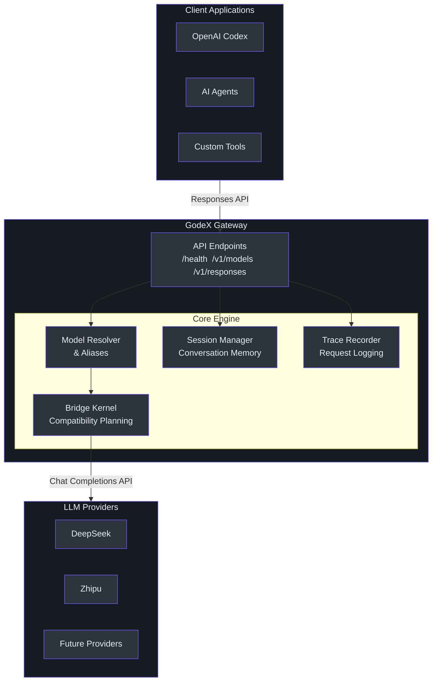
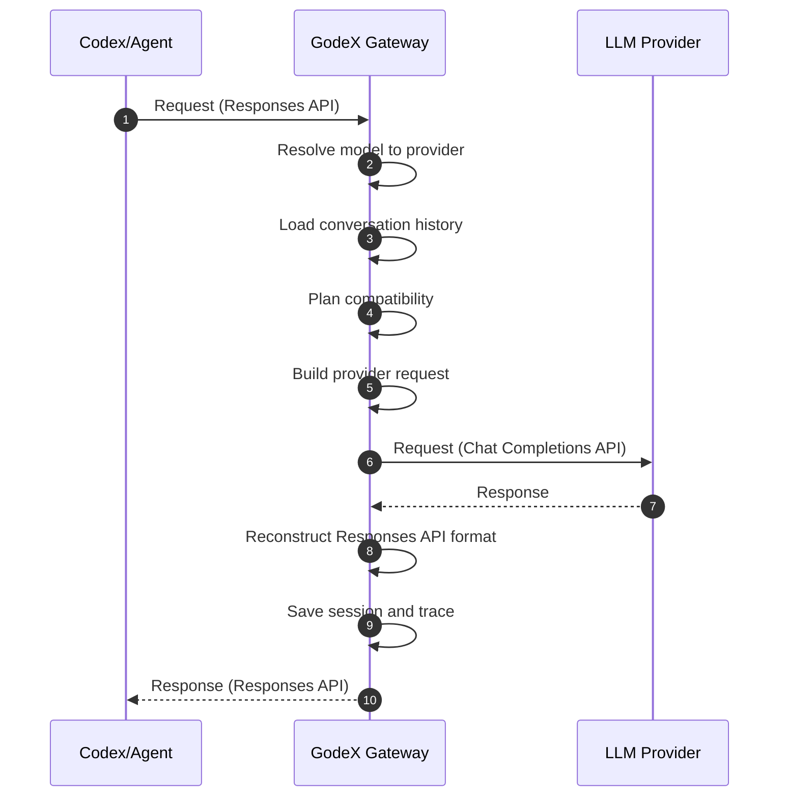

# Executive Guide to GodeX

> **Audience**: VP and director-level engineering leaders who need to understand GodeX's strategic value, architecture at a service level, risk profile, and investment thesis.
> **No code snippets in this document.**

---

## Table of Contents

- [What GodeX Does](#what-godex-does)
- [Capability Map](#capability-map)
- [Business Value](#business-value)
- [Technology Investment Thesis](#technology-investment-thesis)
- [Architecture Overview](#architecture-overview)
- [Risk Assessment](#risk-assessment)
- [Cost and Scaling Model](#cost-and-scaling-model)
- [Team Impact](#team-impact)
- [Recommendations](#recommendations)

---

## What GodeX Does

GodeX is a gateway service that makes any large language model (LLM) provider work with OpenAI's Responses API. Tools like OpenAI Codex, AI coding agents, and other applications built on the Responses API can use DeepSeek, Zhipu, or any future provider without any code changes to the application.

The gateway translates between two protocols:
- **OpenAI Responses API** -- the modern, stateful API used by Codex and agents
- **Chat Completions API** -- the standard API supported by most LLM providers

---

## Capability Map

| Capability | Description | Status |
|---|---|---|
| Multi-provider support | DeepSeek and Zhipu available today | Production |
| Model aliasing | Map friendly model names to specific provider/model combinations | Production |
| Streaming responses | Full Server-Sent Events streaming with real-time deltas | Production |
| Conversation memory | Session chains that maintain conversation context across turns | Production |
| Structured output | JSON schema validation with automatic degradation for providers that do not support it natively | Production |
| Tool compatibility | Automatic mapping of Codex tool types (shell, apply-patch, custom) to provider-supported formats | Production |
| Request tracing | Full request/response tracing stored locally for debugging and monitoring | Production |
| Reasoning support | Provider-specific reasoning effort mapping (native or boolean) | Production |
| Observability | Structured logging with console and file sinks | Production |
| Native binaries | Cross-platform compiled binaries (macOS, Linux, Windows, ARM64, x64) | Production |

---

## Business Value

### Enable Any Provider with Codex and Agents

The primary value proposition: engineering teams using OpenAI Codex or similar agent-based tools can switch to alternative LLM providers without changing their tooling. This enables:

- **Cost optimization**: Use lower-cost providers for appropriate workloads
- **Geographic compliance**: Use providers in specific regions for data sovereignty
- **Vendor diversification**: Avoid single-provider dependency
- **Performance tuning**: Route to the fastest provider for each use case

### Reduce Integration Effort from Days to Hours

Without GodeX, integrating a new provider into a Codex-based workflow requires:
- Understanding the provider's Chat Completions API differences
- Handling tool type incompatibilities
- Managing session state differently
- Implementing streaming event translation
- Testing degradation paths

With GodeX, integrating a new provider requires declaring its capabilities in a configuration file. The bridge kernel handles all translation, degradation, and error handling.

---

## Technology Investment Thesis

### The Bridge Kernel Approach

GodeX uses a "bridge kernel" architecture. This is a **compatibility planning engine** that inspects every feature of an incoming request, compares it against the target provider's declared capabilities, and makes an explicit decision for each feature:

- **Supported**: Forward as-is
- **Degraded**: Downgrade to something the provider understands
- **Ignored**: Silently drop features the provider cannot handle
- **Rejected**: Fail the request if a required feature is unavailable

This means adding a new provider is a **capability declaration exercise**, not an implementation exercise. The bridge kernel already knows how to handle every combination of supported/degraded/ignored/rejected.

### Why This Matters

Most API gateways use an adapter pattern -- one adapter per provider, each implementing translation logic. This leads to:
- N adapters, each with duplicated compatibility logic
- Inconsistent degradation behavior across providers
- Full implementation effort for each new provider

GodeX's approach means:
- One compatibility engine, shared across all providers
- Uniform degradation and diagnostics behavior
- New providers require a capability declaration, not a new adapter

---

## Architecture Overview

### Service-Level Architecture

### Request Flow at Service Level

---

## Risk Assessment

### Provider API Changes Require Spec Updates

**Risk Level**: Medium

LLM providers can change their API behavior without notice. If a provider changes how it handles tool calls, streaming events, or response formats, the corresponding ProviderSpec may need updating.

**Mitigation**: The E2E test suite uses mocked upstream responses and catches format regressions. Live provider tests run on every push to main. The bridge kernel's diagnostic system surfaces incompatibilities in logs before they become user-visible errors.

### Stream State Machine Complexity

**Risk Level**: Medium

Streaming responses use a state machine that tracks multiple concurrent output blocks (text, tool calls, reasoning). Edge cases in multi-tool-call streams with rapid finish reasons are inherently complex.

**Mitigation**: Comprehensive test coverage for all state machine transitions. Defensive assertions catch invalid transitions at runtime. The state machine is a single, well-tested module rather than spread across the codebase.

### Session Chain Depth in Long Conversations

**Risk Level**: Low

Conversation history is stored as a chain of parent pointers with a maximum depth of 64 turns. Users with very long conversations will hit this limit.

**Mitigation**: The depth limit is configurable. The system provides clear error messages when the limit is reached. Future options include session summarization or pruning.

### No Distributed Storage by Default

**Risk Level**: Low (for single-instance deployments)

Session and trace data are stored in local SQLite. This works for single-instance deployments but does not support horizontal scaling with shared state out of the box.

**Mitigation**: The storage interfaces are abstract (session store, trace store). Both can be replaced with external stores (Redis, PostgreSQL, etc.) without changing the core engine.

---

## Cost and Scaling Model

### Stateless Gateway

GodeX is fundamentally a stateless request processor. Each request is self-contained:
- Parse the incoming request
- Plan compatibility against the provider's capabilities
- Build and send the provider request
- Reconstruct and return the response

Session state and trace data are **side effects**, not part of the request path.

### Horizontal Scaling

Because the core request processing is stateless, GodeX scales horizontally behind a load balancer. The caveats:

- **Session data** is local (SQLite or memory). For multi-instance deployments, sessions must be stored in a shared backend or routed to the same instance.
- **Trace data** is local (SQLite). For centralized observability, traces must be shipped to an external system.

Both storage interfaces are abstract and can be replaced without changing the core engine.

### Resource Profile

| Resource | Usage |
|---|---|
| CPU | Low -- primarily JSON parsing and HTTP proxying |
| Memory | Moderate -- bounded by session chain depth and trace queue size |
| Disk | Moderate -- SQLite for sessions and trace (configurable) |
| Network | Proportional to request volume -- gateway adds minimal overhead |

### Async Trace Prevents Response Latency Impact

Trace recording uses an asynchronous bounded queue. Trace writes to SQLite happen in background batches and never block the response path. This means GodeX adds near-zero latency to the upstream provider's response time.

---

## Team Impact

### Reduces Integration Effort from Days to Hours

| Task | Without GodeX | With GodeX |
|---|---|---|
| Add a new LLM provider to Codex | Days of adapter development and testing | Hours of capability declaration and config |
| Switch default provider | Code changes in every consuming application | Config change in godex.yaml |
| Debug provider-specific issues | Inspect raw API calls | Structured trace with compatibility diagnostics |
| Monitor tool compatibility | Manual testing per provider | Automatic diagnostics in logs |

### Cross-Functional Benefits

- **Engineering**: Less integration code, more time on product features
- **Platform**: Single gateway to monitor, configure, and operate
- **Security**: API keys centralized in config, not scattered across applications
- **Finance**: Easy provider switching for cost optimization

---

## Recommendations

### Invest in Provider Conformance Testing

The bridge kernel depends on accurate capability declarations. If a provider's actual behavior diverges from its declared capabilities, degradation paths may produce incorrect output.

**Recommendation**: Establish a provider conformance test suite that runs against live providers on a regular cadence (not just on push to main). Monitor for capability regressions.

### Monitor Trace for Provider-Specific Issues

The trace system captures every request, response, usage metric, and compatibility diagnostic. This is a goldmine for understanding provider behavior in production.

**Recommendation**: Build dashboards on trace data showing:
- Per-provider latency and error rates
- Compatibility degradation frequency by feature
- Token usage patterns by provider and model
- Session chain depth distribution

### Plan for External Storage

For production deployments beyond single-instance, the local SQLite storage for sessions and traces will become a bottleneck.

**Recommendation**: Plan the migration path to external session and trace stores. The interfaces are already abstract, so the effort is implementing new store backends, not refactoring the core engine.

### Establish Provider Onboarding Runbook

As the number of supported providers grows, a standardized onboarding process ensures consistency.

**Recommendation**: Create a provider onboarding checklist:
1. Obtain provider API documentation
2. Define `ProviderSpec` with capabilities
3. Implement provider-specific hooks (request patching, usage mapping, stream delta extraction)
4. Add provider protocol DTOs
5. Write provider conformance tests
6. Add example config to documentation
7. Enable in CI
