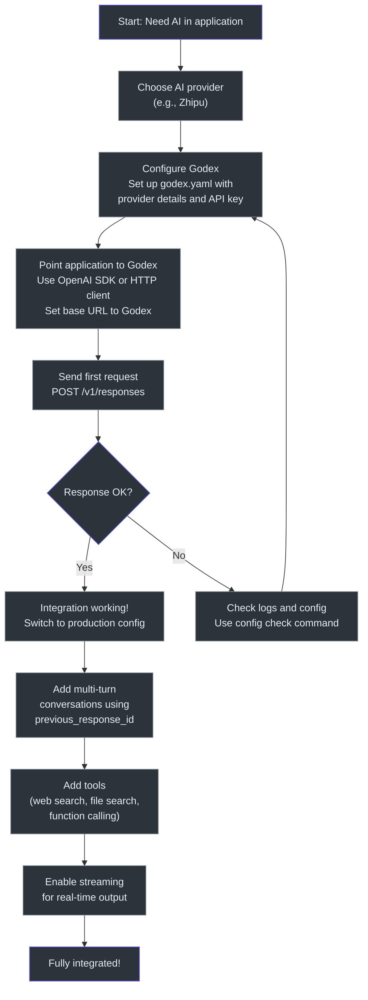
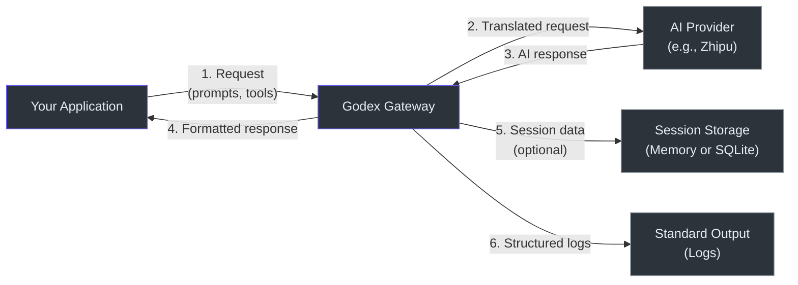

# Product Manager Guide

This guide is written for product managers, business analysts, and non-engineering stakeholders. It explains what Godex does, who uses it, what you can and cannot do today, and answers common questions.

## What Is Godex?

Godex is a **translator** that sits between your applications and AI language models. Here is the simplest way to think about it:

Your applications speak one language (the OpenAI Responses API format). Your AI providers speak different languages (each has its own API format). Godex translates between them in real time.

This means your teams write integration code **once** and can switch AI providers by changing a configuration file -- no application code changes needed.

### A Real-World Analogy

Imagine you have a customer support team that speaks English, but your customers speak 20 different languages. You could hire translators for each language (direct integration with each provider), or you could use a translation service that handles all languages (Godex). The translation service approach means:
- Your support team only learns one system
- Adding a new language is a configuration change, not a hiring process
- If a translator is unavailable, you can route to another without your team noticing

## Who Uses Godex?

| User Persona | What They Do With Godex | Success Criteria |
|-------------|------------------------|------------------|
| **Application Developer** | Sends AI requests through Godex using the OpenAI SDK or any HTTP client | Requests succeed; responses are in the expected format |
| **Platform Engineer** | Configures which AI providers Godex connects to and how models are routed | Providers are reachable; model routing works as configured |
| **DevOps Engineer** | Deploys and monitors Godex instances, manages configuration and secrets | Service is healthy; no dropped connections; logs are useful |
| **Product Owner** | Defines which AI capabilities are available to applications through the gateway | Feature requirements are met; limitations are understood |
| **Security Engineer** | Ensures API keys are protected and data flows are compliant | Secrets are not exposed; data stays within approved boundaries |

## User Journey: First-Time Setup



### Typical Timeline

| Phase | Duration | Activities |
|-------|----------|-----------|
| **Discovery** | 1-2 days | Understand Godex capabilities, evaluate fit |
| **Setup** | 1-2 hours | Install, configure provider, start gateway |
| **Integration** | 1-3 days | Update application to use Responses API format |
| **Testing** | 2-5 days | Verify all features work; test edge cases |
| **Production** | 1-2 days | Deploy with production config, monitoring |

Total time to production: approximately 1-2 weeks for a typical integration.

## User Journey: Switching Providers

```mermaid
sequenceDiagram
    autonumber
    actor PM as Product Manager
    actor PE as Platform Engineer
    participant G as Godex
    participant Old as Old Provider
    participant New as New Provider

    PM->>PM: Business decision to<br>switch providers
    PM->>PE: Request provider switch
    PE->>PE: Add new provider<br>to godex.yaml
    PE->>G: Restart with new config
    Note over G: Both providers now available
    PE->>PE: Update default_provider<br>or update model routing
    PE->>G: Restart with updated routing
    G->>New: Requests now go to<br>new provider
    Note over G: Applications continue<br>working unchanged
    PE->>PM: Provider switch complete<br>No application changes needed
    PE->>PE: Remove old provider<br>from config when ready

    style PM fill:#2d333b,stroke:#6d5dfc,color:#e6edf3
    style PE fill:#2d333b,stroke:#8b949e,color:#e6edf3
    style G fill:#2d333b,stroke:#8b949e,color:#e6edf3
    style Old fill:#2d333b,stroke:#8b949e,color:#e6edf3
    style New fill:#2d333b,stroke:#8b949e,color:#e6edf3
```

**Key point**: Application teams are not involved in the provider switch. They continue sending requests as before. Only the platform engineer changes configuration.

## User Journey: Adding Multi-Turn Conversations

```mermaid
sequenceDiagram
    autonumber
    actor App as Application
    participant G as Godex
    participant Store as Session Store
    participant Prov as AI Provider

    App->>G: Request 1: "What is TypeScript?"
    G->>Prov: Forward request
    Prov-->>G: "TypeScript is a typed<br>superset of JavaScript"
    G->>Store: Save session<br>(id: resp_001)
    G-->>App: Response with id: resp_001

    App->>G: Request 2: "Tell me more about<br>its type system"
    Note over App: Includes previous_response_id: resp_001
    G->>Store: Look up resp_001
    Store-->>G: Previous conversation
    G->>G: Rebuild full chat history
    G->>Prov: Forward with full context
    Prov-->>G: "TypeScript's type system<br>includes generics, unions..."
    G->>Store: Save session<br>(id: resp_002)
    G-->>App: Response with id: resp_002

    style App fill:#2d333b,stroke:#6d5dfc,color:#e6edf3
    style G fill:#2d333b,stroke:#8b949e,color:#e6edf3
    style Store fill:#2d333b,stroke:#8b949e,color:#e6edf3
    style Prov fill:#2d333b,stroke:#8b949e,color:#e6edf3
```

**Key point**: The application only needs to remember one ID (`previous_response_id`). Godex handles looking up and reconstructing the entire conversation history.

## Feature Capability Map

### Supported Today

| Feature | Description | User Benefit |
|---------|-------------|-------------|
| **Text Generation** | Send prompts, receive AI-generated text | Core use case: content generation, summarization, analysis |
| **Multi-Turn Conversations** | Server-side conversation history across multiple requests | Build chatbots and agents without managing history on the client |
| **Streaming Output** | Receive AI output token-by-token in real time | Responsive user experiences; users see output as it generates |
| **Function Calling** | Define tools the AI can invoke during generation | Build AI agents that can take actions (API calls, data lookups) |
| **Web Search** | AI can search the web during generation | Ground responses in current information |
| **File Search** | AI can search through uploaded documents | Build knowledge-base-powered applications |
| **MCP (Model Context Protocol)** | Connect to external tool servers | Integrate with existing tool ecosystems |
| **Reasoning** | AI shows its reasoning process | Understand how the AI arrived at its answer |
| **Structured Output** | Force AI output to match a specific format | Reliable integration with downstream systems |
| **Model Routing** | Route different model names to different providers or models | A/B testing, cost optimization, gradual migration |
| **Model Aliases** | Map friendly model names to provider-specific names | Application code uses stable names; backend mapping changes |
| **Wildcard Fallback** | Route any unrecognized model name to a default | Simplify configuration; one setting covers all models |
| **Health Checks** | Built-in endpoint to verify gateway is running | Load balancer integration, monitoring dashboards |
| **Session Persistence** | Store conversation history in memory or database | Resume conversations after restarts; support compliance needs |
| **Graceful Shutdown** | Clean termination on SIGINT/SIGTERM | No dropped connections during deployments |
| **Structured Logging** | JSON-formatted logs with request IDs and context | Efficient log analysis and debugging |

### How Each Feature Works (Non-Technical)

**Multi-Turn Conversations**: When your application sends a request, it can include a reference to a previous response. Godex looks up the full conversation history and sends it to the AI provider automatically. Your application does not need to store or manage the history.

**Streaming Output**: Instead of waiting for the entire response, your application receives pieces of the response as they are generated. This is like watching someone type in real time versus waiting for a complete letter.

**Model Routing**: You can configure rules like "when someone asks for model X, use provider Y's model Z." This means you can switch providers or models without changing any application code.

**Function Calling**: You define tools (functions) that the AI can call. When the AI decides it needs information or wants to take an action, it returns a tool call instead of a text response. Your application executes the tool and sends the result back.

### Coming Soon (On the Roadmap)

| Feature | Description | Status |
|---------|-------------|--------|
| **Additional Providers** | Support for providers beyond Zhipu (OpenAI, Anthropic, etc.) | Architecture supports it; requires adapter implementation |
| **Redis Session Store** | Redis-backed sessions for distributed deployments | Interface defined; implementation needed |
| **Metrics Dashboard** | Prometheus-compatible metrics for request counts, latency, errors | Planned |
| **Rate Limiting** | Per-client or per-model rate limiting | Planned |
| **Request Logging** | Detailed request/response logging for auditing | Partial (structured logs exist; enhanced format planned) |
| **Authentication** | API key validation on incoming requests | Planned |
| **Admin API** | Runtime configuration changes without restart | Under consideration |

## Known Limitations

| Limitation | Impact | Workaround | Priority to Fix |
|-----------|--------|-----------|----------------|
| **Only Zhipu provider today** | Cannot connect to OpenAI, Anthropic, or other providers directly | Switch to Zhipu or wait for additional provider support | High |
| **No distributed sessions** | Cannot share sessions across multiple Godex instances | Use single instance or accept session isolation per instance | Medium |
| **No built-in authentication** | No API key or token validation on incoming requests | Deploy behind an API gateway or reverse proxy that handles authentication | Medium |
| **No rate limiting** | No protection against excessive request volume | Deploy behind a rate-limiting proxy (e.g., Nginx, Kong) | Medium |
| **No request queuing** | If all upstream connections are busy, new requests fail immediately | Ensure upstream provider has sufficient capacity | Low |
| **Session chain depth limit** | Conversations cannot exceed 64 turns in a chain | Design conversations to start new chains periodically | Low |
| **No conversation branching UI** | Multiple responses can reference the same parent, but there is no dashboard for this | Track conversation flows in your application | Low |
| **SQLite concurrent writes** | SQLite handles one write at a time; high write throughput may queue | Use memory store for high-throughput scenarios or implement Redis backend | Medium |
| **No request/response caching** | Every request goes to the provider, even if identical to a previous one | Implement caching in your application layer | Low |
| **No admin dashboard** | Configuration changes require file editing and restart | Use infrastructure-as-code practices for config management | Low |

## Data and Privacy Overview

### What Data Does Godex Process?

| Data Type | What It Contains | Where It Goes |
|-----------|-----------------|---------------|
| **Request Body** | Your prompts, instructions, tool definitions, and model selection | Translated and forwarded to the configured AI provider |
| **Response Body** | AI-generated text, reasoning, tool calls | Returned to your application; optionally stored in session |
| **Session Data** | Previous request/response pairs for multi-turn conversations | Stored locally (memory or SQLite); never sent to third parties |
| **Configuration** | Provider API keys, base URLs, model mappings | Loaded from local YAML file; API keys sent only to configured providers |
| **Logs** | Request IDs, model names, error codes, timestamps | Written to standard output; no request content logged by default |

### Data Flow Diagram



### Privacy Considerations

1. **Godex does not train models**: It is purely a pass-through gateway. Your data is not used for training.

2. **Session data stays local**: Conversation history stored in sessions remains on the Godex instance (memory or local SQLite file). It is never transmitted to any third party beyond the configured AI provider.

3. **API keys are your responsibility**: Godex sends your provider API key to the configured provider. Protect it using environment variables (the `${ENV_VAR}` syntax in config files).

4. **No telemetry**: Godex does not send usage data, analytics, or telemetry to the project maintainers or any third party.

5. **Open source**: The entire codebase is available for audit. You can verify exactly what happens with your data.

6. **Self-hosted**: Godex runs on your infrastructure. You control the network, the storage, and the logs. No data leaves your environment except to the AI provider you configured.

## FAQ

### General

**Q: What is the OpenAI Responses API?**
A: It is OpenAI's API format for AI interactions. It supports multi-turn conversations, tool use, reasoning, and streaming. It is more capable than the older Chat Completions API format.

**Q: Do I need to use the OpenAI SDK to talk to Godex?**
A: No. You can use any HTTP client. Godex accepts standard HTTP POST requests to `/v1/responses`. The OpenAI SDK works because Godex is compatible with its expected API format.

**Q: Can I use Godex with my existing application that uses the Chat Completions API?**
A: Not directly. Godex speaks the Responses API format, not the Chat Completions format. You would need to update your application to use the Responses API format, or use a different gateway.

**Q: Is Godex free?**
A: Godex is open source under the Apache-2.0 license. There are no licensing costs. You pay only for the AI provider API calls that Godex forwards on your behalf.

### Setup and Configuration

**Q: How do I get started?**
A: Install Bun, clone the repository, run `bun install`, create a `godex.yaml` config file (use `godex init` for interactive setup), and run `bun run dev`.

**Q: Where do I put my API keys?**
A: In `godex.yaml`, use the `${ENV_VAR}` syntax. For example: `api_key: ${ZHIPU_API_KEY}`. Then set the `ZHIPU_API_KEY` environment variable. Never hardcode API keys in the config file.

**Q: Can I run multiple providers at the same time?**
A: Yes. Configure multiple providers in the `providers` section of `godex.yaml`. Use the `default_provider` setting to choose which one handles requests that do not specify a provider explicitly.

**Q: How do I change which model is used?**
A: In your request, set the `model` field. You can use `"provider/model-name"` to explicitly choose a provider, or just `"model-name"` to use the default provider. You can also configure aliases in `godex.yaml` so that `"gpt-4"` maps to your preferred model.

### Features and Capabilities

**Q: Does Godex support streaming?**
A: Yes. Set `"stream": true` in your request body. You will receive Server-Sent Events (SSE) with real-time output.

**Q: How do multi-turn conversations work?**
A: When you receive a response, it has an `id`. In your next request, include `"previous_response_id": "that-id"`. Godex looks up the full conversation history and sends it to the AI provider.

**Q: Can the AI use tools?**
A: Yes. Godex supports function calling, web search, file search, shell execution, and MCP (Model Context Protocol) tools. The exact tools available depend on the AI provider's capabilities.

**Q: What is MCP?**
A: MCP (Model Context Protocol) is a standard for connecting AI models to external tools and data sources. Godex supports passing MCP tool configurations through to the provider.

**Q: What is the difference between in-memory and SQLite sessions?**
A: In-memory sessions are stored in the Godex process memory. They are fast but lost when the process restarts. SQLite sessions are stored in a local database file and survive restarts. For production, use SQLite. For development and testing, in-memory is simpler.

**Q: Can I disable session storage?**
A: Yes. Set `"store": false` in your request body. Godex will not save the session for that request. This is useful for one-off queries where you do not need conversation history.

### Operations

**Q: How do I monitor Godex?**
A: Godex writes structured logs to standard output. It also provides a `/health` endpoint for health checks. Use standard monitoring tools to collect logs and check the health endpoint.

**Q: How do I scale Godex?**
A: Run multiple instances behind a load balancer. For session persistence across instances, use SQLite on a shared volume or implement a distributed session store.

**Q: What happens if the AI provider is down?**
A: Godex returns a structured error response with a clear error code and message. Your application can handle the error gracefully (retry, fallback to another provider, show an error message).

**Q: Can I deploy Godex in a Docker container?**
A: Yes. Godex is a single process. Build it with `bun run build` to create a standalone binary, then package it in a container with Bun installed.

**Q: What ports does Godex use?**
A: By default, port 5678 in production and 13145 in development. You can configure the port in `godex.yaml` or via the `--port` CLI flag.

### Limitations

**Q: Why is only Zhipu supported?**
A: Godex is in early development. The adapter architecture is designed to support any provider. Zhipu is the first implemented provider. Adding more providers is on the roadmap.

**Q: Is there a web dashboard?**
A: Not yet. Configuration is file-based. Monitoring is through logs and the health endpoint.

**Q: Does Godex cache responses?**
A: No. Each request is forwarded to the AI provider. Response caching is not currently supported.

**Q: What is the maximum conversation length?**
A: 64 turns in a session chain by default. This prevents infinite loops in conversation chains. The limit can be configured.

**Q: Does Godex add latency?**
A: Godex adds minimal overhead (in-process translation, no network hops). The dominant latency is the AI provider's response time.

**Q: Can I use Godex without sessions?**
A: Yes. If you do not include `previous_response_id` in your requests, no session data is stored. You can also set `"store": false` to explicitly disable session persistence for individual requests.
