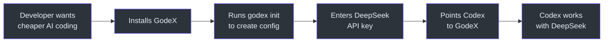
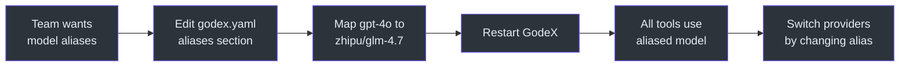
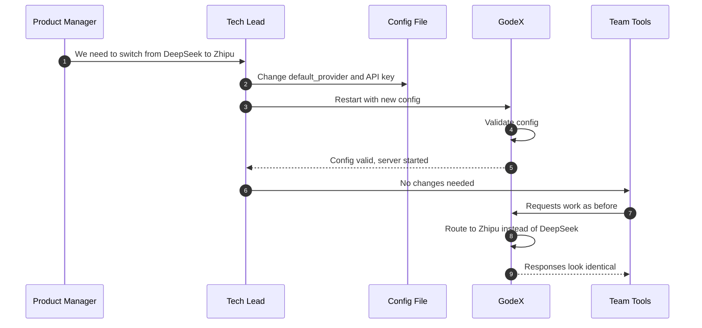
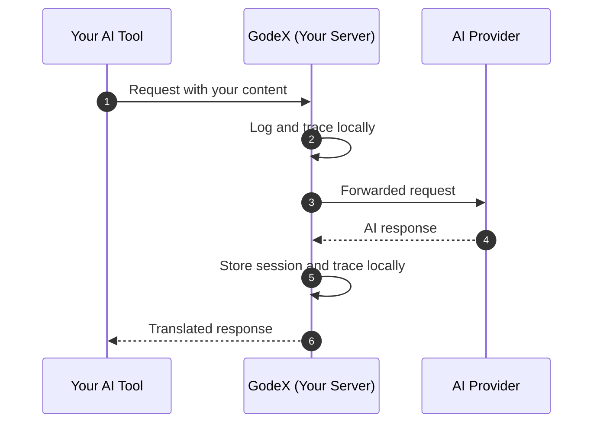

# Product Manager Guide to GodeX

> **Audience**: Product managers, project managers, and non-engineering stakeholders who need to understand what GodeX does, how it helps users, and what to watch out for.
> **No engineering jargon in this document.**

---

## Table of Contents

- [What GodeX Does](#what-godex-does)
- [User Journey Maps](#user-journey-maps)
- [Feature Capability Map](#feature-capability-map)
- [Known Limitations](#known-limitations)
- [Data and Privacy Overview](#data-and-privacy-overview)
- [Frequently Asked Questions](#frequently-asked-questions)

---

## What GodeX Does

GodeX makes AI coding assistants work with **any** AI provider, not just OpenAI.

Tools like OpenAI Codex are designed to work exclusively with OpenAI's API. If your team wants to use a different AI provider -- like DeepSeek for lower costs or Zhipu for Chinese-language support -- you would normally need to rewrite your tools.

GodeX sits between your coding assistant and the AI provider, translating requests and responses automatically. Your tools think they are talking to OpenAI, but GodeX routes them to whichever provider you choose.

Think of it like a universal adapter for AI services.

---

## User Journey Maps

### Journey 1: Developer Wants to Use DeepSeek with Codex

**Steps:**

1. **Developer discovers** that OpenAI Codex only works with OpenAI models, but they want to use DeepSeek for cost savings
2. **Finds GodeX** and installs it (a single binary)
3. **Runs the setup wizard** (`godex init`) which asks a few questions:
   - Which provider? (DeepSeek)
   - API key? (pasted from DeepSeek dashboard)
   - Default model? (deepseek-chat)
4. **Starts GodeX** (`godex serve`)
5. **Points Codex** to GodeX instead of OpenAI (change the API base URL)
6. **Everything works** -- Codex sends requests to GodeX, GodeX translates them to DeepSeek format, translates the responses back, and Codex sees normal OpenAI-style responses

**Time from decision to working setup: Under 10 minutes.**

### Journey 2: Team Wants Model Aliasing

**Steps:**

1. **Team lead** wants tools that reference "gpt-4o" to actually use Zhipu's GLM model
2. **Edits the config file** to add model aliases:
   - `gpt-4o` maps to `zhipu/glm-4.7`
3. **Restarts GodeX** (or it picks up changes automatically in dev mode)
4. **All team tools** now use the aliased model transparently
5. **To switch providers later**, just change the alias -- no tool changes needed

**Time: Under 5 minutes to configure, instant to change later.**

### Journey 3: Team Switches Default Provider

---

## Feature Capability Map

### Multi-Provider Support

GodeX works with multiple AI providers. Currently supported:

| Provider | Best For | Notes |
|---|---|---|
| DeepSeek | Cost-effective coding assistance | Strong tool support, native reasoning |
| Zhipu (GLM) | Chinese-language support, alternative provider | Supports web search tools |

Adding more providers requires declaring their capabilities in a configuration file -- no code changes to your tools.

### Model Aliasing

Create friendly names for models that map to specific provider/model combinations. This allows:

- Tools to use standard model names (like "gpt-4o") while actually using different providers
- Easy switching between providers without changing tool configurations
- Team-wide model standardization

### Streaming Responses

GodeX supports real-time streaming responses. As the AI generates text, it is delivered to your tool immediately, character by character, without waiting for the full response. This provides the same responsive experience as using OpenAI directly.

### Conversation Memory (Sessions)

GodeX remembers previous turns in a conversation. When a tool sends a follow-up request referencing a previous response, GodeX:

- Looks up the entire conversation history
- Includes it as context for the new request
- Returns the response with a new conversation reference

Session storage options:
- **Memory**: Fast, but lost when GodeX restarts
- **SQLite**: Persistent across restarts, stored locally

### Structured Output Validation

Some AI tools need responses in specific formats (like JSON with a particular structure). GodeX handles two scenarios:

- **When the provider supports structured output natively**: Forward the request as-is
- **When the provider only supports basic JSON**: GodeX instructs the provider to output JSON and validates the result against the expected structure afterward

This means your tools can request structured output regardless of which provider is being used.

### Request Tracing and Monitoring

Every request that passes through GodeX is recorded with:

- Which provider and model were used
- How long the request took
- How many tokens were consumed
- Whether any features were downgraded (compatibility adjustments)
- Any errors that occurred

This data is stored locally in a database and can be used for:
- Debugging provider-specific issues
- Monitoring costs and usage patterns
- Understanding which features are being degraded

Tracing can be enabled or disabled in the config file. By default, it captures summary information. Full request/response content capture can be enabled for detailed debugging.

### Tool Compatibility Management

AI coding tools like Codex use specific tool types (file editing, shell commands, web search). Not all AI providers support all tool types. GodeX handles this automatically:

- **Provider supports the tool**: Works as expected
- **Provider supports a similar tool**: GodeX translates between the formats
- **Provider does not support the tool**: GodeX drops the tool and logs a warning

This ensures your tools work with any provider, even when the provider does not support every feature.

---

## Known Limitations

### Some Features Are Degraded, Not Identical

When an AI provider does not support a feature that the tool requests, GodeX degrades to the closest alternative. This means the feature works, but the behavior may differ slightly from OpenAI's native implementation.

**Example**: If a tool requests structured JSON output with a specific schema, and the provider only supports basic JSON mode, GodeX will ask the provider for JSON and then validate it against the schema. If the provider returns invalid JSON, the tool will receive an error.

### Session Chains Have a Depth Limit

Conversation history is stored as a chain of linked responses. The maximum chain length is **64 turns**. For most conversations this is more than enough, but extremely long conversations will need to start a new session.

The limit is configurable for deployments that need longer conversations.

### Trace Payloads Can Be Large

When full payload capture is enabled (`capture_payload: true` in the config), GodeX stores the complete request and response content in the trace database. For large conversations or responses, this can consume significant disk space.

By default, only summary information is captured. Full payload capture is recommended only for debugging sessions.

### Not All Tool Types Work Everywhere

GodeX maps tool types to the closest provider-supported equivalent. In most cases this works well, but some provider-specific tool types (like web search) are only available on providers that support them.

### Provider-Specific Quirks Exist

Each AI provider has slight differences in how they handle edge cases. GodeX smooths over most of these differences, but occasionally a provider may return unexpected results. The trace system helps diagnose these issues.

---

## Data and Privacy Overview

### API Keys

- API keys are stored in the `godex.yaml` configuration file on the machine where GodeX runs
- Environment variable interpolation is supported (e.g., `${DEEPSEEK_API_KEY}`) so keys do not need to be stored in the config file directly
- API keys are sent only to the respective AI provider during requests
- GodeX does not send API keys or credentials to any third party

### Session Data

- Conversation history is stored **locally** on the machine where GodeX runs (in memory or SQLite)
- Session data contains the full request and response content for each turn in the conversation
- Session data is not sent to any third party
- When using in-memory sessions, data is lost when GodeX restarts

### Trace Data

- Request and response traces are stored **locally** in SQLite
- By default, traces contain summary information (provider, model, timing, token counts)
- When full payload capture is enabled, traces contain the complete request and response content
- Trace data may contain sensitive information from conversations (code snippets, instructions, responses)
- Trace data is not sent to any third party
- Treat trace databases as sensitive files -- do not commit them to version control

### Data Flow

**Key point**: GodeX runs on your infrastructure. No data is sent to the GodeX project or any third party. Data flows only between your tool, your GodeX instance, and your chosen AI provider.

---

## Frequently Asked Questions

### What providers are supported?

Currently, GodeX supports:

- **DeepSeek** -- A cost-effective AI provider with strong coding and reasoning capabilities
- **Zhipu (GLM)** -- A Chinese AI provider with strong multilingual support

Additional providers can be added by declaring their capabilities in a configuration file.

### How does model aliasing work?

Model aliasing lets you create a mapping from a model name your tools use to the actual provider and model that should handle the request. For example:

- You configure the alias "gpt-4o" to map to "zhipu/glm-4.7"
- Your tools request "gpt-4o"
- GodeX sees the alias and routes the request to Zhipu's GLM model
- Your tools receive a response as if it came from "gpt-4o"

This means you can switch providers without changing any tool configurations -- just update the alias in GodeX's config file.

### What about streaming?

GodeX fully supports streaming responses. When your tool requests a streaming response, GodeX:

1. Sends a streaming request to the AI provider
2. Translates each piece of the response as it arrives
3. Forwards the translated pieces to your tool in real-time

The experience is the same as using OpenAI directly -- text appears progressively as the AI generates it.

### Is it production-ready?

GodeX is a young project with a solid foundation:

- **What is solid**: The core translation engine (bridge kernel) is well-tested with comprehensive unit, integration, and end-to-end tests. The error handling is structured and thorough. Streaming works correctly with full state machine management.

- **What to watch**: The project is actively developed. Provider capabilities may need updates as providers change their APIs. The current storage options (local SQLite) are suitable for single-instance deployments but may need external storage for multi-instance setups.

- **Recommendation**: Use GodeX for team-level and development deployments today. For large-scale production deployments, monitor the project's maturity and the external storage support roadmap.

### How does GodeX handle provider differences?

GodeX uses a four-level compatibility system for every feature of every request:

| Level | What It Means | Example |
|---|---|---|
| **Supported** | The provider handles this feature natively | Temperature settings on DeepSeek |
| **Degraded** | GodeX translates to the closest alternative | JSON schema output downgraded to basic JSON with validation |
| **Ignored** | The feature is silently dropped | Metadata that GodeX handles but the provider does not need |
| **Rejected** | The request cannot be fulfilled | A feature the provider has no alternative for |

Every degradation and rejection is logged, so you always know what is happening.

### How do I switch providers?

1. Edit `godex.yaml` to change the `default_provider` and add the new provider's credentials
2. Restart GodeX (or let it pick up changes in dev mode)
3. Your tools continue working without any changes

If you are using model aliases, you can also change just the alias mapping to route specific models to different providers.

### What happens if the AI provider goes down?

GodeX will return an error to your tool. The error will include details about the upstream failure. GodeX does not currently provide automatic failover between providers, but this is a potential future feature.

### Can I use GodeX with multiple providers at the same time?

Yes. You can configure multiple providers in `godex.yaml` and route different models to different providers using aliases. For example:

- "gpt-4o" -> DeepSeek for coding tasks
- "gpt-4o-search" -> Zhipu for tasks requiring web search

### Does GodeX add latency to requests?

GodeX adds minimal latency -- typically under 10 milliseconds for the translation and routing. The majority of response time comes from the AI provider itself. GodeX's async trace recording ensures that logging and monitoring do not add any latency to the response path.
