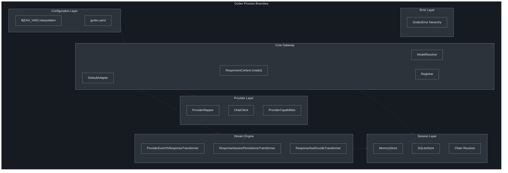
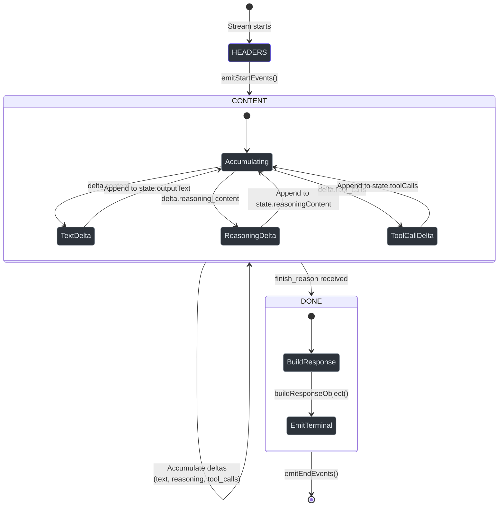
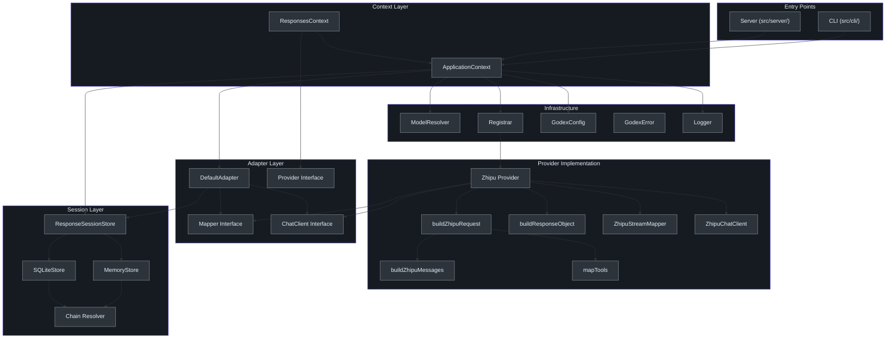

# Staff Engineer Guide

## The ONE Core Insight

Godex is a **protocol translation gateway** that converts OpenAI Responses API requests into upstream provider-specific Chat Completions API calls, with streaming handled via Web Streams `TransformStream` pipelines. Everything else follows from this: the provider abstraction, the mapper pattern, the session chain, and the stream state machine.

The Responses API and Chat Completions API are fundamentally different protocols:

| Dimension | Responses API (Godex input) | Chat Completions (Upstream) |
|-----------|---------------------------|-----------------------------|
| Input format | `input` items (typed objects or string) | `messages` array (role/content pairs) |
| Multi-turn | `previous_response_id` (server-side chain) | Client sends full message history |
| Output format | `output` items (typed objects) | `choices[0].message` |
| Streaming events | Typed events (`response.output_text.delta`, etc.) | `data: {choices[0].delta}` SSE chunks |
| Tools | Rich types (web_search, file_search, mcp, shell) | Function calls only |
| Reasoning | `reasoning` items with summary | `reasoning_content` field |

Godex bridges these gaps with zero client-side changes.

## Comparison: Godex vs Alternatives

| Aspect | Direct API Calls | Godex Gateway | Other Gateways (LiteLLM, OpenRouter) |
|--------|-----------------|---------------|--------------------------------------|
| Client protocol | Provider-specific | OpenAI Responses API | OpenAI Chat Completions |
| Multi-turn history | Client manages | Server-side sessions | Client manages |
| Streaming protocol | Provider-specific SSE | Standardized SSE | Pass-through |
| Tool type mapping | Client handles | Provider adapter handles | Limited |
| Model routing | Hard-coded | Configurable selector | Configurable |
| Protocol complexity | Per-provider | One protocol | One protocol |
| Session persistence | None | Memory or SQLite | None |
| New provider support | Client rewrite | Implement adapter | Provider config |

## Architecture Overview



## Adapter Pattern: Pseudocode

The core adapter pattern, expressed in Python for cross-language clarity:

```python
# Pseudocode: Godex Adapter Pattern
from abc import ABC, abstractmethod
from dataclasses import dataclass
from typing import TypeVar, Generic, AsyncIterator

TReq = TypeVar("TReq")  # Provider-specific request
TRes = TypeVar("TRes")  # Provider-specific response
TChunk = TypeVar("TChunk")  # Provider-specific SSE chunk

@dataclass
class ResponsesContext:
    request: ResponseCreateRequest
    session: SessionSnapshot | None
    resolved: ResolvedModel
    provider: "Provider"

class RequestMapper(ABC, Generic[TReq]):
    @abstractmethod
    async def map(self, ctx: ResponsesContext) -> TReq: ...

class ResponseMapper(ABC, Generic[TRes]):
    @abstractmethod
    async def map(self, ctx: ResponsesContext, result: TRes) -> ResponseObject: ...

class StreamMapper(ABC, Generic[TChunk]):
    @abstractmethod
    async def map(self, ctx, event: SSEEvent[TChunk]) -> list[ResponseStreamEvent]: ...

    @abstractmethod
    async def build_response_object(self, ctx, state: StreamState) -> ResponseObject: ...

@dataclass
class Provider(Generic[TReq, TRes, TChunk]):
    name: str
    mapper: tuple[RequestMapper[TReq], ResponseMapper[TRes], StreamMapper[TChunk]]
    chat_client: ChatClient[TReq, TRes, TChunk]
    capabilities: ProviderCapabilities

class Adapter(ABC):
    @abstractmethod
    async def request(self, ctx: ResponsesContext) -> ResponseObject:
        provider = ctx.provider
        upstream_req = await provider.mapper.request.map(ctx)
        upstream_res = await provider.chat_client.chat(upstream_req)
        response = await provider.mapper.response.map(ctx, upstream_res)
        await save_session(ctx, response)
        return response

    @abstractmethod
    async def stream(self, ctx: ResponsesContext) -> AsyncIterator[ResponseStreamEvent]:
        provider = ctx.provider
        upstream_req = await provider.mapper.request.map(ctx)
        upstream_stream = await provider.chat_client.stream_chat(upstream_req)

        # Pipeline: translate events -> persist session -> encode SSE
        async for event in upstream_stream:
            response_events = await provider.mapper.stream.map(ctx, event)
            for evt in response_events:
                yield evt
                if is_terminal(evt):
                    await save_session(ctx, evt.response)
```

## Data Flow: Non-Streaming Path

```mermaid
sequenceDiagram
    autonumber
    participant C as Client
    participant H as handleResponses
    participant A as DefaultAdapter
    participant M as ProviderMapper.request
    participant CC as ChatClient
    participant R as ProviderMapper.response
    participant S as SessionStore

    C->>H: POST /v1/responses
    H->>H: ResponsesContext.create()
    H->>A: adapter.request(ctx)
    A->>M: map(ctx) -> upstream_req
    M-->>A: ChatCompletionTextRequest
    A->>CC: chat(upstream_req)
    CC->>CC: HTTP POST to provider
    CC-->>A: ChatCompletionResponse
    A->>R: map(ctx, upstream_res)
    R-->>A: ResponseObject
    A->>S: save(session)
    A-->>H: ResponseObject
    H-->>C: 200 JSON

    style C fill:#2d333b,stroke:#6d5dfc,color:#e6edf3
    style H fill:#2d333b,stroke:#8b949e,color:#e6edf3
    style A fill:#2d333b,stroke:#8b949e,color:#e6edf3
    style M fill:#2d333b,stroke:#8b949e,color:#e6edf3
    style CC fill:#2d333b,stroke:#8b949e,color:#e6edf3
    style R fill:#2d333b,stroke:#8b949e,color:#e6edf3
    style S fill:#2d333b,stroke:#8b949e,color:#e6edf3
```

## Data Flow: Streaming Path

```mermaid
sequenceDiagram
    autonumber
    participant C as Client
    participant H as handleResponses
    participant A as DefaultAdapter
    participant CC as ChatClient
    participant T1 as ProviderEventToResponse
    participant T2 as SessionPersistence
    participant T3 as SSEEncode

    C->>H: POST /v1/responses (stream=true)
    H->>H: ResponsesContext.create()
    H->>A: adapter.stream(ctx)
    A->>A: mapper.request.map(ctx)
    A->>CC: streamChat(req)
    CC-->>A: ReadableStream of SSE chunks

    A->>T1: pipeTransform(upstream, T1)
    Note over T1: StreamMapper.map() per chunk

    A->>T2: pipeTransform(eventStream, T2)
    Note over T2: Intercept terminal events<br>Save session

    A->>T3: pipeTransform(persistedStream, T3)
    Note over T3: Serialize to SSE bytes

    A-->>H: ReadableStream of Uint8Array
    H-->>C: 200 SSE stream

    loop Each upstream chunk
        CC->>T1: JsonServerSentEvent
        T1->>T2: ResponseStreamEvent[]
        T2->>T3: ResponseStreamEvent (pass-through)
        T3->>C: SSE bytes
    end

    T3->>C: data: [DONE]

    style C fill:#2d333b,stroke:#6d5dfc,color:#e6edf3
    style H fill:#2d333b,stroke:#8b949e,color:#e6edf3
    style A fill:#2d333b,stroke:#8b949e,color:#e6edf3
    style CC fill:#2d333b,stroke:#8b949e,color:#e6edf3
    style T1 fill:#2d333b,stroke:#8b949e,color:#e6edf3
    style T2 fill:#2d333b,stroke:#8b949e,color:#e6edf3
    style T3 fill:#2d333b,stroke:#8b949e,color:#e6edf3
```

## Stream State Machine

The stream pipeline operates as a state machine with three phases, tracked by [`StreamPhase`](https://github.com/Ahoo-Wang/Godex/blob/main/src/adapter/mapper/stream-state.ts):



The `StreamState` accumulates data across the CONTENT phase and is used by `buildResponseObject` in the DONE phase to construct the final `ResponseObject` for session persistence.

## Design Tradeoffs

### 1. In-Memory vs SQLite Sessions

**Decision**: Support both, configurable per deployment.

| Factor | Memory | SQLite |
|--------|--------|--------|
| Startup time | Instant | Schema migration on start |
| Persistence | Lost on restart | Survives restart |
| Concurrent access | Single process only | File locking, multi-process |
| Memory usage | Grows unbounded | Disk-backed |
| Complexity | `Map` + `structuredClone` | SQL schema, JSON serialization |

The `ResponseSessionStore` interface ([`src/session/index.ts:99`](https://github.com/Ahoo-Wang/Godex/blob/main/src/session/index.ts)) abstracts over both backends. The chain resolution logic in [`src/session/chain.ts:26`](https://github.com/Ahoo-Wang/Godex/blob/main/src/session/chain.ts) is backend-agnostic -- it takes a `get(id)` function and handles cycle detection, depth limits, and status filtering.

**Tradeoff**: The `structuredClone` in `MemoryResponseSessionStore` adds per-read serialization cost but prevents mutation bugs. SQLite uses JSON columns rather than a normalized schema, trading query flexibility for schema simplicity.

### 2. TransformStream vs Callback-Based Streaming

**Decision**: Web Streams `TransformStream` via [`pipeTransform`](https://github.com/Ahoo-Wang/Godex/blob/main/src/adapter/transformers/stream-utils.ts).

| Factor | TransformStream | Callback-based |
|--------|----------------|----------------|
| Backpressure | Built-in | Manual management |
| Composability | `pipeThrough` chaining | Manual callback wiring |
| Error propagation | Stream error propagation | Try/catch per callback |
| Bun integration | Native support | N/A |
| Testing | Pass through identity transform | Mock callbacks |

The `pipeTransform` helper is a one-liner: `stream.pipeThrough(new TransformStream(transformer))`. Each transformer implements the `Transformer<I, O>` interface with `transform()` and optional `flush()` methods.

**Tradeoff**: The `ResponseSessionPersistenceTransformer` ([`src/adapter/transformers/response-session-persistence-transformer.ts`](https://github.com/Ahoo-Wang/Godex/blob/main/src/adapter/transformers/response-session-persistence-transformer.ts)) does async work (`saveSession`) inside `transform()`. This means the stream pipeline awaits the save before forwarding the terminal event. An alternative would be fire-and-forget persistence, but that risks data loss if the process crashes between persist and emit.

### 3. Model Resolver with Wildcards vs Direct Routing

**Decision**: [`ModelResolver`](https://github.com/Ahoo-Wang/Godex/blob/main/src/resolver/index.ts) supports three patterns:

1. **Slash notation**: `"zhipu/glm-4-plus"` explicitly selects provider and model
2. **Bare name with alias**: `"gpt-4"` maps to `"glm-4-plus"` via `models` config
3. **Wildcard fallback**: `"*"` maps any unrecognized model to a default

```typescript
// From src/resolver/index.ts:35
const mapped = models?.[modelName] ?? models?.["*"];
return { provider, model: mapped ?? modelName };
```

**Tradeoff**: The wildcard is powerful for gradual migration (point any model name at a provider) but can mask misconfiguration. The alternative -- strict mode requiring exact matches -- would fail loudly but require more config maintenance.

### 4. Immutable ProviderCapabilities via ImmutableReadonlySet

**Decision**: [`ImmutableReadonlySet`](https://github.com/Ahoo-Wang/Godex/blob/main/src/adapter/provider.ts) throws on post-construction mutation.

```typescript
// From src/adapter/provider.ts:52
override add(value: T): this {
    if (this.sealed) {
        throw new TypeError("Provider capability sets are immutable");
    }
    return super.add(value);
}
```

**Tradeoff**: This is runtime enforcement, not compile-time. An alternative would be `Object.freeze()` on a plain array, but that loses the `Set` API (`.has()` is O(1) vs O(n)). The `ImmutableReadonlySet` gives both immutability and set semantics.

**Why not TypeScript `readonly`?** TypeScript's `readonly` is erased at runtime. A provider implementation could accidentally mutate the shared capability set. The runtime guard catches this in tests.

### 5. Session Persistence in Stream Pipeline

**Decision**: The `ResponseSessionPersistenceTransformer` intercepts terminal events (`response.completed`, `response.incomplete`, `response.failed`) and saves the embedded `ResponseObject`.

**Alternative considered**: Accumulate all events and build the `ResponseObject` in `flush()` from `StreamState`.

**Tradeoff**: Terminal events already carry the complete `ResponseObject` (built by the `StreamMapper`'s `emitEndEvents`). Extracting it from the event avoids redundant reconstruction. The `flush()` fallback handles edge cases where the upstream stream ends without a terminal event.

The persistence is attempted at most once per stream (`persistenceAttempted` flag). This prevents double-saves when `flush()` is called after a terminal event has already triggered persistence.

### 6. Provider Registry: Factory Pattern vs Direct Registration

**Decision**: The [`Registrar`](https://github.com/Ahoo-Wang/Godex/blob/main/src/providers/registrar.ts) uses a two-phase factory pattern:

1. **Register**: `registerFactory(name, factory)` registers a creation function
2. **Build**: `build(configs)` instantiates all configured providers

**Tradeoff**: This enables config-driven provider selection -- only providers listed in the config are instantiated. The alternative -- eagerly registering all provider instances -- would create unused HTTP clients and waste resources for providers not configured.

**Tradeoff 2**: The registrar does not support runtime provider registration. Providers are fixed after `build()`. This simplifies thread safety (no concurrent modification) but limits dynamic provider loading.

### 7. Error Mapping: Typed Errors vs HTTP Status Codes

**Decision**: Four error domains (`server`, `adapter`, `provider`, `session`) with typed error classes. The route handler uses `instanceof` checks to map errors to HTTP responses.

```typescript
// From src/server/routes/responses/index.ts:77
if (err instanceof ProviderError) {
    return jsonError(mapped.status, mapped.error.code, mapped.error.message);
}
if (err instanceof GodexError) {
    return jsonError(err.status, err.code, err.message);
}
```

**Tradeoff**: Using `instanceof` for error handling couples the route handler to the error class hierarchy. An alternative would be a visitor pattern or discriminated union on `domain`. The current approach is simpler and sufficient for the two-tier error handling (provider errors get special treatment; all other domain errors map similarly).

### 8. Context Attributes Map vs Strongly-Typed Properties

**Decision**: `ResponsesContext.attributes` is a `Map<string, unknown>` used for sharing `StreamState` across transformers.

**Tradeoff**: This is an escape hatch from the type system. An alternative would be a `StreamState` property directly on `ResponsesContext`. The current design keeps `ResponsesContext` provider-agnostic -- state specific to stream processing is stored via attributes rather than as a permanent property. This means the non-streaming path does not carry unused stream state.

## Decision Log

| Decision | Context | Options Considered | Chosen | Rationale |
|----------|---------|-------------------|--------|-----------|
| Bun runtime | Startup speed, built-in SQLite | Node.js + Express, Deno, Bun | Bun | Native TypeScript, `bun:sqlite`, `Bun.serve()`, `--hot` reload |
| TransformStream pipeline | Streaming architecture | Callbacks, EventEmitters, TransformStream | TransformStream | Backpressure, composability, native in Bun |
| Two-phase Registrar | Provider lifecycle | Direct registration, factory pattern | Factory pattern | Config-driven instantiation, no unused providers |
| ImmutableReadonlySet | Capability safety | `Object.freeze`, `ReadonlyArray`, ImmutableReadonlySet | ImmutableReadonlySet | Runtime immutability + O(1) `.has()` |
| Terminal event interception | Stream session persistence | Accumulate in flush, intercept terminal events | Intercept terminal events | Avoids redundant ResponseObject construction |
| Memory + SQLite | Session storage | Memory only, SQLite only, both | Both | Memory for dev/tests, SQLite for production |
| Wildcard model mapping | Model routing | Exact match only, aliases + wildcard | Aliases + wildcard | Gradual migration support, flexibility |
| `Map` attributes | Context extensibility | Strongly typed properties, Map | Map | Provider-agnostic, non-streaming path carries no unused state |
| `nanoid` for IDs | Response/request IDs | UUID v4, nanoid, cuid2 | nanoid | Shorter, URL-safe, collision-resistant |
| `structuredClone` | Memory store isolation | Shallow clone, JSON parse/stringify, structuredClone | structuredClone | Handles nested objects, dates, Maps |
| Typed error hierarchy | Error handling | HTTP status codes only, typed errors | Typed errors | Domain context, structured logging, testability |
| ProviderMapper interface | Adapter contract | Single map function, separate interfaces | Three-function mapper | Separation of concerns (request/response/stream) |
| YAML config | Configuration format | JSON, TOML, YAML | YAML | Human-readable, supports comments, env var interpolation |
| `@ahoo-wang/fetcher` | HTTP client | Node fetch, axios, got, fetcher | fetcher | SSE streaming support, decorator pattern for testing |

## Component Dependency Graph



## Key Implementation Invariants

These are invariants that the codebase maintains. Any change that violates them requires careful review.

1. **One `StreamState` per request**: `StreamState.from(ctx)` uses a singleton key to ensure a single state instance exists per `ResponsesContext`. Multiple transformers reading/writing the same state must be coordinated.

2. **Session persistence is attempted at most once**: The `ResponseSessionPersistenceTransformer.persistenceAttempted` flag prevents double-saves. The `saveSession` function in `DefaultAdapter` also checks `ctx.request.store === false` before persisting.

3. **`previous_response_id` chains are append-only**: Each session stores a `previous_response_id` pointer. Chain resolution walks backwards. There is no mechanism for modifying or deleting intermediate sessions in a chain.

4. **Provider instances are immutable after build**: Once `Registrar.build()` is called, the provider map is fixed. No new providers can be registered or existing ones replaced at runtime.

5. **All upstream errors become `ProviderError`**: The `ZhipuChatClient` wraps all HTTP errors (timeouts, rate limits, 5xx) into typed `ProviderError` instances with structured context. Raw errors never escape the adapter layer.

6. **Capability checks happen before upstream calls**: `assertZhipuRequestSupported` validates that the request can be satisfied before making any upstream HTTP call. This prevents wasted provider API calls for unsupported features.

7. **Tool name uniqueness**: `assertNoFunctionNameCollisions` in [`src/providers/zhipu/tools.ts`](https://github.com/Ahoo-Wang/Godex/blob/main/src/providers/zhipu/tools.ts) ensures that mapped tool names are unique. This is checked at request time, not at configuration time.

## Capability System Deep Dive

The [`ProviderCapabilities`](https://github.com/Ahoo-Wang/Godex/blob/main/src/adapter/provider.ts) interface is a flat record of boolean flags, `ReadonlySet<string>` collections, and numeric limits:

| Field | Type | Purpose |
|-------|------|---------|
| `streaming` | `boolean` | Whether provider supports SSE streaming |
| `supportedToolTypes` | `ReadonlySet<string>` | Tool types the provider can handle |
| `reasoning` | `boolean` | Reasoning/thinking token support |
| `structuredOutput` | `boolean` | JSON schema output support |
| `webSearch` | `boolean` | Native web search |
| `fileSearch` | `boolean` | Document retrieval |
| `imageGeneration` | `boolean` | Image generation |
| `computerUse` | `boolean` | Computer use / UI automation |
| `parallelToolCalls` | `boolean` | Multiple tools per response |
| `streamingToolCalls` | `boolean` | Incremental tool call streaming |
| `features` | `ReadonlySet<string>` | Provider-specific features |
| `maxTools` | `number` | Max tools per request (-1 = unlimited) |

The `mergeCapabilities` function layers overrides onto `DEFAULT_CAPABILITIES`, creating new immutable sets for `supportedToolTypes` and `features`. The `checkCapability` and `checkToolSupport` functions provide uniform validation.

The `ImmutableReadonlySet` class overrides `add`, `delete`, and `clear` to throw after the `sealed` flag is set in the constructor. This is runtime enforcement that complements TypeScript's `readonly` type annotation.

## Session Chain Design Analysis

The session chain model is a **linked list with parent pointers**. Each `StoredResponseSession` stores a `previous_response_id` pointing to its parent. This design has specific properties:

**Advantages**:
- O(1) append: creating a new session only requires the parent ID
- Natural forking: multiple responses can reference the same parent
- No need for a centralized conversation object

**Disadvantages**:
- O(n) chain resolution: must walk all parent pointers
- No random access to specific turns without full chain resolution
- Growing chain length increases latency for each request

The chain resolution in [`src/session/chain.ts`](https://github.com/Ahoo-Wang/Godex/blob/main/src/session/chain.ts) addresses the disadvantages with:
- **Cycle detection**: A `visited` set prevents infinite loops from corrupted data
- **Depth limit**: 64 hops maximum prevents resource exhaustion
- **Status filtering**: Only completed responses are included by default

The `input_items` field in `ResponseSessionSnapshot` is a flattened array of all turn inputs and outputs, ordered oldest-to-newest. This is the format that `buildZhipuMessages` expects when reconstructing the chat history.

## Scaling Considerations

| Dimension | Current Design | Scaling Path |
|-----------|---------------|-------------|
| Session storage | Memory or single-file SQLite | Redis, PostgreSQL, distributed store |
| Provider instances | One per configured provider | Connection pooling, per-model clients |
| Concurrency | Single Bun process | Multiple processes behind load balancer |
| Session chain depth | Max 64 hops (configurable) | Pagination, lazy resolution |
| Streaming connections | Per-connection TransformStream | Stream multiplexing for high fan-out |
| Configuration | Static YAML file | Dynamic config with hot reload |

## Testing Strategy Observations

The test architecture mirrors the adapter pattern:

- **Unit tests**: Test mapper functions in isolation with constructed `ResponsesContext`
- **Integration tests**: Test `DefaultAdapter` with mock `ChatClient`
- **E2E tests**: Test full HTTP flow with Fetcher decorator-based upstream mocking
- **Live tests**: Gated behind `ZHIPU_LIVE_TESTS=1`, test real provider calls

The Fetcher decorator pattern ([`@ahoo-wang/fetcher-decorator`](https://github.com/Ahoo-Wang/Godex/blob/main/package.json)) enables mock injection without HTTP interceptor libraries. This is a clean testing approach that avoids the complexity of tools like `nock` or `msw`.

## Stream Pipeline Edge Cases

The stream pipeline handles several non-obvious edge cases:

1. **Empty choices array**: An SSE chunk with no choices returns an empty event array (no events emitted).

2. **Tool calls arriving before tool name**: Arguments can arrive before the function name. The `ZhipuStreamMapper` accumulates arguments and only emits the `response.output_item.added` event when the name arrives.

3. **Stream ends without terminal event**: The `ResponseSessionPersistenceTransformer.flush()` method builds a `ResponseObject` from `StreamState` if no terminal event was seen.

4. **Multiple terminal events**: The `persistenceAttempted` flag ensures session save happens only once even if multiple terminal events somehow appear.

5. **Controller already closed**: The `enqueue` helper in [`stream-utils.ts`](https://github.com/Ahoo-Wang/Godex/blob/main/src/adapter/transformers/stream-utils.ts) catches `TypeError` with "Controller is already closed" and returns `false` instead of throwing.

6. **SSE sequence numbering**: The `ResponseSseEncodeTransformer` tracks a `seq` counter and uses `Math.max` to handle out-of-order or pre-assigned sequence numbers.

## Error Propagation Chain

Understanding the error propagation path is critical for debugging:

```
Upstream HTTP error
  -> ZhipuChatClient catches ExchangeError/TimeoutError
    -> wraps into ProviderError (domain: "provider", status: 502)
      -> handleResponses catches ProviderError
        -> maps to JSON error response with upstream status code

Invalid request (missing model, bad JSON)
  -> ResponsesContext.create() or handleResponses throws ServerError
    -> handleResponses catches GodexError
      -> maps to JSON error response with error-specific status code

Session chain error (not found, cycle, depth)
  -> resolveResponseSessionChain throws SessionError
    -> ResponsesContext.create() catches and re-throws
      -> handleResponses catches SessionError (as GodexError)
        -> maps to JSON error response

Unexpected error (bug, unknown exception)
  -> handleResponses catches unknown errors
    -> logs with toLogEntry()
    -> returns generic 500 "Internal server error"
```

The key insight: `ProviderError` gets special treatment because it carries upstream context (status, body) that should be surfaced differently from validation errors. All other `GodexError` subtypes follow the same mapping path.
