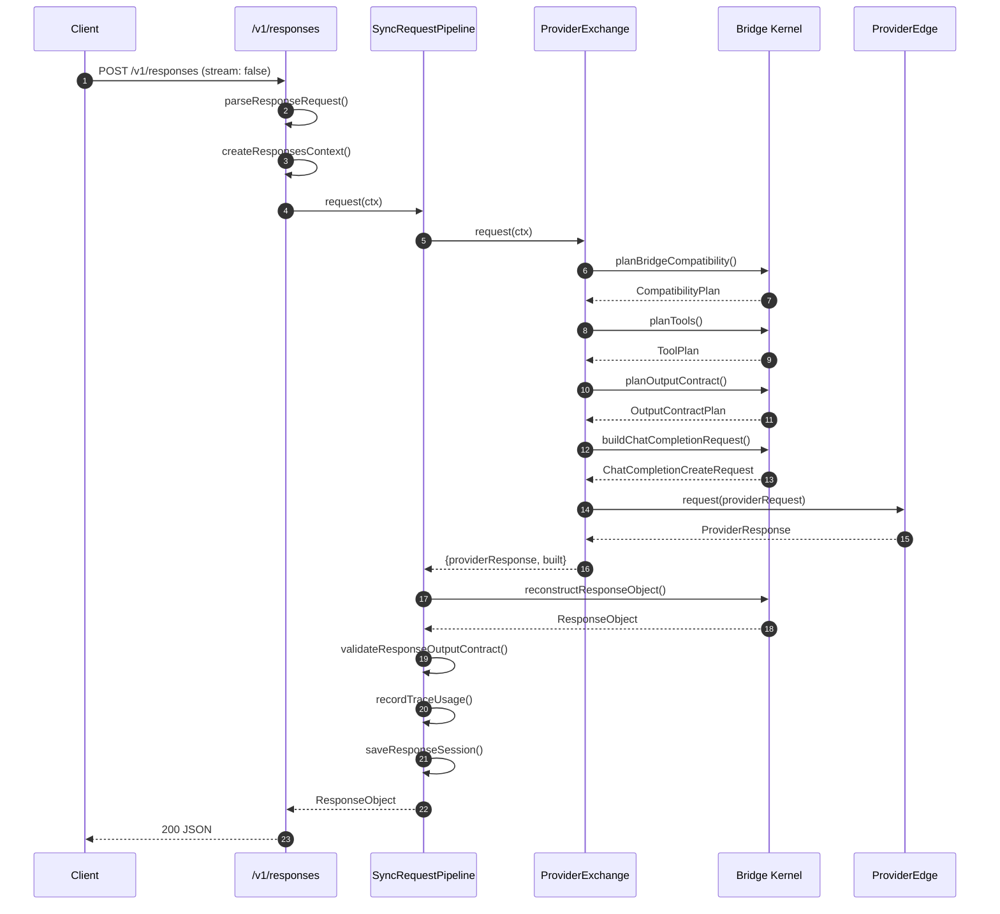
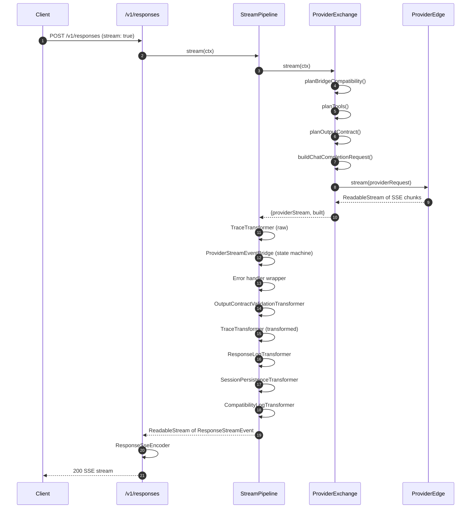
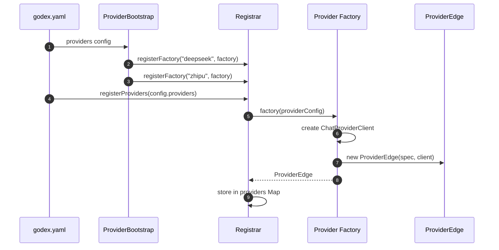
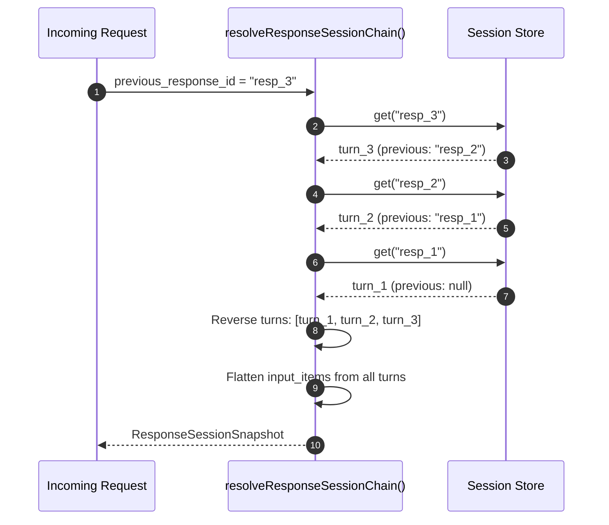

# Staff Engineer Guide

> **Audience**: Senior and staff-level engineers who need a dense, opinionated understanding of GodeX's architecture and design tradeoffs.
> **Assumption**: You have read the Contributor Guide and AGENTS.md.

---

## Table of Contents

- [The ONE Core Insight](#the-one-core-insight)
- [Architecture in Pseudocode](#architecture-in-pseudocode)
- [Layered Architecture](#layered-architecture)
- [The Compatibility Planning Engine](#the-compatibility-planning-engine)
- [Design Tradeoffs](#design-tradeoffs)
- [System Diagrams](#system-diagrams)
- [Decision Log](#decision-log)
- [Comparison: GodeX vs Typical API Gateway](#comparison-godex-vs-typical-api-gateway)
- [Key Extension Points](#key-extension-points)
- [Risk Areas](#risk-areas)
- [Operational Concerns](#operational-concerns)
- [Provider Capability Taxonomy](#provider-capability-taxonomy)

---

## The ONE Core Insight

GodeX's bridge kernel is a **compatibility planning engine**, not just a format translator.

Most API gateways translate request format A into request format B, send it, and translate the response back. This works when the two protocols are isomorphic. The OpenAI Responses API and the Chat Completions API are not isomorphic -- they differ in tool types, response format options, reasoning modes, session semantics, and streaming event shapes.

The bridge kernel solves this by **planning before building**. For every request feature, it makes an explicit decision: **supported** (forward as-is), **degraded** (downgrade to something the provider understands), **ignored** (silently drop it), or **rejected** (fail the request). This plan is computed before any request bytes are sent upstream.

This means:

1. **Adding a provider is a capability declaration, not a translation exercise.** You declare what the provider supports in a `ProviderSpec`. The bridge kernel handles the rest.
2. **Degradation is transparent and auditable.** Every degradation is recorded as a `CompatibilityDiagnostic` and emitted in logs. No silent behavior changes.
3. **Diagnostics are first-class.** The compatibility plan is available for monitoring, debugging, and alerting before the response is even sent.

---

## Architecture in Pseudocode

The entire request path, expressed as a pipeline:

```python
def handle_request(request):
    # Phase 1: Resolve which provider handles this model
    resolved = model_resolver.resolve(request.model)
    provider = registrar.resolve(resolved.provider)

    # Phase 2: Resolve session chain (immutable parent pointers)
    session = resolve_session_chain(request.previous_response_id)

    # Phase 3: Plan compatibility BEFORE building the request
    compatibility = plan_compatibility(provider, request)
    tools = plan_tools(request.tools, provider.capabilities)
    output = plan_output_contract(request.format, compatibility)

    # Phase 4: Build the provider request
    chat_request = build_chat_request(
        request, session, tools, output, compatibility
    )

    # Phase 5: Apply provider-specific patches
    provider_request = provider.hooks.patch_request(chat_request)

    # Phase 6: Call the provider
    if request.stream:
        provider_stream = provider.stream(provider_request)
        return stream_reconstruct(provider_stream, tools, output)
    else:
        provider_response = provider.request(provider_request)
        return reconstruct_response(provider_response, tools, output)
```

Each phase is a separate module with its own test surface. Phases 3-5 are the bridge kernel. Phase 6 is the provider edge.

---

## Layered Architecture

```mermaid
graph TB
    subgraph "Presentation Layer"
        ROUTES["HTTP Routes<br>/health /v1/models /v1/responses"]
        PARSER["Request Parsing<br>& Validation"]
        SSE["SSE Encoding"]
    end

    subgraph "Orchestration Layer"
        SYNC["SyncRequestPipeline"]
        STRM["StreamPipeline"]
        EXCH["ProviderExchange"]
    end

    subgraph "Bridge Kernel"
        COMPAT["Compatibility<br>Planner"]
        TPLAN["Tool Planner"]
        OPLAN["Output Contract<br>Planner"]
        REQBLD["Request Builder"]
        RESPREC["Response<br>Reconstructor"]
        SM["Stream State<br>Machine"]
        FINISH["Finish Reason<br>Mapper"]
    end

    subgraph "Provider Surface"
        SPEC["ProviderSpec<br>Capabilities & Hooks"]
        EDGE["ProviderEdge<br>HTTP Client"]
    end

    subgraph "Infrastructure"
        SESSION["Session Store<br>Memory / SQLite"]
        TRACE["Trace Recorder<br>Async SQLite"]
        LOG["Logger"]
        CONFIG["Config"]
    end

    ROUTES --> PARSER
    PARSER --> SYNC
    PARSER --> STRM
    SYNC --> EXCH
    STRM --> EXCH
    EXCH --> COMPAT
    EXCH --> TPLAN
    EXCH --> OPLAN
    EXCH --> REQBLD
    EXCH --> EDGE
    EDGE --> SPEC
    EDGE --> RESPREC
    EDGE --> SM
    SM --> FINISH
    ROUTES --> SSE
    ROUTES --> SESSION
    ROUTES --> TRACE
    ROUTES --> LOG

    style "Presentation Layer" fill:#161b22,stroke:#6d5dfc,color:#e6edf3
    style "Orchestration Layer" fill:#161b22,stroke:#6d5dfc,color:#e6edf3
    style "Bridge Kernel" fill:#161b22,stroke:#6d5dfc,color:#e6edf3
    style "Provider Surface" fill:#161b22,stroke:#6d5dfc,color:#e6edf3
    style "Infrastructure" fill:#161b22,stroke:#6d5dfc,color:#e6edf3

    style ROUTES fill:#2d333b,stroke:#6d5dfc,color:#e6edf3
    style PARSER fill:#2d333b,stroke:#6d5dfc,color:#e6edf3
    style SSE fill:#2d333b,stroke:#6d5dfc,color:#e6edf3
    style SYNC fill:#2d333b,stroke:#6d5dfc,color:#e6edf3
    style STRM fill:#2d333b,stroke:#6d5dfc,color:#e6edf3
    style EXCH fill:#2d333b,stroke:#6d5dfc,color:#e6edf3
    style COMPAT fill:#2d333b,stroke:#6d5dfc,color:#e6edf3
    style TPLAN fill:#2d333b,stroke:#6d5dfc,color:#e6edf3
    style OPLAN fill:#2d333b,stroke:#6d5dfc,color:#e6edf3
    style REQBLD fill:#2d333b,stroke:#6d5dfc,color:#e6edf3
    style RESPREC fill:#2d333b,stroke:#6d5dfc,color:#e6edf3
    style SM fill:#2d333b,stroke:#6d5dfc,color:#e6edf3
    style FINISH fill:#2d333b,stroke:#6d5dfc,color:#e6edf3
    style SPEC fill:#2d333b,stroke:#6d5dfc,color:#e6edf3
    style EDGE fill:#2d333b,stroke:#6d5dfc,color:#e6edf3
    style SESSION fill:#2d333b,stroke:#6d5dfc,color:#e6edf3
    style TRACE fill:#2d333b,stroke:#6d5dfc,color:#e6edf3
    style LOG fill:#2d333b,stroke:#6d5dfc,color:#e6edf3
    style CONFIG fill:#2d333b,stroke:#6d5dfc,color:#e6edf3
```

The critical boundary is between the **Bridge Kernel** and the **Provider Surface**. The bridge kernel never knows about HTTP clients or specific API endpoints. The provider surface never makes compatibility decisions. This separation is the reason adding a provider is a capability declaration exercise.

---

## The Compatibility Planning Engine

The compatibility planner (`src/bridge/compatibility/`) is the heart of the system. For each request, it produces a `CompatibilityPlan` with:

- **`capabilities`**: Snapshot of the provider's declared capabilities
- **`diagnostics`**: Array of `CompatibilityDiagnostic` entries (code, severity, path, action, message)
- **`parameters`**: Record mapping each parameter path to a `CompatibilityDecision`
- **`responseFormat`**: Decision for the response format parameter

### Decision Actions

| Action | Meaning | Example |
|---|---|---|
| `supported` | Feature is forwarded as-is | `temperature` on DeepSeek |
| `degraded` | Feature is downgraded to a compatible alternative | `json_schema` downgraded to `json_object` on Zhipu |
| `ignored` | Feature is silently dropped | `metadata` is GodeX-owned, not forwarded |
| `rejected` | Feature causes the request to fail | `json_schema` on a provider that has no JSON support at all |

### Tool Planning

Tool planning (`src/bridge/tools/tool-plan.ts`) is a specialized compatibility planner for tools. For each requested tool:

1. If the provider natively supports the tool type -- **supported**
2. If the provider has a degraded mapping (e.g., `local_shell` -> `function`) -- **degraded**
3. If neither -- **ignored** (the tool declaration is dropped)

Tool identity mapping tracks the `requestedName` -> `providerName` mapping so that tool calls in the response can be restored to their original names.

### Output Contract Planning

Output contract planning (`src/bridge/output/output-contract.ts`) handles the `json_schema` -> `json_object` degradation path specifically:

1. If `json_schema` is supported -- forward as-is
2. If `json_schema` is not supported but `json_object` is -- degrade: set `response_format` to `{ type: "json_object" }`, inject a synthetic system instruction containing the JSON Schema, and flag `requiresValidJson: true`
3. After the response is received, validate the JSON output against the schema if `requiresValidJson` is true

This is the most complex degradation path because it requires post-response validation.

---

## Design Tradeoffs

### Provider-Agnostic Bridge vs Provider-Specific Adapters

**Decision**: Bridge kernel wins.

| Approach | Pros | Cons |
|---|---|---|
| **Bridge kernel** (GodeX) | Single place for compatibility logic, adding providers is declarative, diagnostics are uniform | May miss provider-specific optimizations |
| **Provider-specific adapters** | Can optimize per-provider, full control per provider | Compatibility logic duplicated, N*M test surface, adding providers is a full implementation effort |

GodeX chose the bridge kernel because the Responses API -> Chat Completions API translation has a finite set of compatibility dimensions (parameters, tools, response formats, reasoning, streaming). These dimensions can be captured declaratively.

Provider-specific behavior is confined to **hooks** (`patchRequest`, `normalizeResponse`, `normalizeChunk`) which only handle protocol differences, not compatibility decisions.

### Async Bounded Trace Queue vs Sync

**Decision**: Async wins.

| Approach | Pros | Cons |
|---|---|---|
| **Async bounded queue** (GodeX) | Never blocks response path, batch writes are efficient, queue overflow is graceful (drops events, logs warning) | Trace events may arrive slightly after response |
| **Synchronous** | Trace is guaranteed to be written before response returns | Adds latency to every response, especially under load |

The async queue uses a bounded array, batch flush on interval (configurable), and immediate flush when batch size is reached. Queue overflow logs a warning and drops the event. This is the correct tradeoff for a gateway -- response latency is king.

### Parent-Pointer Session Chains vs Mutable Conversation

**Decision**: Parent pointers win.

| Approach | Pros | Cons |
|---|---|---|
| **Parent-pointer chains** (GodeX) | Immutable, no concurrent mutation issues, chain can be audited, branches naturally (two responses with same parent) | Chain resolution is O(depth), memory grows linearly with turns |
| **Mutable conversation** | O(1) lookup, simple append-only | Concurrent modification risk, no branching, harder to debug |

Session chains use `previous_response_id` as a parent pointer. Resolution walks backward, collecting turns. The chain detects cycles, missing parents, depth overflow (max 64), and incomplete responses. This matches the OpenAI Responses API model exactly.

### Compatibility Planning as Separate Phase vs Inline

**Decision**: Separate phase wins.

| Approach | Pros | Cons |
|---|---|---|
| **Separate phase** (GodeX) | Diagnostics available for logging and monitoring before request is built, decisions are auditable, degradation is transparent | Extra allocation per request |
| **Inline during build** | Fewer allocations, slightly faster | No diagnostics, degradation is hidden, harder to debug |

The compatibility plan is computed once and used by both the request builder and the response reconstructor. It is also emitted as diagnostics in the stream (via `CompatibilityLogTransformer`) so downstream consumers can observe what was degraded.

### Transform Stream Pipeline vs Callback Chain

**Decision**: Transform streams win.

| Approach | Pros | Cons |
|---|---|---|
| **Transform streams** (GodeX) | Composable, backpressure-aware, testable in isolation, standard Web Streams API | More allocation per stage, harder to debug ordering issues |
| **Callback chain** | Simpler mental model, fewer allocations | No backpressure, harder to test in isolation, non-standard |

The stream pipeline chains `TransformStream` instances using `pipeThrough`. Each stage (trace, bridge, validation, logging, session, diagnostics) is a separate transformer that can be tested independently. The order matters and is documented in the Contributor Guide.

### Typed Error Hierarchy vs Error Codes

**Decision**: Typed hierarchy wins.

| Approach | Pros | Cons |
|---|---|---|
| **Typed hierarchy** (GodeX) | Catch specific error types, domain-specific context, typed status codes, `toLogEntry()` for structured logging | More classes to maintain |
| **Error codes** | Simpler, fewer classes | No domain distinction in catch blocks, must parse codes to determine handling |

The `GodeXError` hierarchy (`ServerError`, `BridgeError`, `ProviderError`, `SessionError`) allows route handlers to catch specific error types and map them to appropriate HTTP responses. The `domain` field provides automatic categorization for monitoring and alerting.

---

## System Diagrams

### Data Flow: Sync Request



### Data Flow: Stream Request



### Provider Registration



### Session Chain Resolution



---

## Decision Log

### Why Bridge Kernel

The project previously had per-provider mappers (removed in the refactor that introduced the bridge kernel). The problem: every new compatibility dimension required changes in N provider mappers, with inconsistent degradation behavior. The bridge kernel consolidates all compatibility logic into a single, testable module. Provider hooks are thin and protocol-specific only.

**Key constraint**: Do not duplicate compatibility decisions in provider hooks. Provider hooks should expose protocol differences; the bridge decides support, downgrade, rejection, and diagnostics.

**Date**: Introduced during the bridge kernel refactor (commit history: `refactor: rebuild responses bridge kernel`).

### Why Async Trace

Synchronous trace writes add latency to every response. In a gateway, this is unacceptable -- the gateway should be as fast as the upstream provider allows. The async bounded queue decouples trace persistence from response latency.

**Key constraint**: Queue overflow must be graceful. The `AsyncTraceRecorder` logs a warning and drops the event rather than blocking or throwing.

**Tuning parameters**: `max_queue_size`, `flush_interval_ms`, `batch_size` in trace config.

### Why Session Chains

The OpenAI Responses API uses `previous_response_id` as a parent pointer. GodeX models this exactly rather than introducing a mutable conversation abstraction. This means:

- No concurrent mutation issues
- Natural support for branching conversations
- Chain integrity checks (cycles, missing parents, depth overflow)
- Session data is API-shaped (no provider-specific conversion needed)

**Depth limit**: 64 by default, configurable. The limit exists to prevent unbounded memory usage and O(depth) chain resolution from becoming a performance issue.

### Why No Adapter Pattern

The adapter/mapper pattern creates a forest of provider-specific translation code. Each adapter duplicates compatibility logic. The bridge kernel replaces this with a declarative `ProviderSpec` that describes capabilities, plus thin hooks for protocol differences. Adding a provider is declaring a spec, not writing a mapper.

The rule is explicit: "Do not recreate `src/adapter/mapper`, `src/adapter/provider.ts`, or provider-specific mapper forests."

### Why Transform Streams for Pipeline

The stream pipeline uses composable `TransformStream` instances because each stage (trace, bridge, validation, logging, session) has distinct responsibilities and test surfaces. Web Streams are a standard API with built-in backpressure support. The alternative (callback chains) would be simpler but harder to test and would lack backpressure.

**Pipeline order matters**: Provider events are bridged first, output contracts are validated before logging and persistence, then SSE encoding happens in the server route. Reordering the pipeline can break assumptions -- changes to transformer order should be discussed first.

### Why ProviderSpec as a Value Object

`ProviderSpec` is a plain object, not a class. This is intentional:

- Easy to serialize and compare
- No hidden state or lifecycle
- Testable by construction (just create an object literal)
- Can be declared inline in tests without mocking

The runtime behavior (HTTP calls) lives in `ProviderEdge`, not in `ProviderSpec`. This separation means capabilities can be inspected without making network requests.

---

## Comparison: GodeX vs Typical API Gateway

| Dimension | GodeX | Typical API Gateway |
|---|---|---|
| **Compatibility model** | Pre-flight planning with explicit decisions (supported/degraded/ignored/rejected) | Inline translation, assume formats are compatible |
| **Provider onboarding** | Declare capabilities in ProviderSpec, bridge kernel handles the rest | Write adapter per provider, implement translation logic |
| **Degradation** | Explicit, auditable, logged as diagnostics | Implicit or absent |
| **Tool support** | Planned per-tool-type with identity mapping and call restoration | Often unsupported or hardcoded |
| **Streaming** | State machine tracking phases (idle/in_progress/completed/incomplete/failed) with block management | Simple delta passthrough |
| **Session** | Immutable parent-pointer chains with integrity checks | Mutable conversation buffer |
| **Trace** | Async bounded queue with batch SQLite writes | Synchronous logging or external service dependency |
| **Error model** | Typed hierarchy (Server/Bridge/Provider/Session) with domain codes | Generic error handling |
| **Extensibility** | New providers via capability declaration | New providers via adapter implementation |
| **Protocol surface** | Provider-specific hooks for protocol differences only | Full protocol handling per provider |
| **Testing** | Shared test utilities with mock provider specs | Per-provider mock servers |
| **State** | Stateless request processing, side-effectful session/trace | Often stateful with middleware chains |

---

## Key Extension Points

### Adding a Provider

1. Create `src/providers/<name>/` directory
2. Define `spec.ts` with `ProviderSpec` (capabilities, endpoint, auth, toolName codec, accessors, hooks)
3. Define `hooks.ts` with provider-specific patching, usage mapping, finish reason mapping, stream delta extraction
4. Define `client.ts` with `create<Name>ProviderEdge(config)` using `ChatProviderClient`
5. Define `protocol/` with provider-specific Chat Completions DTOs
6. Define `index.ts` barrel exports
7. Register in `src/providers/builtin.ts`

The `src/providers/example/` directory is a template. Key constraints:

- Use `CHAT_COMPLETIONS_PROTOCOL` and `BEARER_AUTH` from bridge/provider-spec
- Use `ChatProviderClient` for HTTP calls unless there is a clear transport reason not to
- Keep provider-specific DTOs under `protocol/`
- Do not add mapper forests or wrapper contracts
- Add or update provider conformance tests

### Adding Custom Tools

1. Define the tool in `src/tools/`
2. Declare the tool type in the provider's `ProviderCapabilities.tools.supported` set
3. If the provider maps the tool type to a different type, add it to `ProviderCapabilities.tools.degraded`
4. The bridge kernel handles declaration rendering and call restoration

### Adding New Compatibility Rules

1. Add the rule to `planBridgeCompatibility()` in `src/bridge/compatibility/planner.ts`
2. Add the corresponding parameter to `ProviderCapabilities.parameters.supported` in provider specs
3. Add handling in `applyRequestOptions()` in `src/bridge/request/request-builder.ts`
4. Add tests for the new rule in both the planner and request builder test files

### Adding Stream Pipeline Stages

1. Create a new `TransformStream` implementation in `src/responses/stream-transforms/`
2. Insert it at the correct position in `StreamPipeline.stream()`
3. Document why the order matters
4. Test in isolation with mock input/output streams

---

## Risk Areas

### Stream State Machine Complexity

The `ResponseStreamStateMachine` manages multiple concurrent block types (text, refusal, reasoning, tool calls) with strict phase transitions. The phase transitions are:

```
IDLE -> IN_PROGRESS -> COMPLETED | INCOMPLETE | FAILED
```

**Risk**: Incorrect phase transitions can cause events to be emitted in the wrong order or lost entirely. The machine has defensive assertions for every transition, but edge cases in multi-tool-call streams with concurrent finish reasons are tricky.

**Specific scenarios to watch:**
- Provider sends finish reason in the same chunk as tool call deltas
- Provider sends empty content deltas
- Provider sends tool call arguments across multiple chunks without an ID in the first chunk
- Provider sends reasoning content after a finish reason

**Mitigation**: Comprehensive test coverage for the state machine, including edge cases like empty deltas, tool calls without IDs, and finish-before-start.

### Session Chain Depth

The max chain depth is 64. For very long conversations (more than 64 turns), the chain will overflow and the request will fail with `SESSION_CHAIN_DEPTH_EXCEEDED`.

**Risk**: Users with long conversations will hit this limit unexpectedly.

**Mitigation**: The depth is configurable. Consider warning users when chain depth approaches the limit. Long-term, consider session summarization or pruning.

### Provider Capability Mismatches

If a provider's actual behavior differs from its declared capabilities (e.g., the spec says `json_object` is supported but the provider returns invalid JSON), the degradation path will fail silently or produce incorrect output.

**Risk**: Capability declarations are static -- they do not adapt to runtime behavior.

**Mitigation**: Output contract validation catches degraded JSON output. Provider conformance tests verify capabilities against actual provider behavior. The `bun run test:e2e` suite catches regressions.

### Trace Queue Overflow

Under extreme load, the async trace queue can overflow. Events are dropped and a warning is logged.

**Risk**: Trace data loss under load. This is by design (response latency is prioritized over trace completeness), but operators should monitor for queue overflow warnings.

**Mitigation**: Queue size, batch size, and flush interval are configurable. Operators can tune these for their load profile.

### Tool Identity Mapping Collisions

Provider name allocation uses a collision-resolution strategy (appending `_2`, `_3`, etc., up to 64 characters). If a provider has strict tool name length limits, this could fail.

**Risk**: Tool names exceeding provider limits cause runtime errors.

**Mitigation**: The `maxTools` capability and name allocation strategy are designed for common cases. Unusual providers may need custom `toProviderName` implementations.

### Input Normalization Edge Cases

The input normalizer converts Responses API input items to Chat Completions messages. Some edge cases are inherently lossy:

- `developer` role messages become `system` role (some providers treat these differently)
- Tool call arguments are JSON-serialized actions (if the action structure is complex, serialization may lose type information)
- Reasoning content is attached to the next assistant message (if there is no next assistant message, reasoning is attached to the last one)

**Mitigation**: The normalizer throws `BridgeError` for truly unsupported input item types rather than silently dropping them. This makes failures explicit and debuggable.

---

## Operational Concerns

### Monitoring Recommendations

GodeX emits structured logs at multiple points during request processing. The key events to monitor:

| Event | Level | What to Watch |
|---|---|---|
| `responses.request.completed` | info | Status, model, output count, duration, usage |
| `responses.request.error` | error | Failed requests |
| `bridge.compatibility.degraded` | warn | Features being downgraded |
| `bridge.compatibility.rejected` | error | Features causing rejections |
| `trace.queue.full` | warn | Trace events being dropped |
| `session.save.error` | warn | Session persistence failures |
| `provider.request.sending` | debug | Per-provider request dispatch |
| `provider.response.received` | debug | Per-provider response timing |

### Scaling Considerations

GodeX is stateless for request processing. The stateful components are:

| Component | Default Backend | Scaling Path |
|---|---|---|
| Sessions | Memory or SQLite | Replace with Redis/PostgreSQL via `ResponseSessionStore` interface |
| Trace | SQLite | Replace with external store via `TraceStoreWriter` interface |
| Config | YAML file | File-based, reload on restart |

The interfaces are abstract. Migration to external stores is a backend swap, not a refactoring effort.

### Configuration Hotspots

These config values have the most impact on behavior:

| Config Path | Default | Impact |
|---|---|---|
| `trace.enabled` | true | Disable for zero overhead |
| `trace.capture_payload` | false | Enable for debugging (increases storage) |
| `session.backend` | memory | Use sqlite for persistence across restarts |
| `server.idle_timeout` | 0 | Set for resource-constrained environments |
| `trace.max_queue_size` | configurable | Tune for load |
| `logging.level` | info | Lower for debugging |

---

## Provider Capability Taxonomy

The `ProviderCapabilities` type has six capability dimensions. Understanding each dimension is essential for declaring provider support accurately.

### Parameters

The `parameters.supported` set controls which request parameters are forwarded to the provider. Common parameters:

| Parameter | Meaning | Bridge Handling |
|---|---|---|
| `stream` | Enable streaming responses | Sets `stream: true` on Chat request |
| `temperature` | Sampling temperature | Forwarded directly |
| `top_p` | Nucleus sampling | Forwarded directly |
| `max_output_tokens` | Max response length | Maps to `max_tokens` on Chat request |
| `reasoning` | Reasoning effort control | Maps to `reasoning_effort` or `thinking` based on effort mode |
| `safety_identifier` | User safety ID | Maps to `user_id` |
| `user` | User identifier | Maps to `user_id` (lower priority than safety_identifier) |
| `text.format` | Response format | Handled by compatibility planner |

### Tools

The `tools` capability has three sub-dimensions:

- **supported**: Set of tool types the provider handles natively (e.g., `function`, `web_search`)
- **degraded**: Map of tool types the provider can handle via degradation (e.g., `local_shell` -> `function`)
- **maxTools**: Maximum number of tool declarations the provider accepts

### Tool Choice

The `toolChoice.supported` set controls which tool_choice modes are supported:
- `auto`: Provider selects tool automatically
- `none`: No tools
- `required`: Must use a tool
- `function`: Force a specific function

### Response Formats

The `responseFormats.supported` set controls which output format types are supported:
- `text`: Plain text output
- `json_object`: JSON output mode
- `json_schema`: Strict JSON schema validation (rare among providers)

### Reasoning

The `reasoning.effort` field controls how reasoning is communicated:
- `native`: Provider supports reasoning effort natively (maps `reasoning_effort` directly)
- `boolean`: Provider supports on/off reasoning (maps to `thinking: { type: "enabled"/"disabled" }`)
- `none`: Provider does not support reasoning

### Streaming

The `streaming.usage` boolean controls whether the provider includes token usage in streaming responses. If true, GodeX requests `stream_options: { include_usage: true }` and extracts usage from the final chunk.
