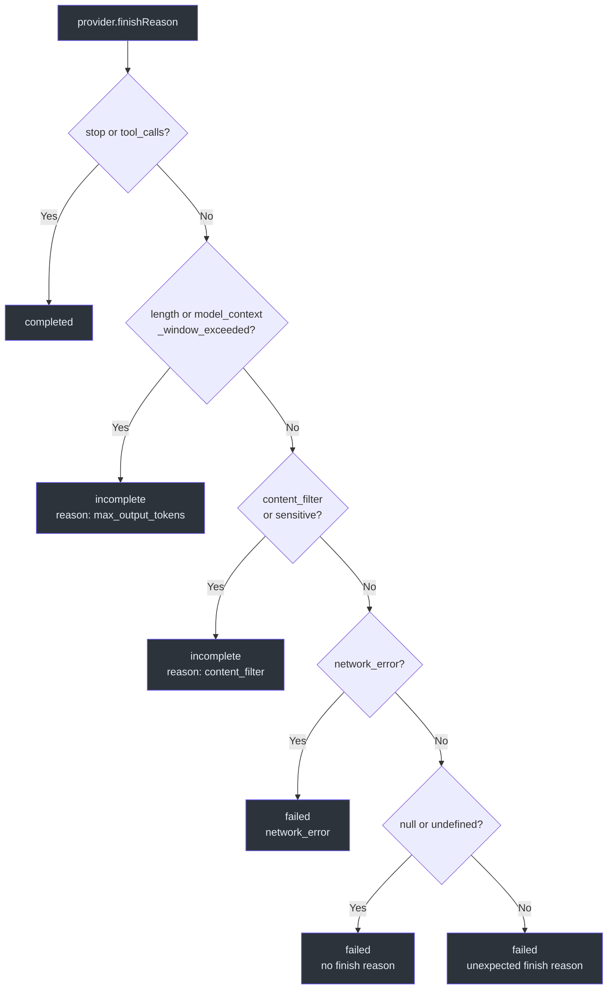
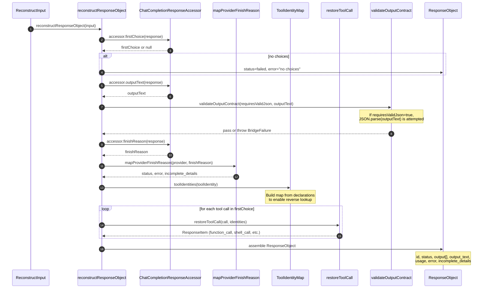
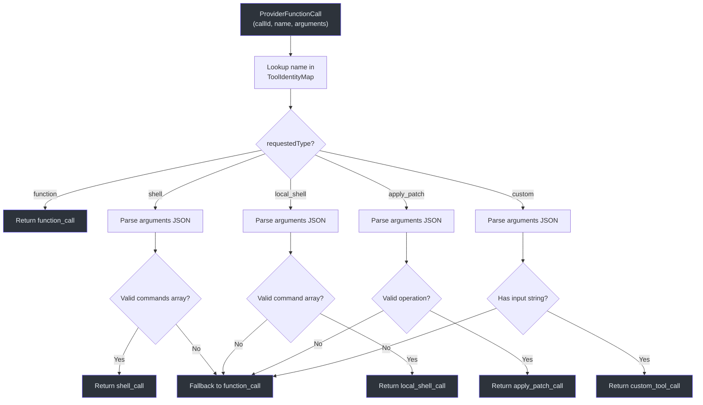
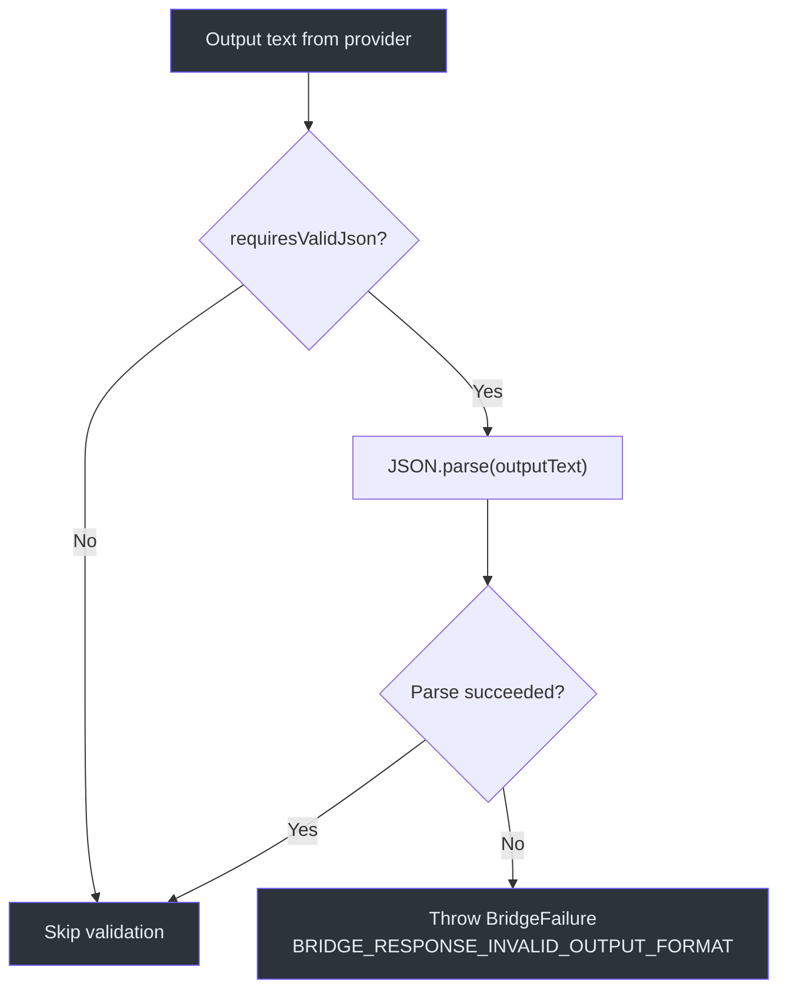

# 响应重建

在上游提供方返回 Chat Completions 响应后，GodeX 必须将其重建为 OpenAI Responses API `ResponseObject` 的格式。这是[请求构建](./request-building.md)的逆过程——工具调用必须还原为原始类型、结束原因必须映射到 Responses 状态模型、推理文本必须被提取、输出合约必须被验证。`reconstructResponseObject` 函数处理这整个转换过程。

## 概览

| 步骤 | 函数 | 用途 |
|------|------|------|
| 1 | `firstChoice` 提取 | 从提供方响应中获取第一个选择 |
| 2 | `outputText` 提取 | 读取选择消息中的文本内容 |
| 3 | `validateOutputContract` | 如果 `requiresValidJson`，解析并验证输出 |
| 4 | `mapProviderFinishReason` | 将提供方结束原因映射到 Responses 状态 |
| 5 | `restoreToolCall`（每个调用） | 将每个工具调用还原为原始 Responses 类型 |
| 6 | 推理文本提取 | 从选择消息中提取 `reasoning_content` |
| 7 | 组装 `ResponseObject` | 将所有部分组合为最终响应 |

## 结束原因映射

各提供方使用不同的 `finish_reason` 字符串。`mapProviderFinishReason` 函数将这些映射到 Responses API 的终止状态（`completed`、`incomplete`、`failed`）：

| 提供方 `finish_reason` | Responses `status` | `incomplete_details.reason` | `error` |
|----------------------|-------------------|----------------------------|---------|
| `stop` | `completed` | null | null |
| `tool_calls` | `completed` | null | null |
| `length` | `incomplete` | `"max_output_tokens"` | null |
| `model_context_window_exceeded` | `incomplete` | `"max_output_tokens"` | null |
| `content_filter` | `incomplete` | `"content_filter"` | null |
| `sensitive` | `incomplete` | `"content_filter"` | null |
| `network_error` | `failed` | null | `{ code: SERVER_ERROR, message }` |
| `null` / `undefined` | `failed` | null | `"Provider returned no finish reason"` |
| 其他任何值 | `failed` | null | `"Unexpected finish reason"` |

## 重建序列

## 工具调用还原

`restoreToolCall` 函数使用 `ToolIdentityMap` 将提供方侧的工具名称反向映射回原始 Responses 类型。每个提供方函数调用包含 `(callId, name, arguments)`。身份映射提供 `requestedType`，该值决定重建路径：

| `requestedType` | 重建方式 | 后备方案 |
|----------------|---------|---------|
| `function` | `{ type: "function_call", call_id, name, arguments }` | 始终成功 |
| `shell` | 将 `arguments` 解析为 JSON；提取 `commands` 数组 | 后退为 `function_call` |
| `local_shell` | 将 `arguments` 解析为 JSON；提取 `command` 数组 + env | 后退为 `function_call` |
| `apply_patch` | 将 `arguments` 解析为 JSON；提取 `operation` 对象 | 后退为 `function_call` |
| `custom` | 将 `arguments` 解析为 JSON；提取 `input` 字符串 | 后退为 `function_call` |

当解析失败（JSON 格式错误、字段缺失）时，`restoreToolCall` 会后退为使用身份映射中的 `requestedName` 生成通用的 `function_call` ResponseItem。这确保即使提供方的输出不符合预期，响应也始终有效。

## 工具身份映射

`ToolIdentityMap` 在请求构建期间创建，承载请求的工具名称/类型与提供方工具名称/类型之间的双向映射。在重建阶段，它被反向使用：

| 请求构建方向 | 重建方向 |
|------------|---------|
| requestedName -> providerName | providerName -> requestedName |
| requestedType -> providerType | providerName -> requestedType |

该映射强制唯一性：如果两个不同的工具映射到同一个提供方名称，请求构建时会抛出 `BridgeError`。

## 输出合约验证

当输出合约被降级时（例如 `json_schema` 降级为 `json_object` 且 `strict: true`），`requiresValidJson` 被设置。重建后，`validateOutputContract` 将输出文本解析为 JSON：

- **通过**：响应是有效的 JSON；`ResponseObject` 正常返回。
- **失败**：抛出 `BridgeFailure`，错误代码为 `BRIDGE_RESPONSE_INVALID_OUTPUT_FORMAT`，元数据中包含提供方、模型和响应 ID。

## ResponseObject 组装

最终的 `ResponseObject` 由所有收集的部分组装而成：

| 字段 | 来源 |
|------|------|
| `id` | 从请求标识生成的 `responseId` |
| `object` | 始终为 `"response"` |
| `created_at` | 上下文创建时的时间戳 |
| `completed_at` | 重建时的当前时间戳 |
| `status` | 来自 `mapProviderFinishReason` |
| `model` | 已解析的模型名称 |
| `output` | `ResponseItem` 数组：推理、工具调用、助手消息 |
| `output_text` | 提取的文本内容 |
| `usage` | 来自 `accessor.usage()` |
| `error` | 来自结束原因映射（完成时为 null） |
| `incomplete_details` | 来自结束原因映射（完成时为 null） |

`output` 数组的排序：推理项在前，然后是还原的工具调用，最后是助手消息（如果有文本或没有工具调用）。

## 交叉引用

- **[架构概览](./architecture-overview.md)**：重建在完整请求生命周期中的位置
- **[兼容性](./compatibility.md)**：输出合约如何被规划（包括 `requiresValidJson`）
- **[请求构建](./request-building.md)**：工具身份和输出合约如何建立

## 参考

- [src/bridge/response/response-reconstructor.ts:1-196](https://github.com/Ahoo-Wang/GodeX/blob/main/src/bridge/response/response-reconstructor.ts#L1-L196) -- `reconstructResponseObject` 和输出组装
- [src/bridge/finish-reason/finish-reason.ts:1-75](https://github.com/Ahoo-Wang/GodeX/blob/main/src/bridge/finish-reason/finish-reason.ts#L1-L75) -- `mapProviderFinishReason`，包含完整的提供方到 Responses 映射
- [src/bridge/tools/call-restorer.ts:1-178](https://github.com/Ahoo-Wang/GodeX/blob/main/src/bridge/tools/call-restorer.ts#L1-L178) -- `restoreToolCall`，包含类型特定解析和后备方案
- [src/bridge/tools/tool-identity.ts:1-72](https://github.com/Ahoo-Wang/GodeX/blob/main/src/bridge/tools/tool-identity.ts#L1-L72) -- `ToolIdentityMap`，用于双向名称/类型查找
- [src/bridge/output/output-validator.ts:1-30](https://github.com/Ahoo-Wang/GodeX/blob/main/src/bridge/output/output-validator.ts#L1-L30) -- `validateOutputContract`，用于降级的 JSON Schema 验证
- [src/bridge/output/validator.ts:1-47](https://github.com/Ahoo-Wang/GodeX/blob/main/src/bridge/output/validator.ts#L1-L47) -- `validateResponseOutputContract`，从 `ResponseObject` 中提取文本
