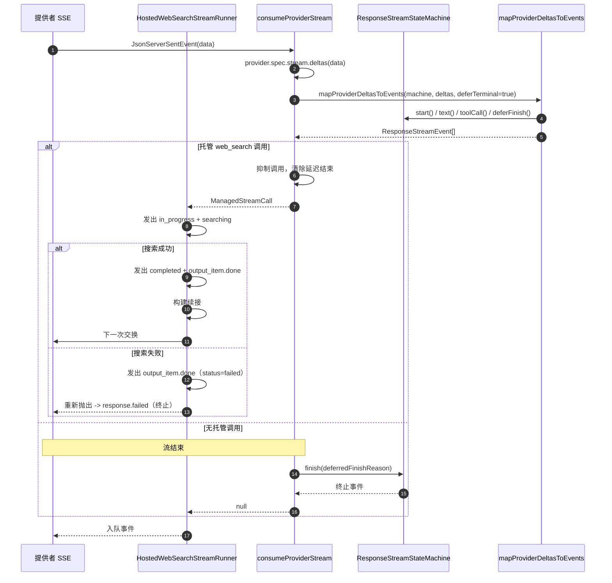
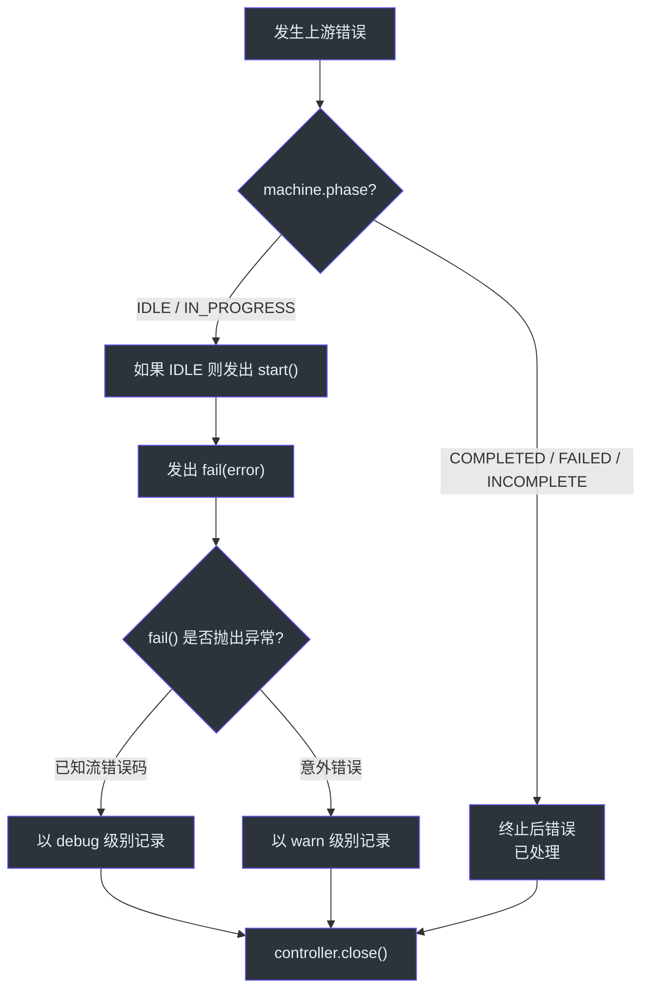

# 流式管道

流式管道是 GodeX 最复杂的执行路径。它连接到提供者的 SSE 流，通过状态机将原始提供者增量映射为结构化的 `ResponseStreamEvent` 对象，然后通过可组合的转换流链传递，处理错误恢复、输出契约验证、可观测性追踪、日志记录、会话持久化和兼容性诊断。每个转换器只负责单一职责，使管道易于扩展和调试。

## 概览

| 关注点 | 组件 | 关键文件 |
|---------|-----------|----------|
| 管道编排器 | `StreamPipeline` | [stream-pipeline.ts:25](https://github.com/Ahoo-Wang/GodeX/blob/main/src/responses/stream-pipeline.ts#L25) |
| 增量到事件映射 + web search 循环 | `HostedWebSearchStreamRunner` | [web-search/stream-runner.ts:60](https://github.com/Ahoo-Wang/GodeX/blob/main/src/responses/web-search/stream-runner.ts#L60) |
| 错误处理器 | `wrapWithErrorHandler` | [stream-error-handler.ts:36](https://github.com/Ahoo-Wang/GodeX/blob/main/src/responses/stream-error-handler.ts#L36) |
| 追踪转换器 | `TraceTransformer` | [trace-transformer.ts:8](https://github.com/Ahoo-Wang/GodeX/blob/main/src/responses/stream-transforms/trace-transformer.ts#L8) |
| 日志转换器 | `ResponseLogTransformer` | [response-log-transformer.ts:13](https://github.com/Ahoo-Wang/GodeX/blob/main/src/responses/stream-transforms/response-log-transformer.ts#L13) |
| 契约验证 | `ResponseOutputContractValidationTransformer` | [response-output-contract-validation-transformer.ts:13](https://github.com/Ahoo-Wang/GodeX/blob/main/src/responses/stream-transforms/response-output-contract-validation-transformer.ts#L13) |
| 会话持久化 | `ResponseSessionPersistenceTransformer` | [response-session-persistence-transformer.ts:19](https://github.com/Ahoo-Wang/GodeX/blob/main/src/responses/stream-transforms/response-session-persistence-transformer.ts#L19) |
| SSE 编码器 | `ResponseSseEncoder` | [response-sse-encoder.ts:4](https://github.com/Ahoo-Wang/GodeX/blob/main/src/responses/stream-transforms/response-sse-encoder.ts#L4) |
| 管道工具函数 | `pipeTransform` | [stream-utils.ts:6](https://github.com/Ahoo-Wang/GodeX/blob/main/src/responses/stream-transforms/stream-utils.ts#L6) |

## 两个阶段：事件生产，然后是转换链

流式路径分为两个阶段。第一阶段从提供者增量**生产** `ResponseStreamEvent`；第二阶段通过转换链**处理**这些事件。之所以这样拆分，是因为第一阶段还必须运行 web search 续接循环，该循环可以在流终止前发起多次上游交换。

`StreamPipeline.stream` ([stream-pipeline.ts:31](https://github.com/Ahoo-Wang/GodeX/blob/main/src/responses/stream-pipeline.ts#L31)) 驱动两个阶段：

1. 它请求 `HostedWebSearchStreamRunner` 生产事件流及状态机。
2. 它通过 `pipeTransform` ([stream-utils.ts:6](https://github.com/Ahoo-Wang/GodeX/blob/main/src/responses/stream-transforms/stream-utils.ts#L6)) 将该事件流送入转换链。

```mermaid
flowchart LR
    subgraph "阶段 1 — 事件生产"
        direction TB
        A["提供者 SSE<br>ReadableStream"] --> B["TraceTransformer<br>(原始事件)"]
        B --> C["HostedWebSearchStreamRunner<br>mapProviderDeltasToEvents<br>+ web search 循环"]
    end

    subgraph "阶段 2 — 转换链"
        direction TB
        D["wrapWithErrorHandler<br>(错误恢复)"] --> E["ResponseOutputContract<br>ValidationTransformer"]
        E --> F["TraceTransformer<br>(转换后事件)"]
        F --> G["ResponseLogTransformer"]
        G --> H{"store = false?"}
        H -->|是| I["CompatibilityLogTransformer"]
        H -->|否| J["ResponseSessionPersistence<br>Transformer"]
        J --> I
    end

    C --> D

    style A fill:#2d333b,stroke:#6d5dfc,color:#e6edf3
    style B fill:#2d333b,stroke:#6d5dfc,color:#e6edf3
    style C fill:#2d333b,stroke:#6d5dfc,color:#e6edf3
    style D fill:#2d333b,stroke:#6d5dfc,color:#e6edf3
    style E fill:#2d333b,stroke:#6d5dfc,color:#e6edf3
    style F fill:#2d333b,stroke:#6d5dfc,color:#e6edf3
    style G fill:#2d333b,stroke:#6d5dfc,color:#e6edf3
    style H fill:#2d333b,stroke:#6d5dfc,color:#e6edf3
    style I fill:#2d333b,stroke:#6d5dfc,color:#e6edf3
    style J fill:#2d333b,stroke:#6d5dfc,color:#e6edf3
```

| 阶段 | 类 | 用途 |
|-------|-------|---------|
| 1 | `HostedWebSearchStreamRunner` | 将提供者增量映射为事件；运行 web search 续接循环（最多 `max_iterations` 次） |
| 2 | `wrapWithErrorHandler` | 将上游错误转换为 `response.failed` 事件 |
| 3 | `ResponseOutputContractValidationTransformer` | 在终止事件上验证 JSON 输出契约 |
| 4 | `TraceTransformer("upstream.stream.event.transformed")` | 记录转换后事件用于追踪 |
| 5 | `ResponseLogTransformer` | 记录包含使用量指标的流完成日志 |
| 6 | `ResponseSessionPersistenceTransformer` | 持久化响应会话（如果 `store !== false`） |
| 7 | `CompatibilityLogTransformer` | 在流结束时记录兼容性诊断 |

## 事件生产：HostedWebSearchStreamRunner

`HostedWebSearchStreamRunner` ([web-search/stream-runner.ts:60](https://github.com/Ahoo-Wang/GodeX/blob/main/src/responses/web-search/stream-runner.ts#L60)) 是将原始提供者 SSE 转换为 `ReadableStream<ResponseStreamEvent>` 的组件。其 `stream(ctx)` 方法创建 `ResponseStreamStateMachine`、打开上游交换、通过 `ctx.attributes.set(ATTR_UPSTREAM_LATENCY_MILLIS, ...)` ([web-search/stream-runner.ts:74](https://github.com/Ahoo-Wang/GodeX/blob/main/src/responses/web-search/stream-runner.ts#L74)) 记录上游延迟，然后返回一个其 `start` 回调运行循环的 `ReadableStream`。

循环 ([web-search/stream-runner.ts:91](https://github.com/Ahoo-Wang/GodeX/blob/main/src/responses/web-search/stream-runner.ts#L91)) 最多迭代 `config.max_iterations`（默认 `2`，见 [Web Search 配置](../07-configuration/config-schema.md#web-search)）次：

1. 调用 `consumeProviderStream`，它读取每个 SSE 事件，运行 `provider.spec.stream.deltas(data)`，将增量以 `deferTerminal: true` 传入 `mapProviderDeltasToEvents`，并入队结果事件。
2. 如果提供者发出了托管的 `web_search` 函数调用，该调用会从输出中被**抑制**，延迟结束被清除，循环继续。
3. Runner 发出 `web_search_call` 生命周期 — 先是 `response.web_search_call.in_progress`，然后是 `searching`。搜索成功时，它发出 `completed`（加上 `output_item.done`）并构建一个**续接请求**将结果反馈给提供者进行下一次交换。搜索**失败**时，生命周期辅助函数发出 `status: "failed"` 的 `response.output_item.done`（**没有** `response.web_search_call.failed` 事件），然后重新抛出异常，使流错误处理器发出终止性的 `response.failed`。
4. 当不再有托管搜索调用时，循环结束，`consumeProviderStream` 通过调用 `machine.finish(machine.deferredFinishReason)` 完成流。

`consumeProviderStream` 函数 ([web-search/stream-runner.ts:182](https://github.com/Ahoo-Wang/GodeX/blob/main/src/responses/web-search/stream-runner.ts#L182)) 在映射前用 `TraceTransformer("upstream.stream.event.raw")` 包装提供者流，以记录原始提供者事件。

`deferTerminal: true` 标志至关重要：它阻止状态机立即转换到终止阶段，给下游转换器（尤其是输出契约验证器）一个检查并可能重写终止事件的机会。

## 错误处理器

`wrapWithErrorHandler` ([stream-error-handler.ts:36](https://github.com/Ahoo-Wang/GodeX/blob/main/src/responses/stream-error-handler.ts#L36)) 将事件流包装在一个捕获读取错误的 `ReadableStream` 中。当错误发生时：

1. 通过 `recordTraceError` 记录错误
2. 如果状态机仍处于 `IDLE` 或 `IN_PROGRESS` 阶段，发出 `machine.start()`（如果需要）然后发出 `machine.fail(error)`
3. 如果 `fail()` 调用本身抛出已知的流生命周期错误（例如已处于终止状态），以 debug 级别记录日志
4. 错误处理期间的意外失败以 warn 级别记录
5. 干净地关闭流

## 各转换器详解

### TraceTransformer

`TraceTransformer<T>` ([trace-transformer.ts:8](https://github.com/Ahoo-Wang/GodeX/blob/main/src/responses/stream-transforms/trace-transformer.ts#L8)) 是一个通用的直通转换器，在追踪启用时（`ctx.app.traceEnabled`）将每个数据块记录为追踪事件。它跟踪一个序列号用于有序的追踪回放。路径中有两个实例：一个（`"upstream.stream.event.raw"`）在 runner 内部作用于原始提供者事件，一个（`"upstream.stream.event.transformed"`）在链中作用于转换后事件。

### ResponseLogTransformer

`ResponseLogTransformer` ([response-log-transformer.ts:13](https://github.com/Ahoo-Wang/GodeX/blob/main/src/responses/stream-transforms/response-log-transformer.ts#L13)) 统计事件数，在遇到终止事件（`response.completed`、`response.failed`、`response.incomplete`）时记录完成日志。它记录使用量指标和上游延迟。

### ResponseOutputContractValidationTransformer

此转换器 ([response-output-contract-validation-transformer.ts:13](https://github.com/Ahoo-Wang/GodeX/blob/main/src/responses/stream-transforms/response-output-contract-validation-transformer.ts#L13)) 在终止事件上验证 JSON 输出契约。如果验证失败，它将事件重写为 `response.failed` 并抑制后续事件。详见 [输出契约](./output-contracts.md)。

### ResponseSessionPersistenceTransformer

`ResponseSessionPersistenceTransformer` ([response-session-persistence-transformer.ts:19](https://github.com/Ahoo-Wang/GodeX/blob/main/src/responses/stream-transforms/response-session-persistence-transformer.ts#L19)) 在遇到终止事件时持久化响应会话。它使用 `persistenceAttempted` 标志确保只执行一次保存尝试。当 `ctx.request.store === false` 时 ([stream-pipeline.ts:54](https://github.com/Ahoo-Wang/GodeX/blob/main/src/responses/stream-pipeline.ts#L54))，此阶段完全跳过。

### CompatibilityLogTransformer

`CompatibilityLogTransformer` ([compatibility-log-transformer.ts:6](https://github.com/Ahoo-Wang/GodeX/blob/main/src/responses/stream-transforms/compatibility-log-transformer.ts#L6)) 是最后一个转换器。它在终止事件到达或 flush 时记录所有累积的兼容性诊断，确保即使流异常关闭也能发出诊断信息。

## 上游延迟追踪

管道通过 `ctx.attributes.set(ATTR_UPSTREAM_LATENCY_MILLIS, ...)` 在 [web-search/stream-runner.ts:74](https://github.com/Ahoo-Wang/GodeX/blob/main/src/responses/web-search/stream-runner.ts#L74) 记录上游延迟（连接到提供者流的时间）到 `upstreamLatencyMillis`。该值稍后包含在 `ResponseLogTransformer` 的完成日志中。

## SSE 编码

转换链之后，`ResponseSseEncoder` ([response-sse-encoder.ts:4](https://github.com/Ahoo-Wang/GodeX/blob/main/src/responses/stream-transforms/response-sse-encoder.ts#L4)) 将每个 `ResponseStreamEvent` 转换为 SSE 帧（`event: type\ndata: JSON\n\n`），带有自增的序列号。

## 交叉引用

- [流重建](./stream-reconstruction.md) -- `HostedWebSearchStreamRunner` 内部使用的状态机和增量到事件映射
- [同步管道](./sync-pipeline.md) -- 更简单的非流式对应管道
- [输出契约](./output-contracts.md) -- 转换链中使用的验证逻辑
- [工具规划](./tool-planning.md) -- 生成事件生产期间使用的 `ToolIdentityMap`
- [配置 Schema - Web Search](../07-configuration/config-schema.md#web-search) -- 管理托管搜索循环的 `web_search` 配置块

## 参考

- [stream-pipeline.ts:25](https://github.com/Ahoo-Wang/GodeX/blob/main/src/responses/stream-pipeline.ts#L25) -- `StreamPipeline` 类
- [web-search/stream-runner.ts:60](https://github.com/Ahoo-Wang/GodeX/blob/main/src/responses/web-search/stream-runner.ts#L60) -- `HostedWebSearchStreamRunner` 类
- [web-search/stream-runner.ts:182](https://github.com/Ahoo-Wang/GodeX/blob/main/src/responses/web-search/stream-runner.ts#L182) -- `consumeProviderStream` 函数
- [stream-error-handler.ts:36](https://github.com/Ahoo-Wang/GodeX/blob/main/src/responses/stream-error-handler.ts#L36) -- `wrapWithErrorHandler` 函数
- [trace-transformer.ts:8](https://github.com/Ahoo-Wang/GodeX/blob/main/src/responses/stream-transforms/trace-transformer.ts#L8) -- `TraceTransformer` 类
- [response-log-transformer.ts:13](https://github.com/Ahoo-Wang/GodeX/blob/main/src/responses/stream-transforms/response-log-transformer.ts#L13) -- `ResponseLogTransformer` 类
- [response-output-contract-validation-transformer.ts:13](https://github.com/Ahoo-Wang/GodeX/blob/main/src/responses/stream-transforms/response-output-contract-validation-transformer.ts#L13) -- 契约验证转换器
- [response-session-persistence-transformer.ts:19](https://github.com/Ahoo-Wang/GodeX/blob/main/src/responses/stream-transforms/response-session-persistence-transformer.ts#L19) -- 会话持久化转换器
- [compatibility-log-transformer.ts:6](https://github.com/Ahoo-Wang/GodeX/blob/main/src/responses/stream-transforms/compatibility-log-transformer.ts#L6) -- `CompatibilityLogTransformer` 类
- [stream-utils.ts:6](https://github.com/Ahoo-Wang/GodeX/blob/main/src/responses/stream-transforms/stream-utils.ts#L6) -- `pipeTransform` 工具函数
- [response-sse-encoder.ts:4](https://github.com/Ahoo-Wang/GodeX/blob/main/src/responses/stream-transforms/response-sse-encoder.ts#L4) -- `ResponseSseEncoder` 类
