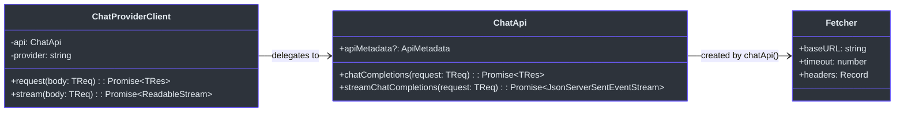
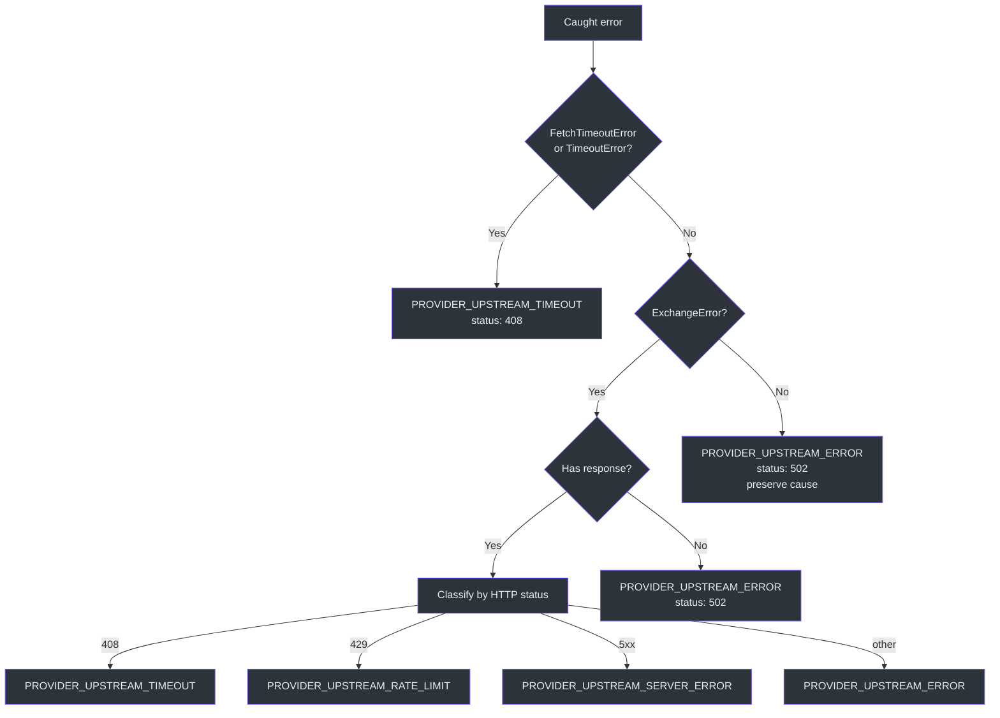

# Chat Provider Client

GodeX 需要在提供商特定逻辑（规范、钩子、能力声明）和实际上与上游 API 通信的原始 HTTP 传输层之间建立一个清晰的边界。`ChatProviderClient` 正好占据了这个边界。它接收提供商名称、基础 URL、API 密钥和可选超时，暴露两个方法——`request()` 和 `stream()`——委托给生成的 `ChatApi` 类并将每个错误包装为带有适当领域代码的 `ProviderError`。

这一层是为什么提供商实现从不处理原始 fetch 错误或 SSE 解析。客户端吸收了超时检测、响应体提取和状态码分类的复杂性，因此每个提供商规范只需要声明它支持什么，而不需要关心 HTTP 如何工作。

## 概览

| 组件 | 文件 | 用途 |
|---|---|---|
| `ChatProviderClient` | [chat-provider-client.ts](https://github.com/Ahoo-Wang/GodeX/blob/main/src/providers/shared/chat-provider-client.ts) | 带错误包装的类型化 HTTP 客户端 |
| `ChatApi` | [chat-api.ts](https://github.com/Ahoo-Wang/GodeX/blob/main/src/providers/shared/chat-api.ts) | 装饰器生成的 API 类（`@post` 方法） |
| `chatApi` 工厂 | [chat-api.ts:42-53](https://github.com/Ahoo-Wang/GodeX/blob/main/src/providers/shared/chat-api.ts#L42) | 创建带 Bearer 认证和超时的 `ChatApi` 实例 |
| `wrapProviderError` | [chat-provider-client.ts:47-96](https://github.com/Ahoo-Wang/GodeX/blob/main/src/providers/shared/chat-provider-client.ts#L47) | 将未知错误转换为 `ProviderError` |
| `assertProviderChatRequest` | [chat-request-guard.ts](https://github.com/Ahoo-Wang/GodeX/blob/main/src/providers/shared/chat-request-guard.ts) | 在发送之前验证修补请求的格式 |
| 示例客户端 | [example/client.ts](https://github.com/Ahoo-Wang/GodeX/blob/main/src/providers/example/client.ts) | 参考实现 |

## 类图



## ChatProviderClient

构造函数（[chat-provider-client.ts:22-25](https://github.com/Ahoo-Wang/GodeX/blob/main/src/providers/shared/chat-provider-client.ts#L22)）通过 `chatApi` 工厂创建 `ChatApi` 实例，传入 `baseURL`、`apiKey` 和 `timeout`。提供商名称存储用于错误上下文。

### request(body)

发送非流式 Chat Completions 请求（[chat-provider-client.ts:27-33](https://github.com/Ahoo-Wang/GodeX/blob/main/src/providers/shared/chat-provider-client.ts#L27)）：

1. 调用 `this.api.chatCompletions(body)`。
2. 失败时，调用 `wrapProviderError(err, this.provider)` 并抛出结果。

### stream(body)

发送流式 Chat Completions 请求（[chat-provider-client.ts:35-44](https://github.com/Ahoo-Wang/GodeX/blob/main/src/providers/shared/chat-provider-client.ts#L35)）：

1. 在请求体上强制设置 `stream: true`。
2. 调用 `this.api.streamChatCompletions(body)`。
3. 失败时，以与 `request()` 相同的方式包装错误。

## ChatApi 和 chatApi 工厂

`ChatApi` 是一个装饰器生成的类（[chat-api.ts:23-40](https://github.com/Ahoo-Wang/GodeX/blob/main/src/providers/shared/chat-api.ts#L23)），有两个方法：

| 方法 | 端点 | 结果处理 |
|---|---|---|
| `chatCompletions` | `POST chat/completions` | 默认 JSON 提取 |
| `streamChatCompletions` | `POST chat/completions` | 用于 SSE 解析的 `JsonStreamResultExtractor` |

`chatApi` 工厂（[chat-api.ts:42-53](https://github.com/Ahoo-Wang/GodeX/blob/main/src/providers/shared/chat-api.ts#L42)）构造一个 `Fetcher`：
- `baseURL` 来自选项
- `timeout` 来自选项
- `Authorization: Bearer {apiKey}` 头

`JsonStreamResultExtractor`（[stream-result-extractor.ts:13-17](https://github.com/Ahoo-Wang/GodeX/blob/main/src/providers/shared/stream-result-extractor.ts#L13)）使用 `DoneDetector` 检查 `[DONE]` SSE 哨兵以确定流何时终止。

## 错误包装

`wrapProviderError` 函数（[chat-provider-client.ts:47-96](https://github.com/Ahoo-Wang/GodeX/blob/main/src/providers/shared/chat-provider-client.ts#L47)）将错误分类为领域代码：



### 错误码分类

| HTTP 状态码 | 领域代码 | 含义 |
|---|---|---|
| 408 | `PROVIDER_UPSTREAM_TIMEOUT` | 请求超时（fetch 层或上游） |
| 429 | `PROVIDER_UPSTREAM_RATE_LIMIT` | 触及上游速率限制 |
| 500-599 | `PROVIDER_UPSTREAM_SERVER_ERROR` | 上游服务器错误 |
| 其他 | `PROVIDER_UPSTREAM_ERROR` | 通用上游故障 |
| 无响应 | `PROVIDER_UPSTREAM_ERROR` | 网络层故障（DNS、连接拒绝等） |

对于 `ExchangeError` 实例，包装器还尝试将响应体提取为 JSON 并读取 `error.message` 字段以获取人类可读的消息（[chat-provider-client.ts:62-83](https://github.com/Ahoo-Wang/GodeX/blob/main/src/providers/shared/chat-provider-client.ts#L62)）。如果解析失败，`safeResponseJson` 优雅地返回 `null`（[chat-provider-client.ts:113-122](https://github.com/Ahoo-Wang/GodeX/blob/main/src/providers/shared/chat-provider-client.ts#L113)）。

## 请求生命周期

```mermaid
sequenceDiagram
    autonumber
    participant Caller as Provider Edge
    participant Client as ChatProviderClient
    participant API as ChatApi
    participant Fetch as Fetcher
    participant Upstream as Upstream API

    Caller->>Client: request(body)
    Client->>API: chatCompletions(body)
    API->>Fetch: POST {baseURL}/chat/completions
    Fetch->>Upstream: HTTP Request
    Upstream-->>Fetch: HTTP Response
    Fetch-->>API: Exchange with response
    API-->>Client: JSON response
    Client-->>Caller: TRes

    Caller->>Client: stream(body)
    Client->>API: streamChatCompletions({ ...body, stream: true })
    API->>Fetch: POST {baseURL}/chat/completions
    Fetch->>Upstream: HTTP Request
    Upstream-->>Fetch: SSE stream
    Fetch-->>API: JsonServerSentEventStream
    API-->>Client: ReadableStream of SSE events
    Client-->>Caller: ReadableStream

    style Caller fill:#2d333b,stroke:#6d5dfc,color:#e6edf3
    style Client fill:#2d333b,stroke:#6d5dfc,color:#e6edf3
    style API fill:#2d333b,stroke:#6d5dfc,color:#e6edf3
    style Fetch fill:#2d333b,stroke:#6d5dfc,color:#e6edf3
    style Upstream fill:#2d333b,stroke:#6d5dfc,color:#e6edf3
```

## 示例提供商

[src/providers/example/client.ts](https://github.com/Ahoo-Wang/GodeX/blob/main/src/providers/example/client.ts) 处的示例提供商展示了最小使用模式。`createExampleProviderEdge`（[client.ts:11-26](https://github.com/Ahoo-Wang/GodeX/blob/main/src/providers/example/client.ts#L11)）使用 `EXAMPLE_PROVIDER_SPEC` 和可选的传输层覆盖调用 `createProviderEdge`。在实际提供商中，传输函数将是 `ChatProviderClient` 实例上的方法，而不是直接注入的。

## ChatRequestGuard

在发送之前，`assertProviderChatRequest`（[chat-request-guard.ts:5-27](https://github.com/Ahoo-Wang/GodeX/blob/main/src/providers/shared/chat-request-guard.ts#L5)）验证请求对象具有非空的 `model` 字符串和 `messages` 数组。此守卫被每个提供商的 `patchRequest` 钩子调用，以便在格式错误的请求到达网络层之前尽早捕获它们。

## 交叉引用

- [ProviderSpec Contract](./provider-spec.md)——声明 `chatApi` 消费的端点和认证配置的规范
- [Provider Hooks](./provider-hooks.md)——在 `ChatProviderClient` 接收请求体之前运行的 `patchRequest` 钩子

## 参考文献

- [src/providers/shared/chat-provider-client.ts](https://github.com/Ahoo-Wang/GodeX/blob/main/src/providers/shared/chat-provider-client.ts)——`ChatProviderClient`、`wrapProviderError`
- [src/providers/shared/chat-api.ts](https://github.com/Ahoo-Wang/GodeX/blob/main/src/providers/shared/chat-api.ts)——`ChatApi`、`chatApi` 工厂
- [src/providers/shared/stream-result-extractor.ts](https://github.com/Ahoo-Wang/GodeX/blob/main/src/providers/shared/stream-result-extractor.ts)——`JsonStreamResultExtractor`、`DoneDetector`
- [src/providers/shared/chat-request-guard.ts](https://github.com/Ahoo-Wang/GodeX/blob/main/src/providers/shared/chat-request-guard.ts)——`assertProviderChatRequest`
- [src/providers/example/client.ts](https://github.com/Ahoo-Wang/GodeX/blob/main/src/providers/example/client.ts)——示例提供商边缘工厂
- [src/providers/example/spec.ts](https://github.com/Ahoo-Wang/GodeX/blob/main/src/providers/example/spec.ts)——示例提供商规范
- [src/error/codes.ts](https://github.com/Ahoo-Wang/GodeX/blob/main/src/error/codes.ts)——提供商错误领域代码
