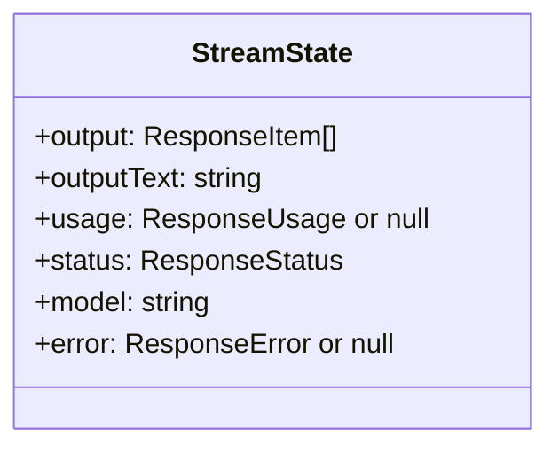

# 流状态

`StreamState` 对象是 `SessionPersistenceTransformer` 使用的可变累积器，用于在流事件到达时收集部分结果。

## 状态结构

## 累积流程

当每个 `ResponseStreamEvent` 流经转换器时：

1. **内容增量事件**：追加文本到 `outputText` 并跟踪当前内容项
2. **工具调用事件**：累积函数调用参数并跟踪工具调用项
3. **使用量事件**：更新 `usage` 计数器
4. **终止事件**：设置最终 `status` 并触发会话保存

当终止事件到达时，`StreamMapper.buildResponseObject(ctx, state)` 从累积状态构建完整的 `ResponseObject`。

[错误层次](/zh/06-error-handling/error-hierarchy)
