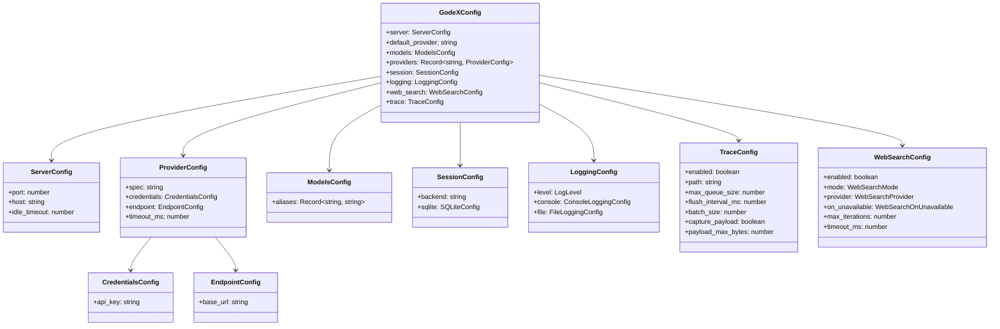

# 配置 Schema

GodeX 通过 `godex.yaml` 文件配置，通常由 `godex init` 创建。环境变量使用 `${VAR_NAME}` 语法插值。

## 完整 Schema

```yaml
server:
  port: 5678              # HTTP 监听端口
  host: "0.0.0.0"         # 监听地址
  idle_timeout: 30000     # 空闲连接超时（毫秒），默认：0（禁用）

default_provider: deepseek   # 模型无斜杠前缀时使用的提供商

models:
  aliases:
    "gpt-5.5": deepseek/deepseek-v4-pro   # 将别名映射到 provider/model
    "glm": zhipu/glm-5.1                   # 将别名映射到 provider/model
    "*": deepseek/deepseek-v4-flash        # 通配符兜底

providers:
  deepseek:
    spec: deepseek                      # 提供商规格名称（必填）
    credentials:
      api_key: ${DEEPSEEK_API_KEY}
    endpoint:
      base_url: https://api.deepseek.com
    timeout_ms: 30000

  zhipu:
    spec: zhipu                         # 提供商规格名称（必填）
    credentials:
      api_key: ${ZHIPU_API_KEY}
    endpoint:
      base_url: https://open.bigmodel.cn/api/coding/paas/v4
    timeout_ms: 30000

  minimax:
    spec: minimax                        # 提供商规格名称（必填）
    credentials:
      api_key: ${MINIMAX_API_KEY}
    endpoint:
      base_url: https://api.minimaxi.com/v1
    timeout_ms: 30000

session:
  backend: sqlite         # "sqlite" 或 "memory"
  sqlite:
    path: ./data/sessions.db

logging:
  level: info             # trace | debug | info | warn | error
  console:
    enabled: true
    level: info
  file:
    enabled: false
    level: debug
    dir: ./logs
    filename: godex.log
    max_size: 10485760    # 10MB
    max_files: 5

web_search:                      # 内置 Web 搜索（默认：启用，无后端）
  enabled: true                  # 总开关
  mode: auto                     # auto | provider_native | godex_managed | disabled
  provider: none                 # none | mock | zhipu（godex_managed 模式的搜索后端）
  on_unavailable: client_tool_call  # client_tool_call | fail | ignore
  max_iterations: 2              # 每个请求的最大托管搜索轮数
  timeout_ms: 10000              # 单次搜索超时

trace:
  enabled: true
  path: ./data/trace.db
  max_queue_size: 10000
  flush_interval_ms: 1000
  batch_size: 100
  capture_payload: false
  payload_max_bytes: 65536
```

## 类型定义



## 提供商配置

每个提供商条目必须包含 `spec` 字段，匹配已注册的提供商定义名称。启动时会拒绝没有 `spec` 的旧版提供商配置。

```yaml
providers:
  myprovider:
    spec: myprovider           # 必填：匹配已注册的提供商定义
    credentials:
      api_key: ${MY_API_KEY}
    endpoint:
      base_url: https://api.example.com/v1
    timeout_ms: 30000
```

## Web 搜索

GodeX 可以两种方式运行 Web 搜索：让提供商原生处理，或由 GodeX 自行运行（"GodeX 托管"/"hosted"）并将结果反馈到续接请求中。`web_search` 块（[src/config/sections/web-search.ts:10](https://github.com/Ahoo-Wang/GodeX/blob/main/src/config/sections/web-search.ts#L10)）控制此行为。

| 字段 | 默认值 | 说明 |
|-------|---------|-------------|
| `enabled` | `true` | 总开关。为 `false` 时不进行任何 Web 搜索处理。 |
| `mode` | `auto` | 执行策略 — 见下表。 |
| `provider` | `none` | GodeX 在 `godex_managed` 模式下使用的搜索后端。 |
| `on_unavailable` | `client_tool_call` | 当托管搜索已配置但不可用时的处理方式。 |
| `max_iterations` | `2` | 每个请求的最大托管搜索轮数。 |
| `timeout_ms` | `10000` | 单次搜索超时（毫秒）。 |

### `mode` — 执行策略

| 模式 | 行为 |
|------|----------|
| `auto` | 当提供商支持时优先使用提供商原生 Web 搜索；否则如果配置了搜索 `provider` 则回退到 `godex_managed`。 |
| `provider_native` | 始终将搜索委托给上游提供商。提供商发出自己的 `web_search_call` 事件。 |
| `godex_managed` | GodeX 拦截提供商的 `web_search` 函数调用，通过配置的 `provider` 后端自行运行搜索，发出 `web_search_call` 生命周期（`in_progress` → `searching` → `completed` / `failed`），并提交带结果的续接请求。最多 `max_iterations` 轮。 |
| `disabled` | 完全关闭 Web 搜索。 |

### `provider` — 托管搜索后端

| 后端 | 说明 |
|----------|-------------|
| `none` | 无后端。`godex_managed` 模式不可用（此时应用 `on_unavailable` 策略）。 |
| `mock` | 返回固定结果；用于测试。 |
| `zhipu` | [智谱 Web Search API](https://open.bigmodel.cn/dev/api/search-tool/websearch)。需要 `ZHIPU_API_KEY`。 |

### `on_unavailable` — 回退策略

当 `mode` 解析为 `godex_managed` 但未配置搜索后端时适用。

| 策略 | 行为 |
|--------|----------|
| `client_tool_call` | 将 `web_search` 调用作为普通函数调用转发给客户端（由客户端处理）。 |
| `fail` | 以 `BridgeError` 失败请求。 |
| `ignore` | 静默丢弃搜索调用。 |

::: tip
使用默认配置（`mode: auto`、`provider: none`）时，支持原生 Web 搜索的提供商（智谱、小米）直接使用它，其他提供商将 `web_search` 调用转发给客户端。要为任何提供商启用 GodeX 托管搜索，设置 `provider: zhipu` 并提供 `ZHIPU_API_KEY`。
:::

托管搜索循环由 `src/responses/web-search/` 中的 `HostedWebSearchStreamRunner` / `HostedWebSearchSyncRunner` 实现。它如何集成到事件生产阶段见[流式管道](../02-architecture/streaming-pipeline.md)。

## 环境变量插值

`${DEEPSEEK_API_KEY}` 等值在加载时从环境变量解析。缺少的变量会产生启动错误。

## 环境变量覆盖

除 YAML 插值外，以下环境变量可直接覆盖配置字段（CLI 标志优先级最高）：

| 变量 | 配置字段 | 说明 |
|------|---------|------|
| `GODEX_PORT` | `server.port` | 覆盖监听端口 |
| `GODEX_HOST` | `server.host` | 覆盖绑定地址 |
| `GODEX_LOG_LEVEL` | `logging.level` | 覆盖日志级别 |
| `GODEX_DEFAULT_PROVIDER` | `default_provider` | 未设置时回退到 `deepseek` |

[CLI 命令](/zh/07-configuration/cli-commands)

